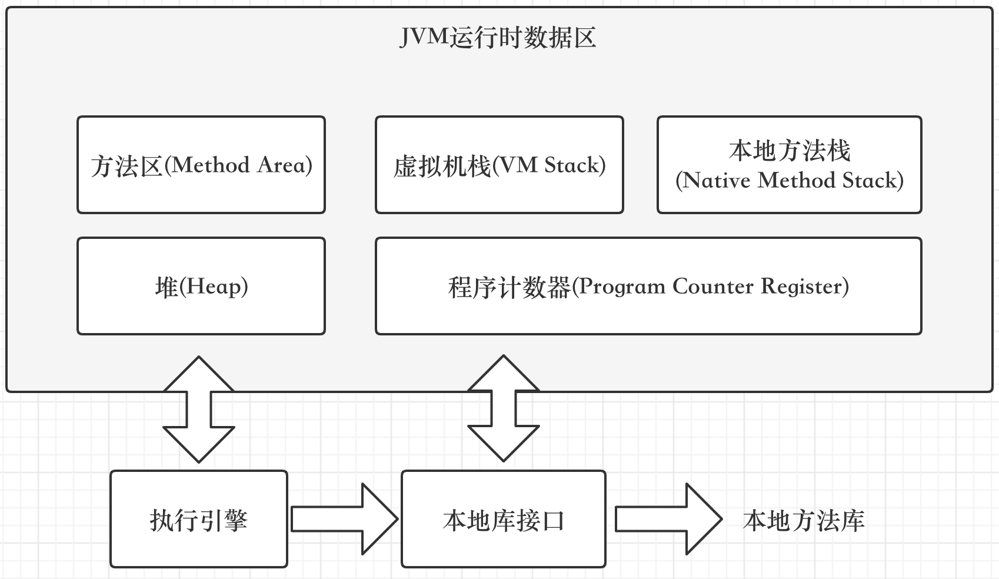

# JVM

## Java 内存模型



### 程序计数器

程序计数器是一块较小的内存空间，它标记程序执行的位置，可以通过改变程序计数器来依次执行字节码中的指令。
它的作用有两个，一个是可以改变程序计数器来依次执行字节码指令，二是进行上下文切换时，程序计数器记录当前执行位置，当线程切换回来时知道从哪个位置开始执行
程序计数器是唯一一个不会出现 OutOfMemoryError 的内存区域

### Java 虚拟机栈

Java 虚拟机栈是由一个个栈帧组成，而每个栈帧中都拥有局部变量表、操作数栈等数据。每次方法调用的数据都是通过栈传递的。每一次函数调用都会有一个对应的栈帧被压入Java栈，每一个函数调用结束后，都会有一个栈帧被弹出。Java 虚拟机栈也是线程私有的。

Java 虚拟机栈会出现两种错误: StackOverFlowError(栈深度大于所允许的深度) 和 OutOfMemoryError(栈扩展到无法申请内存)。

### 本地方法栈

本地方法栈则为虚拟机使用到的Native方法服务，于Java虚拟机栈类似，Java虚拟机栈支持的事Java方法的运行，而本地方法栈则是支持Native方法的运行。

与Java虚拟机栈类似会出现两种错误: StackOverFlowError(栈深度大于所允许的深度) 和 OutOfMemoryError(栈扩展到无法申请内存)。

### Java 堆

Java堆是所有线程共享的一块内存区域，在虚拟机启动时创建。此内存区域的唯一目的就是存放对象实例，几乎所有的对象实例以及数组都在这里分配内存。
堆可细分为：新生代(Eden区、From Survivor、To Survivor)，老年代，永久代(JDK1.8 移除 转而被元空间取代)

当Java堆无法再扩展时，会抛出OutOfMemoryError

### 方法区

各个线程共享的内存区域，它用于存储已被虚拟机加载的类信息、常量、静态变量、即时编译器编译后的代码等数据。JDK 1.8 的时候，方法区(HotSpot 的永久代)被彻底移除了，取而代之是元空间，元空间使用的是直接内存。如果方法去无法满足新的内存分配需求时将抛出OutOfMemoryError。
注：永久代是HotSpot的概念，方法区是Java虚拟机规范中的定义，是一种规范，而永久代是一种实现

### 运行时常量池

运行时常量池是方法区的一部分。Class 文件中除了有类的版本、字段、方法、接口等描述信息外，还有常量池表(用于存放编译期生成的各种字面量和符号引用)。

运行时常量池相对于Class文件常量池的区别是运行时常量池具备动态性，Jva语言并不要求常量一定只有编译器才能产生，运行期间也可以将新的常量放入到运行时常量池中，例如String类的intern()方法。

### 直接内存

直接内存并不是虚拟机运行时数据区的一部分，也不是java虚拟机规范中定义的内存区域。直接内存的分配不会受到Java堆大小的限制，会受到本机物理等内存的限制。这部分内存也被频繁用着，例如NIO(New Input/Output)，使用Native函数库直接分配对外内存，然后通过存储在Java堆里的DirectByteBuffer对象作为这块内存的引用进行操作。他也会产生OutOfMemoryError异常。


## 对象的访问和定位

在《Java虚拟机规范》里边之规定了通过引用来访问对象，并没有规定通过什么方式、访问堆中的什么位置。所以目前主流的访问方式有两种

- 句柄访问

如果使用句柄访问，Java堆中将可能会开辟一块内存来作为句柄池，栈中引用就是存储这里面句柄的地址，而句柄中包含了对象实例数据与类型类型数据各自具体的地址信息

- 直接指针访问

栈上的引用的值就是Java堆中的直接对象的地址，直接可以访问到。


---
在Hotspot源码中oops/markOop.hpp里面描述了Mark Word结构

```cpp
// Bit-format of an object header (most significant first, big endian layout below):
//
//  32 bits:
//  --------
//             hash:25 ------------>| age:4    biased_lock:1 lock:2 (normal object)
//             JavaThread*:23 epoch:2 age:4    biased_lock:1 lock:2 (biased object)
//             size:32 ------------------------------------------>| (CMS free block)
//             PromotedObject*:29 ---------->| promo_bits:3 ----->| (CMS promoted object)
//
//  64 bits:
//  --------
//  unused:25 hash:31 -->| unused:1   age:4    biased_lock:1 lock:2 (normal object)
//  JavaThread*:54 epoch:2 unused:1   age:4    biased_lock:1 lock:2 (biased object)
//  PromotedObject*:61 --------------------->| promo_bits:3 ----->| (CMS promoted object)
//  size:64 ----------------------------------------------------->| (CMS free block)
//
//  unused:25 hash:31 -->| cms_free:1 age:4    biased_lock:1 lock:2 (COOPs && normal object)
//  JavaThread*:54 epoch:2 cms_free:1 age:4    biased_lock:1 lock:2 (COOPs && biased object)
//  narrowOop:32 unused:24 cms_free:1 unused:4 promo_bits:3 ----->| (COOPs && CMS promoted object)
//  unused:21 size:35 -->| cms_free:1 unused:7 ------------------>| (COOPs && CMS free block)
```


## Java 的各种实验

### 堆 HeapOOM

```java
/**
 * VM Args：-Xms20m -Xmx20m -XX:+HeapDumpOnOutOfMemoryError
 */
public class HeapOOM {
    static class OOMObject {
    }
    public static void main(String[] args) {
        List<OOMObject> list = new ArrayList<OOMObject>();
        while (true) {
            list.add(new OOMObject());
        }
    }
}
```

```text
java.lang.OutOfMemoryError: Java heap space
Dumping heap to java_pid85249.hprof ...
Heap dump file created [27782054 bytes in 0.142 secs]
Exception in thread "main" java.lang.OutOfMemoryError: Java heap space
```

分析过程，首先出现这种内存溢出情况常规的处理方法就是将内存堆转存快照，通过参数"-XX:+HeapDumpOnOutOfMemoryError"，然后通过内存映像分析工具，例如Idea中的profiler对Dump出来的堆转储快照进行分析。先确认出现的是内存泄漏(Memory Leak)还是内存溢出(Memory Overflow)
如果是内存泄漏，可以通过工具查看泄漏对象到GCRoots的引用链，找到泄漏对象是通过怎样的引用路径、与哪些GCRoots相关联才导致垃圾回收器无法回收他们。可以跟踪到其创建位置。
如果是内存溢出，也就是对象都需要存活，那就应该检查Java虚拟机的启动参数设置，与机器的内存对比，看是否有向上调整的可能

### 虚拟机栈和本地方法栈 SOF

Java虚拟机规范中描述了两种栈和本地方法栈的异常：
1. 如果线程请求的栈深度大于虚拟机所允许的最大深度，将抛出StackOverflowError异常
2. 如果虚拟机的栈内存允许动态扩展，当扩展容量无法申请到足够的内存时，将抛出OutOfMemoryError异常。

在Hotspot虚拟机实现中，是不允许支持栈扩展的，因为规范中允许不支持扩展。那么当虚拟机启动时无法获得足够的内存导致OOM会动态扩展，但不会因为运行时因为栈内存不足而动态扩展。所以当程序运行时只会因为栈容量无法扩展，栈容量无法容纳新的栈帧导致OOM。

```java
public class JavaVMStackSOF {
    private int stackLength = 1;
    public void stackLeak() {
        stackLength++;
        stackLeak();
    }
    public static void main(String[] args) {
        JavaVMStackSOF_1 oom = new JavaVMStackSOF_1();
        try {
            oom.stackLeak();
        } catch (Throwable e) {
            System.out.println("stack length:" + oom.stackLength);
            throw e;
        }
    }
}
```
但我们给定虚拟机参数"-Xss128k"时，

```text
...
The stack size specified is too small, Specify at least 160k
```
根据机器的不同，栈容量的最小值也会不同。我这里至少需要设置栈大小为160K才能运行该程序。
只需要将"-Xss"适当调大即可运行，其次就是如果在方法中定义很多局部变量，那么栈的深度自然就越小，很容易理解，当给定栈的容量，当每个栈帧所占的空间越大，那么分配的栈帧就越少。这是单线程的运行用例
如果是多线程运行，无限循环创建线程的话，肯定会导致虚拟机内存溢出。那么这种内存溢出异常和栈空间不足没有任何的直接关系，这主要取决于操作系统本身的内存情况，多线程情况下，为每个线程分配栈的空间越大，那么就越容易产生内存溢出。也就是说为每个线程分配的栈内存越大，可建立的线程数量自然越小。

当我给虚拟机参数设置为"-Xss2G"时，就出现一下的错误
```text
Error occurred during initialization of VM
java.lang.OutOfMemoryError: unable to create new native thread
...
```

### 方法区和运行时常量池的溢出

在JDK7以前，我们说JDK6时代，常量池是分配在永久代的，可以通过 "-XX:PermSize=1M -XX:MaxPermSize=1M"来限制永久代的大小，可以间接的限制其中的常量池大小。而在JDK以及更高的版本中，常量池已经从方法区移出放到Java堆中去了。JDK8已经将永久代废除掉了，改为元空间，放到了直接内存中去了，但常量池放到了堆中。

```java
public class RuntimeConstantPoolOOM_2 {
    public static void main(String[] args) {
        String str1 = new StringBuilder("计算机").append("软件").toString();
        System.out.println(str1.intern() == str1);

        String str2 = new StringBuilder("ja").append("va").toString();
        System.out.println(str2.intern() == str2);
    }
}
```
JDK8的运行结果
```text
true
false
```

String.intern()方法的作用是一种手动将字符串加入常量池中的native方法，也就是说调用该方法将字符串加入到常量池然后返回常量池中该字符串的引用，而且这个引用会保存着，即保存第一次出现的引用。

这里“计算机软件”返回true是因为这个字符串第一次出现，且在堆中，然后String.intern()方法无需拷贝，因为常量池就在堆中，只需要在常量池中记录一下首次出现的实例引用即可。

所以说Str1==str1

对于第二个“java”返回false，是因为这个字符串在这之前出现过，所以str2.intern()返回的是之前的字符串引用，而str2指向的是当前的字符串引用，所以肯定不会相等

在JDK7中还能使用参数“-XX:PermSize=10M -XX:MaxPermSize=10M”来控制永久代大小
在JDK8中就无法控制永久代，因为JDK8中永久代已经完全退出舞台了，取而代之的是元空间。那么此时可以通过"-XX:MetaspaceSize=256M -XX:MaxMetaspaceSize=256M"设置元空间大小，不设置则视为不限制，那么它就只受本地内存大小的限制了。还有其他几个参数控制暂不列出。

### 直接内存溢出

直接内存


## Java 堆

Java堆内存中按照分代年龄来划分，分为Young区和Old区，对象分配首先会到Young区，达到一定分代年龄(-XX:MaxTenuringThreshold可以设置大小，默认为15)就会进入Old区(注：如果一个对象太大，那么就会直接进入Old区)
这么划分是因为如果整个堆只有一个区的话，那么垃圾回收的时候每次都需要把堆内所有对象都扫描一遍，浪费性能。其实大部分Java对象的生命周期都是很短的，一旦一个对象回收很多次都回收不掉，可以认为下一次垃圾回收的时候可能也回收不掉，所以Young区和Old区的垃圾回收可以分开进行，只有当Young区在进行垃圾回收之后还是没有腾出空间，那么再去触发Old区的垃圾回收。

```text
Tips:
垃圾回收次数保存在对象头(Header)的Mark Word中，当一个对象经过一次垃圾回收之后还存在，那么分代年龄就会加1，在64位的虚拟机中，分代年龄占了4位，最大值为15。分代年龄默认为0000，随着垃圾回收次数，会逐渐递增。
```

Young是一整块内存区域，随着对象的产生、GC的垃圾回收，造成了很多内存碎片，随着内存碎片的增多，内存的浪费就越来越多，导致最后明明还有空间，但因为空间不连续，使得对象分配内存失败，从而触发Old GC。

解决方案就是把Young区再次划分一下，分为2个区：Eden区和Survivor区，Eden去的对象一并回收，存活下来的放到Survivor区，这使得Survivor区也会产生内存碎片，为此我们将Survivor区给一分为二了。

这个时候工作流程又变成这样了：
首先还是在Eden区分配空间，Eden区满了之后触发GC，GC之后把幸存对象 复制到S0区(S1区是空的)，然后继续在Eden区分配对象，再次触发GC之后如果发现S0区放不下了(产生空间碎片，实际还有空间)，那么就把S0区对象复制到S1区，并把幸存对象也复制到S1区，这时候S0区是空的了，并依次反复操作，假如说S0区或者S1区空间对象复制移动了之后还是放不下，那就说明这时候是真的满了，那就去老年区借点空间过来（这就是担保机制，老年代需要提供这种空间分配担保），假如说老年区空间也不够了，那就会触发Full GC，如果还是不够，那就会抛出OutOfMemeoyError异常了。

为了确保S0和S1两个区域之间每次复制都能顺利进行，S0和S1两个区的大小必须要保持一致，而且同一时间有一个区域一定是空的。虽然说这种做法是会导致了一小部分空间的浪费，但是综合其他性能的提升来说，是值得的。
所以就有了以下这种堆模型


对象分配内存的整个过程如下：


## tomcat需要破坏双亲委派模型的原因

(1)tomcat中的需要支持不同web应用依赖同一个第三方类库的不同版本，jar类库需要保证相互隔离;

(2)同一个第三方类库的相同版本在不同web应用可以共享

(3)tomcat自身依赖的类库需要与应用依赖的类库隔离

(4)jsp需要支持修改后不用重启tomcat即可生效 为了上面类加载隔离 和类更新不用重启，定制开发各种的类加载器

## 垃圾回收算法

复制算法：新生代内存划分为两块内存区域，然后只使用其中一块内存。内存使用率极低

复制算法的优化：Eden区和Survivor区，1个Eden区，2个Survivor区，其中Eden区占80%内存空间，每一块Survivor区各占10%内存空间，Eden区和其中一块Survivor区，那么相当于就是有900MB的内存是可以使用的

标记整理算法：首先标记出来老年代当前存活的对象，这些对象可能是东一个西一个的。接着会让这些存活对象在内存里进行移动，把存活对象尽量都挪动到一边去，让存活对象紧凑的靠在一起，避免垃圾回收过后出现过多的内存碎片。老年代的垃圾回收算法的速度至少比新生代的垃圾回收算法的速度慢10倍。


1. 躲过15次GC之后进入老年代，具体是多少岁进入老年代，可以通过JVM参数“-XX:MaxTenuringThreshold”来设置，默认是15岁。
2. 动态对象年龄判断，假如说当前放对象的Survivor区域里，一批对象的总大小大于了这块Survivor区域的内存大小的50%，那么此时大于等于这批对象年龄的对象，就可以直接进入老年代了。
3. 大对象直接进入老年代，“-XX:PretenureSizeThreshold”，设置为字节数，如果你要创建一个大于这个大小的对象，比如一个超大的数组，此时就直接把这个大对象放到老年代里去。压根儿不会经过新生代。之所以这么做，就是要避免新生代里出现那种大对象，然后屡次躲过GC，还得把他在两个Survivor区域里来回复制多次之后才能进入老年代，

当Eden区存活对象没办法放入Survivor区中，这个时候就必须得把这些对象直接转移到老年代去，如果老年代里空间也不够放这些对象？
```text
1. 首先，在执行任何一次Minor GC之前，JVM会先检查一下老年代可用的内存空间，是否大于新生代所有对象的总大小。如果说发现老年代的内存大小是大于新生代所有对象的，此时就可以放心大胆的对新生代发起一次Minor GC了，因为即使Minor GC之后所有对象都存活，Survivor区放不下了，也可以转移到老年代去。
万一老年代空间不够会继续尝试进行下一步判断，就是看看老年代的内存大小，是否大于之前每一次Minor GC后进入老年代的对象的平均大小。

如果上面那个步骤判断失败了，或者是“-XX:-HandlePromotionFailure”参数没设置，此时就会直接触发一次“Full GC”，就是对老年代进行垃圾回收，尽量腾出来一些内存空间，然后再执行Minor GC。
如果上面两个步骤都判断成功了，那么就是说可以冒点风险尝试一下Minor GC。此时进行Minor GC有几种可能。

第一种可能，Minor GC过后，剩余的存活对象的大小，是小于 Survivor区的大小的，那么此时存活对象进入Survivor 区域即可。
第二种可能，Minor GC过后，剩余的存活对象的大小，是大于 Survivor区域的大小，但是是小于老年代可用内存大小的，此时就直接进入老年代即可。
第三种可能，很不幸，Minor GC过后，剩余的存活对象的大小，大于了Survivor区域的大小，也大于了老年代可用内存的大小。此时老年代都放不下这些存活对象了，就会发生“Handle Promotion Failure”的情况，这个时候就会触 发一次“Full GC”。
Full GC就是对老年代进行垃圾回收，同时也一般会对新生代进行垃圾回收。
如果要是Full GC过后，老年代还是没有足够的空间存放Minor GC过后的剩余存活对象，那么此时就会导致所谓的 “OOM”内存溢出了


注：
	“-XX:HandlePromotionFailure”参数在JDK 1.6以后就被废弃了，所以现在一般都不会在生产环境里设置这个参数了。在JDK 1.6以后，只要判断“老年代可用空间”> “新生代对象总和”，或者“老年代可用空间”> “历次Minor GC升入老年代对象的平均大小”，两个条件满足一个，就可以直接进行Minor GC，不需要提前触发Full GC了。
	例：jdk<=6
		“-Xms3072M -Xmx3072M -Xmn1536M -Xss1M -XX:PermSize=256M -XX:MaxPermSize=256M - XX:HandlePromotionFailure”
	jdk>=7
		“-Xms3072M -Xmx3072M -Xmn1536M -Xss1M -XX:PermSize=256M -XX:MaxPermSize=256M”
```

## Stop the World

因为在垃圾回收的时候，尽可能要让垃圾回收器专心致志的干工作，不能随便让我们写的Java系统继续制造对象了，所以此时JVM会在后台直接进入“Stop the World”状态。

垃圾回收器：

- Serial垃圾回收器就是用一个线程进行垃圾回收，然后此时暂停系统工作线程，所以一般我们在服务器程序中很少用这种方式。
- ParNew垃圾回收器，他针对服务器一般都是多核CPU做了优化，他是支持多线程垃圾回收的，可以大幅度提升回收的性能，缩短回收的时间
- CMS垃圾回收器，专门负责老年代的垃圾回收，他也有自己特殊的一套机制和原理，非常的复杂
- G1垃圾回收器，他更是将采用复杂的回收机制将回收性能优化到极致，尽可能更多的降低“Stop the World”的时间。

## CMS垃圾回收器的问题

1. CMS垃圾回收器有一个最大的问题，虽然能在垃圾回收的同时让系统同时工作，但是在并发标记和并发清理两个最耗时的阶段，垃圾回收线程和系统工作线程同时工作，会导致有限的CPU资源被垃圾回收线程占用了一部分。因为老年代里存活对象是比较多的，这个过程会追踪大量的对象，所以耗时较高。并发清理，又需要把垃圾对象从各种随机的内存位置清理掉，也是比较耗时的。所以在这两个阶段，CMS的垃圾回收线程是比较耗费CPU资源的。CMS默认启动的垃圾回收线程的数量是(CPU核数 + 3)/ 4。

2. Concurrent Mode Failure问题。在并发清理阶段，CMS只不过是回收之前标记好的垃圾对象，但是这个阶段系统一直在运行，可能会随着系统运行让一些对象进入老年代，同时还变成垃圾对象，这种垃圾对象是“**浮动垃圾**”。所以为了保证在CMS垃圾回收期间，还有一定的内存空间让一些对象可以进入老年代，一般会预留一些空间。CMS垃圾回收的触发时机，其中有一个就是当老年代内存占用达到一定比例了，就自动执行GC。“-XX:CMSInitiatingOccupancyFaction”参数可以用来设置老年代占用多少比例的时候触发CMS垃圾回收，JDK 1.6里面默认的值是 92%。也就是说，老年代占用了92%空间了，就自动进行CMS垃圾回收，预留8%的空间给并发回收期间，系统程序把一些新对象放入老年代中。那么如果CMS垃圾回收期间，系统程序要放入老年代的对象大于了可用内存空间，这个时候，会发生Concurrent Mode Failure，就是说并发垃圾回收失败了，此时就会自动用“Serial Old”垃圾回收器替代CMS，就是直接强行把系统程序“Stop the World”，重新进行长时间的GC Roots追踪，标记出来全部垃圾对象，不允许新的对象产生，然后一次性把垃圾对象都回收掉，完事儿了再恢复系统线程。
3. 内存碎片问题，CMS不是完全就仅仅用“标记-清理”算法的，因为太多的内存碎片实际上会导致更加频繁的Full GC。CMS有一个参数是“-XX:+UseCMSCompactAtFullCollection”，默认就打开了，意思是在Full GC之后要再次进行“Stop the World”，停止工作线程，然后进行碎片整理，就是把存活对象挪到一起，空出来大片连续内存空间，避免内存碎片。还有一个参数是“-XX:CMSFullGCsBeforeCompaction”，这个意思是执行多少次Full GC之后再执行一次内存碎片整理的工作，默认是0，意思就是每次Full GC之后都会进行一次内存整理。

新生代执行速度其实很快，因为直接从GC Roots出发就追踪哪些对象是活的就行了，新生代存活对象是很少的，这个速度是极快的，不需要追踪多少对象。然后直接把存活对象放入Survivor中，就一次性直接回收Eden和之前使用的Survivor了。
但是CMS的Full GC在并发标记阶段，他需要去追踪所有存活对象，老年代存活对象很多，这个过程就会很慢，其次并发清理阶段，他不是一次性回收一大片内存，而是找到零零散散在各个地方的垃圾对象，速度也很慢，最后还得执行一次内存碎片整理，把大量的存活对象给挪在一起，空出来连续内存空间，这个过程还得“Stop the World”，那就更慢了。万一并发清理期间，剩余内存空间不足以存放要进入老年代的对象了，引发了“Concurrent Mode Failure”问题，还得立马用“Serial Old”垃圾回收器，“Stop the World”之后慢慢重新来一遍回收的过程，这更是耗时了。


```text
分析：“-Xms3072M -Xmx3072M -Xmn2048M -Xss1M -XX:PermSize=256M -XX:MaxPermSize=256M - XX:SurvivorRatio=8 -XX:MaxTenuringThreshold=5 -XX:PretenureSizeThreshold=1M -XX:+UseParNewGC - XX:+UseConcMarkSweepGC -XX:CMSInitiatingOccupancyFaction=92 -XX:+UseCMSCompactAtFullCollection -XX:CMSFullGCsBeforeCompaction=0”

对于电商系统，很多都是临时的对象，1秒钟就成了垃圾需要被回收，所以新生代尽量大，Survivor尽量的大，避免Minor GC后剩余对象Survivor放不下，而且尽量不要因为动态年龄判定而导致临时对象进入老年代，最大年龄也尽量的小，因为大部分都是临时性的对象，极少数也避免长期呆在新生代占用内存，大对象也直接进入老年代，新生代采用ParNew垃圾回收器，老年代采用CMS垃圾回收器
```


## G1垃圾回收器

G1垃圾回收器是可以同时回收新生代和老年代的对象的，不需要两个垃圾回收器配合起来运作。他最大的一个特点，就是把Java堆内存拆分为多个大小相等的Region。G1另一个最大的一个特点，就是可以让我们设置一个垃圾回收的预期停顿时间，需要做到预期停顿时间可控，他就必须要追踪每个Region里的回收价值，他必须搞清楚每个Region里的对象有多少是垃圾，如果对这个Region进行垃圾回收，需要耗费多长时间。所以简单来说，G1可以做到让你来设定垃圾回收对系统的影响，他自己通过把内存拆分为大量小Region，以及追踪每个Region中可以 回收的对象大小和预估时间，最后在垃圾回收的时候，尽量把垃圾回收对系统造成的影响控制在你指定的时间范围内，同时在有限的时 间内尽量回收尽可能多的垃圾对象。Region可能属于新生代也可能属于老年代

**如何设定G1对应的内存大小**

默认情况下自动计算和设置的，JVM启动的时候一旦发现你使用的是G1垃圾回收器，可以使用“-XX:+UseG1GC”来指定使用G1垃圾回收器，此时会自动用堆大小除以2048，JVM最多可以有2048个Region，如果通过手动方式来指定，则是“-XX:G1HeapRegionSize”，比如说堆大小是4G，那么就是4096MB，此时除以2048个Region，每个Region的大小就是2MB。大概就是这样子来决定Region的数 量和大小的，大家一般保持默认的计算方式就可以。刚开始的时候，默认新生代对堆内存的占比是5%，也就是占据200MB左右的内存，对应大概是100个Region，这个是可以通过“- XX:G1NewSizePercent”来设置新生代初始占比的，其实维持这个默认值即可。因为在系统运行中，JVM其实会不停的给新生代增加更多的Region，但是最多新生代的占比不会超过60%，可以通过“- XX:G1MaxNewSizePercent”。而且一旦Region进行了垃圾回收，此时新生代的Region数量还会减少，这些其实都是动态的。

-XX:SurvivorRatio=8”，可以区分出来属于新生代的Region里哪些属于Eden，哪些属于Survivor。比如新生代之前说刚开始初始的时候，有100个Region，那么可能80个Region就是Eden，两个Survivor各自占10个Region。这里其实还是有Eden和Survivor的概念的，他们会各自占据不同的Region。一旦新生代达到了设定的占据堆内存的最大大小60%，这个时候还是会触发新生代的GC，G1就会用之前说过的复制算法来进行垃圾回收，进入一个“Stop the World”状态，然后把Eden对应的Region中的存活对象放入S1对应的Region中，接着回收掉Eden对应的Region中的垃圾对象，但是这个过程跟之前是有区别的，因为G1是可以设定目标GC停顿时间的，也就是G1执行GC的时候最多可以让系统停顿多长时间，可 以通过“-XX:MaxGCPauseMills”参数来设定，默认值是200ms。那么G1就会对每个Region追踪回收他需要多少时间，可以回收多少对象来选择回收一部分的Region，保证GC停顿时 间控制在指定范围内，尽可能多的回收掉一些对象。

**对象什么时候进入老年代**

(1)对象在新生代躲过了很多次的垃圾回收，达到了一定的年龄了，“-XX:MaxTenuringThreshold”参数可以设置这个年龄，他就会进入老年代

(2)动态年龄判定规则，如果一旦发现某次新生代GC过后，存活对象超过了Survivor的50%

**大对象Region**

G1提供了专门的Region来存放大对象，而不是让大对象进入老年代的Region中。在G1中，大对象的判定规则就是一个大对象超过了一个Region大小的50%，而且一个大对象如果太大，可能会横跨多个Region来存放。


## 触发新生代+老年代的混合垃圾回收

G1有一个参数，是“-XX:InitiatingHeapOccupancyPercent”，他的默认值是45%，如果老年代占据了堆内存的45%的Region的时候，此时就会尝试触发一个新生代+老年代一起回收的混合回收阶段。

**G1垃圾回收的过程**

1. 首先会触发一个“初始标记”的操作，这个过程是需要进入“Stop the World”的，仅仅只是标记一下GC Roots直接能引用的对象， 这个过程速度是很快的。
2. 进入“并发标记”的阶段，这个阶段会允许系统程序的运行，同时进行GC Roots追踪，从GC Roots开始追踪所有的存活对象。这个并发标记阶段还是很耗时的，因为要追踪全部的存活对象。但是这个阶段是可以跟系统程序并发运行的，所以对系统程序的影响不太大。
3. 最终标记阶段，这个阶段会进入“Stop the World”，系统程序是禁止运行的，但是会根据并发标记阶段记录的那些对象修改，最终标记一下有哪些存活对象，有哪些是垃圾对象。
4. 最后一个阶段，就是“混合回收“阶段，这个阶段会计算老年代中每个Region中的存活对象数量，存活对象的占比，还有执行垃圾回收的预期性能和效率。接着会停止系统程序，然后全力以赴尽快进行垃圾回收，此时会选择部分Region进行回收，因为必须让垃圾回收的停顿时间控制在我们指定的范围内。

**G1垃圾回收器的一些参数**

一般在老年代的Region占据了堆内存的Region的45%之后，会触发一个混合回收的过程，也就是Mixed GC。

“-XX:G1MixedGCCountTarget”参数，就是在一次混合回收的过程中，最后一个阶段执行几次混合回收，默认值是8次。意味着最后一个阶段，先停止系统运行，混合回收一些Region，再恢复系统运行，接着再次禁止系统运行，混合回收一些Region，反 复8次。因为停止系统一会儿，回收掉一些Region，再让系统运行一会儿，然后再次停止系统一会儿，再次回收掉一些Region，这样可以尽 可能让系统不要停顿时间过长，可以在多次回收的间隙，也运行一下。

“-XX:G1HeapWastePercent”，默认值是5%。在混合回收的时候，对Region回收都是基于复制算法进行的，都是把要回收的Region里的存活对象放入其他 Region，然后这个Region中的垃圾对象全部清理掉，这样的话在回收过程就会不断空出来新的Region，一旦空闲出来的Region数量达到了堆内存的5%，此时就会 立即停止混合回收，意味着本次混合回收就结束了。

“-XX:G1MixedGCLiveThresholdPercent”，他的默认值是85%，意思就是确定要回收的Region的时候，必须是存活对象低于85%的Region才可以进行回收

**回收失败时的Full GC**

如果在进行Mixed回收的时候，无论是年轻代还是老年代都基于复制算法进行回收，都要把各个Region的存活对象拷贝到别的Region 里去，此时万一出现拷贝的过程中发现没有空闲Region可以承载自己的存活对象了，就会触发 一次失败。一旦失败，立马就会切换为停止系统程序，然后采用单线程进行标记、清理和压缩整理，空闲出来一批Region，这个过程是极慢极慢的。

**G1垃圾回收器的默认内存布局**

假设对机器上的JVM分配4G给堆内存，其中新生代默认初始占比为5%，最大占比为60%，每个Java线程的栈内存为1MB， 元数据区域(永久代)的内存为256M，此时JVM参数如下:"-Xms4096M -Xmx4096M -Xss1M -XX:PermSize=256M -XX:MaxPermSize=256M -XX:+UseG1GC"
“-XX:G1NewSizePercent”参数是用来设置新生代初始占比的，不用设置，维持默认值为5%即可。
“-XX:G1MaxNewSizePercent”参数是用来设置新生代最大占比的，也不用设置，维持默认值为60%即可。

此时堆内存共4G，那么此时会除以2048，计算出每个Region的大小，此时每个Region的大小就是2MB，刚开始新生代就占5%的Region，可以认为新生代就是只有100个Region，有200MB的内存空间，

在G1垃圾回收器中有一个至关重要的参数会影响到GC的表现，就是“-XX:MaxGCPauseMills”，他的默认值是200 毫秒

其实G1里是很动态灵活的，他会根据你设定的gc停顿时间给你的新生代不停 分配更多Region，然后到一定程度，感觉差不多了，就会触发新生代gc，保证新生代gc的时候导致的系统停顿时间在你预设范围内。


“-XX:TraceClassLoading -XX:TraceClassUnloading” 这两个参数，顾名思义，就是追踪类加载和类卸载的情况，他会通过日志打印出来JVM中加载了哪些类，卸载了哪些类。加入这两个参数之后，就可以看到在Tomcat的catalina.out日志文件中，输出了一堆日志，里面显示类似如下的内容: 【Loaded sun.reflect.GeneratedSerializationConstructorAccessor from __JVM_Defined_Class】


JVM参数设置：

```text
-XX:+CMSParallelInitialMarkEnabled表示在初始标记的多线程执行，减少STW;
-XX:+CMSScavengeBeforeRemark:在重新标记之前执行minorGC减少重新标记时间;
-XX:+CMSParallelRemarkEnabled:在重新标记的时候多线程执行，降低STW;
-XX:CMSInitiatingOccupancyFraction=92和-XX:+UseCMSInitiatingOccupancyOnly配套使用，如果不设置后者，jvm第一 次会采用92%但是后续jvm会根据运行时采集的数据来进行GC周期，如果设置后者则jvm每次都会在92%的时候进行gc;
-XX:+PrintHeapAtGC:在每次GC前都要GC堆的概况输出

-XX:+HeapDumpOnOutOfMemoryError
-XX:HeapDumpPath=/usr/local/app/oom
第一个参数意思是在OOM的时候自动dump内存快照出来，第二个参数是说把内存快照放到哪儿去
```

较为完整的JVM参数模版

```text
-Xms4096M
-Xmx4096M
-Xmn3072M
-Xss1M
-XX:MetaspaceSize=256M
-XX:MaxMetaspaceSize=256M
-XX:+UseParNewGC
-XX:+UseConcMarkSweepGC
-XX:CMSInitiatingOccupancyFaction=92
-XX:+UseCMSCompactAtFullCollection
-XX:CMSFullGCsBeforeCompaction=0
-XX:+CMSParallelInitialMarkEnabled
-XX:+CMSScavengeBeforeRemark
-XX:+DisableExplicitGC
-XX:+PrintGCDetails
-Xloggc:gc.log
-XX:+HeapDumpOnOutOfMemoryError
-XX:HeapDumpPath=/usr/local/app/oom
```


## JVM实验

### 模拟一次全过程的GC过程

JVM参数

```jvm
-XX:NewSize=5242880 -XX:MaxNewSize=5242880 -XX:InitialHeapSize=10485760 -XX:MaxHeapSize=10485760 -XX:SurvivorRatio=8 -XX:PretenureSizeThreshold=10485760 -XX:+UseParNewGC -XX:+UseConcMarkSweepGC -XX:+PrintGCDetails -XX:+PrintGCTimeStamps -Xloggc:gc.log

-XX:NewSize=5242880	//新生代大小
-XX:MaxNewSize=5242880	//新生代最大的大小
-XX:InitialHeapSize=10485760	//初始化堆内存大小
-XX:MaxHeapSize=10485760		//最大堆内存大小
XX:SurvivorRatio=8				//新生代的E:S:S = 8:1:1
-XX:PretenureSizeThreshold=10485760	//指定了大对象阈值是10MB
-XX:+UseParNewGC					//新生代使用ParNew GC
-XX:+UseConcMarkSweepGC				//老年代使用的是CMS GC
-XX:+PrintGCDetils					//打印详细的gc日志
-XX:+PrintGCTimeStamps				//打印出来每次GC发生的时间
-Xloggc:gc.log						//设置将gc日志写入一个磁盘文件
```

程序代码

```java
public class Demo {
    public static void main(String[] args) {
        byte[] array1 = new byte[1024 * 1024];
        array1 = new byte[1024 * 1024];
        array1 = new byte[1024 * 1024];
        array1 = null;
        
        byte[] array2 = new byte[2 * 1024 * 1024];
    }
}
```

分析GC情况

```text
array1 会创建1M的数组，占用新生代1M内存空间   --此时新生代 4.5M(E+S) 占用1M   -->剩3.5M
array1 又创建1M的数组，占用新生代1M内存空间	  --此时新生代 4.5M 占用2M		   -->剩2.5M
array1 又创建1M的数组，占用新生代1M内存空间	  --此时新生代 4.5M 占用3M		   -->剩1.5M

array1=null 此时新生代产生3M的垃圾对象

array2 创建2M的数组对象，由于此时新生代剩余1M内存，无法分配。所以会触发一次新生代的GC，
```

GC日志

```java
Java HotSpot(TM) 64-Bit Server VM (25.251-b08) for bsd-amd64 JRE (1.8.0_251-b08), built on Mar 12 2020 02:36:37 by "java_re" with gcc 4.2.1 (Based on Apple Inc. build 5658) (LLVM build 2336.11.00)
Memory: 4k page, physical 16777216k(912780k free)
// 虚拟机的一些基本信息

/proc/meminfo:

// jvm人工配置的参数信息
CommandLine flags: -XX:InitialHeapSize=10485760 -XX:MaxHeapSize=10485760 -XX:MaxNewSize=5242880 -XX:NewSize=5242880 -XX:OldPLABSize=16 -XX:PretenureSizeThreshold=10485760 -XX:+PrintGC -XX:+PrintGCDetails -XX:+PrintGCTimeStamps -XX:SurvivorRatio=8 -XX:+UseCompressedClassPointers -XX:+UseCompressedOops -XX:+UseConcMarkSweepGC -XX:+UseParNewGC

// 从系统运行开始的0.127s 由于Eden区内存不够了，内存分配失败产生的一次ParNew新生代Young GC 垃圾回收
// 垃圾回收前的内存使用大约3.4M，回收后的内存使用了大约0.4M，而总共可以分配的有大约4.5M(E[4M] + S[0.5M])，此次回收花费1.6ms
// 整个java的堆内存有大约9.5M，GC前使用了3.5M，GC后使用内存1.4M
0.127: [GC (Allocation Failure) 0.127: [ParNew: 3470K->402K(4608K), 0.0016141 secs] 3470K->1428K(9728K), 0.0017226 secs] [Times: user=0.01 sys=0.00, real=0.00 secs] 

// java整个堆内存情况
Heap
 // par new 垃圾回收负责的总共内存4.5M，已使用3.5M
 par new generation   total 4608K, used 3582K [0x00000007bf600000, 0x00000007bfb00000, 0x00000007bfb00000)
  //其中 eden空间有4M，使用率为77%
  eden space 4096K,  77% used [0x00000007bf600000, 0x00000007bf91af40, 0x00000007bfa00000)
  //survivor1空间有0.5M，使用率为78%
  from space 512K,  78% used [0x00000007bfa80000, 0x00000007bfae4950, 0x00000007bfb00000)
  //survivor2空间有0.5M，使用率为0%
  to   space 512K,   0% used [0x00000007bfa00000, 0x00000007bfa00000, 0x00000007bfa80000)
 //CMS 垃圾回收负责的内存空间有5MM，已使用1M
 concurrent mark-sweep generation total 5120K, used 1026K [0x00000007bfb00000, 0x00000007c0000000, 0x00000007c0000000)
 Metaspace       used 2942K, capacity 4496K, committed 4864K, reserved 1056768K
 class space    used 320K, capacity 388K, committed 512K, reserved 1048576K

used：加载的类的空间量
capacity：当前分配块的元数据的空间。
committed：空间块的数量。
reserved：元数据的空间保留（但不一定提交）的量提交
这几个概念待弄清楚
```

### 案例2

JVM参数

```text
-XX:NewSize=10485760 -XX:MaxNewSize=10485760 -XX:InitialHeapSize=20971520 -XX:MaxHeapSize=20971520 -XX:SurvivorRatio=8 -XX:MaxTenuringThreshold=15 -XX:PretenureSizeThreshold=10485760 -XX:+UseParNewGC -XX:+UseConcMarkSweepGC -XX:+PrintGCDetails -XX:+PrintGCTimeStamps -Xloggc:gc-demo1.log
```

程序代码

```java
public class Demo1 {
    public static void main(String[] args) {
        byte[] array1=new byte[2 * 1024 * 1024];
        array1= new byte[2 * 1024 * 1024];
        array1= new byte[2 * 1024 * 1024];
        array1= null;
        byte[] array2 = new byte[128 * 1024];
        byte[] array3 = new byte[2 * 1024* 1024];
    }
}
```


### 案例3(新生代GC S区放不下，部分进入老年区)

JVM参数

```text
-XX:NewSize=10485760 -XX:MaxNewSize=10485760 -XX:InitialHeapSize=20971520 -XX:MaxHeapSize=20971520 -XX:SurvivorRatio=8 -XX:MaxTenuringThreshold=15 -XX:PretenureSizeThreshold=10485760 -XX:+UseParNewGC -XX:+UseConcMarkSweepGC -XX:+PrintGCDetails -XX:+PrintGCTimeStamps -Xloggc:gc-demo1.log
```

程序代码

```java
public class Demo1 {
    public static void main(String[] args) {
        byte[] array1=new byte[2 * 1024 * 1024];
        array1= new byte[2 * 1024 * 1024];
        array1= new byte[2 * 1024 * 1024];
        byte[] array2 = new byte[128 * 1024];
        byte[] array3 = new byte[2 * 1024* 1024];
    }
}
```

GC分析

```text
array1 会创建2M的数组，占用新生代2M内存空间   --此时新生代 9M(E+S) 占用2M   -->剩7
array1 又创建2M的数组，占用新生代2M内存空间	  --此时新生代 9M 占用2M		   -->剩5
array1 又创建2M的数组，占用新生代2M内存空间	  --此时新生代 9M 占用3M		   -->剩3

array2 创建128kb的数组，占用新生代128KB内存空间	--新生代 9M 占用 128KB	-->剩2.72KB
array3 创建2M的数组对象，由于此时新生代eden区剩余1.72M内存，无法分配。所以会触发一次新生代的GC

此时回收之后 剩余2.128M，无法放入survive区域，直接进入老年区，但是不会全部进入，2M对象直接进入，剩下128KB放到survive区域。
```

GC日志

```java
CommandLine flags: -XX:InitialHeapSize=20971520 -XX:MaxHeapSize=20971520 -XX:MaxNewSize=10485760 -XX:MaxTenuringThreshold=15 -XX:NewSize=10485760 -XX:OldPLABSize=16 -XX:PretenureSizeThreshold=10485760 -XX:+PrintGC -XX:+PrintGCDetails -XX:+PrintGCTimeStamps -XX:SurvivorRatio=8 -XX:+UseCompressedClassPointers -XX:+UseCompressedOops -XX:+UseConcMarkSweepGC -XX:+UseParNewGC 
0.133: [GC (Allocation Failure) 0.133: [ParNew: 7660K->391K(9216K), 0.0024103 secs] 7660K->2441K(19456K), 0.0025288 secs] [Times: user=0.01 sys=0.00, real=0.00 secs] 
Heap
 par new generation   total 9216K, used 2603K [0x00000007bec00000, 0x00000007bf600000, 0x00000007bf600000)
  eden space 8192K,  27% used [0x00000007bec00000, 0x00000007bee290f8, 0x00000007bf400000)
  from space 1024K,  38% used [0x00000007bf500000, 0x00000007bf561d58, 0x00000007bf600000)
  to   space 1024K,   0% used [0x00000007bf400000, 0x00000007bf400000, 0x00000007bf500000)
 // 老年代占据2M对象
 concurrent mark-sweep generation total 10240K, used 2050K [0x00000007bf600000, 0x00000007c0000000, 0x00000007c0000000)
 Metaspace       used 2974K, capacity 4496K, committed 4864K, reserved 1056768K
  class space    used 327K, capacity 388K, committed 512K, reserved 1048576K
```

### 案例4(大对象直接进入)

JVM参数

```text
-XX:NewSize=10485760
-XX:MaxNewSize=10485760
-XX:InitialHeapSize=20971520
-XX:MaxHeapSize=20971520
-XX:SurvivorRatio=8
-XX:MaxTenuringThreshold=15
-XX:PretenureSizeThreshold=3145728			// 3M
-XX:+UseParNewGC
-XX:+UseConcMarkSweepGC
-XX:+PrintGCDetails
-XX:+PrintGCTimeStamps
-Xloggc:gc-demo1.log
```

程序代码

```java
public class Demo1 {
    public static void main(String[] args) {
        byte[] array1=new byte[2 * 1024 * 1024];
        array1= new byte[2 * 1024 * 1024];
        array1= new byte[2 * 1024 * 1024];
        byte[] array2 = new byte[128 * 1024];
        byte[] array3 = new byte[3 * 1024* 1024];
    }
}
```

GC分析

```text
array1 会创建2M的数组，占用新生代2M内存空间   --此时新生代 9M(E+S) 占用2M   -->剩7
array1 又创建2M的数组，占用新生代2M内存空间	  --此时新生代 9M 占用2M		   -->剩5
array1 又创建2M的数组，占用新生代2M内存空间	  --此时新生代 9M 占用3M		   -->剩3

array2 创建128kb的数组，占用新生代128KB内存空间	--新生代 9M 占用 128KB	-->剩2.72KB
array3 创建3的数组大对象，直接进入老年区，不会触发新生代GC
```

GC日志

```java
Java HotSpot(TM) 64-Bit Server VM (25.251-b08) for bsd-amd64 JRE (1.8.0_251-b08), built on Mar 12 2020 02:36:37 by "java_re" with gcc 4.2.1 (Based on Apple Inc. build 5658) (LLVM build 2336.11.00)
Memory: 4k page, physical 16777216k(623620k free)

/proc/meminfo:

CommandLine flags: -XX:InitialHeapSize=20971520 -XX:MaxHeapSize=20971520 -XX:MaxNewSize=10485760 -XX:MaxTenuringThreshold=15 -XX:NewSize=10485760 -XX:OldPLABSize=16 -XX:PretenureSizeThreshold=3145728 -XX:+PrintGC -XX:+PrintGCDetails -XX:+PrintGCTimeStamps -XX:SurvivorRatio=8 -XX:+UseCompressedClassPointers -XX:+UseCompressedOops -XX:+UseConcMarkSweepGC -XX:+UseParNewGC 
Heap
 par new generation   total 9216K, used 7990K [0x00000007bec00000, 0x00000007bf600000, 0x00000007bf600000)
  eden space 8192K,  97% used [0x00000007bec00000, 0x00000007bf3cd870, 0x00000007bf400000)
  from space 1024K,   0% used [0x00000007bf400000, 0x00000007bf400000, 0x00000007bf500000)
  to   space 1024K,   0% used [0x00000007bf500000, 0x00000007bf500000, 0x00000007bf600000)
 concurrent mark-sweep generation total 10240K, used 3072K [0x00000007bf600000, 0x00000007c0000000, 0x00000007c0000000)
 Metaspace       used 2991K, capacity 4496K, committed 4864K, reserved 1056768K
  class space    used 328K, capacity 388K, committed 512K, reserved 1048576K

```


## 案例4(大对象直接进入+FullGC)

JVM参数

```text
-XX:NewSize=10485760
-XX:MaxNewSize=10485760
-XX:InitialHeapSize=20971520
-XX:MaxHeapSize=20971520
-XX:SurvivorRatio=8
-XX:MaxTenuringThreshold=15
-XX:PretenureSizeThreshold=3145728		//3M
-XX:+UseParNewGC
-XX:+UseConcMarkSweepGC
-XX:+PrintGCDetails
-XX:+PrintGCTimeStamps
-Xloggc:gc-demo2.log
```

程序代码

```java
public class Demo2 {
    public static void main(String[] args) {
        byte[] array1=new byte[4 * 1024 * 1024];	// 直接进入old
        array1 = null;
        byte[] array2=new byte[2 * 1024 * 1024];	// eden
        byte[] array3=new byte[2 * 1024 * 1024];	// eden
        byte[] array4=new byte[2 * 1024 * 1024];	// eden
        byte[] array5 = new byte[128 * 1024];		// eden
        byte[] array6 = new byte[2 * 1024* 1024];	// eden无法分配内存，perNew GC后，发现7.28M无法回收，判断是否能进入
        											// 并且这里可以直接先放入2个2M对象进入老年代。
        											// 发现old区剩下6M无法放入,只能放4M进去,且大于历次平均进入老年区大小
        											// 则进行FullGC，完事后就把剩下未放入老年区的对象放进来。
    }
}
```

GC日志

```java
Java HotSpot(TM) 64-Bit Server VM (25.251-b08) for bsd-amd64 JRE (1.8.0_251-b08), built on Mar 12 2020 02:36:37 by "java_re" with gcc 4.2.1 (Based on Apple Inc. build 5658) (LLVM build 2336.11.00)
Memory: 4k page, physical 16777216k(656788k free)

/proc/meminfo:

CommandLine flags: -XX:InitialHeapSize=20971520 -XX:MaxHeapSize=20971520 -XX:MaxNewSize=10485760 -XX:MaxTenuringThreshold=15 -XX:NewSize=10485760 -XX:OldPLABSize=16 -XX:PretenureSizeThreshold=3145728 -XX:+PrintGC -XX:+PrintGCDetails -XX:+PrintGCTimeStamps -XX:SurvivorRatio=8 -XX:+UseCompressedClassPointers -XX:+UseCompressedOops -XX:+UseConcMarkSweepGC -XX:+UseParNewGC 
    																// 没有可回收的
0.131: [GC (Allocation Failure) 0.131: [ParNew (promotion failed): 7825K->8361K(9216K), 0.0032624 secs]0.134: [CMS: 8194K->6647K(10240K), 0.0024966 secs] 11921K->6647K(19456K), [Metaspace: 3008K->3008K(1056768K)], 0.0058960 secs] [Times: user=0.02 sys=0.01, real=0.01 secs] 
Heap
 par new generation   total 9216K, used 2213K [0x00000007bec00000, 0x00000007bf600000, 0x00000007bf600000)
  eden space 8192K,  27% used [0x00000007bec00000, 0x00000007bee297c8, 0x00000007bf400000)
  from space 1024K,   0% used [0x00000007bf500000, 0x00000007bf500000, 0x00000007bf600000)
  to   space 1024K,   0% used [0x00000007bf400000, 0x00000007bf400000, 0x00000007bf500000)
 concurrent mark-sweep generation total 10240K, used 6647K [0x00000007bf600000, 0x00000007c0000000, 0x00000007c0000000)
 Metaspace       used 3029K, capacity 4496K, committed 4864K, reserved 1056768K
  class space    used 329K, capacity 388K, committed 512K, reserved 1048576K
```

## 案例5(FullGC->ParNew GC) ----->待完善

JVM参数

```text
-XX:NewSize=10485760
-XX:MaxNewSize=10485760
-XX:InitialHeapSize=20971520
-XX:MaxHeapSize=20971520
-XX:SurvivorRatio=8
-XX:MaxTenuringThreshold=15
-XX:PretenureSizeThreshold=3145728		//3M
-XX:+UseParNewGC
-XX:+UseConcMarkSweepGC
-XX:+PrintGCDetails
-XX:+PrintGCTimeStamps
-Xloggc:gc-demo2.log
```

程序代码

```java
public class Demo2 {
    public static void main(String[] args) {
        byte[] array1=new byte[7 * 1024 * 1024];	// 直接进入old
        array1 = null;
        byte[] array2=new byte[2 * 1024 * 1024];	// eden
        byte[] array3=new byte[2 * 1024 * 1024];	// eden
        array3=new byte[2 * 1024 * 1024];			// eden
        array3 = null;
        byte[] array4 = new byte[4 * 1024 * 1024];	// 直接进入old，但是放不下，只能FullGC后，伴随着ParNewGC
        											// 将新生代回收，进入2M到老年代，此时老年代占用2M，然后在进行内存分配
        											// 将4M放入老年代
        byte[] array5 = new byte[128 * 1024];		// eden
        byte[] array6 = new byte[2 * 1024* 1024];	// eden
        array6 = new byte[2 * 1024* 1024];			// eden
        array6 = new byte[2 * 1024* 1024];			// eden
        array6 = new byte[2 * 1024* 1024];			// eden
        array6 = new byte[2 * 1024* 1024];			// 无法分配内存, 需要ParNewGC，回收完后，2.128M进入老年代，eden为空
        											// 日志分析有CMS初始化标记，待研究
    }
}
```

GC日志

```java
Java HotSpot(TM) 64-Bit Server VM (25.251-b08) for bsd-amd64 JRE (1.8.0_251-b08), built on Mar 12 2020 02:36:37 by "java_re" with gcc 4.2.1 (Based on Apple Inc. build 5658) (LLVM build 2336.11.00)
Memory: 4k page, physical 16777216k(467292k free)

/proc/meminfo:

CommandLine flags: -XX:InitialHeapSize=20971520 -XX:MaxHeapSize=20971520 -XX:MaxNewSize=10485760 -XX:MaxTenuringThreshold=15 -XX:NewSize=10485760 -XX:OldPLABSize=16 -XX:PretenureSizeThreshold=3145728 -XX:+PrintGC -XX:+PrintGCDetails -XX:+PrintGCTimeStamps -XX:SurvivorRatio=8 -XX:+UseCompressedClassPointers -XX:+UseCompressedOops -XX:+UseConcMarkSweepGC -XX:+UseParNewGC 
0.126: [GC (Allocation Failure) 0.126: [CMS: 7168K->2427K(10240K), 0.0025480 secs] 14865K->2427K(19456K), [Metaspace: 3063K->3063K(1056768K)], 0.0026438 secs] [Times: user=0.00 sys=0.00, real=0.00 secs] 
0.130: [GC (Allocation Failure) 0.130: [ParNew: 6519K->144K(9216K), 0.0019419 secs] 13042K->8717K(19456K), 0.0020079 secs] [Times: user=0.01 sys=0.00, real=0.01 secs] 
0.132: [GC (CMS Initial Mark) [1 CMS-initial-mark: 8573K(10240K)] 10820K(19456K), 0.0001541 secs] [Times: user=0.00 sys=0.00, real=0.00 secs] 
0.132: [CMS-concurrent-mark-start]
Heap
 par new generation   total 9216K, used 2329K [0x00000007bec00000, 0x00000007bf600000, 0x00000007bf600000)
  eden space 8192K,  26% used [0x00000007bec00000, 0x00000007bee22568, 0x00000007bf400000)
  from space 1024K,  14% used [0x00000007bf500000, 0x00000007bf524010, 0x00000007bf600000)
  to   space 1024K,   0% used [0x00000007bf400000, 0x00000007bf400000, 0x00000007bf500000)
 concurrent mark-sweep generation total 10240K, used 8573K [0x00000007bf600000, 0x00000007c0000000, 0x00000007c0000000)
 Metaspace       used 3075K, capacity 4496K, committed 4864K, reserved 1056768K
  class space    used 336K, capacity 388K, committed 512K, reserved 1048576K
```


## JVM分析工具

jps查看当前的java进程


jstat -gc PID 查看此刻gc情况

```text
S0C:这是From Survivor区的大小
S1C:这是To Survivor区的大小
S0U:这是From Survivor区当前使用的内存大小
S1U:这是To Survivor区当前使用的内存大小
EC:这是Eden区的大小
EU:这是Eden区当前使用的内存大小
OC:这是老年代的大小
OU:这是老年代当前使用的内存大小
MC:这是方法区(永久代、元数据区)的大小
MU:这是方法区(永久代、元数据区)的当前使用的内存大小
YGC:这是系统运行迄今为止的Young GC次数
YGCT:这是Young GC的耗时
FGC:这是系统运行迄今为止的Full GC次数
FGCT:这是Full GC的耗时
GCT:这是所有GC的总耗时

jstat -gccapacity PID:堆内存分析
jstat -gcnew PID:年轻代GC分析，这里的TT和MTT可以看到对象在年轻代存活的年龄和存活的最大年龄
jstat -gcnewcapacity PID:年轻代内存分析
jstat -gcold PID:老年代GC分析
jstat -gcoldcapacity PID:老年代内存分析
jstat -gcmetacapacity PID:元数据区内存分析
```


jmap -heap PID 查看堆，可以使用jstat-gc PID

jmap -histo PID 了解系统运行时的对象分布

jmap -dump:live,format=b,file=dump.hprof PID 生成一个dump.hrpof二进制的格式文件，可以使用jhat去分析堆快照，jhat内置了web服务器，**jhat dump.hprof -port 7000**，接着在浏览器上访问当前这台机器的7000端口号，就可以通过图形化的方式去分析堆内存里的对象分布情况了。


案例：

jvm参数：

```text
-XX:NewSize=104857600
-XX:MaxNewSize=104857600
-XX:InitialHeapSize=209715200
-XX:MaxHeapSize=209715200
-XX:SurvivorRatio=8
-XX:MaxTenuringThreshold=15
-XX:PretenureSizeThreshold=3145728
-XX:+UseParNewGC
-XX:+UseConcMarkSweepGC
-XX:+PrintGCDetails
-XX:+PrintGCTimeStamps
-Xloggc:gc.log
```

java代码：

```java
public class Demo {
    public static void main(String[] args) throws Exception {
        Thread. sleep(30000);
        while(true) {
            loadData();
        }
    }
    public static void loadData() throws Exception {
        byte[] data = null;
        for (int i = 0; i < 50; i++) {
            data = new byte[100 * 1024];
        }
        data = null;
        Thread.sleep(1000);
    }
}
```

分析：

```text
jstat -gc 51464 1000 1000  //针对51464这个进程统计JVM运行状态，同时每隔1秒钟打印一次统计信息，连续打印1000次

S0C    S1C    S0U    S1U      EC       EU        OC         OU       MC     MU    CCSC   CCSU   YGC     YGCT    FGC    FGCT     GCT 
10240.0 10240.0  0.0    0.0   81920.0   8192.4   102400.0     0.0     4480.0 780.7  384.0   76.6       0    0.000   0      0.000    0.000
10240.0 10240.0  0.0    0.0   81920.0  12793.2   102400.0     0.0     4480.0 780.7  384.0   76.6       0    0.000   0      0.000    0.000
10240.0 10240.0  0.0    0.0   81920.0  17793.9   102400.0     0.0     4480.0 780.7  384.0   76.6       0    0.000   0      0.000    0.000
10240.0 10240.0  0.0    0.0   81920.0  22794.7   102400.0     0.0     4480.0 780.7  384.0   76.6       0    0.000   0      0.000    0.000
10240.0 10240.0  0.0    0.0   81920.0  27795.5   102400.0     0.0     4480.0 780.7  384.0   76.6       0    0.000   0      0.000    0.000
10240.0 10240.0  0.0    0.0   81920.0  32796.3   102400.0     0.0     4480.0 780.7  384.0   76.6       0    0.000   0      0.000    0.000
10240.0 10240.0  0.0    0.0   81920.0  37797.1   102400.0     0.0     4480.0 780.7  384.0   76.6       0    0.000   0      0.000    0.000
10240.0 10240.0  0.0    0.0   81920.0  42797.9   102400.0     0.0     4480.0 780.7  384.0   76.6       0    0.000   0      0.000    0.000
10240.0 10240.0  0.0    0.0   81920.0  47798.6   102400.0     0.0     4480.0 780.7  384.0   76.6       0    0.000   0      0.000    0.000
10240.0 10240.0  0.0    0.0   81920.0  52799.4   102400.0     0.0     4480.0 780.7  384.0   76.6       0    0.000   0      0.000    0.000
10240.0 10240.0  0.0    0.0   81920.0  57800.2   102400.0     0.0     4480.0 780.7  384.0   76.6       0    0.000   0      0.000    0.000
10240.0 10240.0  0.0    0.0   81920.0  62801.0   102400.0     0.0     4480.0 780.7  384.0   76.6       0    0.000   0      0.000    0.000
10240.0 10240.0  0.0    0.0   81920.0  67801.8   102400.0     0.0     4480.0 780.7  384.0   76.6       0    0.000   0      0.000    0.000
10240.0 10240.0  0.0    0.0   81920.0  72802.5   102400.0     0.0     4480.0 780.7  384.0   76.6       0    0.000   0      0.000    0.000
10240.0 10240.0  0.0    0.0   81920.0  77803.3   102400.0     0.0     4480.0 780.7  384.0   76.6       0    0.000   0      0.000    0.000
10240.0 10240.0  0.0   877.2  81920.0   1756.5   102400.0     0.0     4864.0 3588.8 512.0  397.8       1    0.002   0      0.000    0.002
10240.0 10240.0  0.0   877.2  81920.0   5957.1   102400.0     0.0     4864.0 3588.8 512.0  397.8       1    0.002   0      0.000    0.002
10240.0 10240.0  0.0   877.2  81920.0  10957.9   102400.0     0.0     4864.0 3588.8 512.0  397.8       1    0.002   0      0.000    0.002
10240.0 10240.0  0.0   877.2  81920.0  15958.7   102400.0     0.0     4864.0 3588.8 512.0  397.8       1    0.002   0      0.000    0.002
10240.0 10240.0  0.0   877.2  81920.0  20959.5   102400.0     0.0     4864.0 3588.8 512.0  397.8       1    0.002   0      0.000    0.002
10240.0 10240.0  0.0   877.2  81920.0  25960.3   102400.0     0.0     4864.0 3588.8 512.0  397.8       1    0.002   0      0.000    0.002
10240.0 10240.0  0.0   877.2  81920.0  30961.0   102400.0     0.0     4864.0 3588.8 512.0  397.8       1    0.002   0      0.000    0.002
10240.0 10240.0  0.0   877.2  81920.0  35961.8   102400.0     0.0     4864.0 3588.8 512.0  397.8       1    0.002   0      0.000    0.002
10240.0 10240.0  0.0   877.2  81920.0  40962.6   102400.0     0.0     4864.0 3588.8 512.0  397.8       1    0.002   0      0.000    0.002
10240.0 10240.0  0.0   877.2  81920.0  45963.4   102400.0     0.0     4864.0 3588.8 512.0  397.8       1    0.002   0      0.000    0.002
10240.0 10240.0  0.0   877.2  81920.0  50964.2   102400.0     0.0     4864.0 3588.8 512.0  397.8       1    0.002   0      0.000    0.002
10240.0 10240.0  0.0   877.2  81920.0  55965.0   102400.0     0.0     4864.0 3588.8 512.0  397.8       1    0.002   0      0.000    0.002
10240.0 10240.0  0.0   877.2  81920.0  60965.7   102400.0     0.0     4864.0 3588.8 512.0  397.8       1    0.002   0      0.000    0.002
10240.0 10240.0  0.0   877.2  81920.0  65966.5   102400.0     0.0     4864.0 3588.8 512.0  397.8       1    0.002   0      0.000    0.002
10240.0 10240.0  0.0   877.2  81920.0  70967.3   102400.0     0.0     4864.0 3588.8 512.0  397.8       1    0.002   0      0.000    0.002
10240.0 10240.0  0.0   877.2  81920.0  75968.1   102400.0     0.0     4864.0 3588.8 512.0  397.8       1    0.002   0      0.000    0.002
10240.0 10240.0  0.0   877.2  81920.0  80968.9   102400.0     0.0     4864.0 3588.8 512.0  397.8       1    0.002   0      0.000    0.002
10240.0 10240.0 1147.1  0.0   81920.0   5823.1   102400.0     0.0     4864.0 3589.1 512.0  397.8       2    0.005   0      0.000    0.005
```


如果在代码里大量用了类似反射的东西，那么JVM就是会动态的去生成一些类放入Metaspace区域里的。JVM在发射过程中动态生成的类的Class对象，他们都是SoftReference软引用的。那么SoftReference对象回收公式：clock - timestamp <= freespace \* SoftRefLRUPolicyMSPerMB。这个公式的意思就是说，“clock - timestamp”代表了一个软引用对象他有多久没被访问过了，freespace代表JVM中的空闲内存空间，SoftRefLRUPolicyMSPerMB代表每一MB空闲内存空间可以允许SoftReference对象存活多久。

-XX:SoftRefLRUPolicyMSPerMB 这个参数设置大一些即可，千万别设置为0，可以设置个1000，2000，3000，或者5000毫秒。


不要自己使用“System.gc()”去随便触发GC，一方面可以在JVM参数中加入这 个参数:-XX:+DisableExplicitGC。这个参数的意思就是禁止显式执行GC，不允许你来通过代码触发GC。


## java原生工具

### 基础工具

#### javac

用于java编程语言的编译器

> javac xxx.java

#### javap

java字节码分析工具，用来分析字节码文件

> javap -v xxx.class

#### java

Java运行工具，用于运行Class文件或者jar

> java Klass

#### jar

创建和管理JAR文件

> jar -cvf Klass.jar Klass.class
> jar -xvf Klass.jar

#### 