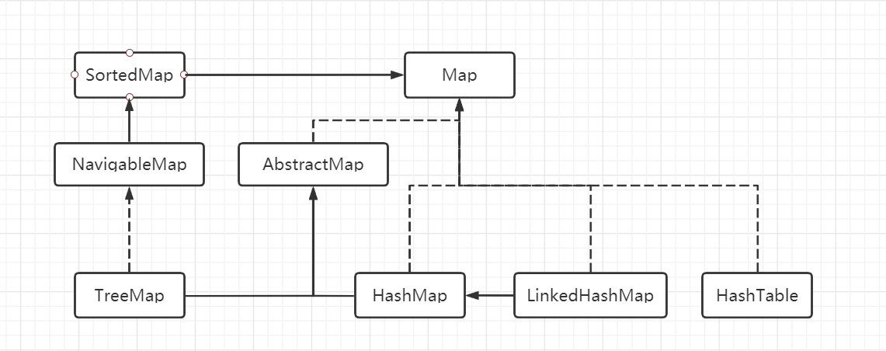
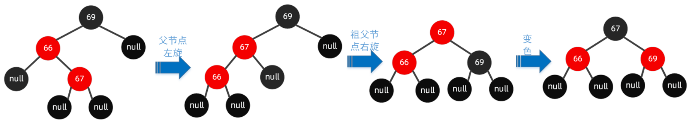
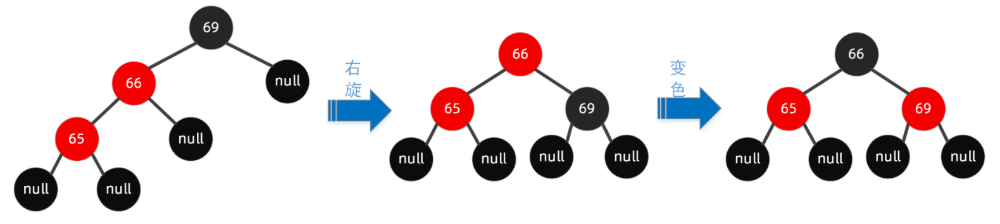
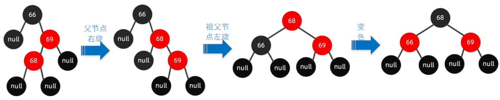
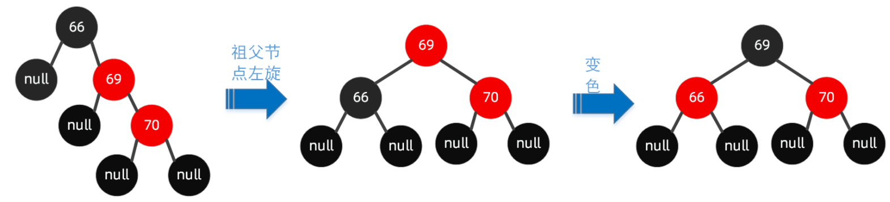
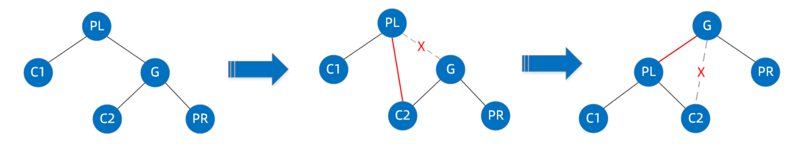
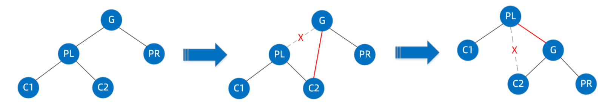

# HashMap

Map的关系图



## HashMap底层原理

推荐好文：

[Jdk1.8中的HashMap实现原理](https://www.cnblogs.com/chengdabelief/p/7419776.html)

[HashMap底层实现原理/HashMap与HashTable区别/HashMap与HashSet区别](https://www.cnblogs.com/beatIteWeNerverGiveUp/p/5709841.html)

[总结HashMap实现原理分析](https://blog.csdn.net/hefenglian/article/details/79763634)

### HashMap的put底层原理

JDK 8的HashMap的put的实现步骤

1. 对key的hashCode()做hash，然后再计算index

2.  如果没碰撞直接放到bucket里

3. 如果碰撞了，看第一个节点收否相等，相等则替换。判断依据(hashCode是否相同，且key是否相等)
   否则看是否为红黑树，如果是则调用putTreeVal
   若都不是就当链表处理，遍历链表每个元素

   判断是否最后一个元素，是则创建一个新的节点添加到最后，然后判断节点数大于等于8个，则转换为红黑树
   否则判断hashCode是否相同，且key是否相等，相等则替换

4. 判断实际存在的键值对数量size是否超多了最大容量threshold，如果超过，进行扩容

详细代码如下:

```java
// 计算hash值
// 在JDK1.8的实现中，优化了高位运算的算法，通过hashCode()的高16位异或低16位实现的
// 主要是从速度、功效、质量来考虑的，这么做可以在数组table的length比较小的时候
// 也能保证考虑到高低Bit都参与到Hash的计算中，同时不会有太大的开销。
static final int hash(Object key) {
    int h;
    return (key == null) ? 0 : (h = key.hashCode()) ^ (h >>> 16);
} 

public V put(K key, V value) {
	return putVal(hash(key), key, value, false, true);
}

final V putVal(int hash, K key, V value, boolean onlyIfAbsent,
                   boolean evict) {
    Node<K,V>[] tab; Node<K,V> p; int n, i;
    // 判断是否存在或者长度是否为零，否则resize
    if ((tab = table) == null || (n = tab.length) == 0)
        n = (tab = resize()).length;
    // 通过计算的hash值取模运算，找到对应的桶位置
    // hash & (n - 1) 与 hash % n 类似，但是前者速度快
    // 如果该位置不存在(未发生碰撞)元素则创建
    if ((p = tab[i = (n - 1) & hash]) == null)
        tab[i] = newNode(hash, key, value, null);
    else {
        Node<K,V> e; K k;
        // 判断hash值是否相等，且key也相等。若是，则替换原来的值
        if (p.hash == hash &&
            ((k = p.key) == key || (key != null && key.equals(k))))
            e = p;
        // 判断是否为红黑树
        else if (p instanceof TreeNode)
            e = ((TreeNode<K,V>)p).putTreeVal(this, tab, hash, key, value);
        // 否则为链表
        else {
            // 遍历所有元素
            for (int binCount = 0; ; ++binCount) {
                // 如果发现是最后一个则创建一个新的节点添加到最后
                if ((e = p.next) == null) {
                    p.next = newNode(hash, key, value, null);
                    // 如果节点数大于等于8个，则转换为红黑树
                    if (binCount >= TREEIFY_THRESHOLD - 1) // -1 for 1st
                        treeifyBin(tab, hash);
                    break;
                }
                if (e.hash == hash &&
                    ((k = e.key) == key || (key != null && key.equals(k))))
                    break;
                p = e;
            }
        }
        if (e != null) { // existing mapping for key
            V oldValue = e.value;
            // onlyIfAbsent: if true, don't change existing value
            if (!onlyIfAbsent || oldValue == null)
                e.value = value;
            afterNodeAccess(e);
            return oldValue;
        }
    }
    // 被修改的次数 -- fail-fast机制
    ++modCount;
    // 插入成功后，判断实际存在的键值对数量size是否超多了最大容量threshold，如果超过，进行扩容
    if (++size > threshold)
        resize();
    afterNodeInsertion(evict);
    return null;
}
```


### HashMap的get底层原理

JDK 8的HashMap的get的实现步骤

1. 判断表是否存在，大小是否大于零，计算桶的位置是否有对应的值
2. 是否命中第一个节点
3. 未命中则从链表或者树中获取

详细代码如下:

```java
public V get(Object key) {
    Node<K,V> e;
    return (e = getNode(hash(key), key)) == null ? null : e.value;
}

final Node<K,V> getNode(int hash, Object key) {
    Node<K,V>[] tab; Node<K,V> first, e; int n; K k;
    // 判断表是否存在，大小是否大于零，计算桶的位置是否有对应的值
    if ((tab = table) != null && (n = tab.length) > 0 &&
        (first = tab[(n - 1) & hash]) != null) {
        // 总是检查链表第一个元素是否是对应的值
        if (first.hash == hash && // always check first node
            ((k = first.key) == key || (key != null && key.equals(k))))
            return first;
        if ((e = first.next) != null) {
            // 是否为红黑树
            if (first instanceof TreeNode)
                return ((TreeNode<K,V>)first).getTreeNode(hash, key);
            // 否则遍历链表所有搜索发现值
            do {
                if (e.hash == hash &&
                    ((k = e.key) == key || (key != null && key.equals(k))))
                    return e;
            } while ((e = e.next) != null);
        }
    }
    return null;
}
```


## JDK 8 对 JDK 7 的HashMap的优化

### 扩容机制

JDK 7  使用了单链表的头插入方式，同一位置上新元素总会被放在链表的头部位置；这样先放在一个索引上的元素终会被放到Entry链的尾部(如果发生了hash冲突的话），这一点和Jdk1.8有区别

在 JDK 8 中我们使用的是2次幂的扩展(指长度扩为原来2倍)，所以，元素的位置要么是在原位置，要么是在原位置再移动2次幂的位置。也就是说元素在重新计算hash之后，因为n变为2倍，那么n-1的mask范围在高位多1bit，因此，**我们在扩充HashMap的时候，不需要像JDK1.7的实现那样重新计算hash，只需要看看原来的hash值在新增的那个bit位是1还是0就好了，是0的话索引没变，是1的话索引变成“原索引+oldCap**

这个设计确实非常的巧妙，既省去了重新计算hash值的时间，而且同时，由于新增的1bit是0还是1可以认为是随机的，因此resize的过程，均匀的把之前的冲突的节点分散到新的bucket了。这一块就是JDK1.8新增的优化点。有一点注意区别，JDK1.7中rehash的时候，旧链表迁移新链表的时候，如果在新表的数组索引位置相同，则链表元素会倒置


# TreeMap

推荐好文

[TreeMap原理实现及常用方法](https://www.cnblogs.com/LiaHon/p/11221634.html)

[关于红黑树(R-B tree)原理，看这篇如何](https://www.cnblogs.com/LiaHon/p/11203229.html)


TreeMap存储K-V键值对，通过红黑树（R-B tree）实现；

## R-B Tree的特点

1. 节点分为红色或者黑色
2. 根节点必为黑色
3. 叶子节点都为黑色，且为null
4. 连接红色节点的两个子节点都为黑色（红黑树不会出现相邻的红色节点）
5. 从任意节点出发，到其每个叶子节点的路径中包含相同数量的黑色节点
6. 新加入到红黑树的节点为红色节点

## 红黑树的平衡操作

1. 变色：在不违反上述红黑树规则特点情况下，将红黑树某个node节点颜色由红变黑，或者由黑变红；
2. 左旋：逆时针旋转两个节点，让一个节点被其右子节点取代，而该节点成为右子节点的左子节点
3. 右旋：顺时针旋转两个节点，让一个节点被其左子节点取代，而该节点成为左子节点的右子节点

## TreeMap底层原理

### TreeMap的put方法

JDK 8的TreeMap的get的实现步骤

1. 判断红黑树是否存在，不存在即创建，返回null
2. 遍历红黑树，与传入的key进行比较，若找到相同的key则替换值
3. 将遍历最后的节点parent作为插入节点的父节点，插入到左或者右节点上
4. 调整红黑树使其满足规则

```java
public V put(K key, V value) {
    Entry<K,V> t = root;
    // 判断红黑树是否创建
    if (t == null) {
        compare(key, key); // type (and possibly null) check

        root = new Entry<>(key, value, null);
        size = 1;
        modCount++;
        return null;
    }
    // 通过comparator函数比较的结果
    int cmp;
    Entry<K,V> parent;
    // split comparator and comparable paths
    Comparator<? super K> cpr = comparator;
    // 通过比较找到key的位置
    // 从root节点开始遍历，通过二分查找逐步向下找
    if (cpr != null) {
        do {
            parent = t;
            cmp = cpr.compare(key, t.key);
            if (cmp < 0)
                t = t.left;
            else if (cmp > 0)
                t = t.right;
            else
                return t.setValue(value);
        } while (t != null);
    }
    else {
        if (key == null)
            throw new NullPointerException();
        @SuppressWarnings("unchecked")
        Comparable<? super K> k = (Comparable<? super K>) key;
        do {
            parent = t;
            cmp = k.compareTo(t.key);
            if (cmp < 0)
                t = t.left;
            else if (cmp > 0)
                t = t.right;
            else
                return t.setValue(value);
        } while (t != null);
    }
    // 到此说明树中没有对应的key匹配，且确定了插入对象的parent
    Entry<K,V> e = new Entry<>(key, value, parent);
    // 通过上面的比较结果将新插入的节点插入到左或者右节点
    if (cmp < 0)
        parent.left = e;
    else
        parent.right = e;
    // ------调整红黑树使其满足规则
    fixAfterInsertion(e);
    size++;
    modCount++;
    return null;
}
```

fixAfterInsertion()私有方法

```java
// 下面较为复杂的情况有相应的图示

private void fixAfterInsertion(Entry<K,V> x) {
    // 新插入的节点默认红色
    x.color = RED;

    while (x != null && x != root && x.parent.color == RED) {
        // 判断传入节点的父亲节点是祖父节点的左还是右节点
        if (parentOf(x) == leftOf(parentOf(parentOf(x)))) {
            Entry<K,V> y = rightOf(parentOf(parentOf(x)));
            if (colorOf(y) == RED) {
                // 叔父节点和父节点都是红色，则只需要将父节点和叔父节点变为黑色，将祖父节点变为红色即可
                // 最后将插入节点x赋值为祖父节点，进行下一轮调整
                setColor(parentOf(x), BLACK);
                setColor(y, BLACK);
                setColor(parentOf(parentOf(x)), RED);
                x = parentOf(parentOf(x));
            } else {
                // 其他情况就需要旋转，此处父节点是祖父节点的左节点
                if (x == rightOf(parentOf(x))) {
                    // ----------------------左右节点旋转--------------------------
                    // 插入节点是父节点的右节点，需要进行左旋后，变成接下来的情况
                    x = parentOf(x);
                    rotateLeft(x);
                }
                // --------------------------左左节点旋转--------------------------
                // 此处的情况为x为红节点，x的父节点也是红节点，x的叔父和祖父节点为黑色节点
                // 那么需要变色右旋即可
                setColor(parentOf(x), BLACK);
                setColor(parentOf(parentOf(x)), RED);
                rotateRight(parentOf(parentOf(x)));
            }
        } else {
            // 下面情况和上面情况类似
            Entry<K,V> y = leftOf(parentOf(parentOf(x)));
            if (colorOf(y) == RED) {
                setColor(parentOf(x), BLACK);
                setColor(y, BLACK);
                setColor(parentOf(parentOf(x)), RED);
                x = parentOf(parentOf(x));
            } else {
                if (x == leftOf(parentOf(x))) {
                    // ----------------------右左节点旋转--------------------------
                    x = parentOf(x);
                    rotateRight(x);
                }
                // --------------------------右右节点旋转--------------------------
                setColor(parentOf(x), BLACK);
                setColor(parentOf(parentOf(x)), RED);
                rotateLeft(parentOf(parentOf(x)));
            }
        }
    }
    root.color = BLACK;
}
```

左右节点旋转情况如下：



左左节点旋转情况如下：



右左节点旋转情况如下：



右右节点旋转情况如下：



rotateLeft()和rotateRight()私有方法

```java
/** 以下图示为例 */

/** From CLR */
private void rotateLeft(Entry<K,V> p) {
    // p是最靠近root的节点,即下图的PL节点
    if (p != null) {
        // 保存p的右节点
        Entry<K,V> r = p.right;
        // 将p的右节点赋值为r的左节点
        p.right = r.left;
        // 如果r的左节点不为空，也将r的左节点的父节点指向p，即双向链表
        if (r.left != null)
            r.left.parent = p;
        // 将r的父节点指向p的父节点
        r.parent = p.parent;
        if (p.parent == null)
            // 若p无父节点，说明p是根节点，旋转后r就为根节点，此时将根节点赋值r
            root = r;
        else if (p.parent.left == p)
            // 若p是其父节点的左节点，就将p的父节点的左节点赋值为r
            p.parent.left = r;
        else
            // 否则就只能是父节点的右节点，就将p的父节点的右节点赋值为r
            p.parent.right = r;
        // 最后将r的左节点赋值为p，p的父节点复制为r
        r.left = p;
        p.parent = r;
    }
}

/** 右旋和左旋类似 */
/** From CLR */
private void rotateRight(Entry<K,V> p) {
    if (p != null) {
        Entry<K,V> l = p.left;
        p.left = l.right;
        if (l.right != null) l.right.parent = p;
        l.parent = p.parent;
        if (p.parent == null)
            root = l;
        else if (p.parent.right == p)
            p.parent.right = l;
        else p.parent.left = l;
        l.right = p;
        p.parent = l;
    }
}
```

左旋图示：



右旋图示：

