# MySQL

**一条查询语句怎么执行的？**

大体来说，MySQL可以分为Server层和存储引擎层两部分

Server层包括连接器、查询缓存、分析器、优化器、执行器等，涵盖MySQL的大多数核心服务功能，以及所有的内置函数（如日期、时间、数学和加密函数等），所有跨存储引擎的功能都在这一层实现，比如存储过程、触发器、视图等。

存储引擎层负责数据的存储和提取。其架构模式是插件式的，支持InnoDB、MyISAM、Memory等多个存储引擎。现在最常用的存储引擎是InnoDB，它从MySQL 5.5.5版本开始成为了默认存储引擎。

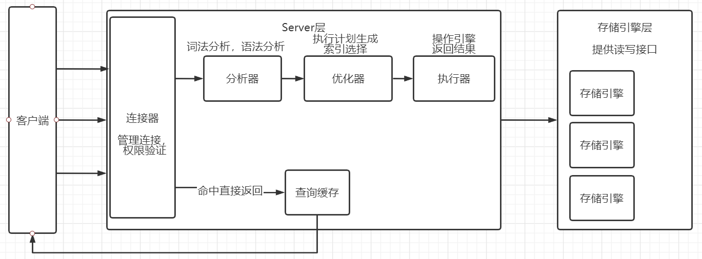

连接器：

```text
连接器负责跟客户端建立连接、获取权限、维持和管理连接。

通过命令或者客户端输入用户名和密码连接MySQL服务器，在完成经典的TCP握手后，连接器就要开始认证你的身份，这个时候用的就是你输入的用户名和密码。
- 如果用户名或密码不对，你就会收到一个"Access denied for user"的错误，然后客户端程序结束执行。
- 如果用户名密码认证通过，连接器会到权限表里面查出你拥有的权限。之后，这个连接里面的权限判断逻辑，都将依赖于此时读到的权限。
这就意味着，一个用户成功建立连接后，即使你用管理员账号对这个用户的权限做了修改，也不会影响已经存在连接的权限。修改完成后，只有再新建的连接才会使用新的权限设置。

客户端如果太长时间没动静，连接器就会自动将它断开。这个时间是由参数wait_timeout控制的，默认值是8小时。
```

查询缓存：

```java
MySQL拿到一个查询请求后，会先到查询缓存看看，之前执行过的语句及其结果可能会以key-value对的形式，被直接缓存在内存中。key是查询的语句，value是查询的结果。如果你的查询能够直接在这个缓存中找到key，那么这个value就会被直接返回给客户端。如果语句不在查询缓存中，就会继续后面的执行阶段。执行完成后，执行结果会被存入查询缓存中。

但是大多数情况下建议不要使用查询缓存，因为查询缓存往往弊大于利。
MySQL也提供了这种“按需使用”的方式。你可以将参数query_cache_type设置成DEMAND，这样对于默认的SQL语句都不使用查询缓存。而对于你确定要使用查询缓存的语句，可以用SQL_CACHE显式指定，像下面这个语句一样：
mysql> select SQL_CACHE * from T where ID=10；

需要注意的是，MySQL 8.0版本直接将查询缓存的整块功能删掉了，也就是说8.0开始彻底没有这个功能了。
```

分析器：

```java
如果没有命中查询缓存，就要开始真正执行语句了。

分析器先会做“词法分析”。你输入的是由多个字符串和空格组成的一条SQL语句，MySQL需要识别出里面的字符串分别是什么，代表什么。

做完“词法分析”后，就要做“语法分析”。根据词法分析的结果，语法分析器会根据语法规则，判断你输入的这个SQL语句是否满足MySQL语法。
```

优化器：

```java
经过了分析器，在开始执行之前，还要先经过优化器的处理。
优化器是在表里面有多个索引的时候，决定使用哪个索引；或者在一个语句有多表关联（join）的时候，决定各个表的连接顺序。
```

执行器：

```text
进入执行器阶段，开始执行语句。
开始执行的时候，要先判断一下你对这个表有没有执行查询的权限，如果没有，就会返回没有权限的错误。
如果有权限，就打开表继续执行。打开表的时候，执行器就会根据表的引擎定义，去使用这个引擎提供的接口。

比如我们举个例子，表中ID字段没有索引且查询使用ID，那么执行器的执行流程是这样的：
1.调用InnoDB引擎接口取这个表的第一行，判断ID值是不是10，如果不是则跳过，如果是则将这行存在结果集中；
2.调用引擎接口取“下一行”，重复相同的判断逻辑，直到取到这个表的最后一行。
3.执行器将上述遍历过程中所有满足条件的行组成的记录集作为结果集返回给客户端。
至此，这个语句就执行完成了。
对于有索引的表，执行的逻辑也差不多。第一次调用的是“取满足条件的第一行”这个接口，之后循环取“满足条件的下一行”这个接口，这些接口都是引擎中已经定义好的。
```

**一条更新语句怎么执行的？**

你执行语句前要先连接数据库，这是连接器的工作。

在一个表上有更新的时候，跟这个表有关的查询缓存会失效，所以这条语句就会把表T上所有缓存结果都清空。这也就是我们一般不建议使用查询缓存的原因。

接下来，分析器会通过词法和语法解析知道这是一条更新语句。优化器决定要使用哪个索引。然后，执行器负责具体执行，找到这一行，然后更新。 

与查询流程不一样的是，更新流程还涉及两个重要的日志模块：redo log（重做日志）和 binlog（归档日志）

具体来说，当有一条记录需要更新的时候，InnoDB引擎就会先把记录写到redo log（粉板）里面，并更新内存，这个时候更新就算完成了。同时，InnoDB引擎会在适当的时候，将这个操作记录更新到磁盘里面，而这个更新往往是在系统比较空闲的时候做， 

InnoDB的redo log是固定大小的，比如可以配置为一组4个文件，每个文件的大小是1GB，那么总共就可以记录4GB的操作。从头开始写，写到末尾就又回到开头循环写

有了redo log，InnoDB就可以保证即使数据库发生异常重启，之前提交的记录都不会丢失，这个能力称为**crash-safe**。 

 **redo log是InnoDB引擎特有的日志**，而Server层也有自己的日志，称为binlog（归档日志） 

```text
注：
	因为最开始MySQL里并没有InnoDB引擎。MySQL自带的引擎是MyISAM，但是MyISAM没有crash-safe的能力，binlog日志只能用于归档。而InnoDB是另一个公司以插件形式引入MySQL的，既然只依靠binlog是没有crash-safe能力的，所以InnoDB使用另外一套日志系统——也就是redo log来实现crash-safe能力。
```

这两种日志有以下三点不同：

1. redo log是InnoDB引擎特有的；binlog是MySQL的Server层实现的，所有引擎都可以使用。
2. redo log是物理日志，记录的是“在某个数据页上做了什么修改”；
   binlog是逻辑日志，记录的是这个语句的原始逻辑，比如“给ID=2这一行的c字段加1 ”；
3. redo log是循环写的，空间固定会用完；binlog是可以追加写入的。“追加写”是指binlog文件写到一定大小后会切换到下一个，并不会覆盖以前的日志。 

执行器和InnoDB引擎在执行这个简单的update语句时的内部流程：

```text
mysql> update T set c=c+1 where ID=1;

1. 执行器先找引擎取ID=1这一行。ID是主键，引擎直接用树搜索找到这一行。如果ID=1这一行所在的数据页本来就在内存中，就直接返回给执行器；否则，需要先从磁盘读入内存，然后再返回。

2. 执行器拿到引擎给的行数据，把这个值加上1，比如原来是N，现在就是N+1，得到新的一行数据，再调用引擎接口写入这行新数据。

3. 引擎将这行新数据更新到内存中，同时将这个更新操作记录到redo log里面，此时redo log处于prepare状态。然后告知执行器执行完成了，随时可以提交事务。

4. 执行器生成这个操作的binlog，并把binlog写入磁盘。

5. 执行器调用引擎的提交事务接口，引擎把刚刚写入的redo log改成提交（commit）状态，更新完成。
```

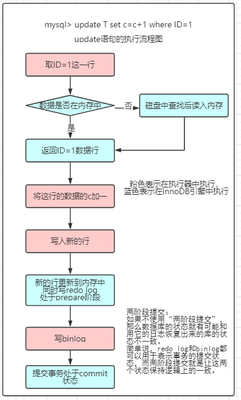

redo log用于保证crash-safe能力。innodb_flush_log_at_trx_commit这个参数设置成1的时候，表示每次事务的redo log都直接持久化到磁盘。这个参数建议设置成1，这样可以保证MySQL异常重启之后数据不丢失。

sync_binlog这个参数设置成1的时候，表示每次事务的binlog都持久化到磁盘。这个参数也建议设置成1，这样可以保证MySQL异常重启之后binlog不丢失。 

**两阶段提交**
崩溃恢复时的判断规则
- 如果redo log里面的事务是完整的，也就是已经有了commit标识，则直接提交；
- 如果redo log里面的事务只有完整的prepare，则判断对应的事务binlog是否存在并完整：
    a. 如果是，则提交事务；
    b. 否则，回滚事务。
```text
一个事务binlog的完整格式：
- statement格式的binlog，最后会有COMMIT。
- row格式的binlog，最后会有一个XID event。
在MySQL 5.6.2版本以后，还引入了binlog-checksum参数，用来验证binlog内容的正确性。对于binlog日志由于磁盘原因，可能会在日志中间出错的情况，MySQL可以通过校验checksum的结果来发现。

redo log 和 binlog它们有一个共同的数据字段，叫XID。崩溃恢复的时候，会按顺序扫描redo log
- 如果碰到既有prepare、又有commit的redo log，就直接提交。
- 如果碰到只有parepare、而没有commit的redo log，就拿着XID去binlog找对应的事务。

处于prepare阶段的redo log加上完整binlog，重启就能恢复，这个与数据与备份的一致性有关。binlog写完以后MySQL发生崩溃，这时候binlog已经写入了，之后就会被从库（或者用这个binlog恢复出来的库）使用。所以，在主库上也要提交这个事务。采用这个策略，主库和备库的数据就保证了一致性。
```

```text
redo log并没有记录数据页的完整数据，所以它并没有能力自己去更新磁盘数据页，也就不存在“数据最终落盘，是由redo log更新过去”的情况。
- 如果是正常运行的实例的话，数据页被修改以后，跟磁盘的数据页不一致，称为脏页。最终数据落盘，就是把内存中的数据页写盘。这个过程，甚至与redo log毫无关系。
- 在崩溃恢复场景中，InnoDB如果判断到一个数据页可能在崩溃恢复的时候丢失了更新，就会将它读到内存，然后让redo log更新内存内容。更新完成后，内存页变成脏页，就回到了第一种情况的状态。
```
先修改内存，还是先写redo log文件
```text
redo log buffer就是一块内存，用来先存redo日志的。真正把日志写到redo log文件（文件名是 ib_logfile+数字），是在执行commit语句的时候做的。
```

**事务隔离**

ACID（Atomicity、Consistency、Isolation、Durability，即原子性、一致性、隔离性、持久性） 

SQL标准的事务隔离级别包括：读未提交（read uncommitted）、读提交（read committed）、可重复读（repeatable read）和串行化（serializable ）

```text
- 读未提交：一个事务还没提交时，它做的变更就能被别的事务看到。
- 读提交：一个事务提交之后，它做的变更才会被其他事务看到。
- 可重复读：一个事务执行过程中看到的数据，总是跟这个事务在启动时看到的数据是一致的。当然在可重复读隔离级别下，未提交变更对其他事务也是不可见的。
- 串行化：顾名思义是对于同一行记录，“写”会加“写锁”，“读”会加“读锁”。当出现读写锁冲突的时候，后访问的事务必须等前一个事务执行完成，才能继续执行。
```

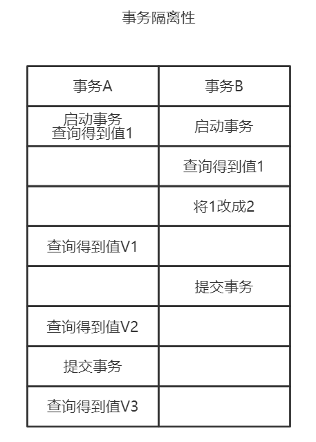

四种隔离级别通过上图分析结果

```text
- 若隔离级别是“读未提交”， 则V1的值就是2。这时候事务B虽然还没有提交，但是结果已经被A看到了。因此，V2、V3也都是2。“读未提交”隔离级别下直接返回记录上的最新值，没有视图概念；
- 若隔离级别是“读提交”，则V1是1，V2的值是2。事务B的更新在提交后才能被A看到。所以， V3的值也是2。在“读提交”隔离级别下，视图是在每个SQL语句开始执行的时候创建的，访问的时候以视图的逻辑结果为准。
- 若隔离级别是“可重复读”，则V1、V2是1，V3是2。之所以V2还是1，遵循的就是这个要求：事务在执行期间看到的数据前后必须是一致的。在“可重复读”隔离级别下，这个视图是在事务启动时创建的，整个事务存在期间都用这个视图。
- 若隔离级别是“串行化”，则在事务B执行“将1改成2”的时候，会被锁住。直到事务A提交后，事务B才可以继续执行。所以从A的角度看， V1、V2值是1，V3的值是2。“串行化”隔离级别下直接用加锁的方式来避免并行访问。
```

```text
注：
	在不同的隔离级别下，数据库行为是有所不同的。Oracle数据库的默认隔离级别其实就是“读提交”，因此对于一些从Oracle迁移到MySQL的应用，为保证数据库隔离级别的一致，你一定要记得将MySQL的隔离级别设置为“读提交”。
```

**事务隔离的实现**

在MySQL中，实际上每条记录在更新的时候都会同时记录一条回滚操作。记录上的最新值，通过回滚操作，都可以得到前一个状态的值。 

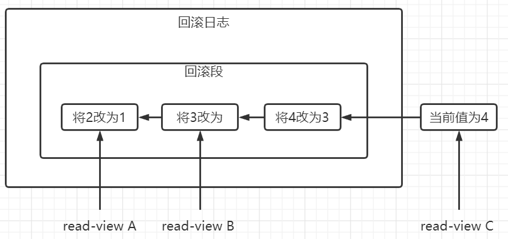

```text
如上图，假设一个值从1被按顺序改成了2、3、4，在回滚日志里面就会有类似下面的记录。
当前值是4，但是在查询这条记录的时候，不同时刻启动的事务会有不同的read-view。如图中看到的，在视图A、B、C里面，这一个记录的值分别是1、2、4，同一条记录在系统中可以存在多个版本，就是数据库的多版本并发控制（MVCC）。对于read-view A，要得到1，就必须将当前值依次执行图中所有的回滚操作得到。同时你会发现，即使现在有另外一个事务正在将4改成5，这个事务跟read-view A、B、C对应的事务是不会冲突的。

注：
	回滚日志不会一直保留，在不需要的时候才删除。也就是说，系统会判断，当没有事务再需要用到这些回滚日志时，回滚日志会被删除。就是当系统里没有比这个回滚日志更早的read-view的时候，回滚日志就会被删除。

建议：
	尽量不要使用长事务，长事务意味着系统里面会存在很老的事务视图。由于这些事务随时可能访问数据库里面的任何数据，所以这个事务提交之前，数据库里面它可能用到的回滚记录都必须保留，这就会导致大量占用存储空间。除了对回滚段的影响，长事务还占用锁资源，也可能拖垮整个库。
	在MySQL 5.5及以前的版本，回滚日志是跟数据字典一起放在ibdata文件里的，即使长事务最终提交，回滚段被清理，文件也不会变小。
```

**事务的启动方式**

MySQL的事务启动方式有以下两种：

1. 显式启动事务语句， begin 或 start transaction。配套的提交语句是commit，回滚语句是rollback
2. set autocommit=0，这个命令会将这个线程的自动提交关掉。意味着如果你只执行一个select语句，这个事务就启动了，而且并不会自动提交。这个事务持续存在直到你主动执行commit 或 rollback 语句，或者断开连接。 

```text
注：
	建议使用set autocommit=1, 通过显式语句的方式来启动事务。
	在autocommit为1的情况下，用begin显式启动的事务，如果执行commit则提交事务。如果执行 commit work and chain，则是提交事务并自动启动下一个事务，这样也省去了再次执行begin语句的开销。同时带来的好处是从程序开发的角度明确地知道每个语句是否处于事务中。
```


**索引**

索引的出现其实就是为了提高数据查询的效率，就像书的目录一样。

**索引的常见模型**

1. 哈希表

   ```text
   一种以键-值（key-value）存储数据的结构，我们只要输入待查找的值即key，就可以找到其对应的值即Value。
   好处是增加新的数据时速度会很快，只需要往后追加。但缺点是，因为不是有序的，所以哈希索引做区间查询的速度是很慢的。
   所以，哈希表这种结构适用于只有等值查询的场景，比如Memcached及其他一些NoSQL引擎。而有序数组在等值查询和范围查询场景中的性能就都非常优秀。
   ```

2. 有序数组索引

   ```text
   有序数组就是按照某字段递增的顺序保存的。这时候如果你要查某个字段对应的数据，用二分法就可以快速得到，这个时间复杂度是O(log(N))。
   仅仅看查询效率，有序数组就是最好的数据结构了。但是，在需要更新数据的时候就麻烦了，你往中间插入一个记录就必须得挪动后面所有的记录，成本太高。
   所以，有序数组索引只适用于静态存储引擎，比如你要保存的是2017年某个城市的所有人口信息，这类不会再修改的数据。
   ```

3. 二叉搜索树

   ```text
   二叉树虽然是搜索效率最高的，但是实际上大多数数据库存储却并不使用二叉树，其原因是因为索引并不只存在内存中，而且还要写入磁盘。
   举个例子：
    可以想象一下一棵100万节点的平衡二叉树，树高20。一次查询可能需要访问20个数据块。在机械硬盘时代，从磁盘随机读一个数据块需要10 ms左右的寻址时间。也就是说，对于一个100万行的表，如果使用二叉树来存储，单独访问一个行可能需要20个10 ms的时间，这个查询可真够慢的。
   
   为了让一个查询尽量少地读磁盘，就必须让查询过程访问尽量少的数据块。那么，我们就不应该使用二叉树，而是要使用“N叉”树。这里，“N叉”树中的“N”取决于数据块的大小。
   ```
   


```text
不管是哈希还是有序数组，或者N叉树，它们都是不断迭代、不断优化的产物或者解决方案。数据库技术发展到今天，跳表、LSM树等数据结构也被用于引擎设计中
总之数据库底层存储的核心就是基于这些数据模型的。每碰到一个新数据库，我们需要先关注它的数据模型，这样才能从理论上分析出这个数据库的适用场景。
```


**InnoDB 的索引模型**

在InnoDB中，表都是根据主键顺序以索引的形式存放的，这种存储方式的表称为索引组织表。又因为InnoDB使用了B+树索引模型，所以数据都是存储在B+树中的。

 每个索引在innoDB里面都对应的有一颗B+树

```text
create table T(
id int primary key, 
k int not null, 
index (k))engine=InnoDB;

举例：上表主键列key和k上有索引
row1~row5的(ID,k)值分别为(100,1)、(200,2)、(300,3)、(500,5)和(600,6)
对应有以下的两颗B+树
```

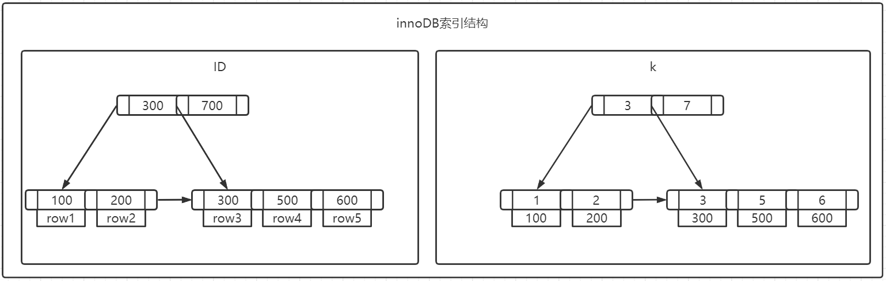

```text
根据叶子节点的内容，索引类型分为主键索引和非主键索引。

主键索引的叶子节点存的是整行数据。在InnoDB里，主键索引也被称为聚簇索引（clustered index）。
非主键索引的叶子节点内容是主键的值。在InnoDB里，非主键索引也被称为二级索引（secondary index）。

例如：SELECT * FROM t WHERE k=5
首先根据普通索引找到主键的值，在根据主键的值在ID索引树中搜索一次，这个过程称为回表。
即：基于非主键索引树需要多扫描一颗索引树，因此我们在应用中尽量使用主键搜索。
```

**索引维护**

B+树为了保证有序性，在插入或着删除数据的时候会对树进行维护。在此过程中会出现两种情况：页分裂和也合并，这两种情况都会有性能损耗。但是如果是自增主键就不会出现这两种情况。

在自增主键的插入数据模式中，每次插入一条新记录，都是追加操作，都不涉及到挪动其他记录，也不会触发叶子节点的分裂。然而有业务的字段作为主键，则往往不容易保证插入的有序性，这样写数据的成本相对较高。除了考虑性能外，在非主键索引树叶子结点存储的是主键的值，如果主键采用的是很长的字符串，将会占用很多的存储空间，而如果使用整数类型作为主键，只占用4个字节，显然，主键长度越小，普通索引的叶子节点就越小，普通索引占用的空间就越小
索引从性能和存储空间考虑，往往自增主键索引是更合理的选择。

但是也可以采用业务字段作为索引，例如以下场景：

```text
1. 只有一个索引
2. 该索引必须是唯一索引

由于没有其他索引，所以也不用考虑其他索引的叶子节点大小问题。
这时候应该优先考虑“尽量使用主键查询”的原则，直接将该字段设为主键，避免了每次查询需要搜索两棵树
```

**覆盖索引**

```text
SELECT * FROM T WHERE k BETWEEN 3 AND 5;
SELECT ID FROM T WHERE K BETWEEN 3 AND 5;
以上两条SQL的执行流程有所不同：
第一条：
	1. 在k索引树上找到3对应的ID值，再到ID索引树中搜索对应的行
	2. 再到k索引树取到下一个值为5，在回到ID索引树中搜索对应的行
	3. 再回到k索引树取下一个值为6，不满足条件，结束循环
在这个过程中，回到主键索引树搜索的过程，我们称为回表。这个查询过程读了k索引树的3条记录，回表了两次。
第二条：
查询结果已经在k索引树上了，因此可以直接提供查询结果，不需要回表，即这个查询，索引k已经"覆盖了"我们查询的需求，称为覆盖索引。

建议：
	由于覆盖索引可以减少树的搜索次数，显著提升查询性能，所以使用覆盖索引是一个常用的性能优化手段。
```

**最左前缀原则**

B+树这种索引结构，可以利用索引的“最左前缀”，来定位记录。只要满足最左前缀，就可以利用索引来加速检索。这个最左前缀可以是联合索引的最左N个字段，也可以是字符串索引的最左M个字符。那么在建立联合索引的时候，如何安排索引内的字段顺序呢，该评估标准就是**索引的复用能力**， 因为可以支持最左前缀，所以当已经有了(a,b)这个联合索引后，一般就不需要单独在a上建立索引了。因此，**第一原则是，如果通过调整顺序，可以少维护一个索引，那么这个顺序往往就是需要优先考虑采用的。** 那么，如果既有联合查询，又有基于a、b各自的查询，但查询条件里面只有b的语句，是无法使用(a,b)这个联合索引的，这时候你不得不维护另外一个索引，也就是说需要同时维护(a,b)、(b) 这两个索引。这时候，我们要**考虑的原则就是空间**了。比如以下情况，a字段是比b字段大的 ，那我就建议你创建一个（a,b)的联合索引和一个(b)的单字段索引。

**索引下推**

对于那些不符合左前缀

```text
例如：
联合索引(a,b,c)，如果既有条件a也有条件c，那么根据前缀规则则会通过该索引搜索树根据条件a搜索结果，然后在MySQL5.6之前，只能再进行回表查询，到主键索引上找出数据行，在进行对比条件c
而在MySQL5.6及以后就引入了索引下推优化，可以在索引遍历过程中，对索引中包含的字段先做判断，直接过滤掉不满足条件的记录，减少回表的次数
也就是例子中的判断条件a，同时也判断条件c，对于不满足的直接跳过，进而可以减少回表的次数
```


```text
注：
为什么需要重建索引?
索引可能因为删除，或者页分裂等原因，导致数据页有空洞，重建索引的过程会创建一个新的索引，把数据按顺序插入，这样页面的利用率最高，也就是索引更紧凑、更省空间。

	对于InnoDB表T，如果你要重建索引k，你的两个SQL语句可以这么写：
        alter table T drop index k;
        alter table T add index(k);
    重建非主键索引是合理的，可以达到省空间的目的。
    
    如果重建主键索引，可以如下方式：
        alter table T drop primary key;
        alter table T add primary key(id);
    重建主键的过程不合理。不论是删除主键还是创建主键，都会将整个表重建。
    这两个语句，你可以用这个语句代替 ： alter table T engine=InnoDB。
```

**全局锁和表锁**

根据加锁的范围，MySQL里面的锁大致可以分成全局锁、表级锁和行锁三类

**全局锁**

全局锁就是对整个数据库实例加锁，MySQL提供了一个加全局读锁的方法，命令是 `Flush tables with read lock (FTWRL)`。使用这个命令之后其他例如数据更新语句（数据的增删改）、数据定义语句（包括建表、修改表结构等）和更新类事务的提交语句等都会使线程阻塞。

全局锁的典型使用场景是做**全库逻辑备份**。
但是让整个库只读，会有以下缺点：
1. 如果是在主库上备份，那么在备份期间不能执行更新类的语句，业务流程基本停止。
2. 如果是在从库上备份，那么在备份期间不能执行主库同步过来的binlog，会导致主从延迟。

MySQL数据库自带的逻辑备份工具是mysqldump。当mysqldump使用参数`–single-transaction`的时候，导数据之前就会启动一个事务，来确保拿到一致性视图。而由于MVCC的支持，这个过程中数据是可以正常更新的。**但是前提是引擎要支持这个隔离级别(可重复读)**。
例如，对于MyISAM这种不支持事务的引擎，如果备份过程中有更新，总是只能取到最新的数据，那么就破坏了备份的一致性。这时，我们就需要使用FTWRL命令了。

```text
注：
    single-transaction方法只适用于所有的表使用事务引擎的库。如果有的表使用了不支持事务的引擎，那么备份就只能通过FTWRL方法。这往往是DBA要求业务开发人员使用InnoDB替代MyISAM的原因之一。

尽量不使用set global readonly=true的方式使全库只读，原因如下：
1. 在有些系统中，readonly的值会被用来做其他逻辑，比如用来判断一个库是主库还是备库。因此，修改global变量的方式影响面更大
2. 在异常处理机制上会有所不同，执行FTWRL命令之后如果客户端发生异常断开，那么MySQL会自动释放这个全局锁，整个库回到可以正常更新的状态。而将整个库设置为readonly之后，如果客户端发生异常，则数据库就会一直保持readonly状态，这样会导致整个库长时间处于不可写状态，风险较高。
```

**表级锁**

MySQL里面表级别的锁有两种：一种是表锁，一种是元数据锁（meta data lock，MDL)。

表锁的语法是 lock tables … read/write。与FTWRL类似，可以用unlock tables主动释放锁，也可以在客户端断开的时候自动释放。需要注意，lock tables语法除了会限制别的线程的读写外，也限定了本线程接下来的操作对象。

```text
例如，如果在某个线程A中执行lock tables t1 read, t2 write; 这个语句，则其他线程写t1、读写t2的语句都会被阻塞。同时，线程A在执行unlock tables之前，也只能执行读t1、读写t2的操作。连写t1都不允许，也不能访问其他表。

对于InnoDB这种支持行锁的引擎，一般不使用lock tables命令来控制并发，毕竟锁住整个表的影响面还是太大。

表锁一般是在数据库引擎不支持行锁的时候才会被用到的。如果你发现你的应用程序里有lock tables这样的语句，比较可能的情况是：
- 要么是系统现在还在用MyISAM这类不支持事务的引擎，那要安排升级换引擎；
- 要么是引擎升级了，但是代码还没升级。最后业务开发就是把lock tables 和 unlock tables 改成 begin 和 commit，问题就解决了。
```

MySQL 5.5版本中引入了另一类表级的锁是MDL(metadata Lock)，MDL不需要显式使用，在访问一个表的时候会被自动加上。MDL的作用是，保证读写的正确性。
- 读锁之间不互斥，因此可以有多个线程同时对一张表增删改查。
- 读写锁之间、写锁之间是互斥的，用来保证变更表结构操作的安全性。因此，如果有两个线程要同时给一个表加字段，其中一个要等另一个执行完才能开始执行。

```text
例如一个查询正在遍历一个表中的数据，而执行期间另一个线程对这个表结构做变更，删了一列，那么查询线程拿到的结果跟表结构对不上。
当对一个表做增删改查操作的时候，加MDL读锁；当要对表做结构变更操作的时候，加MDL写锁。

虽然MDL锁是系统默认会加的，但却要注意MDL会直到事务提交才释放，所以在做表的结构变更的时候，要注意不要导致锁住线上查询和更新。
```

**行锁**

行锁就是针对数据表中行记录的锁。MySQL的行锁是在引擎层由各个引擎自己实现的。但并不是所有的引擎都支持行锁，比如MyISAM引擎就不支持行锁。不支持行锁意味着并发控制只能使用表锁，对于这种引擎的表，同一张表上任何时刻只能有一个更新在执行，这就会影响到业务并发度。InnoDB是支持行锁

```text
两阶段锁协议

在InnoDB事务中，行锁是在需要的时候才加上的，但并不是不需要了就立刻释放，而是要等到事务结束时才释放。这个就是两阶段锁协议。

知道了两阶段锁，使用事务的时候需要注意的是：如果事务中需要锁多个行，要把最可能造成锁冲突、最可能影响并发度的行锁的申请时机尽量往后放。这样一来最可能影响并发度的行锁在事务中待的时间就是最少，这就最大程度地减少了事务之间的锁等待，提升了并发度。
```

**死锁和死锁检测**

当并发系统中不同线程出现循环资源依赖，涉及的线程都在等待别的线程释放资源时，就会导致这几个线程都进入无限等待的状态，称为死锁。

两种策略：

1. 直接进入等待，直到超时。这个超时时间可以通过参数innodb_lock_wait_timeout来设置，在InnoDB中，innodb_lock_wait_timeout的默认值是50

2. 发起死锁检测，发现死锁后，主动回滚死锁链条中的某一个事务，让其他事务得以继续执行。将参数innodb_deadlock_detect设置为on，表示开启这个逻辑。innodb_deadlock_detect的默认值本身就是on

```text
主动死锁检测在发生死锁的时候，是能够快速发现并进行处理的，但是它也是有额外负担的。

每当一个事务被锁的时候，就要看看它所依赖的线程有没有被别人锁住，如此循环，最后判断是否出现了循环等待，也就是死锁。如果所有事务都要更新同一行，每个新来的被堵住的线程，都要判断会不会由于自己的加入导致了死锁，这是一个时间复杂度是O(n)的操作。假设有1000个并发线程要同时更新同一行，那么死锁检测操作就是100万这个量级的。虽然最终检测的结果是没有死锁，但是这期间要消耗大量的CPU资源。因此，你就会看到CPU利用率很高，但是每秒却执行不了几个事务。

所以这种热点行更新导致的性能问题的症结在于，死锁检测要耗费大量的CPU资源。

三种解决方案：
1. 如果能确保这个业务一定不会出现死锁，可以临时把死锁检测关掉，带有一定的风险性。
2. 控制并发度。如果你有中间件，可以考虑在中间件实现；如果能修改MySQL源码，基本思路就是，对于相同行的更新，在进入引擎之前排队。这样在InnoDB内部就不会有大量的死锁检测工作了；
3. 可以考虑通过将一行改成逻辑上的多行来减少锁冲突。每次要更改该数据行的时候，随机选其中一条记录来更新。这样每次冲突概率变成原来的1/10，可以减少锁等待个数，也就减少了死锁检测的CPU消耗。
```

**"快照"在MVCC里的工作原理**

在MySQL里，有两个“视图”的概念
1. 一个是view。它是一个用查询语句定义的虚拟表，在调用的时候执行查询语句并生成结果。创建视图的语法是create view … ，而它的查询方法与表一样。
2. 另一个是InnoDB在实现MVCC时用到的一致性读视图，即consistent read view，用于支持RC（Read Committed，读提交）和RR（Repeatable Read，可重复读）隔离级别的实现。

```text
在可重复读隔离级别下，事务在启动的时候就“拍了个快照”。注意，这个快照是基于整库的。
```

数据行的多版本

```text
InnoDB里面每个事务有一个唯一的事务ID，叫作transaction id。它是在事务开始的时候向InnoDB的事务系统申请的，是按申请顺序严格递增的。
每行数据都是有多个版本的。每次事务更新数据的时候，都会生成一个新的数据版本，并且把transaction id赋值给这个数据版本的事务ID，记为row trx_id。同时，旧的数据版本要保留，并且在新的数据版本中，能够在需要的时候根据当前版本和undo log计算出来得到旧数据。也就是说，数据表中的一行记录，其实可能有多个版本(row)，每个版本有自己的row trx_id。
```

一致性视图

```text
InnoDB为每个事务构造了一个数组，用来保存这个事务启动瞬间，当前正在“活跃”的所有事务ID。“活跃”指的就是，启动了但还没提交。
数组里面事务ID的最小值记为低水位，当前系统里面已经创建过的事务ID的最大值加1记为高水位。
这个视图数组和高水位，就组成了当前事务的一致性视图（read-view）。
```

而数据版本的可见性规则，就是基于数据的row trx_id和这个一致性视图的对比结果得到的。

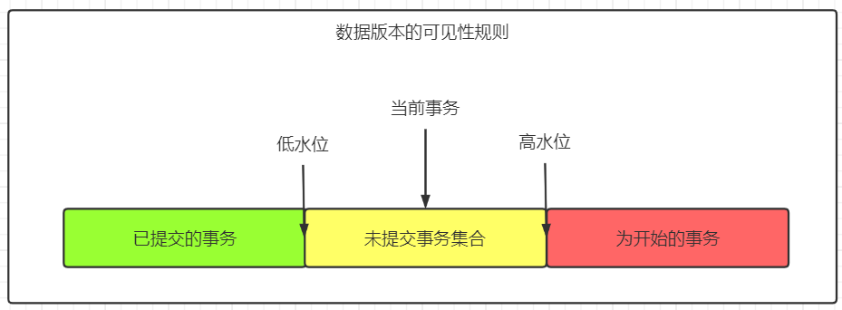

这个视图数组把所有的row trx_id 分成了几种不同的情况

```text
当前事务的启动瞬间来说，一个数据版本的row trx_id，有以下几种可能：
1. 如果落在绿色部分，表示这个版本是已提交的事务或者是当前事务自己生成的，这个数据是可见的；
2. 如果落在红色部分，表示这个版本是由将来启动的事务生成的，是肯定不可见的；
3. 如果落在黄色部分
    a. 若 row trx_id 在数组中，表示这个版本是由还没提交的事务生成的，不可见；
    b. 若 row trx_id 不在数组中，表示这个版本是已经提交了的事务生成的，可见。
```
InnoDB利用了“所有数据都有多个版本”的这个特性，实现了“秒级创建快照”的能力。

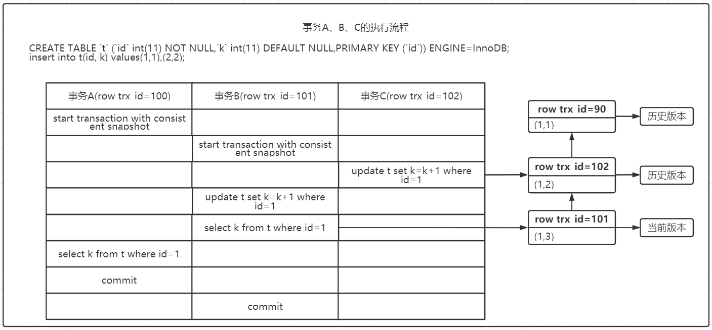
```text
注：
    该例子中autocommit=1，事务C没有显式地使用begin/commit，表示这个update语句本身就是一个事务，语句完成的时候会自动提交。
    事务的启动时机: begin/start transaction 命令并不是一个事务的起点，在执行到它们之后的第一个操作InnoDB表的语句，事务才真正启动。想要马上启动一个事务，可以使用命令start transaction with consistent snapshot。

分析执行流程：由上图可见，事务A的视图数组就是[99,100], 事务B的视图数组是[99,100,101], 事务C的视图数组是[99,100,101,102]。
1. 第一个有效更新是事务C，把数据从(1,1)改成了(1,2)。这时候，这个数据的最新版本的row trx_id是102，而90这个版本已经成为了历史版本。
2. 第二个有效更新是事务B，把数据从(1,2)改成了(1,3)。这时候，这个数据的最新版本（即row trx_id）是101，而102又成为了历史版本。(在事务A查询的时候，其实事务B还没有提交，但是它生成的(1,3)这个版本已经变成当前版本了，但这个版本对事务A必须是不可见的。)
3. 事务A要读数据，它的视图数组是[99,100]。读数据都是从当前版本读起的。所以，事务A查询语句的读数据流程是这样的：
    a. 找到(1,3)的时候，判断出row trx_id=101，比高水位大，处于红色区域，不可见。
    b. 找到上一个历史版本，一看row trx_id=102，比高水位大，处于红色区域，不可见。
    c. 再往前找，终于找到了（1,1)，它的row trx_id=90，比低水位小，处于绿色区域，可见。
这样执行下来，虽然期间这一行数据被修改过，但是事务A不论在什么时候查询，看到这行数据的结果都是一致的，所以我们称之为一致性读。

小结：
一个数据版本，对于一个事务视图来说，除了自己的更新总是可见以外，有三种情况：
1. 版本未提交，不可见。
2. 版本已提交，但是是在视图创建后提交的，不可见。
3. 版本已提交，而且是在视图创建前提交的，可见。

如果此处事务隔离是读提交：
(1,3)还没提交，属于上面情况1，不可见；
(1,2)提交了，属于上面情况3，可见。
所以，这时候事务A查询语句返回的是k=2。事务B查询结果k=3。
```

**更新逻辑**
上图所示：
如果事务B在更新之前查询一次数据，这个查询返回的k的值确实是1。
但是，当它要去更新数据的时候，就不能再在历史版本上更新了，否则事务C的更新就丢失了。因此，事务B此时的set k=k+1是在（1,2）的基础上进行的操作。
有这样一条规则：**更新数据都是先读后写的，而这个读，只能读当前的值，称为“当前读”（current read）。**(除了update语句外，select语句如果加锁(不是很理解)，也是当前读。)

```text
把事务A的查询语句select * from t where id=1修改一下，加上lock in share mode 或 for update，也都可以读到版本号是101的数据，返回的k的值是3。下面这两个select语句，就是分别加了读锁（S锁，共享锁）和写锁（X锁，排他锁）。
mysql> select k from t where id=1 lock in share mode;
mysql> select k from t where id=1 for update;
```
在执行事务B中更新后的查询语句的时候，一看自己的版本号是101，最新数据的版本号也是101，是自己的更新，可以直接使用，所以查询得到的k的值是3。

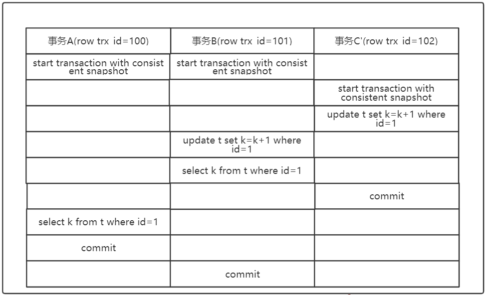
```text
如上图，假设事务C不是马上提交的，而是变成了下面的事务C'。
在这个阶段中，"两阶段锁协议"就起到作用了。事务C'没提交，也就是说(1,2)这个版本上的写锁还没释放。而事务B是当前读，必须要读最新版本，而且必须加锁，因此就被锁住了，必须等到事务C'释放这个锁，才能继续它的当前读。
```

可重复读的核心就是一致性读（consistent read），而事务更新数据的时候，只能用当前读。如果当前的记录的行锁被其他事务占用的话，就需要进入锁等待。

读提交的逻辑和可重复读的逻辑类似，它们最主要的区别是：
- 在可重复读隔离级别下，只需要在事务开始的时候创建一致性视图，之后事务里的其他查询都共用这个一致性视图；
- 在读提交隔离级别下，每一个语句执行前都会重新算出一个新的视图。
```text
说明：
    “start transaction with consistent snapshot; ”的意思是从这个语句开始，创建一个持续整个事务的一致性快照。所以，在读提交隔离级别下，这个用法就没意义了，等效于普通的start transaction。
```

```text 
小结：
InnoDB的行数据有多个版本，每个数据版本有自己的row trx_id，每个事务或者语句有自己的一致性视图。普通查询语句是一致性读，一致性读会根据row trx_id和一致性视图确定数据版本的可见性。

- 对于可重复读，查询只承认在事务启动前就已经提交完成的数据；
- 对于读提交，查询只承认在语句启动前就已经提交完成的数据；

而当前读，总是读取已经提交完成的最新版本。
```

**普通索引和唯一索引**

查询过程
```text
执行查询的语句： select id from T where k=5。
在索引树上查找的过程，先是通过B+树从树根开始，按层搜索到叶子节点。
- 对于普通索引来说，查找到满足条件的第一个记录(5,500)后，需要查找下一个记录，直到碰到第一个不满足k=5条件的记录。
- 对于唯一索引来说，由于索引定义了唯一性，查找到第一个满足条件的记录后，就会停止继续检索。

innoDB的数据是按数据页为单位来读写的。由于引擎是按页读写的，当需要读一条记录的时候，并不是将这个记录本身从磁盘读出来，而是以页为单位，将其整体读入内存。在InnoDB中，每个数据页的大小默认是16KB。

- 当找到k=5的记录的时候，它所在的数据页就都在内存里了。那么，对于普通索引来说，要多做的那一次“查找和判断下一条记录”的操作，就只需要一次指针寻找和一次计算。此时两者性能差异不大。
- 如果k=5这个记录刚好是这个数据页的最后一个记录，那么要取下一个记录，必须读取下一个数据页，这个操作会稍微复杂一些。由此可见此时的普通索引性能消耗明显低于唯一索引。

但是，对于整型字段，一个数据页可以放近千个key，因此出现这种情况的概率会很低。所以，我们计算平均性能差异时，仍可以认为这个操作成本对于现在的CPU来说可以忽略不计。
```

更新过程
```text
当需要更新一个数据页时，如果数据页在内存中就直接更新，如果这个数据页还没有在内存中的话，在不影响数据一致性的前提下，InooDB会将这些更新操作缓存在change buffer中，这样就不需要从磁盘中读入这个数据页了。在下次查询需要访问这个数据页的时候，将数据页读入内存，然后执行change buffer中与这个页有关的操作。通过这种方式就能保证这个数据逻辑的正确性。
```

**change buffer**
```text
它是一种应用在非唯一普通索引页(non-unique secondary index page)不在缓冲池中，对页进行了写操作，并不会立刻将磁盘页加载到缓冲池，而仅仅记录缓冲变更(buffer changes)，等未来数据被读取时，再将数据合并(merge)恢复到缓冲池中的技术。写缓冲的目的是降低写操作的磁盘IO，提升数据库性能。数据读入内存是需要占用buffer pool的，所以这种方式还能够避免占用内存，提高内存利用率。
它也是可以持久化的数据。即change buffer在内存中有拷贝，也会被写入到磁盘上。

merge：将change buffer中的操作应用到原数据页，得到最新结果的过程称为merge。除了访问这个数据页会触发merge外，系统有后台线程会定期merge。在数据库正常关闭（shutdown）的过程中，也会执行merge操作。

change buffer用的是buffer pool里的内存，因此不能无限增大。change buffer的大小，可以通过参数innodb_change_buffer_max_size来动态设置。这个参数设置为50的时候，表示change buffer的大小最多只能占用buffer pool的50%。

对于唯一索引来说，所有的更新操作都要先判断这个操作是否违反唯一性约束。比如，要插入一条记录，就要先判断现在表中是否已经存在该记录，而这必须要将数据页读入内存才能判断。如果都已经读入到内存了，那直接更新内存会更快，就没必要使用change buffer了。唯一索引的更新是不能使用change buffer，实际上也只有普通索引可以使用。
```

当插入一条新记录到表中，innoDB的处理流程
- 情况一：这个记录要更新的目标页在内存中
    1. 对于唯一索引来说，判断到没有冲突，插入这个值，语句执行结束；
    2. 对于普通索引来说，找到位置后，插入这个值，语句执行结束。
    ```text
    普通索引和唯一索引对更新语句性能影响的差别，只是一个判断，只会耗费微小的CPU时间。
    ```
- 情况二：这个记录要更新的目标页不在内存中
    1. 对于唯一索引来说，需要将数据页读入内存，判断到没有冲突，插入这个值，语句执行结束；
    2. 对于普通索引来说，则是将更新记录在change buffer，语句执行就结束了。
    ```text
    将数据从磁盘读入内存涉及随机IO的访问，是数据库里面成本最高的操作之一。change buffer因为减少了随机磁盘访问，所以对更新性能的提升是会很明显的。
    ```

change buffer 的使用场景
```text
change buffer的主要目的就是将记录的变更动作缓存下来，所以在一个数据页做merge之前，change buffer记录的变更越多（也就是这个页面上要更新的次数越多），收益就越大。

对于写多读少的业务来说，页面在写完以后马上被访问到的概率比较小，此时change buffer的使用效果最好。这种业务模型常见的就是账单类、日志类的系统。反过来，假设一个业务的更新模式是写入之后马上会做查询，那么即使满足了条件，将更新先记录在change buffer，但之后由于马上要访问这个数据页，会立即触发merge过程。这样随机访问IO的次数不会减少，反而增加了change buffer的维护代价。所以，对于这种业务模式来说，change buffer反而起到了副作用。
```

索引选择
```text
普通索引和唯一索引这两类索引在查询能力上是没差别的，主要考虑的是对更新性能的影响。所以尽量选择普通索引。
如果所有的更新后面，都马上伴随着对这个记录的查询，那么应该关闭change buffer。而在其他情况下，change buffer都能提升更新性能。
普通索引和change buffer的配合使用，对于数据量大的表的更新优化尤其明显的。
特别地，在使用机械硬盘时，change buffer这个机制的收效是非常显著的。所以，当有一个类似“历史数据”的库，并且出于成本考虑用的是机械硬盘时，那你应该特别关注这些表里的索引，尽量使用普通索引，然后把change buffer 尽量开大，以确保这个“历史数据”表的数据写入速度。
```

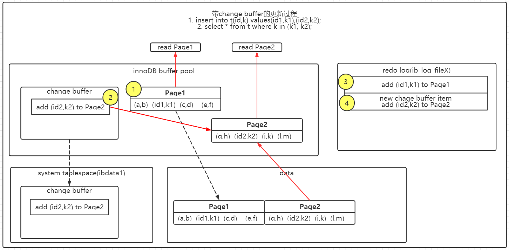
分析一下插入语句的执行流程：insert into t(id,k) values(id1,k1),(id2,k2);
假设当前k索引树的状态，查找到位置后，k1所在的数据页在内存(InnoDB buffer pool)中，k2所在的数据页不在内存中。

```text
这条插入语句做了如下的操作
1. Page 1在内存中，直接更新内存
2. Page 2没有在内存中，就在内存的change buffer区域，记录下“我要往Page 2插入一行”这个信息
3. 将上述两个动作记入redo log中
做完上面这些，事务就可以完成了。所以执行这条更新语句的成本很低，就是写了两处内存，然后写了一处磁盘（两次操作合在一起写了一次磁盘），而且还是顺序写的。同时，图中的两个虚线箭头，是后台操作，不影响更新的响应时间。

接着执行 select * from t where k in (k1, k2);
读语句发生在更新语句后不久，内存中的数据都还在，那么此时的这两个读操作就与系统表空间（ibdata1）和 redo log（ib_log_fileX）无关了
1. 读Page 1的时候，直接从内存返回。
2. 要读Page 2的时候，需要把Page 2从磁盘读入内存中，然后应用change buffer里面的操作日志，生成一个正确的版本并返回结果。需要读Page 2的时候，这个数据页才会被读入内存。

简单地对比这两个机制在提升更新性能上的收益的话，redo log 主要节省的是随机写磁盘的IO消耗（转成顺序写），而change buffer主要节省的则是随机读磁盘的IO消耗
```


**优化器对索引的选择**

优化器的逻辑

```text
优化器选择索引的目的是找到一个最优的执行方案，并用最小的代价去执行语句。在数据库里面，扫描行数是影响执行代价的因素之一。扫描的行数越少，意味着访问磁盘数据的次数越少，消耗的CPU资源越少。当然，扫描行数并不是唯一的判断标准，优化器还会结合是否使用临时表、是否排序等因素进行综合判断。
```

扫描行数的判断
```text
MySQL在真正开始执行语句之前，并不能精确地知道满足这个条件的记录有多少条，而只能根据统计信息来估算记录数。
这个统计信息就是索引的“区分度”。一个索引上不同的值越多，这个索引的区分度就越好。而一个索引上不同的值的个数，我们称之为“基数”（cardinality）。也就是说，这个基数越大，索引的区分度越好。
show index from t; //显示表t中的索引信息
```

MySQL 索引的基数
```text
MySQL采样统计的方法得到基数，因为把整张表取出来一行行统计，虽然可以得到精确的结果，但是代价太高了，所以只能选择“采样统计”。
采样统计的时候，InnoDB默认会选择N个数据页，统计这些页面上的不同值，得到一个平均值，然后乘以这个索引的页面数，就得到了这个索引的基数。而数据表是会持续更新的，索引统计信息也不会固定不变。所以，当变更的数据行数超过1/M的时候，会自动触发重新做一次索引统计。

在MySQL中，有两种存储索引统计的方式，可以通过设置参数innodb_stats_persistent的值来选择：
1. 设置为on的时候，表示统计信息会持久化存储。这时，默认的N是20，M是10。
2. 设置为off的时候，表示统计信息只存储在内存中。这时，默认的N是8，M是16。

由于是采样统计，这个基数都是很容易不准的。
```

优化器预估扫描行
```text
EXPLAIN关键字可以模拟优化器执行SQL查询语句，从而知道MySQL是如何处理你的SQL语句的。分析你的查询语句或是表结构的性能瓶颈。

在有些查询中，由于普通索引每次都需要拿着主键值然后回表去查询整行数据，这也是优化器的考虑情况之一，难免优化器会不走索引，直接主键全表扫描。由于优化器没能准确的判断扫描行数，可能会MySQL选错索引。

既然是统计信息不对，那就修正。analyze table t 命令，可以用来重新统计索引信息。如果发现explain的结果预估的rows值跟实际情况差距比较大，可以采用这个方法来处理。如果只是索引统计不准确，通过analyze命令可以解决很多问题。
注意：优化器判断因素不止扫描行数，还有其他因素。
```

索引选择异常和处理
```text
大多数时候优化器都能找到正确的索引，但偶尔会出现索引选错导致SQL没有达到预期的执行效果
1. 采用force index强行选择一个索引。MySQL会根据词法解析的结果分析出可能可以使用的索引作为候选项，然后在候选列表中依次判断每个索引需要扫描多少行。如果force index指定的索引在候选索引列表中，就直接选择这个索引，不再评估其他索引的执行代价。
2. 可以考虑修改语句，引导MySQL使用我们期望的索引。
    select * from t where (a between 1 and 1000) and (b between 50000 and 100000) order by b limit 1;
    会采用索引b，因为只需要找出b最小的一行，因为优化器认为使用索引b可以避免排序（b本身是索引，已经是有序的了，如果选择索引b的话，不需要再做排序，只需要遍历），所以即使扫描行数多，也判定为代价更小。
    select * from t where (a between 1 and 1000) and (b between 50000 and 100000) order by b,a limit 1;
    通过将order by b 改为order by b,a，要求按照b,a排序，就意味着使用这两个索引都需要排序。因此，扫描行数成了影响决策的主要条件，于是此时优化器选了只需要扫描行数少的索引a。
    select * from  (select * from t where (a between 1 and 1000)  and (b between 50000 and 100000) order by b limit 100)alias limit 1;
    也可以用limit 100让优化器意识到，使用b索引代价是很高的。其实是根据数据特征诱导了一下优化器，也不具备通用性。
3. 在有些场景下，我们可以新建一个更合适的索引，来提供给优化器做选择，或删掉误用的索引。
    发现这个优化器错误选择的索引其实根本没有必要存在，于是就删掉了这个索引，优化器也就重新选择到了正确的索引。
```

MySQL慢查询日志
```text
找到mysql的安装目录，找到my.ini文件夹在[mysqld]处加入以下代码开启慢查询，永久有效。
#开启慢查询
slow_query_log = ON
#log-slow-queries:代表MYSQL慢查询的日志存储目录,此目录文件一定要有写权限；
log-slow-queries="D://MySQL//log//mysql-slow.log"
#最长执行时间 (查询的最长时间，超过了这个时间则记录到日志中).
long_query_time = 0
#没有使用到索引的查询也将被记录在日志中
log-queries-not-using-indexes = ON

最后查log文件即可有详细的SQL执行信息
```

**前缀索引**
优势；占用的空间会更小
使用前缀索引后，可能会导致查询语句读数据的次数变多。
使用前缀索引，定义好长度，就可以做到既节省空间，又不用额外增加太多的查询成本。

确定字符串索引前缀
```text
在建立索引时关注的是区分度，区分度越高越好。因为区分度越高，意味着重复的键值越少。因此，我们可以通过统计索引上有多少个不同的值来判断要使用多长的前缀。
可以使用下面这个语句，算出这个列上有多少个不同的值：依次选取不同长度的前缀来看这个值
select count(distinct xxx) as L from T;
使用前缀索引很可能会损失区分度，所以需要预先设定一个可以接受的损失比例，比如5%。然后，在返回的中，找出不小于 L * 95%的值。
```

前缀索引对覆盖索引的影响
```text
使用前缀索引可能会增加扫描行数，这会影响到性能。使用前缀索引就用不上覆盖索引对查询性能的优化了，在选择是否使用前缀索引时需要考虑的一个因素。

例如：
alter table T add index index1(c);
alter table T add index index2(c(2));

select a,c from T where c='xx';
select a,b,c from T where c='xx';
如果使用index1（即c整个字符串的索引结构）的话，可以利用覆盖索引，从index1查到结果后直接就返回了，不需要回到ID索引再去查一次。而如果使用index2（即c(2)索引结构）的话，就不得不回到ID索引再去判断c字段的值。
即使你将index2的定义修改为c(20)的前缀索引，这时候虽然index2已经包含了所有的信息，但InnoDB还是要回到id索引再查一下，因为系统并不确定前缀索引的定义是否截断了完整信息。
```

**倒序存储和使用hash字段**
索引选取的越长，占用的磁盘空间就越大，相同的数据页能放下的索引值就越少，搜索的效率也就会越低。

- 倒序存储。
- hash字段。可以在表上再创建一个整数字段，来保存某字段的校验码，同时在这个整数hash字段上创建索引。

它们的区别，主要体现在以下三个方面：
```text
1. 从占用的额外空间来看，倒序存储方式在主键索引上，不会消耗额外的存储空间，而hash字段方法需要增加一个字段。当然，倒序存储方式使用4个字节的前缀长度应该是不够的，如果再长一点，这个消耗跟额外这个hash字段也差不多抵消了。
2. 在CPU消耗方面，倒序方式每次写和读的时候，都需要额外调用一次reverse函数，而hash字段的方式需要额外调用一次crc32()函数。如果只从这两个函数的计算复杂度来看的话，reverse函数额外消耗的CPU资源会更小些。
3. 从查询效率上看，使用hash字段方式的查询性能相对更稳定一些。因为crc32算出来的值虽然有冲突的概率，但是概率非常小，可以认为每次查询的平均扫描行数接近1。而倒序存储方式毕竟还是用的前缀索引的方式，也就是说还是会增加扫描行数。
```

**一条SQL语句，正常执行的时候特别快，但是偶尔变得特别慢**
脏页：当内存数据页跟磁盘数据页内容不一致的时候，我们称这个内存页为“脏页”。
干净页：内存和磁盘上的数据页的内容就一致，称为“干净页”。

InnoDB用缓冲池（buffer pool）管理内存，缓冲池中的内存页有三种状态：
```text
1. 还没有使用的。
2. 使用了并且是干净页。
3. 使用了并且是脏页。
InnoDB的策略是尽量使用内存，因此对于一个长时间运行的库来说，未被使用的页面很少。
```

情况
1. 刷脏页(flush)
    a. InnoDB的redo log写满了。这时候系统会停止所有更新操作，把checkpoint往前推进，redo log留出空间可以继续写。这种情况是InnoDB要尽量避免的。因为出现这种情况的时候，整个系统就不能再接受更新了，所有的更新都必须堵住。
    b. 系统内存不足。当需要新的内存页，而内存不够用的时候，就要淘汰一些数据页，空出内存给别的数据页使用。如果淘汰的是“脏页”，就要先将脏页写到磁盘。
    c. MySQL认为系统“空闲”的时候。只要有机会就刷一点“脏页”。
    d. MySQL正常关闭的情况。MySQL会把内存的脏页都flush到磁盘上，下次MySQL启动的时候，就可以直接从磁盘上读数据，启动速度会很快。

    ```text
    以下这两种情况，明显会影响性能：
    1. 一个查询要淘汰的脏页个数太多，会导致查询的响应时间明显变长；
    2. 日志写满，更新全部堵住，写性能跌为0，这种情况对敏感业务来说，是不能接受的。
    所以，InnoDB需要有控制脏页比例的机制，来尽量避免上面的这两种情况。

    刷脏页的刷盘速度影响因素：脏页比例、redo log写盘速度
    
    InnoDB刷脏页的控制策略
    innodb_io_capacity参数：它会告诉InnoDB你的磁盘能力。这个值建议设置成磁盘的IOPS。磁盘的IOPS可以通过fio这个工具来测试，测试磁盘随机读写的命令：fio -filename=$filename -direct=1 -iodepth 1 -thread -rw=randrw -ioengine=psync -bs=16k -size=500M -numjobs=10 -runtime=10 -group_reporting -name=mytest
    innodb_max_dirty_pages_pct参数：脏页比例上限，默认值是75%。InnoDB会根据当前的脏页比例（假设为M），算出一个范围在0到100之间的数字。伪代码如下：
    F1(M)
    {
    if M>=innodb_max_dirty_pages_pct then
        return 100;
    return 100*M/innodb_max_dirty_pages_pct;
    }
    InnoDB每次写入的日志都有一个序号，当前写入的序号跟checkpoint对应的序号之间的差值，假设为N。InnoDB会根据这个N算出一个范围在0到100之间的数字，这个计算公式可以记为F2(N)。F2(N)算法比较复杂，你只要知道N越大，算出来的值越大就好了。
    最后根据上述算得的F1(M)和F2(N)两个值，取其中较大的值记为R，之后引擎就可以按照innodb_io_capacity定义的能力乘以R%来控制刷脏页的速度
    要合理地设置innodb_io_capacity的值，并多关注脏页比例，不要让它经常接近75%。
    脏页比例是通过Innodb_buffer_pool_pages_dirty/Innodb_buffer_pool_pages_total得到的。

    连坐机制
    在准备刷一个脏页的时候，如果这个数据页旁边的数据页刚好是脏页，就会把这个“邻居”也带着一起刷掉；而且这个把“邻居”拖下水的逻辑还可以继续蔓延，也就是对于每个邻居数据页，如果跟它相邻的数据页也还是脏页的话，也会被放到一起刷。在InnoDB中，innodb_flush_neighbors 参数就是用来控制这个行为的，值为1的时候会有上述的“连坐”机制，值为0时表示不找邻居，自己刷自己的。在MySQL 8.0中，innodb_flush_neighbors参数的默认值已经是0了。
    ```

在MySQL 8.0版本以前，表结构是存在以.frm为后缀的文件里。而MySQL 8.0版本，则已经允许把表结构定义放在系统数据表中了。

**参数innodb_file_per_table**
表数据既可以存在共享表空间里，也可以是单独的文件。这个行为是由参数innodb_file_per_table控制的：
- 这个参数设置为OFF表示的是，表的数据放在系统共享表空间，也就是跟数据字典放在一起。
- 这个参数设置为ON表示的是，每个InnoDB表数据存储在一个以 .ibd为后缀的文件中。
```text
从MySQL 5.6.6版本开始，它的默认值就是ON了。
建议这个值设置为ON。因为一个表单独存储为一个文件更容易管理，而且在不需要这个表的时候，通过drop table命令，系统就会直接删除这个文件。而如果是放在共享表空间中，即使表删掉了，空间也是不会回收的。
```

数据的删除过程
如果删除一条记录，innoDB则会把这条记录标记为删除，而不会真正意义上的删除，在之后有记录插入的时候且满足该位置的条件时，则会复用这个位置。即磁盘文件大小不会缩小。
由于innoDB是按照页存储的，所以在删除某页上的所有数据时，则整个页都会被无条件复用。和删除一条记录有稍许不同。
delete命令就是以上两种情况的删除过程，他不会因为删除数据而导致空间缩小，实际上磁盘文件不会因为delete删除数据了而缩小。
不仅是删除数据会造成空间浪费即"空洞"，插入数据和更新数据都有可能会造成"空洞"，例如插入数据，由于是B+树的存储结构，会导致页分裂，就会导致页的利用率降低，进而有了空洞。而更新数据可以看做删除后插入。

去除"空洞"

1. 重建表
   在重建表的时候，InnoDB不会把整张表占满，每个页留了1/16给后续的更新用。也就是说，其实重建表之后不是“最”紧凑的。
   使用 alter table A engine=InnoDB 命令来重建表，在MySQL5.5以前这个命令就是新建一张表，然后将数据挪过去，最后改名替换原来的表。但是在挪数据的过程中插入数据是比较慢的，所以如果在原表上进行了数据的插入更新，就会导致数据丢失。而在MySQL 5.6版本开始引入的Online DDL，对这个操作流程做了优化。
   引入了Online DDL之后，重建表的流程：
    ```text
    1. 建立一个临时文件，扫描表A主键的所有数据页
    2. 用数据页中表A的记录生成B+树，存储到临时文件中
    3. 生成临时文件的过程中，将所有对A的操作记录在一个日志文件（row log）中。
    4. 临时文件生成后，将日志文件中的操作应用到临时文件，得到一个逻辑数据上与表A相同的数据文件
    5. 用临时文件替换表A的数据文件
    ```
    在这里，alter语句在启动的时候需要获取MDL写锁，但是这个写锁在真正拷贝数据之前就退化成读锁了。为了实现Online，MDL读锁不会阻塞增删改操作。不直接解锁的原因是为了保护自己，禁止其他线程对这个表同时做DDL。

Online 和 inplace
根据一张表重建出来的数据是放在“tmp_file”里的，这个临时文件是InnoDB在内部创建出来的。整个DDL过程都在InnoDB内部完成。对于server层来说，没有把数据挪动到临时表，是一个“原地”操作，这就是“inplace”名称的来源。

两种重建表方式
```text
alter table t engine=innodb,ALGORITHM=inplace; == alter table t engine=InnoDB;
alter table t engine=innodb,ALGORITHM=copy; // 表示的是强制拷贝表
```

online 和 inplace 两个逻辑之间的关系可以概括为：
1. DDL过程如果是Online的，就一定是inplace的；
2. inplace的DDL，有可能不是Online的。截止到MySQL 8.0，添加全文索引（FULLTEXT index）和空间索引(SPATIAL index)就属于这种情况。

optimize table、analyze table和alter table这三种方式重建表的区别:
```text
从MySQL 5.6版本开始，alter table t engine = InnoDB（也就是recreate）默认的就是上面图4的流程了；
analyze table t 其实不是重建表，只是对表的索引信息做重新统计，没有修改数据，这个过程中加了MDL读锁；
optimize table t 等于recreate+analyze。
```

**没有过滤条件count(*)的实现方式**
在不同的MySQL引擎中，count(*)有不同的实现方式
- MyISAM引擎把一个表的总行数存在了磁盘上，因此执行count(*)的时候会直接返回这个数，效率很高；
- 而InnoDB引擎就麻烦了，它执行count(*)的时候，需要把数据一行一行地从引擎里面读出来，然后累积计数。

innoDB不是将总行保存在磁盘上是因为即使是在同一个时刻的多个查询，由于多版本并发控制（MVCC）的原因，InnoDB表“应该返回多少行”也是不确定的。

InnoDB是索引组织表，主键索引树的叶子节点是数据，而普通索引树的叶子节点是主键值。所以，普通索引树比主键索引树小很多。对于count(*)这样的操作，遍历哪个索引树得到的结果逻辑上都是一样的。因此，MySQL优化器会找到最小的那棵树来遍历。**在保证逻辑正确的前提下，尽量减少扫描的数据量，是数据库系统设计的通用法则之一。**

show table status 命令输出结果里面也有一个TABLE_ROWS用于显示这个表当前有多少行，虽然这个命令执行挺快，但是索引统计的值是通过采样来估算的，而TABLE_ROWS就是从这个采样估算得来的，因此它也很不准。

小结：
- MyISAM表虽然count(*)很快，但是不支持事务；
- show table status命令虽然返回很快，但是不准确；
- InnoDB表直接count(*)会遍历全表，虽然结果准确，但会导致性能问题。

记录行数方法：

1. 用缓存系统保存计数
可以用一个Redis服务来保存这个表的总行数。这个表每被插入一行Redis计数就加1，每被删除一行Redis计数就减1。
这样会存在问题：缓存系统可能会丢失更新

2. 在数据库保存计数
可以解决一致性视图的问题

基于InnoDB引擎不同的count用法
按照效率排序的话，count(字段)<count(主键id)<count(1)≈count(*)，所以我建议你，尽量使用count(*)。

分析性能差别的时候，有这么几个原则：
- server层要什么就给什么。
- InnoDB只给必要的值。
- 现在的优化器只优化了count(*)的语义为“取行数”，其他“显而易见”的优化并没有做。

```text
对于count(主键id)来说：InnoDB引擎会遍历整张表，把每一行的id值都取出来，返回给server层。server层拿到id后，判断是不可能为空的，就按行累加。

对于count(1)来说：InnoDB引擎遍历整张表，但不取值。server层对于返回的每一行，放一个数字“1”进去，判断是不可能为空的，按行累加。count(1)执行得要比count(主键id)快。因为从引擎返回id会涉及到解析数据行，以及拷贝字段值的操作

对于count(字段)来说：
如果这个“字段”是定义为not null的话，一行行地从记录里面读出这个字段，判断不能为null，按行累加；
如果这个“字段”定义允许为null，那么执行的时候，判断到有可能是null，还要把值取出来再判断一下，不是null才累加。

count(*)是例外，并不会把全部字段取出来，而是专门做了优化，不取值。count(*)肯定不是null，按行累加。
```

**order by 工作原理**

假设定义如下表：
```text
CREATE TABLE `t` (
  `id` int(11) NOT NULL,
  `city` varchar(16) NOT NULL,
  `name` varchar(16) NOT NULL,
  `age` int(11) NOT NULL,
  `addr` varchar(128) DEFAULT NULL,
  PRIMARY KEY (`id`),
  KEY `city` (`city`)
) ENGINE=InnoDB;

查询语句：select city,name,age from t where city='杭州' order by name limit 1000;
```
全字段排序：通常情况下，这个语句执行流程为
1. 初始化sort_buffer，确定放入name、city、age这三个字段；
2. 从索引city找到第一个满足city='杭州’条件的主键id；
3. 到主键id索引取出整行，取name、city、age三个字段的值，存入sort_buffer中；
4. 从索引city取下一个记录的主键id；
5. 重复步骤3、4直到city的值不满足查询条件为止；
6. 对sort_buffer中的数据按照字段name做快速排序；
7. 按照排序结果取前1000行返回给客户端。

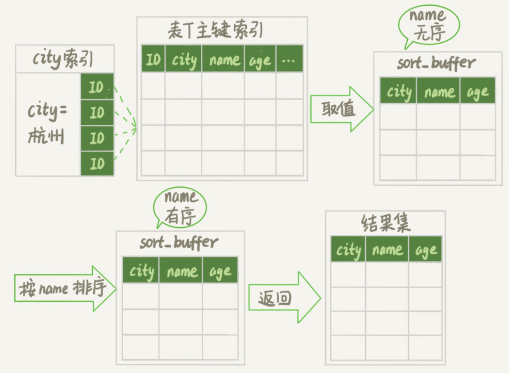

“按name排序”可能在内存中完成，也可能需要使用外部排序，这取决于排序所需的内存和参数sort_buffer_size。
```text
sort_buffer_size：就是MySQL为排序开辟的内存（sort_buffer）的大小。如果要排序的数据量小于sort_buffer_size，排序就在内存中完成。但如果排序数据量太大，内存放不下，则不得不利用磁盘临时文件辅助排序。
```

确定一个排序语句是否使用了临时文件方法
```sql
/* 打开optimizer_trace，只对本线程有效 */
SET optimizer_trace='enabled=on'; 
/* @a保存Innodb_rows_read的初始值 */
select VARIABLE_VALUE into @a from  performance_schema.session_status where variable_name = 'Innodb_rows_read';
/* 执行语句 */
select city, name,age from t where city='杭州' order by name limit 1000; 
/* 查看 OPTIMIZER_TRACE 输出 */
SELECT * FROM `information_schema`.`OPTIMIZER_TRACE`\G
/* @b保存Innodb_rows_read的当前值 */
select VARIABLE_VALUE into @b from performance_schema.session_status where variable_name = 'Innodb_rows_read';
/* 计算Innodb_rows_read差值 */
select @b-@a;
```


```text
number_of_tmp_files：排序过程中使用的临时文件数。内存放不下时，就需要使用外部排序，外部排序一般使用归并排序算法。也就是说MySQL将需要排序的数据分成12份，每一份单独排序后存在这些临时文件中。然后把这12个有序文件再合并成一个有序的大文件。

如果sort_buffer_size超过了需要排序的数据量的大小，number_of_tmp_files就是0，表示排序可以直接在内存中完成。否则就需要放在临时文件中排序。sort_buffer_size越小，需要分成的份数越多，number_of_tmp_files的值就越大。

sort_mode里面的packed_additional_fields的意思是排序过程对字符串做了“紧凑”处理。即使name字段的定义是varchar(16)，在排序过程中还是要按照实际长度来分配空间的。
```

**rowid排序**
在上面这个算法过程里面，只对原表的数据读了一遍，剩下的操作都是在sort_buffer和临时文件中执行的。但如果查询要返回的字段很多的话，那么sort_buffer里面要放的字段数太多，这样内存里能够同时放下的行数很少，要分成很多个临时文件，排序的性能会很差。

max_length_for_sort_data：是MySQL中专门控制用于排序的行数据的长度的一个参数。即如果单行的长度超过这个值，MySQL就认为单行太大，要换一个算法。
```text
SET max_length_for_sort_data = 16;
```
city、name、age 这三个字段的定义总长度是36，把max_length_for_sort_data设置为16，就会更换算法，整个执行流程就变为：
1. 初始化sort_buffer，确定放入两个字段，即name和id；
2. 从索引city找到第一个满足city='杭州’条件的主键id，也就是图中的ID_X；
3. 到主键id索引取出整行，取name、id这两个字段，存入sort_buffer中；
4. 从索引city取下一个记录的主键id；
5. 重复步骤3、4直到不满足city='杭州’条件为止，也就是图中的ID_Y；
6. 对sort_buffer中的数据按照字段name进行排序；
7. 遍历排序结果，取前1000行，并按照id的值回到原表中取出city、name和age三个字段返回给客户端。
这个执行流程的示意图如下，称为rowid排序。

需要说明的是，最后的“结果集”是一个逻辑概念，实际上MySQL服务端从排序后的sort_buffer中依次取出id，然后到原表查到city、name和age这三个字段的结果，不需要在服务端再耗费内存存储结果，是直接返回给客户端的。


从OPTIMIZER_TRACE的结果中，看到另外两个信息也变了。
- 图中的examined_rows的值还是4000，表示用于排序的数据是4000行。但是select @b-@a这个语句的值变成5000了。因为这时候除了排序过程外，在排序完成后，还要根据id去原表取值。由于语句是limit 1000，因此会多读1000行。
- sort_mode变成了<sort_key, rowid>，表示参与排序的只有name和id这两个字段。
- number_of_tmp_files变成10了，是因为这时候参与排序的行数虽然仍然是4000行，但是每一行都变小了，因此需要排序的总数据量就变小了，需要的临时文件也相应地变少了。

全字段排序 VS rowid排序
- 如果MySQL实在是担心排序内存太小，会影响排序效率，才会采用rowid排序算法，这样排序过程中一次可以排序更多行，但是需要再回到原表去取数据。
- 如果MySQL认为内存足够大，会优先选择全字段排序，把需要的字段都放到sort_buffer中，这样排序后就会直接从内存里面返回查询结果了，不用再回到原表去取数据。
- 这也就体现了MySQL的一个设计思想：如果内存够，就要多利用内存，尽量减少磁盘访问。
- 并不是所有的order by语句，都需要排序操作的。从上面分析的执行过程，MySQL之所以需要生成临时表，并且在临时表上做排序操作，其原因是原来的数据都是无序的。

```text
alter table t add index city_user(city, name);
```
在这个索引里面，我们依然可以用树搜索的方式定位到第一个满足city='杭州’的记录，并且额外确保了，接下来按顺序取“下一条记录”的遍历过程中，只要city的值是杭州，name的值就一定是有序的。
这样整个查询过程的流程就变成了：
1. 从索引(city,name)找到第一个满足city='杭州’条件的主键id；
2. 到主键id索引取出整行，取name、city、age三个字段的值，作为结果集的一部分直接返回；
3. 从索引(city,name)取下一个记录主键id；
4. 重复步骤2、3，直到查到第1000条记录，或者是不满足city='杭州’条件时循环结束；

覆盖索引
```text
alter table t add index city_user_age(city, name, age);
```
对于city字段的值相同的行来说，还是按照name字段的值递增排序的，此时的查询语句也就不再需要排序了。整个查询语句的执行流程就变成了：
1. 从索引(city,name,age)找到第一个满足city='杭州’条件的记录，取出其中的city、name和age这三个字段的值，作为结果集的一部分直接返回；
2. 从索引(city,name,age)取下一个记录，同样取出这三个字段的值，作为结果集的一部分直接返回；
3. 重复执行步骤2，直到查到第1000条记录，或者是不满足city='杭州’条件时循环结束。
用了覆盖索引，性能上会快很多。

并不是说要为了每个查询能用上覆盖索引，就要把语句中涉及的字段都建上联合索引，毕竟索引还是有维护代价的。这是一个需要权衡的决定。

```text
注：
    当MySQL去更新一行，但是要修改的值跟原来的值是相同的，这时候MySQL会真的去执行一次修改。
    假设：
    1. MySQL读出数据，发现值与原来相同，不更新，直接返回，执行结束。这里我们可以用一个锁实验来确认。
    两个会话，一个显示开启事务做更新，但不提交，另一个更新就会被阻塞，加锁这个动作是InnoDB才能做的，所以会有innoDB的操作。不可能是这种情况
    2. MySQL调用了InnoDB引擎提供的接口，但是引擎发现值与原来相同，不更新，直接返回。用一个可见性实验来确认。
    两个会话，一个会话开启事务后，在另一个会话中更新一个值，在回到第一个会话中更新和另一个会话一样的值，这时候查询结果就是该会话更新后的结果，如果该会话没有做更新操作，它是看不见另一个会话的更新操作的。说明MySQL做了真正的更新操作，所以这个假设不成立。
    所以最后的结论：InnoDB认真执行了更新操作哪怕是和未更新的值一样的，该加锁的加锁，该更新的更新。

其实MySQL是确认了的。只是在这个语句里面(update t set a=3 where id=1)，MySQL认为读出来的值，只有一个确定的 (id=1), 而要写的是(a=3)，只从这两个信息是看不出来“不需要修改”的。
```
如下验证：

说明MySQL查出来确定了id=1和a=3，然后更新为a=3，确定了这个是不需要修改的，所以就没做更新操作。所以说最后可重复读隔离级别下，未触发更新操作，最后前后读出来的值都是一样的。

```text
但是更新的时候既然读了数据，读取了一行的数据，那么为什么不进行判断后在做更新，相等就不需要做更新。
```

**显示随机消息**

假设表结构
```sql
CREATE TABLE `words` (
  `id` int(11) NOT NULL AUTO_INCREMENT,
  `word` varchar(64) DEFAULT NULL,
  PRIMARY KEY (`id`)
) ENGINE=InnoDB;
```

查询随机三个单词的语句：select word from words order by rand() limit 3;
explain 查询语句：
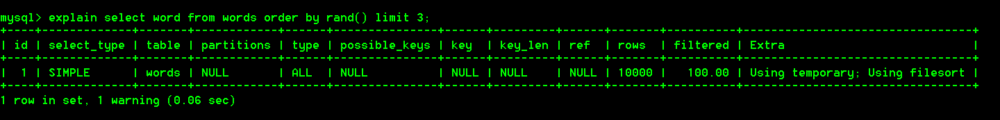
Extra字段显示Using temporary，表示的是需要使用临时表；Using filesort，表示的是需要执行排序操作。也就是说：需要临时表，并且需要在临时表上排序。

执行流程：
```text
1. 创建一个临时表。这个临时表使用的是memory引擎，表里有两个字段，第一个字段是double类型，记为字段R，第二个字段是varchar(64)类型，记为字段W。这个表没有建索引。

2. 从words表中，按主键顺序取出所有的word值。对于每一个word值，调用rand()函数生成一个大于0小于1的随机小数，并把这个随机小数和word分别存入临时表的R和W字段中，到此，扫描行数是10000。

3. 现在临时表有10000行数据了，接下来你要在这个没有索引的内存临时表上，按照字段R排序。

4. 初始化sort_buffer。sort_buffer中有两个字段，一个是double类型，另一个是整型。

5. 从内存临时表中一行一行地取出R值和位置信息(rowid)，分别存入sort_buffer中的两个字段里。这个过程要对内存临时表做全表扫描，此时扫描行数增加10000，变成了20000。

6. 在sort_buffer中根据R的值进行排序。注意，这个过程没有涉及到表操作，所以不会增加扫描行数。

7. 排序完成后，取出前三个结果的位置信息(rowid)，依次到内存临时表中取出word值，返回给客户端。这个过程中，访问了表的三行数据，总扫描行数变成了20003。

order by rand()使用了内存临时表，内存临时表排序的时候使用了rowid排序方法。
```


rowid
```text
如果你创建的表没有主键，或者把一个表的主键删掉了，那么InnoDB会自己生成一个长度为6字节的rowid来作为主键。这也就是排序模式里面，rowid名字的来历。实际上它表示的是：每个引擎用来唯一标识数据行的信息。
- 对于有主键的InnoDB表来说，这个rowid就是主键ID；
- 对于没有主键的InnoDB表来说，这个rowid就是由系统生成的；
```

tmp_table_size这个配置限制了内存临时表的大小，默认值是16M。如果临时表大小超过了tmp_table_size，那么内存临时表就会转成磁盘临时表。磁盘临时表使用的引擎默认是InnoDB，是由参数internal_tmp_disk_storage_engine控制的。

优先队列排序算法
现在的SQL语句，只需要取R值最小的3个rowid。但是，如果使用归并排序算法的话，虽然最终也能得到前3个值，但是这个算法结束后，已经将10000行数据都排好序了。而优先队列算法，就可以精确地只得到三个最小值，执行流程如下：

```text
1. 对于这10000个准备排序的(R,rowid)，先取前三行，构造成一个堆。
2. 取下一个行(R’,rowid’)，跟当前堆里面最大的R比较，如果R’小于R，把这个(R,rowid)从堆中去掉，换成(R’,rowid’)
3. 重复第2步，直到第10000个(R’,rowid’)完成比较。
```

**函数不合理使用对性能影响**

1. 条件字段函数操作

```sql
select count(*) from tradelog where month(t_modified)=7;
# 由于加了month()函数操作，MySQL无法再使用索引快速定位功能，而只能使用全索引扫描。
```

如上查询语句存在的性能问题：如果对字段做了函数计算，就用不上索引了，这是MySQL的规定。对索引字段做函数操作，可能会破坏索引值的有序性，因此优化器就决定放弃走树搜索功能。需要注意的是，优化器并不是要放弃使用这个索引。

```text
即使是对于不改变有序性的函数，也不会考虑使用索引。
比如，对于select *fromtradelog where id + 1 = 10000这个SQL语句，这个加1操作并不会改变有序性，但是MySQL优化器还是不能用id索引快速定位到9999这一行。所以，需要你在写SQL语句的时候，手动改写成 where id = 10000-1才可以。
```

2. 隐式类型转换

```sql
select * from T where id=100;
# id这个字段上有索引，但是这条语句需要走全表扫描。id的字段类型是varchar(32)，而输入的参数却是整型，所以需要做类型转换。
```

有数据类型转换，就需要走全索引扫描

```text
其实对于上面的语句：select * from T where id=100;
在优化器的层面来说：select * from T where CAST(id AS signed int) = 110717;
也就是说，这条语句触发了对索引字段做函数操作，优化器会放弃走树搜索功能。
```

3. 隐式字符编码转换

```sql
select b.* from A a, B b where a.name=b.name and a.id=1;
// 1. 根据id在A表中找到id=1的行
// 2. 从找出来的行取出name的值
// 3. 根据name的值在B表中找到匹配的行，然后返回结果集。

假设A表的字符集为utf8mb4，B表的字符集为utf8
当这两个类型的字符串在做比较的时候，MySQL内部的操作是，先把utf8字符串转成utf8mb4字符集，再做比较。
第三步优化器处理为：select * from B where CONVERT(name USING utf8mb4)=A表中取出来的name
也就是说：如果这两个表的字符集不同，表连接查询的时候用不上关联字段的索引
```

优化方案：

```text
1. 比较常见的优化方法是，把两种表上的关联字段的字符集也改成一致，这样就没有字符集转换的问题了。
2. 我主动把A表的关联字段转换成utf8就避免了被驱动表上的字符编码转换
	例如：select b.* from A a, B b where b.name=CONVERT(a.name USING utf8) and a.id=1;
```

小结：

​	对索引字段做函数操作，可能会破坏索引值的有序性，因此优化器就决定放弃走树搜索功能。

**查一行慢的原因**

一、查询长时间不返回结果

1. 等MDL锁
   查询需要获得MDL锁，若被锁住需要长时间等待获得锁后进行查询操作
2. 等flush
   flush table：关闭指定或者打开的表，同时该操作将会清空查询缓存中的内容FLUSH TABLES WITH READ LOCK   关闭所有打开的表，同时对于表会加一个读锁，直到显示地执行unlock tables，该操作常常用于数据备份的时候
3. 等行锁
   由于访问某个记录时要加读锁，如果已经有一个事务在这个记录上持有一个写锁，select语句就会被堵住。

二、查询慢

1. 在RR事务级别中，事务中的回滚日志过多，需要长时间回滚得到对应的值


**幻读**

 幻读指的是一个事务在前后两次查询同一个范围的时候，后一次查询看到了前一次查询没有看到的行。 在可重复读隔离级别下，普通的查询是快照读，是不会看到别的事务插入的数据的。因此，幻读在“当前读”下才会出现。 幻读仅专指“新插入的行”。

比如把满足c=5的记录加锁，而在之后新插入进来满足c=5的记录是未加锁的。所以可能会导致数据不一致问题，也就是说即使把所有的记录都加上锁后，还是阻止不了新插入的记录。因此，为了解决幻读问题，InnoDB只好引入新的锁，也就是间隙锁(Gap Lock)。

**间隙锁**
在一行行扫描的过程中，不仅将给行加上了行锁，还给行两边的空隙，也加上了间隙锁。间隙锁之间都不存在冲突关系（同一个间隙可以被多次加锁）。

间隙锁可能会造成死锁，间隙锁被多次加锁的情况一旦有并发，就会碰到死锁。
例：sessionA 加锁后插入一条数据，sessionB加锁后也插入一条数据，两者如果冲突的话就会造成两边相互等待对方的间隙锁。

如果把隔离级别设置为读提交的话，就没有间隙锁了，但同时要解决可能出现的数据和日志不一致问题，需要把binlog格式设置为row。这也是现在不少公司使用的配置组合。

间隙锁和行锁合称next-key lock，每个next-key lock是前开后闭区间。也就是说，我们的表t初始化以后，如果用select * from t for update要把整个表所有记录锁起来，就形成了7个next-key lock，分别是 (-∞,0]、(0,5]、(5,10]、(10,15]、(15,20]、(20, 25]、(25, +supremum]。


**加锁规则**

前提：
1. 可重复读隔离级别
2. 测试版本为，即5.x系列<=5.7.24，8.0系列 <=8.0.13，其余的版本可能有所改变加锁策略

```text
两个“原则”、两个“优化”和一个“bug”。
原则1：加锁的基本单位是next-key lock。next-key lock是前开后闭区间。
原则2：查找过程中访问到的对象才会加锁。
优化1：索引上的等值查询，给唯一索引加锁的时候，next-key lock退化为行锁。
优化2：索引上的等值查询，向右遍历时且最后一个值不满足等值条件的时候，next-key lock退化为间隙锁。
一个bug：唯一索引上的范围查询会访问到不满足条件的第一个值为止。
```


准备：
```sql
CREATE TABLE `t` (
  `id` int(11) NOT NULL,
  `c` int(11) DEFAULT NULL,
  `d` int(11) DEFAULT NULL,
  PRIMARY KEY (`id`),
  KEY `c` (`c`)
) ENGINE=InnoDB;

insert into t values(0,0,0),(5,5,5),
(10,10,10),(15,15,15),(20,20,20),(25,25,25);
```


案例一：等值查询间隙锁
SessionA
begin;
update t set d = d+1 where id = 7;
                                    SessionB
                            insert  into t values(8,8,8);
                                    (blocked)
                                                                SessionC
                                                         update t set d=d+1 where id = 10;
                                                                (Query OK)
```text
根据原则1，加锁单位是next-key lock，session A加锁范围就是(5,10]；
同时根据优化2，这是一个等值查询(id=7)，而id=10不满足查询条件，next-key lock退化成间隙锁，因此最终加锁的范围是(5,10)。
所以，session B要往这个间隙里面插入id=8的记录会被锁住，但是session C修改id=10这行是可以的。
```

案例二：非唯一索引等值锁
SessionA
begin;
select  id from t where c = 5 lock in share mode;
                                    SessionB
                            update t set d=d+1 where id = 5;
                                    (blocked)
                                                                SessionC
                                                        insert into t values(7,7,7);
                                                                (Query OK)

```text
这里session A要给索引c上c=5的这一行加上读锁。
1. 根据原则1，加锁单位是next-key lock，因此会给(0,5]加上next-key lock。
2. 要注意c是普通索引，因此仅访问c=5这一条记录是不能马上停下来的，需要向右遍历，查到c=10才放弃。根据原则2，访问到的都要加锁，因此要给(5,10]加next-key lock。
3. 但是同时这个符合优化2：等值判断，向右遍历，最后一个值不满足c=5这个等值条件，因此退化成间隙锁(5,10)。
4. 根据原则2 ，只有访问到的对象才会加锁，这个查询使用覆盖索引，并不需要访问主键索引，所以主键索引上没有加任何锁，这就是为什么session B的update语句可以执行完成。
5. 但session C要插入一个(7,7,7)的记录，就会被session A的间隙锁(5,10)锁住。

需要注意，在这个例子中，lock in share mode只锁覆盖索引，但是如果是for update就不一样了。 执行 for update时，系统会认为你接下来要更新数据，因此会顺便给主键索引上满足条件的行加上行锁。

这个例子说明，锁是加在索引上的；同时，它给我们的指导是，如果你要用lock in share mode来给行加读锁避免数据被更新的话，就必须得绕过覆盖索引的优化，在查询字段中加入索引中不存在的字段。比如，将session A的查询语句改成select d from t where c=5 lock in share mode。可以验证一下效果。(达到预期)
```

案例三：主键索引范围锁
SessionA
begin;
select * from t where id>=10 and id<11 for update;
                                    SessionB
                            insert into t values(6,6,6);
                                    (Query OK)
                            insert into t values(13,13,13);
                                    (blocked)
                                                                SessionC
                                                        update t set d=d+1 where id = 15;
                                                                (blocked)
```text
1. 开始执行的时候，要找到第一个id=10的行，因此本该是next-key lock(5,10]。 根据优化1， 主键id上的等值条件，退化成行锁，只加了id=10这一行的行锁。
2. 范围查找就往后继续找，找到id=15这一行停下来，因此需要加next-key lock(10,15]。
3. 所以，session A这时候锁的范围就是主键索引上，行锁id=10和next-key lock(10,15]。
这里你需要注意一点，首次session A定位查找id=10的行的时候，是当做等值查询来判断的，而向右扫描到id=15的时候，用的是范围查询判断。
```

案例四：非唯一索引范围锁
SessionA
begin;
select * from t where c>=10 and c<11 for update;
                                    SessionB
                            insert into t values(6,6,6);
                                    (blocked)
                                                                SessionC
                                                        update t set d=d+1 where c = 15;
                                                                (blocked)
```text
加锁规则跟案例三唯一的不同是：
在第一次用c=10定位记录的时候，索引c上加了(5,10]这个next-key lock后，由于索引c是非唯一索引，没有优化规则，也就是说不会蜕变为行锁，因此最终sesion A加的锁是，索引c上的(5,10] 和(10,15] 这两个next-key lock。
```

案例五：唯一索引范围锁bug
SessionA
begin;
select * from t where id>10 and id<=15 for update;
                                    SessionB
                            update t set d=d+1 where id = 20;
                                    (blocked)
                                                                SessionC
                                                        insert into t values(16,16,16);
                                                                (blocked)
```text
session A是一个范围查询，按照原则1的话，应该是索引id上只加(10,15]这个next-key lock，并且因为id是唯一键，所以循环判断到id=15这一行就应该停止了。但是实现上，InnoDB会往前扫描到第一个不满足条件的行为止，也就是id=20。而且由于这是个范围扫描，因此索引id上的(15,20]这个next-key lock也会被锁上。

照理说，这里锁住id=20这一行的行为，其实是没有必要的。因为扫描到id=15，就可以确定不用往后再找了。但实现上还是这么做了，因此我认为这是个bug。
```

案例六：非唯一索引上存在"等值"的例子
前提：增加一行insert into t values(30,10,30);表示c=10有两行
delete语句加锁的逻辑，跟select ... for update是类似的

SessionA
begin;
delete from t where c=10;
                                    SessionB
                            insert into t values(12,12,12);
                                    (blocked)
                                                                SessionC
                                                        update t set d=d+1 where c=15;
                                                                (Query OK)
```text
索引c局部展示
0   5   10  10  15  20  25
0   5   10  30  15  20  25

这时，session A在遍历的时候，先访问第一个c=10的记录。同样地，根据原则1，这里加的是(c=5,id=5)到(c=10,id=10)这个next-key lock。即索引c (5,10]
然后session A向右查找，直到碰到(c=15,id=15)这一行，循环才结束。根据优化2，这是一个等值查询，向右查找到了不满足条件的行，所以会退化成(c=10,id=10) 到 (c=10,id=10)的间隙锁。即索引c (10,15)
(c=10,id=10)和(c=10,id=10)都没有加锁
```

案例七：limit 语句加锁
前提表里有(id,c,d)
SessionA
begin;
delete from t where c=10 limit 2;
                                    SessionB
                            insert into t values(12,12,12);
                                    (Query OK)
```text
索引c局部展示
0   5   10  10  15  20  25
0   5   10  30  15  20  25

session A的delete语句加了 limit 2。你知道表t里c=10的记录其实只有两条，因此加不加limit 2，删除的效果都是一样的，但是加锁的效果却不同。
这是因为，delete语句明确加了limit 2的限制，因此在遍历到(c=10, id=30)这一行之后，满足条件的语句已经有两条，循环就结束了。

套路：
在删除数据的时候尽量加limit。这样不仅可以控制删除数据的条数，让操作更安全，还可以减小加锁的范围。
```

案例八：一个死锁的例子

SessionA
begin;
select id from t where c=10 lock in share mode;
                                    SessionB
                            update t set d=d+1 where c=10;
                                    (blocked)
insert into t values(8,8,8);
                            ERROR 1213 (40001): Deadlock found when trying to get lock; try restarting transaction

```text
1. session A 启动事务后执行查询语句加lock in share mode，在索引c上加了next-key lock(5,10] 和间隙锁(10,15)；
2. session B 的update语句也要在索引c上加next-key lock(5,10] ，进入锁等待；
    session B的“加next-key lock(5,10] ”操作，实际上分成了两步，先是加(5,10)的间隙锁，加锁成功；然后加c=10的行锁，这时候才被锁住的。
3. 然后session A要再插入(8,8,8)这一行，被session B的间隙锁锁住。由于出现了死锁，InnoDB让session B回滚。

在分析加锁规则的时候可以用next-key lock来分析。具体执行的时候，是要分成间隙锁和行锁两段来执行的。
```

小结：
```text
在读提交隔离级别下还有一个优化，即：语句执行过程中加上的行锁，在语句执行完成后，就要把“不满足条件的行”上的行锁直接释放了，不需要等到事务提交。也就是说，读提交隔离级别下，锁的范围更小，锁的时间更短，这也是不少业务都默认使用读提交隔离级别的原因。
在业务需要使用可重复读隔离级别的时候，能够更细致地设计操作数据库的语句，解决幻读问题的同时，最大限度地提升系统并行处理事务的能力。
```

**短连接风暴**
正常的短连接模式就是连接到数据库后，执行很少的SQL语句就断开，下次需要的时候再重连。如果使用的是短连接，在业务高峰期的时候，就可能出现连接数突然暴涨的情况。

MySQL建立连接的过程，成本是很高的。除了正常的网络连接三次握手外，还需要做登录权限判断和获得这个连接的数据读写权限。

短连接模型存在一个风险，一旦数据库处理得慢一些，连接数就会暴涨。max_connections参数，用来控制一个MySQL实例同时存在的连接数的上限，超过这个值，系统就会拒绝接下来的连接请求，并报错提示“Too many connections”。对于被拒绝连接的请求来说，从业务角度看就是数据库不可用。
在机器负载比较高的时候，处理现有请求的时间变长，每个连接保持的时间也更长。这时，再有新建连接的话，就可能会超过max_connections的限制。

如果过度调高max_connections的值。这样做是有风险的。因为设计max_connections这个参数的目的是想保护MySQL，如果我们把它改得太大，让更多的连接都可以进来，那么系统的负载可能会进一步加大，大量的资源耗费在权限验证等逻辑上，结果可能是适得其反，已经连接的线程拿不到CPU资源去执行业务的SQL请求。

解决参考方案：

1. 处理掉那些占着连接但是不工作的线程。
```text
对于那些不需要保持的连接，我们可以通过kill connection主动踢掉。
如果是连接数过多，你可以优先断开事务外空闲太久的连接；如果这样还不够，再考虑断开事务内空闲太久的连接。

从服务端断开连接使用的是kill connection + id的命令， 一个客户端处于sleep状态时，它的连接被服务端主动断开后，这个客户端并不会马上知道。直到客户端在发起下一个请求的时候，才会收到这样的报错“ERROR 2013 (HY000): Lost connection to MySQL server during query”。
从数据库端主动断开连接可能是有损的，尤其是有的应用端收到这个错误后，不重新连接，而是直接用这个已经不能用的句柄重试查询。这会导致从应用端看上去，“MySQL一直没恢复”。
```

2. 减少连接过程的消耗

```text
有的业务代码会在短时间内先大量申请数据库连接做备用，如果现在数据库确认是被连接行为打挂了，那么一种可能的做法，是让数据库跳过权限验证阶段。
跳过权限验证的方法是：重启数据库，并使用–skip-grant-tables参数启动。这样，整个MySQL会跳过所有的权限验证阶段，包括连接过程和语句执行过程在内。这种方法特别符合我们标题里说的“饮鸩止渴”，风险极高，是我特别不建议使用的方案。尤其你的库外网可访问的话，就更不能这么做了。

在MySQL 8.0版本里，如果你启用–skip-grant-tables参数，MySQL会默认把 --skip-networking参数打开，表示这时候数据库只能被本地的客户端连接。
```

**慢查询性能问题**

大致分为以下三种情况

1. 索引没有设计好

```text
这种场景一般就是通过紧急创建索引来解决。MySQL 5.6版本以后，创建索引都支持Online DDL了，对于那种高峰期数据库已经被这个语句打挂了的情况，最高效的做法就是直接执行alter table 语句。

假设你现在的服务是一主一备，主库A、备库B，这个方案的大致流程是这样的：
1. 在备库B上执行 set sql_log_bin=off，也就是不写binlog，然后执行alter table 语句加上索引
2. 执行主备切换
3. 此时主库是B，备库是A。在A上执行 set sql_log_bin=off，然后执行alter table 语句加上索引
这是一个“古老”的DDL方案。平时在做变更的时候，你应该考虑类似gh-ost这样的方案，更加稳妥。但是在需要紧急处理时，上面这个方案的效率是最高的。
```

2. SQL语句没写好

```text
语句没写好，导致没有使用到索引。
可以通过改写SQL语句来处理。MySQL 5.7提供了query_rewrite功能，可以把输入的一种语句改写成另外一种模式。

比如，语句被错误地写成了 select * from t where id + 1 = 10000，你可以通过下面的方式，增加一个语句改写规则。
mysql> insert into query_rewrite.rewrite_rules(pattern, replacement, pattern_database) values ("select * from t where id + 1 = ?", "select * from t where id = ? - 1", "db1");
call query_rewrite.flush_rewrite_rules();//这是存储过程，是让插入的新规则生效，也就是我们说的“查询重写”。
```

3. MySQL选错了索引

```text
应急方案就是给这个语句加上force index。强制使用某个索引来进行操作。
```

实际上出现最多的是前两种，而这两种情况，恰恰是完全可以避免的。
通过一下方法来进行避免
1. 上线前，在测试环境，把慢查询日志（slow log）打开，并且把long_query_time设置成0，确保每个语句都会被记录入慢查询日志
2. 在测试表里插入模拟线上的数据，做一遍回归测试
3. 观察慢查询日志里每类语句的输出，特别留意Rows_examined字段是否与预期一致。
可以使用工具检查所有的SQL语句的返回结果。比如，开源工具(pt-query-digest)[https://www.percona.com/doc/percona-toolkit/3.0/pt-query-digest.html]


**QPS突增问题**
有时候由于业务突然出现高峰，或者应用程序bug，导致某个语句的QPS突然暴涨，也可能导致MySQL压力过大，影响服务。

有以下解决方案：
1. 一种是由全新业务的bug导致的。假设DB运维是比较规范的，也就是说白名单是一个个加的。这种情况下，如果能够确定业务方会下掉这个功能，只是时间上没那么快，那么就可以从数据库端直接把白名单去掉。
2. 如果这个新功能使用的是单独的数据库用户，可以用管理员账号把这个用户删掉，然后断开现有连接。这样，这个新功能的连接不成功，由它引发的QPS就会变成0。
3. 如果这个新增的功能跟主体功能是部署在一起的，那么我们只能通过处理语句来限制。这时，可以使用上面提到的查询重写功能，把压力最大的SQL语句直接重写成"select 1"返回。当然，这个操作的风险很高，需要你特别细致。它可能存在两个副作用：
a. 如果别的功能里面也用到了这个SQL语句模板，会有误伤；
b.很多业务并不是靠这一个语句就能完成逻辑的，所以如果单独把这一个语句以select 1的结果返回的话，可能会导致后面的业务逻辑一起失败。
所以，方案3是用于止血的，跟前面提到的去掉权限验证一样，应该是所有选项里优先级最低的一个方案。

其实方案1和2都要依赖于规范的运维体系：虚拟化、白名单机制、业务账号分离。

**binlog 的写入机制**

事务执行过程中，先把日志写到binlog cache中，事务提交的时候，再把binlog cache写到binlog文件中。一个事务的binlog是不能被拆开的，无论事务多大，都要保证一次性写入。

系统给binlog cache分配了一块内存，每个线程一个。参数binlog_cache_size用于控制单线程所占内存大小，如果超过这个参数规定的大小，就需要暂存磁盘。事务提交的时候，执行器吧binlog cache里面的完整事务写到binlog中，并清空binlog cache，最后刷新到磁盘中。每个线程有自己单独的binlog cache，但是共用同一份binlog文件。

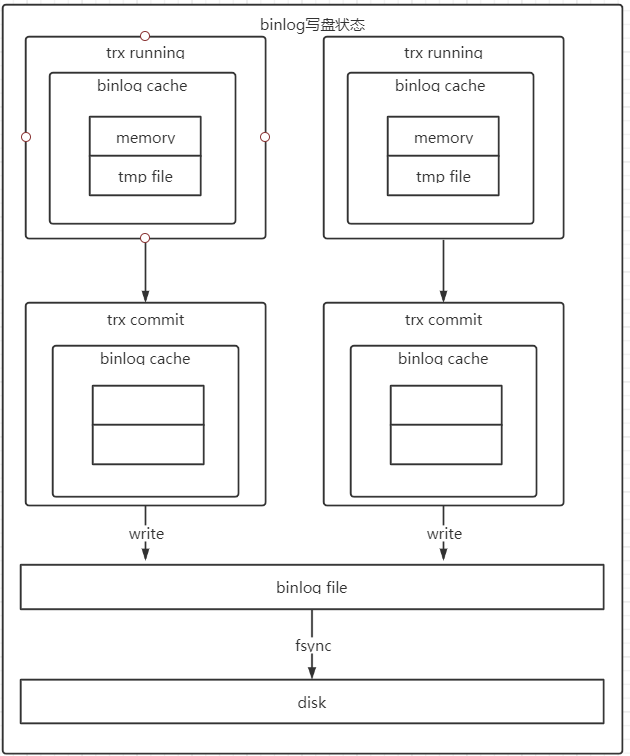
```text
write和fsync的时机是由参数sync_binlog控制的：
1. sync_binlog=0的时候，表示每次事务提交的时候都会write，不fsync
2. sync_binlog=1的时候，表示每次事务提交的时候都会fsync
3. sync_binlog=N(N>1)的时候，表示每次事务提交的时候都会write，但是累计N个事务后才fsync

在实际的业务场景中，考虑到丢失日志量的可控性，一般不建议将这个参数设成0，比较常见的是将其设置为100~1000中的某个数值。
但是，将sync_binlog设置为N，对应的风险是：如果主机发生异常重启，会丢失最近N个事务的binlog日志。
```

**redo log的写入机制**

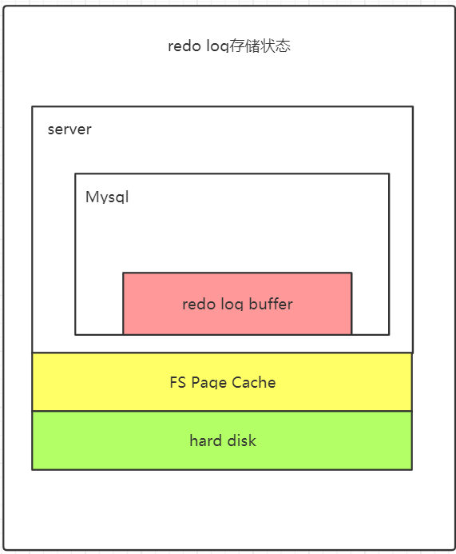

```text
这三种状态分别是：
1. 存在redo log buffer中，物理上是在MySQL进程内存中
2. 写到磁盘(write)，但是没有持久化（fsync)，物理上是在文件系统的page cache里面
3. 持久化到磁盘，对应的是hard disk

日志写到redo log buffer是很快的，wirte到page cache也差不多，但是持久化到磁盘的速度就慢多了。
为了控制redo log的写入策略，InnoDB提供了innodb_flush_log_at_trx_commit参数，它有三种可能取值：
1. 设置为0的时候，表示每次事务提交时都只是把redo log留在redo log buffer中;
2. 设置为1的时候，表示每次事务提交时都将redo log直接持久化到磁盘；
3. 设置为2的时候，表示每次事务提交时都只是把redo log写到page cache。

InnoDB有一个后台线程，每隔1秒，就会把redo log buffer中的日志，调用write写到文件系统的page cache，然后调用fsync持久化到磁盘。

注意:
让没有提交的事务的redo log写入到磁盘中情况如下
1. 事务执行中间过程的redo log也是直接写在redo log buffer中的，这些redo log也会被后台线程一起持久化到磁盘。
2. redo log buffer占用的空间即将达到 innodb_log_buffer_size一半的时候，后台线程会主动写盘。注意，由于这个事务并没有提交，所以这个写盘动作只是write，而没有调用fsync，也就是只留在了文件系统的page cache。
3. 并行的事务提交的时候，顺带将这个事务的redo log buffer持久化到磁盘。

两阶段提交：时序上redo log先prepare， 再写binlog，最后再把redo log commit。
- 如果把innodb_flush_log_at_trx_commit设置成1，那么redo log在prepare阶段就要持久化一次，因为有一个崩溃恢复逻辑是要依赖于prepare 的redo log，再加上binlog来恢复的。
- 每秒一次后台轮询刷盘，再加上崩溃恢复这个逻辑，InnoDB就认为redo log在commit的时候就不需要fsync了，只会write到文件系统的page cache中就够了。

通常MySQL的“双1”配置，指的就是sync_binlog和innodb_flush_log_at_trx_commit都设置成 1。也就是说，一个事务完整提交前，需要等待两次刷盘，一次是redo log（prepare 阶段），一次是binlog。
```

**组提交（group commit）机制**

日志逻辑序列号（log sequence number，LSN）的概念。LSN是单调递增的，用来对应redo log的一个个写入点。每次写入长度为length的redo log， LSN的值就会加上length。

LSN也会写到InnoDB的数据页中，来确保数据页不会被多次执行重复的redo log。

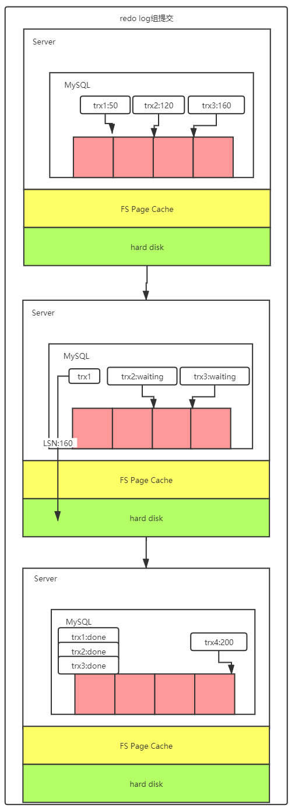
```text
从图中可以看到
1. trx1是第一个到达的，会被选为这组的 leader；
2. 等trx1要开始写盘的时候，这个组里面已经有了三个事务，这时候LSN也变成了160；
3. trx1去写盘的时候，带的就是LSN=160，因此等trx1返回时，所有LSN小于等于160的redo log，都已经被持久化到磁盘；
4. 这时候trx2和trx3就可以直接返回了。

所以，一次组提交里面，组员越多，节约磁盘IOPS的效果越好。但如果只有单线程压测，那就只能老老实实地一个事务对应一次持久化操作了。

在并发更新场景下，第一个事务写完redo log buffer以后，接下来这个fsync越晚调用，组员可能越多，节约IOPS的效果就越好。

为了让一次fsync带的组员更多，MySQL有一个很有趣的优化：拖时间。
```


```text
binlog也可以组提交了。在执行图5中第4步把binlog fsync到磁盘时，如果有多个事务的binlog已经写完了，也是一起持久化的，这样也可以减少IOPS的消耗。不过通常情况下第3步执行得会很快，所以binlog的write和fsync间的间隔时间短，导致能集合到一起持久化的binlog比较少，因此binlog的组提交的效果通常不如redo log的效果那么好。

如果想提升binlog组提交的效果，可以设置 binlog_group_commit_sync_delay 和 binlog_group_commit_sync_no_delay_count来实现。
- binlog_group_commit_sync_delay参数，表示延迟多少微秒后才调用fsync;
- binlog_group_commit_sync_no_delay_count参数，表示累积多少次以后才调用fsync。
```

如果你的MySQL现在出现了性能瓶颈，而且瓶颈在IO上，可以考虑以下三种方法：
1. 设置 binlog_group_commit_sync_delay 和 binlog_group_commit_sync_no_delay_count参数，减少binlog的写盘次数。这个方法是基于“额外的故意等待”来实现的，因此可能会增加语句的响应时间，但没有丢失数据的风险。
2. 将sync_binlog 设置为大于1的值（比较常见是100~1000）。这样做的风险是，主机掉电时会丢binlog日志。
3. 将innodb_flush_log_at_trx_commit设置为2。这样做的风险是，主机掉电的时候会丢数据。


**MySQL主备的基本原理**

一个事务日志同步的完整过程
1. 在备库上通过change master命令，设置主库的IP、端口、用户名、密码，以及要从哪个位置开始请求binlog，这个位置包含文件名和日志偏移量。
2. 在备库上执行start slave命令，这时候备库会启动多个线程，即一个io_thread和一个或多个sql_thread。其中io_thread负责与主库建立连接。
3. 主库校验完用户名、密码后，开始按照备库传过来的位置，从本地读取binlog，发给备库。
4. 备库拿到binlog后，写到本地文件，称为中转日志（relay log）。
5. sql_thread读取中转日志，解析出日志里的命令，并执行。


**binlog的三种格式对比**

- statement

当binlog_format=statement时，binlog里面记录的就是SQL语句的原文

- row

当binlog_format=row时，binlog_row_image的默认配置是FULL，binlog里面记录的操作包含所有的原始数据，保证了在另一个库中执行的一致性
如果把binlog_row_image设置为MINIMAL，则只会记录必要的信息，例如binlog值记录的操作和操作的记录的id值


mixed

解决问题:
- 有些statement格式的binlog可能会导致主备不一致，所以要使用row格式。
- row格式的缺点是，很占空间。比如你用一个delete语句删掉10万行数据，用statement的话就是一个SQL语句被记录到binlog中，占用几十个字节的空间。但如果用row格式的binlog，就要把这10万条记录都写到binlog中。这样做，不仅会占用更大的空间，同时写binlog也要耗费IO资源，影响执行速度。

所以，MySQL就取了个折中方案，也就是有了mixed格式的binlog。mixed格式的意思是，MySQL自己会判断这条SQL语句是否可能引起主备不一致，如果有可能，就用row格式，否则就用statement格式。
也就是说，mixed格式可以利用statment格式的优点，同时又避免了数据不一致的风险。


现在越来越多的场景要求把MySQL的binlog格式设置成row。这么做的理由有很多，最直接的理由是**恢复数据**。简单举例如下：
```text
delete
执行delete语句，row格式的binlog也会把被删掉的行的整行信息保存起来。所以，如果你在执行完一条delete语句以后，发现删错数据了，可以直接把binlog中记录的delete语句转成insert，把被错删的数据插入回去就可以恢复了。

insert
row格式下，insert语句的binlog里会记录所有字段信息，这些信息可以用来精确定位刚刚被插入的那一行。这时，你直接把insert语句转成delete语句，删除掉这被误插入的一行数据就可以了。

update
update语句的话，binlog里面会记录修改前整行的数据和修改后的整行数据。所以，如果你误执行了update语句的话，只需要把这个event前后的两行信息对调一下，再去数据库里面执行，就能恢复这个更新操作了。
```

mysql> insert into t values(10,10, now());
当binlog格式设置为mixed，则MySQL会把它记录为statement格式，可以看出主备执行时间不同插入的now()函数或取得本地时间也会不同，但是在binlog记录的时候，他会多记录一条命令：SETTIMESTAMP=1546103491。它用 SETTIMESTAMP命令约定了接下来的now()函数的返回时间。通过这条SETTIMESTAMP命令，MySQL就确保了主备数据的一致性。

**循环复制问题**

binlog的特性确保了在备库执行相同的binlog，可以得到与主库相同的状态。可以认为正常情况下主备的数据是一致的。在学习过程中接触较多的是M-S结构，也就是主从结构，一个主库一个备库，但是实际生产用的比较多的是双M结构相互充当主备库，但是双M结构还有一个问题需要解决，如下：

业务逻辑在节点A上更新了一条语句，然后再把生成的binlog发给节点B，节点B执行完这条更新语句后也会生成binlog。（建议你把参数log_slave_updates设置为on，表示备库执行relay log后生成binlog）。如果节点A同时是节点B的备库，相当于又把节点B新生成的binlog拿过来执行了一次，然后节点A和B间，会不断地循环执行这个更新语句，也就是循环复制了。要解决这个问题就需要用到MySQL在binlog中记录了这个命令第一次执行时所在实例的server id。因此，我们可以用下面的逻辑，来解决两个节点间的循环复制的问题：
1. 规定两个库的server id必须不同，如果相同，则它们之间不能设定为主备关系；
2. 一个备库接到binlog并在重放的过程中，生成与原binlog的server id相同的新的binlog；
3. 每个库在收到从自己的主库发过来的日志后，先判断server id，如果跟自己的相同，表示这个日志是自己生成的，就直接丢弃这个日志。
按照这个逻辑，如果设置了双M结构，日志的执行流就会变成这样：
1. 从节点A更新的事务，binlog里面记的都是A的server id；
2. 传到节点B执行一次以后，节点B生成的binlog 的server id也是A的server id；
3. 再传回给节点A，A判断到这个server id与自己的相同，就不会再处理这个日志。所以，死循环在这里就断掉了。


**主备延迟**

主备切换可能是主动运维动作，例如软件升级，主库所在机器按计划下线等。
主备切换也可能是被动操作，例如主库所在机器掉电等。

同步延迟
```text
1. 主库执行完一个事务，写入binlog，此刻为T1
2. 之后主库将binlog传送给备库，当备库接收完binlog的时刻为T2
3. 当备库执行完这个事务(中转日志)的时刻为T3

所谓主备延迟就是指，在同一个事务中，在备库执行完成的时间和在主库执行完成的时间的差值，也就是T3-T1

可以在备库上执行show slave status命令，它的返回结果里面会显示seconds_behind_master，用于表示当前备库延迟了多少秒。

seconds_behind_master的计算方法：
1. 每个事务的binlog里面都有一个时间字段，用于记录主库上写入的时间。
2. 备库取出当前正在执行的事务的时间字段的值，计算它与当前系统时间的差值，得到seconds_behind_master。

主备延迟最直接的表现是，备库消费中转日志（relay log）的速度，比主库生产binlog的速度要慢。
```

**主备延迟的来源**

1. 有些部署条件下，备库所在机器的性能要比主库所在的机器性能差（目前比较少）

	```text
	更新请求对IOPS的压力，在主库和备库上是无差别的。所以，做这种部署时，一般都会将备库设置为“非双1”的模式。
	当备库主机上的多个备库都在争抢资源的时候，就可能会导致主备延迟了。
	```

2. 主库提供了写的能力，备库可以提供一些读的能力。

	```text
	导致的结果就是备库上的查询耗费了大量的CPU资源，影响了同步速度，造成主备延迟。
	这种情况，我们一般可以这么处理：
	1. 一主多从。除了备库外，可以多接几个从库，让这些从库来分担读的压力。
	2. 通过binlog输出到外部系统，比如Hadoop这类系统，让外部系统提供统计类查询的能力。

	一主多从的方式大都会被采用。因为作为数据库系统，还必须保证有定期全量备份的能力。而从库，就很适合用来做备份。多个从库中将来被选为主库的成为备库，其他的称为从库
	```

3. 大事务

	```text
	因为主库上必须等事务执行完成才会写入binlog，再传给备库。所以，如果一个主库上的语句执行10分钟，那这个事务很可能就会导致从库延迟10分钟。

	其中一种场景为 一次性地用delete语句删除太多数据
	另一种典型的大事务场景，就是大表DDL
	```

4. 造成主备延迟还有一个大方向的原因，就是备库的并行复制能力

**由于主备延迟的存在，主备切换也有相应的不同策略**

1. 可靠性优先策略
	```text
	1. 判断备库现在的seconds_behind_master，如果小于某个值（比如5秒）继续下一步，否则持续重试这一步。
	2. 把主库改成只读状态，即把readonly设置为true。
	3. 判断备库的seconds_behind_master的值，直到这个值变成0为止。
	4. 把备库改成可读写状态，也就是把readonly设置为false。
	5. 把业务请求切到备库B。
	```
2. 可用性优先策略
	```text
	1. 把备库改成可读写状态，也就是把readonly设置为false。
	2. 把业务请求切到备库B。
	3. 把主库改成只读状态，即把readonly设置为true。

	可用性优先的策略引发的问题(举例)：
	1. binlog_format=mixed时可能会产生{数据格式(id(auto pre key),c),插入数据(1,1),(2,2),(3,3)}
		1. 主库执行完insert语句，插入了一行数据insert into t(c) values(4)，之后开始进行主备切换。
		2. 由于主备之间有5秒的延迟，所以备库还没来得及应用“插入c=4”这个中转日志，就开始接收客户端“插入c=5”的命令。
		3. 备库插入了一行数据（4,5），并且把这个binlog发给主库。
		4. 备库执行“插入c=4”这个中转日志，插入了一行数据（5,4）。而直接在备库执行的“插入c=5”这个语句，传到主库，就插入了一行新数据（5,5）。

		最后的结果就是，主库A和备库B上出现了两行不一致的数据。
		使用mixed或者statement格式的binlog时，数据很可能悄悄地就不一致了。如果你过了很久才发现数据不一致的问题，很可能这时的数据不一致已经不可查，或者连带造成了更多的数据逻辑不一致。
	2. 但设置binlog_format=row
		因为row格式在记录binlog的时候，会记录新插入的行的所有字段值，所以最后只会有一行不一致。而且，两边的主备同步的应用线程会报错duplicate keyerror并停止。也就是说，这种情况下，备库的(5,4)和主库的(5,5)这两行数据，都不会被对方执行。
		使用row格式的binlog时，数据不一致的问题更容易被发现。

	主备切换的可用性优先策略会导致数据不一致。因此，大多数情况下，我都建议你使用可靠性优先策略。毕竟对数据服务来说的话，数据的可靠性一般还是要优于可用性的。
	```

	

**并行复制策略**

在官方的5.6版本之前，MySQL只支持单线程复制，由此在主库并发高、TPS高时就会出现严重的主备延迟问题。
多线程复制机制的模型图如下:
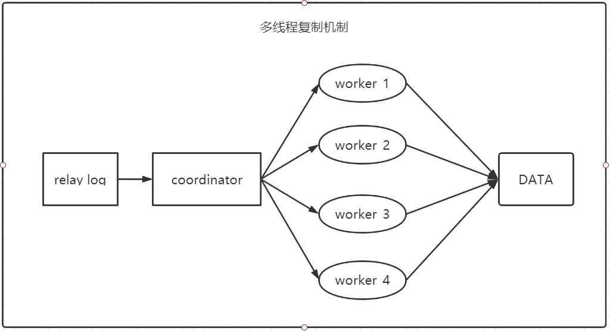

```text
coordinator在分发的时候，需要满足以下这两个基本要求：
1. 不能造成更新覆盖。这就要求更新同一行的两个事务，必须被分发到同一个worker中。
2. 同一个事务不能被拆开，必须放到同一个worker中。


```

1. 按表分发策略

基本思路: 如果两个事务更新不同的表，它们就可以并行。因为数据是存储在表里的，所以按表分发，可以保证两个worker不会更新同一行。

每个worker线程对应一个hash表，用于保存当前正在这个worker的“执行队列”里的事务所涉及的表。hash表的key是“库名.表名”，value是一个数字，表示队列中有多少个事务修改这个表。

MySQL 5.5版本的按表分发策略
```text
分配规则，每个事务在分发的时候，有以下三种情况：
1. 如果跟所有worker都不冲突，coordinator线程就会把这个事务分配给最空闲的woker;
2. 如果跟多于一个worker冲突，coordinator线程就进入等待状态，直到和这个事务存在冲突关系的worker只剩下1个；
3. 如果只跟一个worker冲突，coordinator线程就会把这个事务分配给这个存在冲突关系的worker。

这个按表分发的方案，在多个表负载均匀的场景里应用效果很好。但是，如果碰到热点表，比如所有的更新事务都会涉及到某一个表的时候，所有事务都会被分配到同一个worker中，就变成单线程复制了。
```


2. 按行分发策略

按行复制的核心思路是：如果两个事务没有更新相同的行，它们在备库上可以并行执行。显然，这个模式要求binlog格式必须是row。

每个worker，分配一个hash表，key是“库名+表名+唯一键的值”。

MySQL 5.5版本的按行分发策略
```text
相比于按表并行分发策略，按行并行策略在决定线程分发的时候，需要消耗更多的计算资源。

这两个方案其实都有一些约束条件：
1. 要能够从binlog里面解析出表名、主键值和唯一索引的值。也就是说，主库的binlog格式必须是row；
2. 表必须有主键；
3. 不能有外键。表上如果有外键，级联更新的行不会记录在binlog中，这样冲突检测就不准确。

如果是要操作很多行的大事务的话，按行分发的策略有两个问题：
1. 耗费内存。比如一个语句要删除100万行数据，这时候hash表就要记录100万个项。
2. 耗费CPU。解析binlog，然后计算hash值，对于大事务，这个成本还是很高的。
在使用这个策略的时候会设置一个阈值，单个事务如果超过设置的行数阈值（比如，如果单个事务更新的行数超过10万行），就暂时退化为单线程模式，退化过程的逻辑大概步骤如下：
1. coordinator暂时先hold住这个事务；
2. 等待所有worker都执行完成，变成空队列；
3. coordinator直接执行这个事务；
4. 恢复并行模式。

```

MySQL 5.6版本的并行复制策略
```text
官方MySQL5.6版本，支持了并行复制，只是支持的粒度是按库并行。用于决定分发策略的hash表里，key就是数据库名。这个策略的并行效果，取决于压力模型。如果在主库上有多个DB，并且各个DB的压力均衡，使用这个策略的效果会很好。相比于按表和按行分发，这个策略有两个优势：
1. 构造hash值的时候很快，只需要库名；而且一个实例上DB数也不会很多，不会出现需要构造100万个项这种情况。
2. 不要求binlog的格式。因为statement格式的binlog也可以很容易拿到库名。

但是，如果你的主库上的表都放在同一个DB里面，这个策略就没有效果了；或者如果不同DB的热点不同，比如一个是业务逻辑库，一个是系统配置库，那也起不到并行的效果。
理论上你可以创建不同的DB，把相同热度的表均匀分到这些不同的DB中，强行使用这个策略。由于需要特地移动数据，这个策略用得并不多。
```

MariaDB的并行复制策略
```text
MariaDB利用redo log组提交(group commit)优化这个特性：
1. 能够在同一组里提交的事务，一定不会修改同一行；
2. 主库上可以并行执行的事务，备库上也一定是可以并行执行的。
在实现上，MariaDB的做法是：
1. 在一组里面一起提交的事务，有一个相同的commit_id，下一组就是commit_id+1；
2. commit_id直接写到binlog里面；
3. 传到备库应用的时候，相同commit_id的事务分发到多个worker执行；
4. 这一组全部执行完成后，coordinator再去取下一批。

但是，这个策略存在一个问题，它并没有实现“真正的模拟主库并发度”这个目标。在主库上，一组事务在commit的时候，下一组事务是同时处于“执行中”状态的。

在备库上执行的时候，要等第一组事务完全执行完成后，第二组事务才能开始执行，这样系统的吞吐量就不够。这个方案很容易被大事务拖后腿。
```

MySQL 5.7的并行复制策略
```text
在MariaDB并行复制实现之后，官方的MySQL5.7版本也提供了类似的功能，由参数slaveparallel-type来控制并行复制策略：
1. 配置为DATABASE，表示使用MySQL 5.6版本的按库并行策略；
2. 配置为 LOGICAL_CLOCK，表示的就是类似MariaDB的策略。不过，MySQL 5.7这个策略，针对并行度做了优化。这个优化的思路也很有趣儿。


MySQL 5.7并行复制策略的思想是：
1. 同时处于prepare状态的事务，在备库执行时是可以并行的；
2. 处于prepare状态的事务，与处于commit状态的事务之间，在备库执行时也是可以并行的。
此处的两个参数：
1. binlog_group_commit_sync_delay参数，表示延迟多少微秒后才调用fsync;
2. binlog_group_commit_sync_no_delay_count参数，表示累积多少次以后才调用fsync。
这两个参数是用于故意拉长binlog从write到fsync的时间，以此减少binlog的写盘次数。在MySQL 5.7的并行复制策略里，它们可以用来制造更多的“同时处于prepare阶段的事务”。这样就增加了备库复制的并行度。也就是说，这两个参数，既可以“故意”让主库提交得慢些，又可以让备库执行得快些。在MySQL 5.7处理备库延迟的时候，可以考虑调整这两个参数值，来达到提升备库复制并发度的目的。
```

MySQL 5.7.22的并行复制策略
```text
MySQL 5.7.22版本里，MySQL增加了一个新的并行复制策略，基于WRITESET的并行复制。相应地，新增了一个参数binlog-transaction-dependency-tracking，用来控制是否启用这个新策略。这个参数的可选值有以下三种。
1. COMMIT_ORDER，表示的就是前面介绍的，根据同时进入prepare和commit来判断是否可以并行的策略。
2. WRITESET，表示的是对于事务涉及更新的每一行，计算出这一行的hash值，组成集合writeset。如果两个事务没有操作相同的行，也就是说它们的writeset没有交集，就可以并行。
3. WRITESET_SESSION，是在WRITESET的基础上多了一个约束，即在主库上同一个线程先后执行的两个事务，在备库执行的时候，要保证相同的先后顺序。

当然为了唯一标识，这个hash值是通过“库名+表名+索引名+值”计算出来的。如果一个表上除了有主键索引外，还有其他唯一索引，那么对于每个唯一索引，insert语句对应的writeset就要多增加一个hash值。

1. writeset是在主库生成后直接写入到binlog里面的，这样在备库执行的时候，不需要解析binlog内容（event里的行数据），节省了很多计算量；
2. 不需要把整个事务的binlog都扫一遍才能决定分发到哪个worker，更省内存；
3. 由于备库的分发策略不依赖于binlog内容，所以binlog是statement格式也是可以的。

因此，MySQL 5.7.22的并行复制策略在通用性上还是有保证的。对于“表上没主键”和“外键约束”的场景，WRITESET策略也是没法并行的，也会暂时退化为单线程模型。
```

**主备切换**

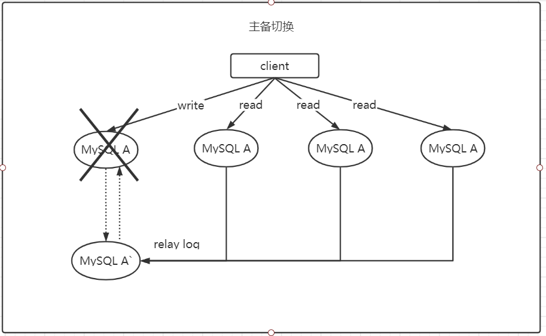

基于位点的主备切换
```text
如图，当B设置为A`的从库，则需要在从库B上执行命令change master命令，此命令参数为：主库A’的IP、端口、用户名和密码，主库的master_log_name文件的master_log_pos这个位置的日志继续同步

一种取同步位点的方法：
1. 等待新主库A’把中转日志（relay log）全部同步完成；
2. 在A’上执行showmaster status命令，得到当前A’上最新的File 和 Position；
3. 取原主库A故障的时刻T；
4. 用mysqlbinlog工具解析A’的File，得到T时刻的位点。
可以得到位点，但是这个位置的值并不准确，因为这个位点的事务在A中执行了然后A故障，但是此时的事务日志可能已经被B同步了，此时如果设置B的位点为A`中得到的位点可能出错
需要跳过这种错误，两种方法：
1. 主动跳过一个事务
2. 通过设置slave_skip_errors参数，直接设置跳过指定的错误
```

GTID

MySQL 5.6 版本引入了GTID

```text
GTID的全称是Global Transaction Identifier，也就是全局事务ID，是一个事务在提交的时候生成的，是这个事务的唯一标识。它由两部分组成，格式是：GTID=server_uuid:gno
其中：
server_uuid是一个实例第一次启动时自动生成的，是一个全局唯一的值；
gno是一个整数，初始值是1，每次提交事务的时候分配给这个事务，并加1。

GTID模式的启动也很简单，我们只需要在启动一个MySQL实例的时候，加上参数gtid_mode=on和enforce_gtid_consistency=on就可以了。

这个GTID有两种生成方式，而使用哪种方式取决于session变量gtid_next的值。
1. 如果gtid_next=automatic，代表使用默认值。这时，MySQL就会把server_uuid:gno分配给这个事务。
a. 记录binlog的时候，先记录一行 SET@@SESSION.GTID_NEXT=‘server_uuid:gno’;
b. 把这个GTID加入本实例的GTID集合。
2. 如果gtid_next是一个指定的GTID的值，比如通过set gtid_next='current_gtid’指定为current_gtid，那么就有两种可能：
a. 如果current_gtid已经存在于实例的GTID集合中，接下来执行的这个事务会直接被系统忽
略；
b. 如果current_gtid没有存在于实例的GTID集合中，就将这个current_gtid分配给接下来要执行的事务，也就是说系统不需要给这个事务生成新的GTID，因此gno也不用加1。
```

基于GTID的主备切换

```text
我们把上图的主库故障这个时刻，实例A’的GTID集合记为set_a，实例B的GTID集合记为set_b。在实例B上执行start slave命令，取binlog的逻辑是这样的：
1. 实例B指定主库A’，基于主备协议建立连接。
2. 实例B把set_b发给主库A’。
3. 实例A’算出set_a与set_b的差集，也就是所有存在于set_a，但是不存在于set_b的GITD的集合，判断A’本地是否包含了这个差集需要的所有binlog事务。
a. 如果不包含，表示A’已经把实例B需要的binlog给删掉了，直接返回错误；
b. 如果确认全部包含，A’从自己的binlog文件里面，找出第一个不在set_b的事务，发给B；
4. 之后就从这个事务开始，往后读文件，按顺序取binlog发给B去执行。其实，这个逻辑里面包含了一个设计思想：在基于GTID的主备关系里，系统认为只要建立主备关系，就必须保证主库发给备库的日志是完整的。因此，如果实例B需要的日志已经不存在，A’就拒绝把日志发给B。
这跟基于位点的主备协议不同。基于位点的协议，是由备库决定的，备库指定哪个位点，主库就发哪个位点，不做日志的完整性判断。

之后这个系统就由新主库A’写入，主库A’的自己生成的binlog中的GTID集合格式是：server_uuid_of_A’:1-M。
如果之前从库B的GTID集合格式是 server_uuid_of_A:1-N， 那么切换之后GTID集合的格式就变成了server_uuid_of_A:1-N, server_uuid_of_A’:1-M。主库A’之前也是A的备库，因此主库A’和从库B的GTID集合是一样的。这就达到了我们预期。
```

**读写分离**

读写分离架构
1. 客户端直连
2. proxy的架构(目前的趋势)

由于主从可能存在延迟，客户端执行完一个更新事务后马上发起查询，如果查询选择的是从库的话，就有可能读到刚刚的事务更新之前的状态。这种“在从库上会读到系统的一个过期状态”的现象的处理方式
1. 强制走主库方案
```text
强制走主库方案其实就是，将查询请求做分类。通常情况下，我们可以将查询请求分为这么两类：
1. 对于必须要拿到最新结果的请求，强制将其发到主库上
2. 对于可以读到旧数据的请求，才将其发到从库上
这个方案是用得最多的
```
2. sleep方案
```text
主库更新后，读从库之前先sleep一下。具体的方案就是，类似于执行一条select sleep(1)命令。
从严格意义上来说，这个方案存在的问题就是不精确。这个不精确包含了两层意思：
1. 如果这个查询请求本来0.5秒就可以在从库上拿到正确结果，也会等1秒；
2. 如果延迟超过1秒，还是会出现过期读。
```
3. 判断主备无延迟方案
```text
要确保备库无延迟，通常有三种做法：
1. 每次从库执行查询请求前，先判断seconds_behind_master是否已经等于0。如果还不等于0，那就必须等到这个参数变为0才能执行查询请求。我们知道show slave status结果里的seconds_behind_master参数的值，可以用来衡量主备延迟时间的长短。
2. 对比位点确保主备无延迟
Master_Log_File和Read_Master_Log_Pos，表示的是读到的主库的最新位点；
Relay_Master_Log_File和Exec_Master_Log_Pos，表示的是备库执行的最新位点。
如果Master_Log_File和Relay_Master_Log_File、Read_Master_Log_Pos和Exec_Master_Log_Pos这两组值完全相同，就表示接收到的日志已经同步完成。
3. 对比GTID集合确保主备无延迟：
Auto_Position=1 ，表示这对主备关系使用了GTID协议
Retrieved_Gtid_Set，是备库收到的所有日志的GTID集合
Executed_Gtid_Set，是备库所有已经执行完成的GTID集合
如果这两个集合相同，也表示备库接收到的日志都已经同步完成。
```
4. 配合semi-sync方案
```text
存在一种情况，主库执行完三个事务，两个事务的日志已经发送给从库执行完了，但是第三个事务的日志还没有发送日志文件给从库，此时主库响应客户端执行完成，客户端查询则没有。这时的从库判断已经没有主备延迟了。

这种情况就要引入半同步复制，也就是semi-sync replication。
semi-sync的设计：
1. 事务提交的时候，主库把binlog发给从库；
2. 从库收到binlog以后，发回给主库一个ack，表示收到了；
3. 主库收到这个ack以后，才能给客户端返回“事务完成”的确认。
也就是说，如果启用了semi-sync，就表示所有给客户端发送过确认的事务，都确保了备库已经收到了这个日志。

semi-sync+位点判断的方案，只对一主一备的场景是成立的。
在一主多从场景中，主库只要等到一个从库的ack，就开始给客户端返回确认。这时，在从库上执行查询请求，就有两种情况：
1. 如果查询是落在这个响应了ack的从库上，是能够确保读到最新数据；
2. 但如果是查询落到其他从库上，它们可能还没有收到最新的日志，就会产生过期读的问题。

判断同步位点的方案还有另外一个潜在的问题，即：如果在业务更新的高峰期，主库的位点或者GTID集合更新很快，那么上面的两个位点等值判断就会一直不成立，很可能出现从库上迟迟无法响应查询请求的情况。

semi-sync配合判断主备无延迟的方案，存在两个问题：
1. 一主多从的时候，在某些从库执行查询请求会存在过期读的现象；
2. 在持续延迟的情况下，可能出现过度等待的问题。
```
5. 等主库位点方案
```text
命令：select master_pos_wait(file, pos, timeout);
1. 它是在从库执行的；
2. 参数file和pos指的是的文件名和位置；
3. timeout可选，设置为正整数N表示这个函数最多等待N秒。
这个命令正常返回的结果是一个正整数M，表示从命令开始执行，到应用完file和pos表示的binlog位置，执行了多少事务。除了正常返回一个正整数M外，这条命令还会返回一些其他结果，包括：
1. 如果执行期间，备库同步线程发生异常，则返回NULL；
2. 如果等待超过N秒，就返回-1；
3. 如果刚开始执行的时候，就发现已经执行过这个位置了，则返回0。

对于在主库上先执行一个事务，在从库上再执行一个查询请求的逻辑，要保证能够查到正确的数据，步骤如下：
1. 主库上事务更新完成后，马上执行showmaster status得到当前主库执行到的File和Position；
2. 选定一个从库执行查询语句；
3. 在从库上执行select master_pos_wait(File, Position, 1)；
4. 如果返回值是>=0的正整数，则在这个从库执行查询语句；
5. 否则，到主库执行查询语句；
步骤5可根据业务放弃查询或者到主库上查询
```
6. 等GTID方案
```text
命令：select wait_for_executed_gtid_set(gtid_set, 1)
1. 等待，直到这个库执行的事务中包含传入的gtid_set，返回0；
2. 超时返回1。

MySQL 5.7.6版本开始，允许在执行完更新类事务后，把这个事务的GTID返回给客户端，这样等GTID的方案就可以减少一次查询。这时，等GTID的执行流程就变成了：
1. 主库的一个事务更新完成后，从返回包直接获取这个事务的GTID，记为gtid1；
2. 选定一个从库执行查询语句；
3. 在从库上执行 select wait_for_executed_gtid_set(gtid1, 1)；
4. 如果返回值是0，则在这个从库执行查询语句；
5. 否则，到主库执行查询语句。

你只需要将参数session_track_gtids设置为OWN_GTID(set session_track_gtids=OWN_GTID;)，然后通过API接口mysql_session_track_get_first从返回包解析出GTID的值即可。
```

**如何判断数据库是否出问题**

**外部检测**
误区：无法判断数据库出问题
```text
1. select 1判断
select 1; 的判断只能说明这个数据库的进程还在，并不能说明数据库没问题。万一select 1; 语句超过了数据库的并发执行数，他前面的请求正在处理大规模的SQL操作耗时长，此时select 1; 进入等待，此时并不能说明数据库出问题了。
set global innodb_thread_concurrency=3; 设置此参数的作用是并发数是3，处理数据的线程只能由三个同时处理，超过的请求必须等待。

并发连接和并发查询
并发连接：只是服务器连接到数据库服务器上了
并发查询：在连接上数据库执行查询等语句的时候才是并发操作，例如并发查询，此时的并发查询数由innodb_thread_concurrency参数控制，但是类似于等行锁之类的进入等待，并不会消耗并发查询数，不会算到innodb_thread_concurrency涉及的数值里面。

例如innodb_thread_concurrency=128，在线程进入锁等待以后，并发线程的计数会减一，也就是说等行锁（也包括间隙锁）的线程是不算在128里面的。进入锁等待的线程已经不吃CPU了；更重要的是，必须这么设计，才能避免整个系统锁死。

2. 查表判断
查询语句： select * from mysql.health_check;
这种判断方式也是不可以的，虽然这种方法可以检测出由于并发线程过多导致数据库不可用的情况，但是会碰到一些情况不能监测处，例如：空间满了之后，更新事务需要写binlog，一旦binlog所在的磁盘空间达到100%，那么所有的更新操作的语句和事务提交的commit语句都会被堵住。但是系统这时候是可以正常读取数据的。因此这种方法也是有检测不到的情况

3. 更新判断
更新语句： update mysql.health_check set t_modified=now();
一般情况下都会把数据库设置为双M结构，备库也需要检测，也要写binlog。
此时如果主备库使用相同的更新命令，就可能出现冲突，也就是会导致主备同步停止。所以更新语句不能更新同一行使用相同的语句。
此时可以用一张表来保存两个数据，一个是server_id，另一个是时间戳。主备更新就只会更新它对应server_id的一行数据，他们同步就不会产生冲突。
更新命令如下：
insert into mysql.health_check(id, t_modified) values (@@server_id, now()) on duplicate key update t_modified=now();

更新判断已经是一个比较常用的方案了，不过还存在一些问题：
"判定慢"是最大的问题，涉及到的是服务器IO资源分配问题。所有的检测逻辑都需要一个超时时间N。执行一条更新语句，超过时间N后没有返回，就认为系统不可用了，就应该需要做主备切换了。
假设一个日志盘的IO利用率已经达到了100%，此时响应非常慢，理论上应该做主备切换了。但是IO利用率达到100%表示系统的IO是在工作，每个请求都有机会拿到IO资源，而且我们使用的更新判断语句需要的资源很少，只要拿到IO资源就可以提交commit了，并且在超时时间N之前就可以作出响应返回给检测系统。此时检测系统就会认为判断系统正常的结论，实际上IO利用率已经达到了100%，需要及时主备切换了。

以上的检测方法都是通过外部检测，外部检测必然会出现一些问题。
外部检测都需要定时轮询，所以系统可能已经出问题了，但是却需要等到下一个检测发起执行语句的时候，我们才有可能发现问题。而且，如果你的运气不够好的话，可能第一次轮询还不能发现，这就会导致切换慢的问题
```

**内部统计**
```text
针对磁盘利用问题，MySQL可以知道每次IO请求时间，MySQL 5.6版本以后提供的performance_schema库，就file_summary_by_event_name表里统计了每次IO请求的时间。
打开方式：操作performance_schema.setup_instruments这张表就可以将对应的功能打开关闭
update setup_instruments set ENABLED='YES', Timed='YES' where name like '%wait/io/file/innodb/innodb_log_file...'

查看：可以通过MAX_TIMER的值来判断数据库是否出问题了。比如，可以设定阈值，单次IO请求时间超过200毫秒属于异常，然后使用类似下面这条语句作为检测逻辑
select event_name,MAX_TIMER_WAIT FROM performance_schema.file_summary_by_event_name where ....
发现异常后，取到需要的信息，再通过下面这条语句：
truncate table performance_schema.file_summary_by_event_name
把之前的统计信息清空。这样如果后面的监控中，再次出现这个异常，就可以加入监控累积值了。

```
小结
```text
检测一个MySQL实例健康状态的几种方法，以及各种方法存在的问题和演进的逻辑。
select 1; 实际上是使用非常广泛的MHA（Master High Availability），默认使用的就是这个方法。
MHA中的另一个可选方法是只做连接，就是 “如果连接成功就认为主库没问题”。选择这个方法的很少。
每个改进的方案，都会增加额外损耗，并不能用“对错”做直接判断，需要你根据业务实际情况去做权衡。
我个人比较倾向优先考虑update系统表，然后再配合增加检测performance_schema的信息。
```

**分析加锁**
表结构：
```text
CREATE TABLE `t` (
    `id` int(11) NOT NULL,
    `c` int(11) DEFAULT NULL,
    `d` int(11) DEFAULT NULL,
    PRIMARY KEY (`id`),
    KEY `c` (`c`)
) ENGINE=InnoDB;
insert into t values(0,0,0),(5,5,5),(10,10,10),(15,15,15),(20,20,20),(25,25,25);
```
加锁规则参考上文的加锁规则
分析语句：select * from t where id>9 and id<12 order by id desc for update;
得到的加锁范围为 (0,5],(5,10],(10,15) 加锁单位是next-key lock，都是前开后闭区间，但是这里用到了优化2，即索引上的等值查询，向右遍历的时候id=15不满足条件，所以next-key lock退化为了间隙锁 (10, 15)。
分析此过程：
1. 首先这个查询语句的语义是order by id desc，要拿到满足条件的所有行，优化器必须先找到“第一个id<12的值”。
2. 这个过程是通过索引树的搜索过程得到的，在引擎内部其实是要找到id=12的这个值，但只是最终没找到，找到了(10,15)这个间隙。
3. 然后向左遍历，在遍历过程中，就不是等值查询了，会扫描到id=5这一行，所以会加一个next-key lock (0,5]。
在执行过程中，通过树搜索的方式定位记录的时候，用的是“等值查询”的方法。

分析语句：select id from t where c in(5,20,10) lock in share mode;
MariaDB [t]> explain select id from t where c in(5,20,10) lock in share mode;
+------+-------------+-------+-------+---------------+------+---------+------+------+--------------------------+
| id   | select_type | table | type  | possible_keys | key  | key_len | ref  | rows | Extra                    |
+------+-------------+-------+-------+---------------+------+---------+------+------+--------------------------+
|    1 | SIMPLE      | t     | range | c             | c    | 5       | NULL |    3 | Using where; Using index |
+------+-------------+-------+-------+---------------+------+---------+------+------+--------------------------+
可以看得出来这条in语句使用了索引c并且rows=3，说明这三个值都是通过B+树搜索定位的。

1. 在查找c=5的时候，先锁住了(0,5]。但是因为c不是唯一索引，为了确认还有没有别的记录c=5，就要向右遍历，找到c=10才确认没有了，这个过程满足优化2，所以加了间隙锁(5,10)。
2. 同样的，执行c=10这个逻辑的时候，加锁的范围是(5,10] 和 (10,15)；执行c=20这个逻辑的时候，加锁的范围是(15,20] 和 (20,25)。
3. 通过这个分析，我们可以知道，这条语句在索引c上加的三个记录锁的顺序是：先加c=5的记录锁，再加c=10的记录锁，最后加c=20的记录锁。
这些锁是“在执行过程中一个一个加的”，而不是一次性加上去的。

分析语句对比上一条分析语句：select id from t where c in(5,20,10) order by c desc for update;
这条和上面一条语句要加锁相同的资源，但是加锁顺序相反。当这两条语句并发执行的时候，就可能出现死锁。关于分析过程参考正文的30文章。

案例：我使用的是MariaDB Server version: 5.5.68-MariaDB MariaDB Server；Server version: 5.7.22 MySQL Community Server (GPL) 也无法通过下面的测试
+----------------------------------------------------+------------------------------+
|                SessionA                            |           SessionB           |
+----------------------------------------------------+------------------------------+
| begin                                              |                              |
| select * from t where id>=10 and id<=15 for update;| delete from t where id = 10; |
|                                                    | (待验证，我是实验的时候锁住了)  |
|                                                    | insert into t values(10,10); |
|                                                    | (blocked)                    |
+----------------------------------------------------+------------------------------+
结论：所谓“间隙”，其实就是由“这个间隙右边的那个记录”定义的。

+----------------------------------------------------+------------------------------+
|                SessionA                            |           SessionB           |
+----------------------------------------------------+------------------------------+
| begin                                              |                              |
| select * from t where c>5 lock in share mode;      | update t set c=1 where c=5;  |
|                                                    | (待验证，我是实验的时候锁住了)  |
|                                                    | update t set c=5 where c=1;  |
|                                                    | (blocked)                    |
+----------------------------------------------------+------------------------------+
showengine innodb status：用来查看SQL的事务信息和死锁信息
执行showengine innodb status命令得到的部分输出。这个命令会输出很多信息，有一节LATESTDETECTED DEADLOCK，就是记录的最后一次死锁信息。


