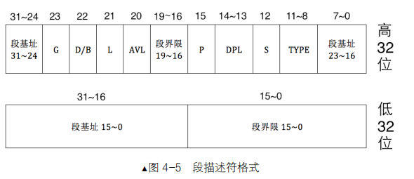

# 操作系统还原


环境准备

-----------

## 一个基本的计算机启动程序

### 环境准备
虚拟机软件：virtual box
虚拟机操作系统：Centos7
x86硬件模拟平台：Bochs
汇编语言编译器：nasm

### Centos 7 安装

```txt
注：
在后续使用过程中会出现如下报错

报错 >>PANIC<< Cannot connect to X display
原因：我没有图形界面，只有console

因为Bochs使用需要图形化界面，需要安装图形化界面，此教程安装的是最小版linux操作系统，需要安装图形界面

# Centos 7x 安装图形界面命令
yum groups install "GNOME Desktop"

# 安装后不能用远程连接，如果是最小版linux，在安装图形界面后输入指令 init 5 来重启系统进入图形界面
# 图形界面下打开终端启动bochs成功

# 还可能缺少一些库，自行安装
```

安装相关依赖
```shell
yum install -y gtk2 gtk2-devel
yum install -y libXt libXt-devel
yum install -y libXpm libXpm-devel
yum install -y SDL SDL-devel
yum install -y libXrandr-devel.x86_64
yum install -y xorg-x11-server-devel
yum install -y gcc
yum install -y gcc-c++
```

### Bochs
Bochs是一个x86硬件平台的开源模拟器

#### 安装

1. 下载版本 https://sourceforge.net/projects/bochs/files/bochs/2.6.2/ 传到linux系统上，解压
2. 配置

```txt
./configure \
--prefix=/root/bochs-2.6.2 \
--enable-debugger \
--enable-disasm \
--enable-iodebug \
--enable-x86-debugger \
--with-x \
--with-x11 \
LDFLAGS='-pthread'
```

3. 编译安装

```shell
make install
```

4. 安装中的常见错误

```txt
gtk_enh_dbg_osdep.cc:20:21: 致命错误：gtk/gtk.h：没有那个文件或目录

添加依赖
yum install -y gtk2 gtk2-devel gtk2-devel-docs

常见错误2
/usr/bin/ld: gui/libgui.a(gtk_enh_dbg_osdep.o): undefined reference to symbol 'pthread_create@@GLIBC_2.2.5'
//usr/lib64/libpthread.so.0: error adding symbols: DSO missing from command line

vim Makefile 文件， 在 92 行增加 -lphread.然后重新 make
```

#### 配置Bochs文件

share/doc/bochs/bochsrc-sample.txt 该文件有示例

bochs根目录创建文件：bochsrc.disk
```text
# 设置 Bochs 在运行过程中能够使用的内存，本例为 32MB
megs: 32

# 设置对应真实机器的 BIOS 和 VGA BIOS
romimage: file=/root/bochs/share/bochs/BIOS-bochs-latest
vgaromimage: file=/root/bochs/share/bochs/VGABIOS-lgpl-latest

# 设置 Bochs 使用的磁盘
# floppya: 1_44=a.img, status=inserted

# 选择启动盘符
boot: disk # 从硬盘启动

# 设置日志文件输出
log: bochsout.txt
# 关闭鼠标，打开键盘
mouse: enabled=0
keyboard: type=mf, serial_delay=250

# 硬盘设置
ata0: enabled=1, ioaddr1=0x1f0, ioaddr2=0x3f0, irq=14
# hd60M.img 镜像文件需要创建
# bochs根目录执行：bin/bximage -hd -mode="flat" -size=60 -q hd60M.img
ata0-master: type=disk, path="hd60M.img", mode=flat, cylinders=121, heads=16, spt=63

# 报错：Bochs is not compiled with gdbstub support
# 注释下面 不启动调试
#gdbstub: enabled=1, port=1234, text_base=0, data_base=0, bss_base=0
```

#### 启动

```shell
bin/bochs -f bochs.dsik  #运行bochs
```

#### 简单解释

```txt
You can also start bochs with the -q option to skip these menus.

1. Restore factory default configuration
2. Read options from...
3. Edit options
4. Save options to...
5. Restore the Bochs state from...
6. Begin simulation
7. Quit now

Please choose one: [6] 
00000000000i[     ] installing x module as the Bochs GUI
00000000000i[     ] using log file bochsout.txt
Next at t=0
(0) [0x0000fffffff0] f000:fff0 (unk. ctxt): jmp far f000:e05b         ; ea5be000f0
<bochs:1> 


# f000:fff0 表示cs 和 ip
# jmp far f000:e05b 执行的第一条命令 跳转到 0xfe05b

```

#### 基本使用

bochs的调试命令分为"Debugger control"类，"Execution control"类，"Breakpoint control"类，"CPU and memory control"类

- "Debugger control"类
```text
q|quit|exit 退出调试状态，关闭虚拟机
```

- "Execution control"类
```text
s|step [count] 执行count条指令
p|n|next 执行1条指令，若是函数，整个函数当作整体执行
```

- "Breakpoint control"类
```text
vb|vbreak [seg: off] 以虚拟地址添加断点，程序执行到此虚拟地址时停下来
lb|lbreak [addr] 以线性地址添加断点，程序执行到此线性地址时停下来
pb|pbreak|b|break [addr] 以物理地址添加断点，程序执行到此物理地址时会停下来
d|del|delete [n] 删除某断点
```

- "CPU and memory control"类
```text
x/nuf [line_addr] 显示线性地址的内容。n、u、f是三个参数，可选。默认n=1,u=4字节，f是十六进制
r|reg|regs|registers 显示8个通用寄存器的值 + eflag寄存器+eip寄存器
```

### nasm

#### 下载安装汇编编译器

```shell
wget https://www.nasm.us/pub/nasm/releasebuilds/2.14/nasm-2.14.tar.gz --no-check-certificate
tar -xvzf nasm-2.14.tar.gz
cd nasm-2.14
./configure
make
make install
```

#### 基本用法

```shell
nasm −f <format> <filename> [−o <output>]

# -f：用来指定编译出来的.o文件的格式。下面是nasm支持的格式，可以通过nasm -hf来查看：
# -o：用来指定编译后的文件的名称。如果不加参数，则使用原来的.asm的文件名，后缀则根据-f指定的文件格式有所不同，windows系统是.obj，unix系统是.o。
# -l：编译时生成list文件，里面包含代码和对应的机器码等内容。
# 其他参数用时再查

# 日常使用 nasm -I include/ -o mbr.bin mbr.asm
# -I path
# 把一些文件包含进来
```

### 计算机启动过程

- 为什么要载入到内存
    1. CPU的硬件电路被设计成只能运行处于内存中的程序
    2. 内存比较快，且容量大

- 什么是载入内存
    1. 程序被加载器（软件或硬件）加载到内存某个区域
    2. CPU的cs:ip寄存器被指向这个程序的起始地址

- 从按下主机power键后，第一个运行的软件就是BIOS

#### 软件接力第一棒，BIOS

BIOS 全称叫 Base Input & Output System，即基本输入输出系统。BIOS是工作在16位实模式下的

1. 实模式下的内存分布


为什么插在主板上的物理内存不是CPU眼里的“全部内存”？

在计算机中并不是只有插在主板上的内存条需要通过地址总线访问，还有一些外设同样是需要通过地址总线来访问的，这类设备还有很多呢。若把全部的地址总线都指向物理内存，那其他设备该如何访问呢？由于这个原因，只好在地址总线上提前预留出来一些地址空间给这些外设用。

1. BIOS是如何苏醒的

因为BIOS是计算机上第一个运行的软件，所以他不可能自己加载自己，它是由硬件加载的—ROM只读存储器，ROM也是一块内存，内存就需要被访问，此ROM被映射到1MB内存的顶部，即地址0xF0000~0XFFFFF处。

- BIOS是如何启动？

    1. 按下power的一瞬间，CPU的cs：ip寄存器被强制初始化为0xF000:0xFFF0，即0XFFF0，此地址便是BIOS的入口地址。
    2. CPU执行的第一条指令时jmp far f000：e05b,即跳向地址0xfe05b处，这才是BIOS代码真正开始的地方。
    3. 接下来BIOS便马不停蹄地检测内存、显卡等外设信息，当检测通过，并初始化好硬件后，开始在内存0x000~0x3FF处建立数据结构，中断向量表IVT并填写中断例程。
    4. 最后jmp 0:0x7c00 把CPU控制权交给MBR

#### 编写简单的主引导程序(MBR)

MBR的大小必须是512字节，这是为了保证0x55和0xaa这两个魔数恰好出现在该扇区的最后两个字节处，即第510字节处和511字节处

1. 简单编码主引导MBR程序

```shell
vim mbr.asm
```
```asm
; 主引导程序MBR
; SECTION是伪指令，cpu不运行，只是方便程序员规划程序分段使用
; `vstart=0x7c00`表示在程序编译时将起始地址编译为0x7c00
; SS存放栈顶的段地址，SP存放栈顶的偏移地址。在任何时刻 ，SS:SP都是指向栈顶元素 
; CS存放内存中代码段入口的段基址，CS:IP表示下一条要运行的指令内存地址   
    
; 初始化部分
SECTION MBR vstart=0x7c00 ; =前后不能有空格
	mov ax,cs			; 由于BIOS是通过`jmp 0:Ox7c00`转到MBR的，故cs此时为0
    mov ds,ax			; 段寄存器不能使用立即数进行赋值，可以使用通用寄存器ax
    mov es,ax
    mov ss,ax
    mov fs,ax
	mov sp,0x7c00
    mov ax,0xb800
    mov gs,ax
        
; 使用10号中断的0x06功能号，进行窗口上卷清屏，避免BIOS检测信息影响显示
    mov ax,0600h		; ah存放将要调用的中断子功能号
    mov bx,0700h
    mov cx,0			; (CL,CH)＝窗口左上角的（X,Y）位置
    mov dx,184fh		; (DL,DH)＝窗口右下角的（X,Y）位置(80,25)
    int 10h				; 调用中断
; 输出背景色是绿色，前景色是红色，并且跳动的字符串为“1 MBR”
    mov byte [gs:0x00],'1' 	;把字符1的ASCII写入以gs:0x00为起始，大小为1字节的内存
    mov byte [gs:0x01],0xA4	; A表示绿色背景闪烁，4表示前景色为红色
    
    mov byte [gs:0x02],' '
    mov byte [gs:0x03],0xA4
    
    mov byte [gs:0x04],'M'
    mov byte [gs:0x05],0xA4
    
    mov byte [gs:0x06],'B'
    mov byte [gs:0x07],0xA4
    
    mov byte [gs:0x08],'R'
    mov byte [gs:0x09],0xA4
    
; $表示本行指令所在的地址，$$表示本section的起始地址，$-$$表示执行代码行到段首的偏移量
	jmp $					; 在本行代码死循环
    times 510-($-$$) db 0	; 将剩余字节用0进行填充
    db 0x55,0xaa			; 最后两个字节填充MBR的标识
```

2. 编译汇编程序

```shell
nasm -o mbr.bin mbr.asm
```

3. 将编译好的二进制数据写入到用来启动的镜像文件

```shell
# 将mbr.bin写入虚拟硬盘hd60m.img
dd if=/root/bochs/mbr.bin of=/root/bochs/hd60M.img bs=512 count=1 conv=notrunc
# dd命令参数解析
# if=file       指定要读取的文件
# of=FILE       指定把数据输出到哪个文件
# bs=BYTES      指定输入块和输出块的大小(字节)
# count=BLOCKS  指定拷贝的块数
# seek=BLOCKS   指定把块输出到文件时想要跳过多少个块
# conv=CONVS    指定如何转换文件，notrunc不打断文件
```

执行结果如下：

```text
记录了1+0 的读入
记录了1+0 的写出
512字节(512 B)已复制，0.0002695 秒，1.9 MB/秒
```

5. 启动

```shell
# bochs根目录下
bin/bochs -f bochsrc.disk
```
6. 在bochs控制台输入 c + 回车 表示continue 继续下一步调试，可以看到bochs所模拟的机器开始运行了，黑窗口上会有一个绿色闪烁的字符串 '1 MBR'


### CPU的实模式

实模式是指 8086 CPU 的寻址方式、寄存器大小、指令用法等，用来反应CPU在该环境下如何工作的概念

注：名词解释
- 什么是地址
地址只是数字，描述各种符号在源程序中的位置，它是源代码文件中各符号偏移文件开头的距离。由于指令和变量所占内存大小不同，故它们相对于文件开头的偏移量参差不齐。
- 什么是section
伪指令section对程序中的地址产生任何影响，即在默认情况下，有没有section都一个样，section中数据的地址依然是相对于整个文件的顺延，仅仅是在逻辑上让开发人员梳理程序之用
- 什么是vstart
section用vstart=来修饰后，可以被赋予一个虚拟起始地址
vstart=xxxx他并不是告诉编译器加载到地址xxxx，“加载”不是它的工作，这是加载器的工作，编译器只会规划代码，编译器只负责编址
- 为什么MBR能够正常运行？
MBR用vstart=0x7c00来修饰的原因，是因为开发人员知道mbr要被加载器（BIOS）加载到物理地址0x7c00，所以说用vstart的时机是：我预先知道我的程序将来被加载到某地址处。程序只有被加载到非0地址时vstart才是有用的。

#### CPU的工作原理

CPU大体上可以分为三个部分，它们是控制单元、运算单元、存储单元
- 控制单元：控制单元是cpu的控制中心，cpu需要它的帮忙才知道自己下一步要做什么。而控制单元大致是：指令寄存器IR、指令译码器ID、指令控制器OC组成。程序被加载到内存后，指令指针寄存器IP指向内存中下一条待执行指令的地址，控制单元根据IP寄存器的指向，将位于内存中的指令逐个装在到指令寄存器中，但它还是不知道这些指令是干什么的，然后指令译码器将位于指令寄存器中的指令按照指令格式来解码，分析出操作码是什么，操作数在哪里之类
- 存储单元：存储单元是指CPU内部的L1、L2缓存及寄存器，待处理的数据就存放在这些存储单元中，这里的数据是指操作数。
- 运算单元：运算单元负责算术运算（加减乘除）和逻辑运算（比较、位移），它从控制单元那接收命令（信号），并执行

工作流程

1. 控制单元读取下一条待运行的指令，于是读取ip寄存器后，将此地址送上地址总线，CPU根据此地址便得到了指令，并将其存入指令寄存器IR中
2. 译码器根据指令格式检查指令寄存器中的指令，先确定操作码是什么，再检查操作类型，若是在内存中，就将相应操作数从内存中取回放入自己的存储单元，若操作数是在寄存器中就直接用了，免了去操作数这一过程
3. 操作码有了，操作数也齐了，操作控制器给运算单元下令开工，于是运算单元便真正开始执行指令了。ip寄存器的值被加上当前指令的大小，于是ip又指向了下一条指令，接着控制单元又要取下一条指令了，cpu便开始循环执行

#### 实模式下的寄存器

寄存器是一种物理存储元件，只不过它比一般的存储介质要快，能跟上CPU的步伐，所以在CPU内部有好多这样的寄存器来给CPU存储数据

CPU中的寄存器大致分为两大类
- 一类是其内部使用的，对程序员不可见。“是否可见”不是说寄存器能否看得见，是指程序员是否能使用。
- 另一类是对程序员可见的寄存器，我们进行汇编语言程序设计时，能够直接操作的就是这些寄存器，如段寄存器，通用寄存器


#### 实模式下CPU内存寻址方式

寻址方式，从大方向来看可以分为三大类

- 寄存器寻址：最直接的寻址方式就是寄存器寻址，它是指操作数在寄存器中，直接从寄存器中拿数据就行了。寄存器寻址也属于立即数寻址

    ```asm
    mov ax,0x10
    mov dx,0x9
    ```

- 立即数寻址：立即数就是常数。宏和标号在编译阶段会转化为数字，最终可执行文件中的依然是立即数

    ```asm
    mov ax,0x18
    mov ax,macro_selector
    mov ax,label_start
    ```

- 内存寻址 ：以上两种方式，操作数一个是在寄存器中，一个是在指令中直接给出，它们都不在内存中。操作数在内存中的寻址方式成为内存寻址。内存寻址又分为：

     - 直接寻址：直接寻址就是直接在操作数中给出的数字作为内存地址

        ```asm
        mov ax,[0x1234]
        mov ax,[fs:0x5678]
        ```

    - 基址寻址：基址寻址就是在操作数中用bx寄存器或bp寄存器作为偏移地址，bx寄存器的默认段寄存器是ds，bp默认段寄存器是ss

        ```asm
        mov ax,[bx]    ;这条指令将ds:bx的值送入ax
        ```

    - 变址寻址：变址寻址起始和基址寻址类似，只是寄存器由bx、bp换成si和di。
            
        ```asm
        mov [di],ax			 ;将寄存器ax的值存入ds：di指向的内存
        mov [si+0x1234],ax	 ;变址也可以加个偏移量
        ```

    - 基址变址寻址：基址寻址和变址寻址的结合，即基址寄存器bx或bp加一个变址寄存器si或di
            
        ```asm
        mov [bx+di],ax
        mov [bx+si],ax
        ```

#### 实模式下的ret
- ret指令的功能是，在栈顶弹出2字节的内容来替换ip寄存器
- reft指令的功能是，在栈顶弹出4字节的内容，2字节用来替换ip寄存器，另外2字节用来替换cs寄存器
- call和ret是一对配合，用于近调用和近返回。call far 和retf是一对配合，用于远调用和远返回。

#### 栈

CPU中有栈段SS寄存器和栈指针SP寄存器，他们是用来指定当前使用的栈的物理地址

- 栈的定义
    
    - 线性结构，并且数据的存取在线性结构的一端进行
    - 需要维护一个指针，用来指向线性结构的一端，数据存取都通过此指针

- 栈的应用

    - 表达式计算，如中缀表达式和后缀表达式的转换
    - 函数调用，无论是嵌套调用或递归调用，用来维护返回地址
    - 深度优先搜索算法

#### 实模式下的call

call，意味调用。在汇编语言中，用call命令实现一个函数的调用
在8086处理器中，也就是我们所说的实模式下，call指令调用函数有四种方式

1. 16位实模式相对近调用

call指令所调用的目标函数和当前的代码段是同一个段，即在同一个64KB的空间内，所以直接给出段内偏移地址就可以了，不需要提供段基址。指令格式：call near 立即数地址。near可以省略，此指令时三个字节的指令，0xe8是此操作的操作码，占一个字节，剩下两个字节便是操作数
call相对近调用发生时，CPU将当前的IP寄存器的值压入栈，再把上面计算出的地址载入IP寄存器，CPU的航线立马被改变到目标地址处。
当CPU拿到两个字节的操作数，需要将其恢复成绝对地址后方可调用，恢复方法：当前的IP指针 + 操作数 + 机器码大小 = 目标函数的绝对地址

```asm
call near near_proc ; nasm编译后就是目标地址 立即数
jmp $
addr dd 4
near_proc:
 mov ax, 0x1234
 ret
```

编译成二进制文件

```shell
nasm -o 1call.bin 1call.asm
```

查看查看文件对应的十六进制形式

```shell
xxd -u -a -g 1 -s 0 -l 13 1call.bin
# 文件13个字节， 0-13
```

输出结果：
```text
0000000: E8 06 00 EB FE 04 00 00 00 B8 34 12 C3           ..........4..

E8 06 00：表示指令，近调用。E8表示近调用，0x06操作数
EB FE：表示 jmp $ 指令，EB操作码，0xFE表示操作数，由于操作数有符号数，所以这个表示-2
04 00 00 00：表示定义四个字节的数据
B8 34 12：B8表示mov操作码，3412表示0x1234
C3：表示ret操作码
```

2. 16位实模式间接绝对近调用

和相对近调用类似，区别在于"间接"、"绝对"
间接：指目标函数的地址没有直接给出，地址要么在寄存器中，要么在内存中
绝对：指目标函数的地址是绝对地址，不像“16位相对进调用”中的那样是相对地址
指令的形式：call 寄存器寻址 或 call 内存地址

```asm
section call_test vstart=0x900
mov word [addr], near_proc ; word 16位的实模式下表示两个字节 16位
call [addr]
mov ax, near_proc
call ax
jmp $
addr dd 4
near_proc:
 mov ax, 0x1234
 ret
```

编译成二进制文件

```shell
nasm -o 2call.bin 2call.asm
```

查看查看文件对应的十六进制形式

```shell
xxd -u -a -g 1 -s 0 -l 25 2call.bin
```

输出结果

```text
0000001: 06 11 09 15 09 · 11 09 B8 15 09 FF D0 EB FE  ................
0000011: 04 00 00 00 B8 34 12 C3                          .....4..
```

3. 16位实模式直接绝对远调用

由于是远调用，所以CS和IP都要用新的，将其压入栈保留下来，先把CS压入栈再压入IP寄存器的值，用新的CS和IP即可完成call远调用。遇到retf后，将老的CS和IP值出栈即可回到调用前的下一条指令位置
此指令的操作码是0x9a，操作数占用4个字节
指令的一般形式： call far(可省略) 段基址(立即数) : 段内偏移地址(立即数)

```asm
section call_test vstart=0x900
call 0: far_proc
jmp $
far_proc:
 mov ax, 0x1234
 retf
```

编译成二进制文件

```shell
nasm -o 3call.bin 3call.asm
```

查看查看文件对应的十六进制形式

```shell
xxd -u -a -g 1 -s 0 -l 11 3call.bin
```

输出结果：

```text
0000000: 9A 07 09 00 00 EB FE B8 34 12 CB                 ........4..

9A：操作码 call
07090000：操作数 0000 ： 0907 表示地址 0x907
EB FE：jmp $的指令 jmp -2
B8：mov指令
34 12：操作数，0x1234
CB：retf
```


4. 16位实模式间接绝对远调用

与直接绝对远调用的区别是段基址和段内偏移地址不是立即数，要么在内存中要么在寄存器中，但是不支持寄存器寻址，只支持内存寻址，也就是段基址和段内偏移地址在内存中
指令格式：call far 内存寻址。

```asm
section call_test vstart=0x900
call far [addr]
jmp $
addr dw far_proc,0
far_proc:
 mov ax, 0x1234
 retf
```

编译成二进制文件

```shell
nasm -o 4call.bin 4call.asm
```

查看查看文件对应的十六进制形式

```shell
xxd -u -a -g 1 -s 0 -l 14 4call.bin
```

输出结果

```text
0000000: FF 1E 06 09 EB FE 0A 09 00 00 B8 34 12 CB        ...........4..

FF 1E：间接绝对远调用call的操作码

16位实模式下的jmp调用
jmp指令通过修改段寄存器CS和IP就可以实现程序流程的跳转，无需保存CS和IP，因为无需返回
```


#### 实模式下的jmp

无条件跳转，jmp指令通过修改CS和IP寄存器来实现跳转，跳转前无需保存CS和IP的值，所以属于无返回的跳转

一共有5类转移方式
1. 16位实模式相对短转移

既然此转移方式是“相对”，也就意味着操作数是个相对增量。所以有正有负，相对转移的机器码大小是2个字节(0xeb)，操作数为1个字节，有正负，则范围 -128 ～ 127。

```asm
section jmp_test vstart=0x900
jmp short start ;short 可以省略 该指令占三个字节，两个字节操作码0xeb，一个字节操作数
times 127 db 0 ; 定义了127个字节为0
start:
 mov ax, 0x1234
 jmp $ ; 该指令占三个字节，两个字节操作码0xeb，一个字节操作数
```

编译成二进制文件

```shell
nasm -o 1jmp.bin 1jmp.asm
```

查看查看文件对应的十六进制形式

```shell
xxd -u -a -g 1 -s 0 -l 134 1jmp.bin
```

输出结果

```text
0000000: EB 7F 00 00 00 00 00 00 00 00 00 00 00 00 00 00  ................
0000010: 00 00 00 00 00 00 00 00 00 00 00 00 00 00 00 00  ................
*
0000080: 00 B8 34 12 EB FE                                ..4...

EB：操作码jmp
7F：操作数，由于有正负，所以该数值表示的127   0111 1111：表示的是127
```


如果将上述的 127 改为 128
```asm
section jmp_test vstart=0x900
jmp short start
times 128 db 0
start:
 mov ax, 0x1234
 jmp $
```
则操作数位128，编译就会报错
1jmp.asm:2: error: short jump is out of range
1jmp.asm:2: warning: byte data exceeds bounds [-w+number-overflow]
去掉short就不会报错，改成near或者不加，让其成为相对近转移


2. 16位实模式相对近转移

和相对短转移的区别在于，操作数是占用两个字节。指令格式：jmp near 立即数地址

```asm
section jmp_test vstart=0x900
jmp near start ; near 可以省略 近转移的操作数范围：-32768 ～ 32767
times 128 db 0
start:
 mov ax, 0x1234
 jmp $
```

编译二进制文件结果：

```text
0000000: E9 80 00 00 00 00 00 00 00 00 00 00 00 00 00 00  ................
0000010: 00 00 00 00 00 00 00 00 00 00 00 00 00 00 00 00  ................
*
0000080: 00 00 00 B8 34 12 EB FE                          ....4...
```

3. 16位实模式间接绝对近转移

与相对近转移的区别在于目标地址没有直接给出，在寄存器或者内存中

```asm
section jmp_test vstart=0x900
mov ax, start
jmp near ax
times 128 db 0
start:
 mov ax, 0x1234
 jmp $
```

或者

```asm
section jmp_test vstart=0x900
mov word [addr], start
jmp near [addr]
times 128 db 0
addr dw 0
start:
 mov ax, 0x1234
 jmp $
```

4. 16位实模式直接绝对远转移

直接：操作数是立即数，拿来就用
绝对：提供的操作数是绝对地址
远：目的地址和当前指令不在同一个段，有跨段的需求，所以操作数要给出段基址和段内偏移地址
指令格式：jmp 段基址(立即数) : 段内偏移地址(立即数)

```asm
section jmp_test vstart=0x900
jmp 0: start
times 128 db 0
start:
 mov ax, 0x1234
 jmp $
```

5. 16位实模式间接绝对远转移

于直接相对绝对远调用的区别在于目标地址不是立即数，在内存中，需要CPU取
指令格式：jmp far [地址]

```asm
section jmp_test vstart=0x900
jmp far [addr]
times 128 db 0
addr dw start, 0 ; 定义了变量addr 低2个字节是偏移地址，高2字节是段基址，直接通过访问变量addr访问跳转地址
start:
 mov ax, 0x1234
 jmp $
```

#### 标志寄存器flags


1. 状态标志(Status Flags)

EFLAGS寄存器的状态标志(0、2、4、6、7以及11位)指示算术指令（如ADD, SUB, MUL以及DIV指令）的结果，这些状态标志的作用如下：

- CF(bit 0) [Carry flag] 若算术操作产生的结果在最高有效位发生进位或借位则将其置1，反之清零。这个标志指示无符号整型运算的溢出状态，这个标志同样在多倍精度运算中使用
- PF(bit 2) [Parity flag] 如果结果的最低8位包含偶数个1位则该位置1，否则清零。
- AF(bit 4) [Adjust flag] 如果算术操作在结果的第3位发生进位或借位则将该标志置1，否则清零
- ZF(bit 6) [Zero flag] 若结果为0则将其置1，反之清零。
- SF(bit 7) [Sign flag] 该标志被设置为有符号整型的最高有效位。(0指示结果为正，反之则为负)
- OF(bit 11) [Overflow flag] 如果整型结果是较大的正数或较小的负数，并且无法匹配目的操作数时将该位置1，反之清零。这个标志为带符号整型运算指示溢出状态。

2. DF标志(DF flag)

这个方向标志(位于EFLAGS寄存器的第10位)控制串指令(MOVS, CMPS, SCAS, LODS以及STOS)。设置DF标志使得串指令自动递减（从高地址向低地址方向处理字符串），清除该标志则使得串指令自动递增。STD以及CLD指令分别用于设置以及清除DF标志

3. 系统标志以及IOPL域(System Flags and IOPL Field)

EFLAGS寄存器中的这部分标志用于控制操作系统或是执行操作，它们不允许被应用程序所修改。这些标志的作用如下：

- TF(bit 8) [Trap flag] 将该位设置为1以允许单步调试模式，清零则禁用该模式。
- IF(bit 9) [Interrupt enable flag] 该标志用于控制处理器对可屏蔽中断请求的响应。置1以响应可屏蔽中断，反之则禁止可屏蔽中断。
- IOPL(bits 12 and 13) [I/O privilege level field] 指示当前运行任务的I/O特权级(I/O privilege level)，正在运行任务的当前特权级(CPL)必须小于或等于I/O特权级才能允许访问I/O地址空间。这个域只能在CPL为0时才能通过POPF以及IRET指令修改。
- NT(bit 14) [Nested task flag] 这个标志控制中断链和被调用任务。若当前任务与前一个执行任务相关则置1，反之则清零。
- RF(bit 16) [Resume flag] 控制处理器对调试异常的响应。
- VM(bit 17) [Virtual-8086 mode flag] 置1以允许虚拟8086模式，清除则返回保护模式。
- AC(bit 18) [Alignment check flag] 该标志以及在CR0寄存器中的AM位置1时将允许内存引用的对齐检查，以上两个标志中至少有一个被清零则禁用对齐检查。
- VIF(bit 19) [Virtual interrupt flag] 该标志是IF标志的虚拟镜像(Virtual image)，与VIP标志结合起来使用。使用这个标志以及VIP标志，并设置CR4控制寄存器中的VME标志就可以允许虚拟模式扩展(virtual mode extensions)
- VIP(bit 20) [Virtual interrupt pending flag] 该位置1以指示一个中断正在被挂起，当没有中断挂起时该位清零。与VIF标志结合使用。
- ID(bit 21) [Identification flag] 程序能够设置或清除这个标志指示了处理器对CPUID指令的支持。

#### 有条件转移

上面说的是无条件转移，有条件转移中的该条件就存储在flags寄存器中，有条件转移的指令族 jxx
条件转移指令jxx 一定得在某个能够影响标志位的指令之后进行

条件转移指令如下


### CPU如何与外设通信

#### IO接口

- IO接口是连接CPU与外部设备的逻辑控制部件，分为硬件和软件，硬件协调cpu和外设之间的种种不匹配，软件控制接口电路工作的驱动程序以及完成内部数据传输所需要的程序

IO接口具有的功能：
1. 设置数据缓冲；解决CPU与外设的速度不匹配。
2. 设置信号电平转换电路；CPU和外设的信号电平不同，如CPU所用的信号是TTL点平，而大多数外设用的是机电设备，故不能使用TTL电平驱动，可以在街口电路中设置电平转换电路来解决
3. 设置数据转换格式；外设多种多样的输出的信号可能是数字信号、模拟信号等，而CPU只能处理数字信号。所以接口中需要包括A/D转换器和D/A转换器。
4. 设置时序控制电路来同步CPU和外部设备；
5. 提供地址译码；CPU和多个硬件打交道，每个硬件反馈信息很多，所以一个IO接口必须包含多个端口，即IO接口上的寄存器，来存储这些信息内容。

南桥芯片，也称输入输出控制中心。他是负责仲裁每个IO接口的竞争，还要连接各种内部总线。对应的有北桥，他是负责连接高速设备如内存，南桥负责连接pci、pci-express等低速设备。

- IO接口芯片又可以按照是否可编程来分类，可分为可编程接口芯片和不可编程接口芯片

    - 不可编程接口芯片：接口的作用是连接处理器和外部设备，如果外部设备很简单，傻瓜型的，不需要设定就直接能用，就可以用不可编程接口芯片与处理器连接，不可编程接口芯片是种非常简单的IO接口。

    - 可编程接口芯片：计算机与IO接口的通信是通过计算机指令实现的，当我们需要定制某些功能时，我们也必须用计算机指令告诉IO接口，哪些设备连接在此IO接口上，此IO接口的工作模式等。这种通过软件指令选择IO接口的功能，工作模式的做法，称为“IO接口控制编程”，这通常是用端口读写指令int/out来实现的

        ```shell
        # in指令用于从端口读取数据
        in al,dx    ;in指令中，端口号只能用dx寄存器
        in ax,dx

        # out指令用于往端口写数据
        out dx,al ;out指令中，可以选用dx寄存器或立即数充当端口号
        out dx,ax
        out 立即数,al
        out 立即数,ax
        ```

- 一个IO接口包含多个端口，即IO接口上的寄存器，来存储这些信息内容，但同一时刻，只能有一个端口和CPU数据交换。
- IA32体系系统中，因为用于存储端口号的寄存器是16位的，所以最大有65536个端口，即0~65535


#### 显存、显卡、显示器

显存地址分布


显卡的文本模式也是分为多种模式的，用“列数*行数”来表示，显卡加电后，默认就置为模式80*25，也就是一屏可以打印2000个字符

即使在文本模式下，也可以打印出彩色字符。可是ASCLL码都是1字节大小，即使标准ASCLL码也要用7位来为一个字符编码，所以要用另一个字节来表示字符的属性


#### 硬盘

- 针对硬盘的IO接口是硬盘控制器，硬盘控制器同硬盘的关系，如同显卡和显示器一样，他们都是专门驱动外部设备的模块电路
- 硬盘和硬盘控制器是整合在一起的，这种接口就成为IDE，主板提供了两个IDE插槽，IDE0 和 IDE1，IDE0叫做primary通道，IDE1叫做Secondary通道，每个通道上分别有主盘master和从盘slave

让硬盘工作，我们需要通过读写硬盘控制器的端口，端口就是位于IO控制器上的寄存器，此处的端口是指硬盘控制器上的寄存器


- 端口是通道给出的，端口不是针对某块硬盘的，一个通道上的主、从两块硬盘都用这些端口号。要想操作某通道上的某块硬盘，需要单独指定(devie第4位指定主从)
- date寄存器，16位寄存器，其作用是是读取或写入数据。
- 端口0x171或0x1F1，读硬盘时叫Error寄存器，只有在读取硬盘失败时才有用，里面才会记录失败的信息。在写硬盘时叫Feature，有些命令需要指定额外参数，这些参数就写在feature寄存器中
- sector count 寄存器用来指定待读取或待写入的扇区数。硬盘每完成一个扇区，就会将此寄存器的值-1，所以如果中间失败了，此寄存器中的值便是尚未完成的扇区，这是8位寄存器，最大值为255，若指定为0，则表示要操作256个扇区
- 硬盘中的扇区在物理上是用“柱面-磁头-扇区”来定位的（Cylinder Head Sector），简称CHS，但每次都要先算出在哪个盘面，哪个柱面太麻烦了。我们希望磁盘中扇区从0开始依次递增编号，不用考虑扇区的物理结构，这就是寻址方法就是LBA，全称为逻辑块地址（Logical Block Address）
- LBA有两种，一种是LBA28，用28位来描述一个扇区地址，最大寻址范围2的28次方，每个扇区512字节，最大支持128g。另一种是LBA48，最大支持131072TB。
- LBA low寄存器用来存储28位地址的第0~7位，LBA mid用来存储第8~15位，LBA high用来存储第16~23位，还剩4位是由device寄存的低4位来存储
- device寄存器是一个杂项，8位，此寄存器低4位用来存储LBA地址的第24~27位。第4位用来指定通道上的主盘或从盘，0代表主盘，1代表从盘，第6位用来设置是否启用LBA方式，1代表启用LBA模式，0代表启用CHS模式，另外第5位和第7位固定为1，称为MBS位
- 端口0x1f7或0x177，8位，在读硬盘时叫status，用来给出硬盘的状态信息，第0位是ERR位，如果位为1，表示命令出错了，具体原因课件error寄存器。第3位是data request位，如果此位为1，表示硬盘已经把数据准备好了可以读数据了。第6位是DRDY表示硬盘就绪，此位是在对硬盘诊断时用得，表示硬盘检测正常。第7位是BSY位，表示硬盘是否繁忙，1为繁忙。其他四位不关注。在写硬盘时叫command，此寄存器用来存储让硬盘执行的命令，只要把命令写进此寄存器，硬盘就开始工作，主要试用了三个命令：
    1. identify：0xEC，即硬盘识别
    2. read sector：0x20，即读扇区
    3. write sector：0x30，即写扇区


##### 常用硬盘操作方法

1. 先选择通道，往该通道的sector count寄存器中写入待操作的扇区数
2. 往该通道上的LBA寄存器写入扇区起始地址的低24位。
3. 往device寄存器中写入LBA地址的24~27位，并置6位为1，使其为LBA模式。设置第4位，选择操作的硬盘（master硬盘或slave硬盘）
4. 往该通道上的command寄存器写入操作命令
5. 读取该通道上的status寄存器，判断硬盘工作是否完成。
6. 如果以上步骤是读硬盘，进入下一个步骤，否则，完工。
7. 将硬盘数据读出。


硬盘工作完成后它已经准备好了数据，一般常用的数据传送方式如下：
1. 无条件传送方式；硬盘不符合此方法
2. 查询传送方式
3. 中断传送方式
4. 直接存储存取方式（DMA）；单独硬件支持
5. I/O处理机传送方式；单独硬件支持

### 重改MBR实现操作显卡和加载loader

由于MBR受限于512字节大小，所以要在另一个程序中完成初始化环境及加载内核任务，这个程序我们称之为loader，即加载器。MBR负责从硬盘上把loader加载到内存，并把接力棒交给loader。

boot.inc文件
```asm
;----------- loader 和 kernel ---------
LOADER_BASE_ADDR equ 0x900
LOADER_START_SECTOR equ 0x2
```

MBR文件
```asm
; 主引导程序MBR
; SECTION是伪指令，cpu不运行，只是方便程序员规划程序分段使用
; `vstart=0x7c00`表示在程序编译时将起始地址编译为0x7c00
; SS存放栈顶的段地址，SP存放栈顶的偏移地址。在任何时刻 ，SS:SP都是指向栈顶元素 
; CS存放内存中代码段入口的段基址，CS:IP表示下一条要运行的指令内存地址
%include "boot.inc"
SECTION MBR vstart=0x7c00 ; =前后不能有空格
    mov ax,cs			; 由于BIOS是通过`jmp 0:Ox7c00`转到MBR的，故cs此时为0
    mov ds,ax			; 段寄存器不能使用立即数进行赋值，可以使用通用寄存器ax
    mov es,ax
    mov ss,ax
    mov fs,ax
	mov sp,0x7c00
    mov ax,0xb800
    mov gs,ax


mov ax,0600h		; ah存放将要调用的中断子功能号
    mov bx,0700h
    mov cx,0			; (CL,CH)＝窗口左上角的（X,Y）位置
    mov dx,184fh		; (DL,DH)＝窗口右下角的（X,Y）位置(80,25)
    int 10h				; 调用中断

; 输出背景色是绿色，前景色是红色，并且跳动的字符串为“1 MBR”
    mov byte [gs:0x00],'1' 	;把字符1的ASCII写入以gs:0x00为起始，大小为1字节的内存
    mov byte [gs:0x01],0xA4	; A表示绿色背景闪烁，4表示前景色为红色
    
    mov byte [gs:0x02],' '
    mov byte [gs:0x03],0xA4
    
    mov byte [gs:0x04],'M'
    mov byte [gs:0x05],0xA4
    
    mov byte [gs:0x06],'B'
    mov byte [gs:0x07],0xA4
    
    mov byte [gs:0x08],'R'
    mov byte [gs:0x09],0xA4

    mov eax, LOADER_START_SECTOR ;起始扇区LBA地址
    mov bx, LOADER_BASE_ADDR ;写入的地址
    mov cx, 1 ;待读入的扇区数

    call rd_disk_m_16 ;读取磁盘

    jmp LOADER_BASE_ADDR

;函数，读取硬盘n个扇区
rd_disk_m_16:
    mov esi, eax ; 保存eax
    mov di, cx ; 保存cx
    
    ; 1. 设置读取扇区数
    mov dx, 0x1f2 ;0x1f2 是IO端口，读写的功能：sector count
    mov al, cl ; 读取的扇区数
    out dx, al ; 写入读取的扇区数
    mov eax, esi ; 恢复ax

    ; 2. LBA地址存入0x1f3 ~ 0x1f6

    mov dx, 0x1f3
    out dx, al

    mov cl, 8
    shr eax, cl
    mov dx, 0x1f4
    out dx, al

    shr eax, cl
    mov dx, 0x1f5
    out dx, al

    shr eax, cl
    and al, 0x0f
    or al, 0xe0
    mov dx, 0x1f6
    out dx, al

    ; 3. 向0x1f7端口写入读入命令, 0x20是读取命令
    mov dx, 0x1f7
    mov al, 0x20
    out dx, al

    ; 4. 检查磁盘状态
.not_ready:
    nop ; 相当于sleep
    in al, dx
    and al, 0x88 ; 第三位为1表示磁盘控制器已准备好数据传输，第七位表示磁盘忙
    cmp al, 0x08 ; 
    jnz .not_ready ; 若未准备好继续等

    ; 5. 从0x1f0端口读取数据
    mov ax, di
    mov dx, 256
    mul dx
    mov cx, ax
    mov dx, 0x1f0

.go_on_read:
    in ax, dx
    mov [bx], ax
    add bx, 2
    loop .go_on_read
    ret

; $表示本行指令所在的地址，$$表示本section的起始地址，$-$$表示执行代码行到段首的偏移量
    times 510-($-$$) db 0 ; 将剩余字节用0进行填充
    db 0x55,0xaa ; 最后两个字节填充MBR的标识
```

编译，将 boot.inc 包含进来

```shell
nasm -I include/ -o mbr.bin mbr.asm
```

模拟一个loader加载器
```asm
; 内核加载器loader
%include "boot.inc"
section loader vstart=LOADER_BASE_ADDR
; 输出背景色是绿色，前景色是红色，并且跳动的字符串为“2 LOADER”
    mov byte [gs:0x00],'2'
    mov byte [gs:0x01],0xA4; A表示绿色背景闪烁，4表示前景色为红色
    
    mov byte [gs:0x02],' '
    mov byte [gs:0x03],0xA4
    
    mov byte [gs:0x04],'L'
    mov byte [gs:0x05],0xA4
    
    mov byte [gs:0x06],'O'
    mov byte [gs:0x07],0xA4
    
    mov byte [gs:0x08],'D'
    mov byte [gs:0x09],0xA4
    
    mov byte [gs:0x0a],'E'
    mov byte [gs:0x0b],0xA4
    
    mov byte [gs:0x0c],'R'
    mov byte [gs:0x0d],0xA4
    
    jmp $			; 通过死循环使程序悬停在此
```

编译，写到镜像文件的第2个扇区，第0个扇区是MBR引导程序，第1个扇区空出来
```shell
dd if=/root/bochs/loader.bin of=/root/bochs/hd60M.img bs=512 count=1 seek=2 conv=notrunc
```


## 保护模式入门

### 为什么要有保护模式

1. 实模式下操作系统和用户程序属于同一特权级
2. 用户程序所引用的地址都是指向真实物理地址的，也就是说逻辑地址等于物理地址，实实在在的指哪打哪
3. 用户程序可以自由修改段基址，可以访问所有内存
4. 访问超过64kb的内存区域时要切换段基址，转来转去容易晕乎
5. 一次只能运行一个程序，无法充分利用计算机资源
6. 共20条地址线，最大可访问的内存为1MB

### 初见保护模式
1. 保护模式之寄存器

- 保护模式大大提高了安全性，其中很大一部分的安全就体现在了内存段的描述方面，偏移地址还是和实模式下一样，但是段寄存器保存的再也不是段基址了，为了更安全添加了约束条件，这些“约束条件”便是对内存段的描述信息，由于信息太多，一个寄存器肯定放不下，所以专门找了数据结构——全局描述符表，其中每一个表项都称为段描述符，其大小为64字节，用来描述各内存段的起始地址、大小、权限等信息，全局描述符表很大所以放在内存中，由GDTR寄存器指向它。

- 段寄存器里面保存的内容叫“选择子”，selector，选择子其实就是个数，用来索引全局描述符表中的段描述符。把全局描述符表当成数组，选择子就像是数组的下标一样

2. 保护模式之寻址运行模式
```text
[bis16] 是告诉编译器，下面的代码帮我编译成16位的机器码
[bis32] 是告诉编译器，下面的代码帮我编译成32位的机器码
```

3. 保护模式之指令扩展

push虽说可以压入8位立即数，但实际上，对CPU来说，出于对齐的考虑，操作数要么是16位，要么是32位，所以8位立即数会扩展成各模式下的默认操作数宽度，即实模式下8位立即数扩展成16位后再入栈，保护模式下扩展成32位后再入栈

在实模式下：
- 当压入8位立即数时， 由于实模式下默认操作数是16位，CPU将其扩展为16后入栈，sp指针减2
- 当压入16位立即数时，CPU直接压入2字节，sp-2
- 当压入32位立即数时，CPU直接压入4字节，sp-4

在保护模式下

- 当压入8位立即数时， 由于保护模式下默认操作数是32位，CPU将其扩展为32后入栈，esp指针减4
- 当压入16位立即数时，CPU直接压入2字节，esp-2
- 当压入32位立即数时，CPU直接压入4字节，esp-4

### 全局描述符表

1. 段描述符

实模式下存在的问题：

- 实模式下的用户程序可以随意破坏存储代码的内存区域，所以要添加个内存段类型属性来阻止这种行为。
- 实模式下的用户程序和操作系统是同一级别的，所以要添加个特权级属性来阻止这种行为。

其次，是一些访问内存段的必要属性条件：

- 内存段是一片内存区域，访问内存就要提供段基址，所以要有段基址属性
- 为了限制程序访问内存的范围，还要对段大小进行约束，所以要有段界限属性



段描述符是8字节大小，图中为了方便展示，才“人为的”分成了低32位和高32位。其实他们不能分成两部分，必须是连续的8字节，这样CPU才能读取到正确的段信息

- 段基址：保护模式下地址总线宽度是32位，段基址需要用32位地址来表示
- 段界限：20位，段界限表示段边界的扩展最值。内存访问需要用到“段基址：段内偏移地址”，段界限其实是用来限制段内偏移地址的，实际的段界限边界值=（描述符中段界限+1）*（段界限的颗粒大小：4KB或1）-1

2. 全局描述符表GDT

段描述符存放在全局描述符表GDT中，全局描述符表位于内存中，需要专门的寄存器指向它，这个寄存器便是GDTR，专门用来存储GDT的内存地址及大小，GDTR是个48位寄存器。对此寄存器的访问用lgdt指令。


- lgdt指令格式是：lgdt 48位内存数据
- 这48位内存数据划分为两部分，其中前16位是GDT以字节为单位的界限值，其范围是2的16次方等于65536个字节，每个描述符的大小是8字节，故GDT最多可容纳的描述符数量是65536/8=8192个，即GDT中可容纳8192个段或门。后32位是GDT起始地址

3. 段选择子

- 段寄存器CS、DS、ES、FS、GS、SS，在实模式下时，段中存储的是段基址，即内存段的起始地址。而在保护模式下时，由于段基址已经存入段描述符中，所以段寄存器中再存放段基址是没有意义的，在段寄存器中存放的是一个叫做段选择子的东西——selector


- 段选择子：第0\~1位用来存储RPL。第2位是TI位，用来指示选择子是在GDT中，还是在LDT中索引描述符。第3~15位是描述符的索引值，用此值在GDT中索引描述符，由于选择子的索引部分是13位，即2的13次方等于8192，故最多可索引8192个段，这和GDT中最多定义8192个描述符吻合。

- 注意：GDT中的第0个段描述符是不可用的，若选择到了GDT中的第0个描述符，处理器将发出异常

4. 局部描述符表LDT
- 局部描述符表LDT，它是CPU厂商为硬件一级原生支持多任务而创造的表，按照CPU的设想，一个任务对应一个LDT。其实现代操作系统中很少有用LDT。
- CPU厂商建议每个任务的私有内存段都应该放到自己的段描述符表中，该表就是LDT。

### 打开A20地址线

实模式下内存访问是采用“段基址：段内偏移地址”的形式，如果段基址和段内偏移地址都为16位的最大值，即0xFFFF:0XFFFF，最大地址是0xFFFF0+0xFFFF=0X10FFEF。由于实模式下的地址线是20位，最大寻址空间1MB，即0x00000~0xFFFFF。超出1MB的部分在物理内存没有与之对应的部分，为了让“段基址：段内偏移地址”策略继续可用，CPU采取的做法是将超过1MB的部分自动回绕到0地址

- 如果A20Gate被打开，当访问到0x100000~0x10FFEF之间的地址时，CPU将真正访问这块物理内存。

- 如果A20Gate被禁止，当访问x100000~0x10FFEF之间的地址时，CPU将采用8086/8088的地址回绕

打开A20Gate的方式，将端口0x92第一位置1

```asm
in al,0x92
or al,0000_0010B
out 0x92,al
```

### 保护模式的开关（CR0寄存器的PE位）


- PE为0表示在实模式下运行，PE为1表示在保护模式下运行，我们需要把此位置1：
```asm
mov eax,cr0
or eax,0x00000001
mov cr0,eax
```

### 进入保护模式 Coding

- 主引导程序MBR.S

```asm
; mbr.s
; 主引导程序MBR
; SECTION是伪指令，cpu不运行，只是方便程序员规划程序分段使用
; `vstart=0x7c00`表示在程序编译时将起始地址编译为0x7c00
; SS存放栈顶的段地址，SP存放栈顶的偏移地址。在任何时刻 ，SS:SP都是指向栈顶元素 
; CS存放内存中代码段入口的段基址，CS:IP表示下一条要运行的指令内存地址
;------------------------------------------------------------
%include "boot.inc"
SECTION MBR vstart=0x7c00 ; =前后不能有空格
   mov ax,0
   mov ds,ax
   mov es,ax
   mov ss,ax
   mov fs,ax            ;将ax，dx，es，ss，fs初始化为0
   mov sp,0x7c00
   mov ax,0xb800
   mov gs,ax
  
; 清屏 利用0x06号功能，上卷全部行，则可清屏。
; -----------------------------------------------------------
;INT 0x10   功能号:0x06	   功能描述:上卷窗口
;------------------------------------------------------
;输入：
;AH 功能号= 0x06
;AL = 上卷的行数(如果为0,表示全部)
;BH = 上卷行属性
;(CL,CH) = 窗口左上角的(X,Y)位置
;(DL,DH) = 窗口右下角的(X,Y)位置
;无返回值：
   mov     ax, 0x600
   mov     bx, 0x700
   mov     cx, 0           ; 左上角: (0, 0)
   mov     dx, 0x184f	   ; 右下角: (80,25),
			   ; VGA文本模式中,一行只能容纳80个字符,共25行。
			   ; 下标从0开始,所以0x18=24,0x4f=79
   int     0x10            ; int 0x10
;输出背景色绿色，前景色红色，并且跳动的字符串”1 MBR“
   mov byte [gs:0x00],'1'
   mov byte [gs:0x01],0xA4
   
   mov byte [gs:0x02],' '
   mov byte [gs:0x03],0xA4
   
   mov byte [gs:0x04],'M'
   mov byte [gs:0x05],0xA4
   
   mov byte [gs:0x06],'B'
   mov byte [gs:0x07],0xA4
   
   mov byte [gs:0x08],'R'
   mov byte [gs:0x09],0xA4
   
   mov eax, LOADER_START_SECTOR    ;loader加载到的扇区
   mov bx , LOADER_BASE_ADDR       ;lodaer写入的地址
   mov cx , 4					   ;待读入的扇区数
   call rd_disk_m_16

   jmp LOADER_BASE_ADDR

;-----------------------------------------------
;功能：读取硬盘n个扇区
rd_disk_m_16:
;-----------------------------------------------
   mov esi,eax		;备份eax
   mov di,cx		;备份cx
;读取硬盘：
;第1步：设置要读取的扇区数
   mov dx,0x1f2
   mov al,cl
   out dx,al		;读取的扇区数
   mov eax,esi		;恢复ax
;第2步：将LBA地址存入0x1f3~0x1f6
  ;LBA地址7~0位写入0x1f3
  mov dx,0x1f3
  out dx,al
  
  ;LBA地址15~8位写入0x1f4
  mov cl,8
  shr eax,cl
  mov dx,0x1f4
  out dx,al
  
  ;LBA地址23~16位写入0x1f5
  ;mov cl,8
  shr eax,cl
  mov dx,0x1f5
  out dx,al
  
  ;LBA地址24~27位写入端口0x1f6低4位，高四位设置主盘和LBA模式
  shr eax,cl
  ;and al,0x0f
  or al,0xe0
  mov dx,0x1f6
  out dx,al
  
;第3步：向0x1f7端口写入读扇区命令，0x20
  mov dx,0x1f7
  mov al,0x20
  out dx,al

;第4步：检查硬盘状态
.not_ready:
	;0X17F同一端口，写时表示写入命令字，读时表示读入硬盘状态
	nop
	;mov dx,0x1f7
	in al,dx
	and al,0x88   ;和0x88进行与操作，保留第3位和第7位
	cmp al,0x08   ;0x08表示硬盘准备就绪
	jnz .not_ready
	

;第5步：从0x1f0端口读取数据
	mov ax,di
	mov dx,256
	mul dx
	mov cx,ax
;di为读取的扇区数，一个扇区512个字节，每次读入的两个字节共需 di*512/2次，所以是di*256
	mov dx,0x1f0
.go_on_read:
	in ax,dx
	mov [bx],ax
	add bx,2
	loop .go_on_read
	ret

   times 510-($-$$) db 0
   db 0x55,0xaa
```
- boot.inc
```asm
;boot.inc
;-------------------loader和kernel--------------------
LOADER_BASE_ADDR    equ 0x900  ;LOADER加载地址
LOADER_START_SECTOR equ 0x2	   ;LOADER开始的扇区

;------------------- gdt描述符属性 ---------------------
DESC_G_4K          equ  1_00000000000000000000000b
DESC_D_32	       equ  1_0000000000000000000000b
DESC_L		       equ  0_000000000000000000000b
DESC_AVL           equ  0_00000000000000000000b
DESC_LIMIT_CODE2   equ  1111_0000000000000000b
DESC_LIMIT_DATA2   equ  DESC_LIMIT_CODE2
DESC_LIMIT_VIDEO2  equ  0000_0000000000000000b
DESC_P 			   equ  1_000000000000000b
DESC_DPL_0		   equ  00_0000000000000b
DESC_DPL_1		   equ  01_0000000000000b
DESC_DPL_2         equ  10_0000000000000b
DESC_DPL_3         equ  11_0000000000000b
DESC_S_CODE        equ  1_000000000000b
DESC_S_DATA		   equ  DESC_S_CODE
DESC_S_SYS         equ  0_000000000000b
DESC_TYPE_CODE	   equ  1000_00000000b
;代码段可执行的，非一致性，不可读，已访问位a清0
DESC_TYPE_DATA     equ  0010_00000000b
;数据段不可执行的，向上扩展，可写，已访问位a清0

DESC_CODE_HIGH4    equ (0x00<<24) + DESC_G_4K + DESC_D_32 + DESC_L + DESC_AVL + DESC_LIMIT_CODE2 + DESC_P + DESC_DPL_0 + DESC_S_CODE + DESC_TYPE_CODE+ 0x00

DESC_DATA_HIGH4    equ (0x00<<24) + DESC_G_4K + DESC_D_32 + DESC_L + DESC_AVL + DESC_LIMIT_DATA2 + DESC_P + DESC_DPL_0 + DESC_S_DATA + DESC_TYPE_DATA+ 0x00

DESC_VIDEO_HIGH4   equ (0x00<<24) + DESC_G_4K + DESC_D_32 + DESC_L + DESC_AVL + DESC_LIMIT_VIDEO2 + DESC_P + DESC_DPL_0 + DESC_S_DATA + DESC_TYPE_DATA+ 0x0b

;----------------------选择子属性-------------------
RPL0   equ 00b
RPL1   equ 01b
RPL2   equ 10b
RPL3   equ 11b
TI_GDT equ 000b
TI_LDT equ 100b
```

- loader.s
```asm
;loader.s

%include "boot.inc"
section loader vstart=LOADER_BASE_ADDR
LOADER_STACK_TOP equ LOADER_BASE_ADDR
jmp near loader_start 		    	; 此处的物理地址是:
   
;构建gdt及其内部的描述符
   GDT_BASE:   		  dd    0x00000000 
	       	   		  dd    0x00000000

   CODE_DESC:  		  dd    0x0000FFFF 
	           		  dd    DESC_CODE_HIGH4

   DATA_STACK_DESC:  dd    0x0000FFFF
		    		 dd    DESC_DATA_HIGH4

   VIDEO_DESC: 		 dd    0x80000007	       ;limit=(0xbffff-0xb8000)/4k=0x7
	       			 dd    DESC_VIDEO_HIGH4  ; 此时dpl已改为0

   GDT_SIZE   equ   $ - GDT_BASE  ;GDT的大小
   GDT_LIMIT   equ   GDT_SIZE -	1  ;GDT的界限
   
   times 60 dq 0					 ; 此处预留60个描述符的slot
   SELECTOR_CODE equ (0x0001<<3) + TI_GDT + RPL0         ; 相当于(CODE_DESC - GDT_BASE)/8 + TI_GDT + RPL0
   SELECTOR_DATA equ (0x0002<<3) + TI_GDT + RPL0	 ; 同上
   SELECTOR_VIDEO equ (0x0003<<3) + TI_GDT + RPL0	 ; 同上 

   ;以下是定义gdt的指针，前2字节是gdt界限，后4字节是gdt起始地址

   gdt_ptr  dw  GDT_LIMIT 
	    dd  GDT_BASE
   loadermsg db '2 loader in real.'

loader_start:
; 打印 '2 loader in real.'
    mov sp, LOADER_BASE_ADDR
    mov bp, loadermsg
    mov cx, 17
    mov ax, 0x1301
    mov bx, 0x001f
    mov dx, 0x1800
    int 0x10

; 以下是打印LOADER字符闪烁
;   mov byte [gs:0xA0],'L'
;   mov byte [gs:0xA1],0xA4
;   
;   mov byte [gs:0xA2],'O'
;   mov byte [gs:0xA3],0xA4
;   
;   mov byte [gs:0xA4],'A'
;   mov byte [gs:0xA5],0xA4
;   
;   mov byte [gs:0xA6],'D'
;   mov byte [gs:0xA7],0xA4
;   
;   mov byte [gs:0xA8],'E'
;   mov byte [gs:0xA9],0xA4
;   
;   mov byte [gs:0xAA],'R'
;   mov byte [gs:0xAB],0xA4

;----------------------------------------   准备进入保护模式   ------------------------------------------
									;1 打开A20
									;2 加载gdt
									;3 将cr0的pe位置1


   ;-----------------  打开A20  ----------------
   in al,0x92
   or al,0000_0010B
   out 0x92,al

   ;-----------------  加载GDT  ----------------
   lgdt [gdt_ptr]


   ;-----------------  cr0第0位置1  ----------------
   mov eax, cr0
   or eax, 0x00000001
   mov cr0, eax
   

   jmp  dword SELECTOR_CODE:p_mode_start ; 刷新流水线，避免分支预测的影响,这种cpu优化策略，最怕jmp跳转，
					     ; 这将导致之前做的预测失效，从而起到了刷新的作用。
                         ;解决了两个问题： 
                         ;1. CPU采用的是流水线指令间重叠执行
                         ;2. 已经进入了32位保护模式，而段寄存器还是16位实模式，其实存的是20位的实际地址，其他的高位都是零，保护模式下段寄存器存的是选择子，所以需要刷新下段寄存器的值，jmp远跳指令就可以刷新

[bits 32]
p_mode_start:
   mov ax, SELECTOR_DATA
   mov ds, ax
   mov es, ax
   mov ss, ax
   mov esp,LOADER_STACK_TOP
   mov ax, SELECTOR_VIDEO
   mov gs, ax

   mov byte [gs:0x140], 'P'

   jmp $
```


### 处理器微架构

1. 流水线

CPU的指令执行过程分为取指令、译码、执行三个步骤，它的时序是时钟周期。
流水线的设计，让CPU在同一个时钟周期能够完成第一条指令的执行，第二条指令的译码，第三条指令的取指令。

2. 乱序执行

指CPU中运行的指令并不是按照代码中的执行顺序，而是按照一定策略打乱顺序执行，也许后面的指令先执行，得保证指令之间不具备相关性。乱序执行的好处就是后面的操作可以放到前面来做，利于装载到流水线上提高效率。

3. 缓存

缓存的原理是用一些存取速度较快的存储设备作为数据缓冲区，避免频繁访问速度较慢的低俗设备
根据程序的局部性原理采取缓存政策。局部性原理是：程序90%的时间都运行在程序中10%的代码上。
局部性分为：
- 时间局部性：最近访问过的指令和数据，在将来一段时间内依然经常访问
- 空间局部性：靠近当前访问内存空间的内存地址，在将来一段时间也会被访问
典型例子：高级语言写的循环嵌套代码

4. 分支预测

CPU中的指令是在流水线上执行的，当处理器遇到一个分支指令时，根据预测策略把相应的指令放到流水线上，如果预测成功直接执行，反之预测失败，直接清空流水线上错误的指令，在把正确的指令加到流水线即可。

#### 使用远跳转指令清空流水线，更新段描述符缓冲器

段描述符缓冲器未更新，它的值还是实模式下的值，进入保护模式后需要填入正确的信息。
段描述符缓冲寄存器在CPU的实模式和保护模式中都同时使用，在不重新引用一个段时，段描述符缓冲器中的内容是不会更新的，无论是实模式还是保护模式下，CPU都以段描述符缓冲寄存器中的内容为主。实模式进入保护模式时，由于段描述符缓冲寄存器中的内容仅仅是实模式下的20位的段基址，很多属性位都是错误的值，这对保护模式来说必然是错误，所以需要马上更新段描述符缓冲寄存器，也就是要想办法往相应段寄存器中加载选择子。
只有用远过程调用指令call、远转移指令jmp、远返回指令retf等指令间接改变段寄存器cs的值，没有直接改变cs的办法。遇到jmp指令时，之前已经送上流水线的指令都会被清空，所以jmp指令有清空流水线的神奇功效

### 保护模式之内存段的保护

1. 向段寄存器加载选择子时的保护

当引用一个内存段时，实际上就是往段寄存器中加载一个选择子，为了避免出现非法引用内存段的情况，在这时候，处理器会在以下几方面做检查。

- 首先根据选择子的值验证段描述符是否超越界限。
    描述符表基地址+选择子中的索引值*8+7 <= 描述符表基地址+描述符表界限值
    检查过程如下：处理器先检查TI的值，如果TI是0，则从全局描述符表寄存器GDTR中拿到GDT基地址和GDT界限值。如果TI是1，则从局部描述符表寄存器LDTR中拿到LDT基地址和LDT界限值。有了描述符表基地址和描述符表界限值后，把选择子的高13位代入上面的表达式，若不成立，处理器则抛出异常。

    

- 在选择子检查后，就要检查段的类型了(段描述符中type字段)

    - 只有具备可执行属性的段（代码段）才能加载到 CS 段寄存器中。
    - 只具备执行属性的段（代码段）不允许加载到除 CS 外的段寄存器中。
    - 只有具备可写属性的段（数据段）才能加载到 SS 栈段寄存器中。
    - 至少具备可读属性的段才能加载到 DS、ES、FS、GS 段寄存器中。

- 在检查完type后，还会检查段是否存在(段描述符中的P位)
    CPU 通过段描述符中的 P 位来确认内存段是否存在，如果P 位为 1，则表示存在。这时候就可以将选择子载入段寄存器了，同时段描述符缓冲寄存器也会更新为选择子对应的段描述符的内容，随后处理器将段描述符中的 A 位置为1，表示已经访问过了。如果 P 位为 0，则表示该内存段不存在，不存在的原因可能是由于内存不足，操作系统将该段移出内存转储到硬盘上了。这时候处理器会抛出异常，自动转去执行相应的异常处理程序，异常处理程序将段从硬盘加载到内存后并将 P 位置为 1，随后返回。CPU 继续执行刚才的操作，判断 P 位。

2. 代码段和数据段的保护

对于代码段和数据段来说，CPU每访问一个地址，都要确认该地址不能超过其所在内存段的范围。

- 实际段界限的值为：（描述符中段界限+1）*（段界限的粒度大小：4k或者1）-1
- 对于G位为1的4K粒度大小的段公式为：（描述符中段界限+1）4k-1 = 描述符中段界限4k-4k-1 = 描述符中段界限 *0x1000+0xFFF
- 实际的段界限大小，是段内最后一个可访问的有效地址。由于有了段界限的限制，我们给CPU提交的每一个内存地址，无论是指令地址，还是数据地址，CPU都要帮我们检查地址的有效性。首先地址指向的数据是有宽度的，CPU要保证该数据一定要落在段内，不能“骑”在段边界上。
- 对于数据段和代码段的访问，都要用“段基址：段内偏移地址”的形式
- 对于代码段要满足的条件：EIP中的偏移地址+指令长度-1 <= 实际段界限大小。如果不满足条件，指令未完整的落在本段内，CPU则会抛出异常。
- 对于数据段要满足的条件：偏移地址+数据长度-1 <= 实际段界限大小。如果不满足条件，数据未完整的落在本段内，CPU则会抛出异常。

```text
例如：
假设数据段描述符的段界限是 0x12345，段基址为 0x00000000。
如果 G 位为 0，那么实际段界限便是 0x12345。如果 G 位为 1，那么实际段界限便是 0x12345* 0x1000+0xFFF=0x12345FFF。如果访问的数据地址是 0x12345FFF，还要看访问的数据宽度。若数据大小是 1 字节，如 mov ax，byte [0x12345fff]，这种内存操作一点问题都没有，数据完全在实际段界限之内。若该数据大小是 2 字节，如 mov ax，word [0x12345fff]，这种内存操作超过了实际的段界限，数据所在地址分别是 0x12345FFF 和 0x12346000 这两个字节，CPU 会抛异常。
```

3. 栈段的保护

- 虽然段描述符type中的e位用来表示段的扩展方向，但它和别的描述符属性一样，仅仅是用来描述段的性质，即使e=1向下扩展，依然可以引用不断向上递增的内存地址，即使e=0向上扩展，也依然可以引用不断向下递增的内存地址。栈顶指针esp的值逐渐降低，这是push指令的作用，与描述符是否向下扩展无关，也就是说，是数据段就可以用作栈。

- CPU对数据的检查，其中一项就是看地址是否超越界限。段的扩展方向决定了CPU对数据的检查方式：

    1. 对于向上扩展的段，实际的段界限是段内可以访问的最后一个字节（上一节数据段的方式来检查，偏移地址+数据段长度-1 <= 实际段界限大小）

    

    2. 对于向下扩展的段，即栈段。段界限本质上就是段的范围大小，范围没有负数只说。栈的段界限是以栈段的基址为准的，并不是栈底，因此栈的段界限肯定是位于栈顶之下。为了避免碰撞，将段界限地址+1视为栈可以访问的下限。段界限+1，才是栈指针可达的下边界。

- 32位保护模式下栈的栈顶指针是esp，栈的操作数大小是由B位决定的，假设B=1，表示32位操作数，所以栈指针最大可访问的地址是0xFFFFFFFF
- 每次向栈段中压入数据时就是CPU检查栈段的时机，它必须满足：实际段界限+1 <= esp-操作数大小 <= 0xFFFFFFFF
