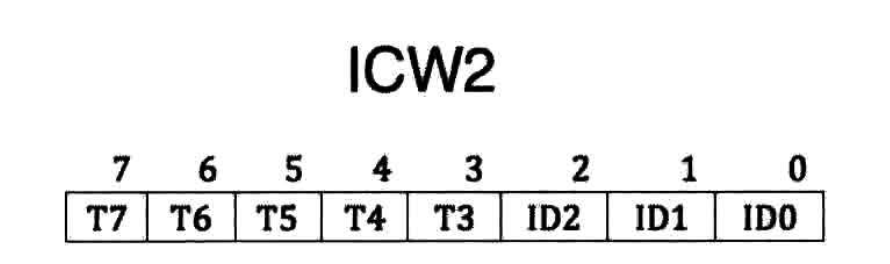
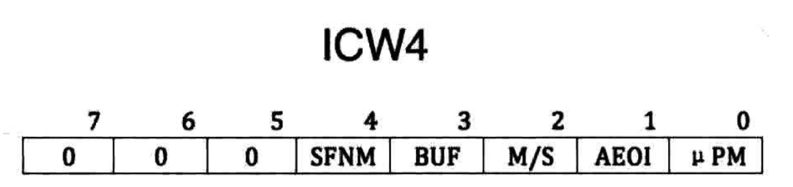
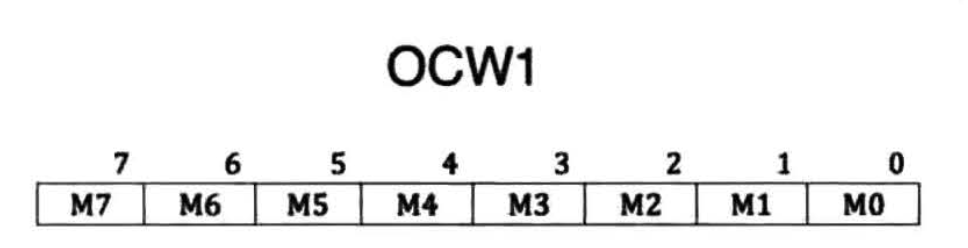
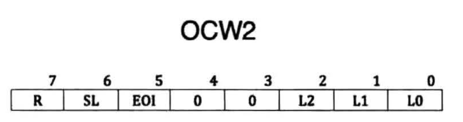
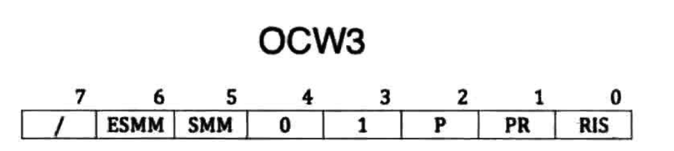

# 操作系统还原


环境准备

-----------

## 一个基本的计算机启动程序

### 环境准备
虚拟机软件：virtual box
虚拟机操作系统：Centos7
x86硬件模拟平台：Bochs
汇编语言编译器：nasm

### Centos 7 安装

```txt
注：
在后续使用过程中会出现如下报错

报错 >>PANIC<< Cannot connect to X display
原因：我没有图形界面，只有console

因为Bochs使用需要图形化界面，需要安装图形化界面，此教程安装的是最小版linux操作系统，需要安装图形界面

# Centos 7x 安装图形界面命令
yum groups install "GNOME Desktop"

# 安装后不能用远程连接，如果是最小版linux，在安装图形界面后输入指令 init 5 来重启系统进入图形界面
# 图形界面下打开终端启动bochs成功

# 还可能缺少一些库，自行安装
```

安装相关依赖
```shell
yum install -y gtk2 gtk2-devel
yum install -y libXt libXt-devel
yum install -y libXpm libXpm-devel
yum install -y SDL SDL-devel
yum install -y libXrandr-devel.x86_64
yum install -y xorg-x11-server-devel
yum install -y gcc
yum install -y gcc-c++
```

### Bochs
Bochs是一个x86硬件平台的开源模拟器

#### 安装

1. 下载版本 https://sourceforge.net/projects/bochs/files/bochs/2.6.2/ 传到linux系统上，解压
2. 配置

```txt
./configure \
--prefix=/root/bochs-2.6.2 \
--enable-debugger \
--enable-disasm \
--enable-iodebug \
--enable-x86-debugger \
--with-x \
--with-x11 \
LDFLAGS='-pthread'
```

3. 编译安装

```shell
make install
```

4. 安装中的常见错误

```txt
gtk_enh_dbg_osdep.cc:20:21: 致命错误：gtk/gtk.h：没有那个文件或目录

添加依赖
yum install -y gtk2 gtk2-devel gtk2-devel-docs

常见错误2
/usr/bin/ld: gui/libgui.a(gtk_enh_dbg_osdep.o): undefined reference to symbol 'pthread_create@@GLIBC_2.2.5'
//usr/lib64/libpthread.so.0: error adding symbols: DSO missing from command line

vim Makefile 文件， 在 92 行增加 -lphread.然后重新 make
```

#### 配置Bochs文件

share/doc/bochs/bochsrc-sample.txt 该文件有示例

bochs根目录创建文件：bochsrc.disk
```text
# 设置 Bochs 在运行过程中能够使用的内存，本例为 32MB
megs: 32

# 设置对应真实机器的 BIOS 和 VGA BIOS
romimage: file=/root/bochs/share/bochs/BIOS-bochs-latest
vgaromimage: file=/root/bochs/share/bochs/VGABIOS-lgpl-latest

# 设置 Bochs 使用的磁盘
# floppya: 1_44=a.img, status=inserted

# 选择启动盘符
boot: disk # 从硬盘启动

# 设置日志文件输出
log: bochsout.txt
# 关闭鼠标，打开键盘
mouse: enabled=0
keyboard: type=mf, serial_delay=250

# 硬盘设置
ata0: enabled=1, ioaddr1=0x1f0, ioaddr2=0x3f0, irq=14
# hd60M.img 镜像文件需要创建
# bochs根目录执行：bin/bximage -hd -mode="flat" -size=60 -q hd60M.img
ata0-master: type=disk, path="hd60M.img", mode=flat, cylinders=121, heads=16, spt=63

# 报错：Bochs is not compiled with gdbstub support
# 注释下面 不启动调试
#gdbstub: enabled=1, port=1234, text_base=0, data_base=0, bss_base=0
```

#### 启动

```shell
bin/bochs -f bochs.dsik  #运行bochs
```

#### 简单解释

```txt
You can also start bochs with the -q option to skip these menus.

1. Restore factory default configuration
2. Read options from...
3. Edit options
4. Save options to...
5. Restore the Bochs state from...
6. Begin simulation
7. Quit now

Please choose one: [6] 
00000000000i[     ] installing x module as the Bochs GUI
00000000000i[     ] using log file bochsout.txt
Next at t=0
(0) [0x0000fffffff0] f000:fff0 (unk. ctxt): jmp far f000:e05b         ; ea5be000f0
<bochs:1> 


# f000:fff0 表示cs 和 ip
# jmp far f000:e05b 执行的第一条命令 跳转到 0xfe05b

```

#### 基本使用

bochs的调试命令分为"Debugger control"类，"Execution control"类，"Breakpoint control"类，"CPU and memory control"类

- "Debugger control"类
```text
q|quit|exit 退出调试状态，关闭虚拟机
```

- "Execution control"类
```text
s|step [count] 执行count条指令
p|n|next 执行1条指令，若是函数，整个函数当作整体执行
```

- "Breakpoint control"类
```text
vb|vbreak [seg: off] 以虚拟地址添加断点，程序执行到此虚拟地址时停下来
lb|lbreak [addr] 以线性地址添加断点，程序执行到此线性地址时停下来
pb|pbreak|b|break [addr] 以物理地址添加断点，程序执行到此物理地址时会停下来
d|del|delete [n] 删除某断点
```

- "CPU and memory control"类
```text
x/nuf [line_addr] 显示线性地址的内容。n、u、f是三个参数，可选。默认n=1,u=4字节，f是十六进制
r|reg|regs|registers 显示8个通用寄存器的值 + eflag寄存器+eip寄存器
```

### nasm

#### 下载安装汇编编译器

```shell
wget https://www.nasm.us/pub/nasm/releasebuilds/2.14/nasm-2.14.tar.gz --no-check-certificate
tar -xvzf nasm-2.14.tar.gz
cd nasm-2.14
./configure
make
make install
```

#### 基本用法

```shell
nasm −f <format> <filename> [−o <output>]

# -f：用来指定编译出来的.o文件的格式。下面是nasm支持的格式，可以通过nasm -hf来查看：
# -o：用来指定编译后的文件的名称。如果不加参数，则使用原来的.asm的文件名，后缀则根据-f指定的文件格式有所不同，windows系统是.obj，unix系统是.o。
# -l：编译时生成list文件，里面包含代码和对应的机器码等内容。
# 其他参数用时再查

# 日常使用 nasm -I include/ -o mbr.bin mbr.asm
# -I path
# 把一些文件包含进来
```

### 计算机启动过程

- 为什么要载入到内存
    1. CPU的硬件电路被设计成只能运行处于内存中的程序
    2. 内存比较快，且容量大

- 什么是载入内存
    1. 程序被加载器（软件或硬件）加载到内存某个区域
    2. CPU的cs:ip寄存器被指向这个程序的起始地址

- 从按下主机power键后，第一个运行的软件就是BIOS

#### 软件接力第一棒，BIOS

BIOS 全称叫 Base Input & Output System，即基本输入输出系统。BIOS是工作在16位实模式下的

1. 实模式下的内存分布


为什么插在主板上的物理内存不是CPU眼里的“全部内存”？

在计算机中并不是只有插在主板上的内存条需要通过地址总线访问，还有一些外设同样是需要通过地址总线来访问的，这类设备还有很多呢。若把全部的地址总线都指向物理内存，那其他设备该如何访问呢？由于这个原因，只好在地址总线上提前预留出来一些地址空间给这些外设用。

1. BIOS是如何苏醒的

因为BIOS是计算机上第一个运行的软件，所以他不可能自己加载自己，它是由硬件加载的—ROM只读存储器，ROM也是一块内存，内存就需要被访问，此ROM被映射到1MB内存的顶部，即地址0xF0000~0XFFFFF处。

- BIOS是如何启动？

    1. 按下power的一瞬间，CPU的cs：ip寄存器被强制初始化为0xF000:0xFFF0，即0XFFF0，此地址便是BIOS的入口地址。
    2. CPU执行的第一条指令时jmp far f000：e05b,即跳向地址0xfe05b处，这才是BIOS代码真正开始的地方。
    3. 接下来BIOS便马不停蹄地检测内存、显卡等外设信息，当检测通过，并初始化好硬件后，开始在内存0x000~0x3FF处建立数据结构，中断向量表IVT并填写中断例程。
    4. 最后jmp 0:0x7c00 把CPU控制权交给MBR

#### 编写简单的主引导程序(MBR)

MBR的大小必须是512字节，这是为了保证0x55和0xaa这两个魔数恰好出现在该扇区的最后两个字节处，即第510字节处和511字节处

1. 简单编码主引导MBR程序

```shell
vim mbr.asm
```
```asm
; 主引导程序MBR
; SECTION是伪指令，cpu不运行，只是方便程序员规划程序分段使用
; `vstart=0x7c00`表示在程序编译时将起始地址编译为0x7c00
; SS存放栈顶的段地址，SP存放栈顶的偏移地址。在任何时刻 ，SS:SP都是指向栈顶元素 
; CS存放内存中代码段入口的段基址，CS:IP表示下一条要运行的指令内存地址   
    
; 初始化部分
SECTION MBR vstart=0x7c00 ; =前后不能有空格
	mov ax,cs			; 由于BIOS是通过`jmp 0:Ox7c00`转到MBR的，故cs此时为0
    mov ds,ax			; 段寄存器不能使用立即数进行赋值，可以使用通用寄存器ax
    mov es,ax
    mov ss,ax
    mov fs,ax
	mov sp,0x7c00
    mov ax,0xb800
    mov gs,ax
        
; 使用10号中断的0x06功能号，进行窗口上卷清屏，避免BIOS检测信息影响显示
    mov ax,0600h		; ah存放将要调用的中断子功能号
    mov bx,0700h
    mov cx,0			; (CL,CH)＝窗口左上角的（X,Y）位置
    mov dx,184fh		; (DL,DH)＝窗口右下角的（X,Y）位置(80,25)
    int 10h				; 调用中断
; 输出背景色是绿色，前景色是红色，并且跳动的字符串为“1 MBR”
    mov byte [gs:0x00],'1' 	;把字符1的ASCII写入以gs:0x00为起始，大小为1字节的内存
    mov byte [gs:0x01],0xA4	; A表示绿色背景闪烁，4表示前景色为红色
    
    mov byte [gs:0x02],' '
    mov byte [gs:0x03],0xA4
    
    mov byte [gs:0x04],'M'
    mov byte [gs:0x05],0xA4
    
    mov byte [gs:0x06],'B'
    mov byte [gs:0x07],0xA4
    
    mov byte [gs:0x08],'R'
    mov byte [gs:0x09],0xA4
    
; $表示本行指令所在的地址，$$表示本section的起始地址，$-$$表示执行代码行到段首的偏移量
	jmp $					; 在本行代码死循环
    times 510-($-$$) db 0	; 将剩余字节用0进行填充
    db 0x55,0xaa			; 最后两个字节填充MBR的标识
```

2. 编译汇编程序

```shell
nasm -o mbr.bin mbr.asm
```

3. 将编译好的二进制数据写入到用来启动的镜像文件

```shell
# 将mbr.bin写入虚拟硬盘hd60m.img
dd if=/root/bochs/mbr.bin of=/root/bochs/hd60M.img bs=512 count=1 conv=notrunc
# dd命令参数解析
# if=file       指定要读取的文件
# of=FILE       指定把数据输出到哪个文件
# bs=BYTES      指定输入块和输出块的大小(字节)
# count=BLOCKS  指定拷贝的块数
# seek=BLOCKS   指定把块输出到文件时想要跳过多少个块
# conv=CONVS    指定如何转换文件，notrunc不打断文件
```

执行结果如下：

```text
记录了1+0 的读入
记录了1+0 的写出
512字节(512 B)已复制，0.0002695 秒，1.9 MB/秒
```

5. 启动

```shell
# bochs根目录下
bin/bochs -f bochsrc.disk
```
6. 在bochs控制台输入 c + 回车 表示continue 继续下一步调试，可以看到bochs所模拟的机器开始运行了，黑窗口上会有一个绿色闪烁的字符串 '1 MBR'


### CPU的实模式

实模式是指 8086 CPU 的寻址方式、寄存器大小、指令用法等，用来反应CPU在该环境下如何工作的概念

注：名词解释
- 什么是地址
地址只是数字，描述各种符号在源程序中的位置，它是源代码文件中各符号偏移文件开头的距离。由于指令和变量所占内存大小不同，故它们相对于文件开头的偏移量参差不齐。
- 什么是section
伪指令section对程序中的地址产生任何影响，即在默认情况下，有没有section都一个样，section中数据的地址依然是相对于整个文件的顺延，仅仅是在逻辑上让开发人员梳理程序之用
- 什么是vstart
section用vstart=来修饰后，可以被赋予一个虚拟起始地址
vstart=xxxx他并不是告诉编译器加载到地址xxxx，“加载”不是它的工作，这是加载器的工作，编译器只会规划代码，编译器只负责编址
- 为什么MBR能够正常运行？
MBR用vstart=0x7c00来修饰的原因，是因为开发人员知道mbr要被加载器（BIOS）加载到物理地址0x7c00，所以说用vstart的时机是：我预先知道我的程序将来被加载到某地址处。程序只有被加载到非0地址时vstart才是有用的。

#### CPU的工作原理

CPU大体上可以分为三个部分，它们是控制单元、运算单元、存储单元
- 控制单元：控制单元是cpu的控制中心，cpu需要它的帮忙才知道自己下一步要做什么。而控制单元大致是：指令寄存器IR、指令译码器ID、指令控制器OC组成。程序被加载到内存后，指令指针寄存器IP指向内存中下一条待执行指令的地址，控制单元根据IP寄存器的指向，将位于内存中的指令逐个装在到指令寄存器中，但它还是不知道这些指令是干什么的，然后指令译码器将位于指令寄存器中的指令按照指令格式来解码，分析出操作码是什么，操作数在哪里之类
- 存储单元：存储单元是指CPU内部的L1、L2缓存及寄存器，待处理的数据就存放在这些存储单元中，这里的数据是指操作数。
- 运算单元：运算单元负责算术运算（加减乘除）和逻辑运算（比较、位移），它从控制单元那接收命令（信号），并执行

工作流程

1. 控制单元读取下一条待运行的指令，于是读取ip寄存器后，将此地址送上地址总线，CPU根据此地址便得到了指令，并将其存入指令寄存器IR中
2. 译码器根据指令格式检查指令寄存器中的指令，先确定操作码是什么，再检查操作类型，若是在内存中，就将相应操作数从内存中取回放入自己的存储单元，若操作数是在寄存器中就直接用了，免了去操作数这一过程
3. 操作码有了，操作数也齐了，操作控制器给运算单元下令开工，于是运算单元便真正开始执行指令了。ip寄存器的值被加上当前指令的大小，于是ip又指向了下一条指令，接着控制单元又要取下一条指令了，cpu便开始循环执行

#### 实模式下的寄存器

寄存器是一种物理存储元件，只不过它比一般的存储介质要快，能跟上CPU的步伐，所以在CPU内部有好多这样的寄存器来给CPU存储数据

CPU中的寄存器大致分为两大类
- 一类是其内部使用的，对程序员不可见。“是否可见”不是说寄存器能否看得见，是指程序员是否能使用。
- 另一类是对程序员可见的寄存器，我们进行汇编语言程序设计时，能够直接操作的就是这些寄存器，如段寄存器，通用寄存器


#### 实模式下CPU内存寻址方式

寻址方式，从大方向来看可以分为三大类

- 寄存器寻址：最直接的寻址方式就是寄存器寻址，它是指操作数在寄存器中，直接从寄存器中拿数据就行了。寄存器寻址也属于立即数寻址

    ```asm
    mov ax,0x10
    mov dx,0x9
    ```

- 立即数寻址：立即数就是常数。宏和标号在编译阶段会转化为数字，最终可执行文件中的依然是立即数

    ```asm
    mov ax,0x18
    mov ax,macro_selector
    mov ax,label_start
    ```

- 内存寻址 ：以上两种方式，操作数一个是在寄存器中，一个是在指令中直接给出，它们都不在内存中。操作数在内存中的寻址方式成为内存寻址。内存寻址又分为：

     - 直接寻址：直接寻址就是直接在操作数中给出的数字作为内存地址

        ```asm
        mov ax,[0x1234]
        mov ax,[fs:0x5678]
        ```

    - 基址寻址：基址寻址就是在操作数中用bx寄存器或bp寄存器作为偏移地址，bx寄存器的默认段寄存器是ds，bp默认段寄存器是ss

        ```asm
        mov ax,[bx]    ;这条指令将ds:bx的值送入ax
        ```

    - 变址寻址：变址寻址起始和基址寻址类似，只是寄存器由bx、bp换成si和di。
            
        ```asm
        mov [di],ax			 ;将寄存器ax的值存入ds：di指向的内存
        mov [si+0x1234],ax	 ;变址也可以加个偏移量
        ```

    - 基址变址寻址：基址寻址和变址寻址的结合，即基址寄存器bx或bp加一个变址寄存器si或di
            
        ```asm
        mov [bx+di],ax
        mov [bx+si],ax
        ```

#### 实模式下的ret
- ret指令的功能是，在栈顶弹出2字节的内容来替换ip寄存器
- reft指令的功能是，在栈顶弹出4字节的内容，2字节用来替换ip寄存器，另外2字节用来替换cs寄存器
- call和ret是一对配合，用于近调用和近返回。call far 和retf是一对配合，用于远调用和远返回。

#### 栈

CPU中有栈段SS寄存器和栈指针SP寄存器，他们是用来指定当前使用的栈的物理地址

- 栈的定义
    
    - 线性结构，并且数据的存取在线性结构的一端进行
    - 需要维护一个指针，用来指向线性结构的一端，数据存取都通过此指针

- 栈的应用

    - 表达式计算，如中缀表达式和后缀表达式的转换
    - 函数调用，无论是嵌套调用或递归调用，用来维护返回地址
    - 深度优先搜索算法

#### 实模式下的call

call，意味调用。在汇编语言中，用call命令实现一个函数的调用
在8086处理器中，也就是我们所说的实模式下，call指令调用函数有四种方式

1. 16位实模式相对近调用

call指令所调用的目标函数和当前的代码段是同一个段，即在同一个64KB的空间内，所以直接给出段内偏移地址就可以了，不需要提供段基址。指令格式：call near 立即数地址。near可以省略，此指令时三个字节的指令，0xe8是此操作的操作码，占一个字节，剩下两个字节便是操作数
call相对近调用发生时，CPU将当前的IP寄存器的值压入栈，再把上面计算出的地址载入IP寄存器，CPU的航线立马被改变到目标地址处。
当CPU拿到两个字节的操作数，需要将其恢复成绝对地址后方可调用，恢复方法：当前的IP指针 + 操作数 + 机器码大小 = 目标函数的绝对地址

```asm
call near near_proc ; nasm编译后就是目标地址 立即数
jmp $
addr dd 4
near_proc:
 mov ax, 0x1234
 ret
```

编译成二进制文件

```shell
nasm -o 1call.bin 1call.asm
```

查看查看文件对应的十六进制形式

```shell
xxd -u -a -g 1 -s 0 -l 13 1call.bin
# 文件13个字节， 0-13
```

输出结果：
```text
0000000: E8 06 00 EB FE 04 00 00 00 B8 34 12 C3           ..........4..

E8 06 00：表示指令，近调用。E8表示近调用，0x06操作数
EB FE：表示 jmp $ 指令，EB操作码，0xFE表示操作数，由于操作数有符号数，所以这个表示-2
04 00 00 00：表示定义四个字节的数据
B8 34 12：B8表示mov操作码，3412表示0x1234
C3：表示ret操作码
```

2. 16位实模式间接绝对近调用

和相对近调用类似，区别在于"间接"、"绝对"
间接：指目标函数的地址没有直接给出，地址要么在寄存器中，要么在内存中
绝对：指目标函数的地址是绝对地址，不像“16位相对进调用”中的那样是相对地址
指令的形式：call 寄存器寻址 或 call 内存地址

```asm
section call_test vstart=0x900
mov word [addr], near_proc ; word 16位的实模式下表示两个字节 16位
call [addr]
mov ax, near_proc
call ax
jmp $
addr dd 4
near_proc:
 mov ax, 0x1234
 ret
```

编译成二进制文件

```shell
nasm -o 2call.bin 2call.asm
```

查看查看文件对应的十六进制形式

```shell
xxd -u -a -g 1 -s 0 -l 25 2call.bin
```

输出结果

```text
0000001: 06 11 09 15 09 · 11 09 B8 15 09 FF D0 EB FE  ................
0000011: 04 00 00 00 B8 34 12 C3                          .....4..
```

3. 16位实模式直接绝对远调用

由于是远调用，所以CS和IP都要用新的，将其压入栈保留下来，先把CS压入栈再压入IP寄存器的值，用新的CS和IP即可完成call远调用。遇到retf后，将老的CS和IP值出栈即可回到调用前的下一条指令位置
此指令的操作码是0x9a，操作数占用4个字节
指令的一般形式： call far(可省略) 段基址(立即数) : 段内偏移地址(立即数)

```asm
section call_test vstart=0x900
call 0: far_proc
jmp $
far_proc:
 mov ax, 0x1234
 retf
```

编译成二进制文件

```shell
nasm -o 3call.bin 3call.asm
```

查看查看文件对应的十六进制形式

```shell
xxd -u -a -g 1 -s 0 -l 11 3call.bin
```

输出结果：

```text
0000000: 9A 07 09 00 00 EB FE B8 34 12 CB                 ........4..

9A：操作码 call
07090000：操作数 0000 ： 0907 表示地址 0x907
EB FE：jmp $的指令 jmp -2
B8：mov指令
34 12：操作数，0x1234
CB：retf
```


4. 16位实模式间接绝对远调用

与直接绝对远调用的区别是段基址和段内偏移地址不是立即数，要么在内存中要么在寄存器中，但是不支持寄存器寻址，只支持内存寻址，也就是段基址和段内偏移地址在内存中
指令格式：call far 内存寻址。

```asm
section call_test vstart=0x900
call far [addr]
jmp $
addr dw far_proc,0
far_proc:
 mov ax, 0x1234
 retf
```

编译成二进制文件

```shell
nasm -o 4call.bin 4call.asm
```

查看查看文件对应的十六进制形式

```shell
xxd -u -a -g 1 -s 0 -l 14 4call.bin
```

输出结果

```text
0000000: FF 1E 06 09 EB FE 0A 09 00 00 B8 34 12 CB        ...........4..

FF 1E：间接绝对远调用call的操作码

16位实模式下的jmp调用
jmp指令通过修改段寄存器CS和IP就可以实现程序流程的跳转，无需保存CS和IP，因为无需返回
```


#### 实模式下的jmp

无条件跳转，jmp指令通过修改CS和IP寄存器来实现跳转，跳转前无需保存CS和IP的值，所以属于无返回的跳转

一共有5类转移方式
1. 16位实模式相对短转移

既然此转移方式是“相对”，也就意味着操作数是个相对增量。所以有正有负，相对转移的机器码大小是2个字节(0xeb)，操作数为1个字节，有正负，则范围 -128 ～ 127。

```asm
section jmp_test vstart=0x900
jmp short start ;short 可以省略 该指令占三个字节，两个字节操作码0xeb，一个字节操作数
times 127 db 0 ; 定义了127个字节为0
start:
 mov ax, 0x1234
 jmp $ ; 该指令占三个字节，两个字节操作码0xeb，一个字节操作数
```

编译成二进制文件

```shell
nasm -o 1jmp.bin 1jmp.asm
```

查看查看文件对应的十六进制形式

```shell
xxd -u -a -g 1 -s 0 -l 134 1jmp.bin
```

输出结果

```text
0000000: EB 7F 00 00 00 00 00 00 00 00 00 00 00 00 00 00  ................
0000010: 00 00 00 00 00 00 00 00 00 00 00 00 00 00 00 00  ................
*
0000080: 00 B8 34 12 EB FE                                ..4...

EB：操作码jmp
7F：操作数，由于有正负，所以该数值表示的127   0111 1111：表示的是127
```


如果将上述的 127 改为 128
```asm
section jmp_test vstart=0x900
jmp short start
times 128 db 0
start:
 mov ax, 0x1234
 jmp $
```
则操作数位128，编译就会报错
1jmp.asm:2: error: short jump is out of range
1jmp.asm:2: warning: byte data exceeds bounds [-w+number-overflow]
去掉short就不会报错，改成near或者不加，让其成为相对近转移


2. 16位实模式相对近转移

和相对短转移的区别在于，操作数是占用两个字节。指令格式：jmp near 立即数地址

```asm
section jmp_test vstart=0x900
jmp near start ; near 可以省略 近转移的操作数范围：-32768 ～ 32767
times 128 db 0
start:
 mov ax, 0x1234
 jmp $
```

编译二进制文件结果：

```text
0000000: E9 80 00 00 00 00 00 00 00 00 00 00 00 00 00 00  ................
0000010: 00 00 00 00 00 00 00 00 00 00 00 00 00 00 00 00  ................
*
0000080: 00 00 00 B8 34 12 EB FE                          ....4...
```

3. 16位实模式间接绝对近转移

与相对近转移的区别在于目标地址没有直接给出，在寄存器或者内存中

```asm
section jmp_test vstart=0x900
mov ax, start
jmp near ax
times 128 db 0
start:
 mov ax, 0x1234
 jmp $
```

或者

```asm
section jmp_test vstart=0x900
mov word [addr], start
jmp near [addr]
times 128 db 0
addr dw 0
start:
 mov ax, 0x1234
 jmp $
```

4. 16位实模式直接绝对远转移

直接：操作数是立即数，拿来就用
绝对：提供的操作数是绝对地址
远：目的地址和当前指令不在同一个段，有跨段的需求，所以操作数要给出段基址和段内偏移地址
指令格式：jmp 段基址(立即数) : 段内偏移地址(立即数)

```asm
section jmp_test vstart=0x900
jmp 0: start
times 128 db 0
start:
 mov ax, 0x1234
 jmp $
```

5. 16位实模式间接绝对远转移

于直接相对绝对远调用的区别在于目标地址不是立即数，在内存中，需要CPU取
指令格式：jmp far [地址]

```asm
section jmp_test vstart=0x900
jmp far [addr]
times 128 db 0
addr dw start, 0 ; 定义了变量addr 低2个字节是偏移地址，高2字节是段基址，直接通过访问变量addr访问跳转地址
start:
 mov ax, 0x1234
 jmp $
```

#### 标志寄存器flags


1. 状态标志(Status Flags)

EFLAGS寄存器的状态标志(0、2、4、6、7以及11位)指示算术指令（如ADD, SUB, MUL以及DIV指令）的结果，这些状态标志的作用如下：

- CF(bit 0) [Carry flag] 若算术操作产生的结果在最高有效位发生进位或借位则将其置1，反之清零。这个标志指示无符号整型运算的溢出状态，这个标志同样在多倍精度运算中使用
- PF(bit 2) [Parity flag] 如果结果的最低8位包含偶数个1位则该位置1，否则清零。
- AF(bit 4) [Adjust flag] 如果算术操作在结果的第3位发生进位或借位则将该标志置1，否则清零
- ZF(bit 6) [Zero flag] 若结果为0则将其置1，反之清零。
- SF(bit 7) [Sign flag] 该标志被设置为有符号整型的最高有效位。(0指示结果为正，反之则为负)
- OF(bit 11) [Overflow flag] 如果整型结果是较大的正数或较小的负数，并且无法匹配目的操作数时将该位置1，反之清零。这个标志为带符号整型运算指示溢出状态。

2. DF标志(DF flag)

这个方向标志(位于EFLAGS寄存器的第10位)控制串指令(MOVS, CMPS, SCAS, LODS以及STOS)。设置DF标志使得串指令自动递减（从高地址向低地址方向处理字符串），清除该标志则使得串指令自动递增。STD以及CLD指令分别用于设置以及清除DF标志

3. 系统标志以及IOPL域(System Flags and IOPL Field)

EFLAGS寄存器中的这部分标志用于控制操作系统或是执行操作，它们不允许被应用程序所修改。这些标志的作用如下：

- TF(bit 8) [Trap flag] 将该位设置为1以允许单步调试模式，清零则禁用该模式。
- IF(bit 9) [Interrupt enable flag] 该标志用于控制处理器对可屏蔽中断请求的响应。置1以响应可屏蔽中断，反之则禁止可屏蔽中断。
- IOPL(bits 12 and 13) [I/O privilege level field] 指示当前运行任务的I/O特权级(I/O privilege level)，正在运行任务的当前特权级(CPL)必须小于或等于I/O特权级才能允许访问I/O地址空间。这个域只能在CPL为0时才能通过POPF以及IRET指令修改。
- NT(bit 14) [Nested task flag] 这个标志控制中断链和被调用任务。若当前任务与前一个执行任务相关则置1，反之则清零。
- RF(bit 16) [Resume flag] 控制处理器对调试异常的响应。
- VM(bit 17) [Virtual-8086 mode flag] 置1以允许虚拟8086模式，清除则返回保护模式。
- AC(bit 18) [Alignment check flag] 该标志以及在CR0寄存器中的AM位置1时将允许内存引用的对齐检查，以上两个标志中至少有一个被清零则禁用对齐检查。
- VIF(bit 19) [Virtual interrupt flag] 该标志是IF标志的虚拟镜像(Virtual image)，与VIP标志结合起来使用。使用这个标志以及VIP标志，并设置CR4控制寄存器中的VME标志就可以允许虚拟模式扩展(virtual mode extensions)
- VIP(bit 20) [Virtual interrupt pending flag] 该位置1以指示一个中断正在被挂起，当没有中断挂起时该位清零。与VIF标志结合使用。
- ID(bit 21) [Identification flag] 程序能够设置或清除这个标志指示了处理器对CPUID指令的支持。

#### 有条件转移

上面说的是无条件转移，有条件转移中的该条件就存储在flags寄存器中，有条件转移的指令族 jxx
条件转移指令jxx 一定得在某个能够影响标志位的指令之后进行

条件转移指令如下


### CPU如何与外设通信

#### IO接口

- IO接口是连接CPU与外部设备的逻辑控制部件，分为硬件和软件，硬件协调cpu和外设之间的种种不匹配，软件控制接口电路工作的驱动程序以及完成内部数据传输所需要的程序

IO接口具有的功能：
1. 设置数据缓冲；解决CPU与外设的速度不匹配。
2. 设置信号电平转换电路；CPU和外设的信号电平不同，如CPU所用的信号是TTL点平，而大多数外设用的是机电设备，故不能使用TTL电平驱动，可以在街口电路中设置电平转换电路来解决
3. 设置数据转换格式；外设多种多样的输出的信号可能是数字信号、模拟信号等，而CPU只能处理数字信号。所以接口中需要包括A/D转换器和D/A转换器。
4. 设置时序控制电路来同步CPU和外部设备；
5. 提供地址译码；CPU和多个硬件打交道，每个硬件反馈信息很多，所以一个IO接口必须包含多个端口，即IO接口上的寄存器，来存储这些信息内容。

南桥芯片，也称输入输出控制中心。他是负责仲裁每个IO接口的竞争，还要连接各种内部总线。对应的有北桥，他是负责连接高速设备如内存，南桥负责连接pci、pci-express等低速设备。

- IO接口芯片又可以按照是否可编程来分类，可分为可编程接口芯片和不可编程接口芯片

    - 不可编程接口芯片：接口的作用是连接处理器和外部设备，如果外部设备很简单，傻瓜型的，不需要设定就直接能用，就可以用不可编程接口芯片与处理器连接，不可编程接口芯片是种非常简单的IO接口。

    - 可编程接口芯片：计算机与IO接口的通信是通过计算机指令实现的，当我们需要定制某些功能时，我们也必须用计算机指令告诉IO接口，哪些设备连接在此IO接口上，此IO接口的工作模式等。这种通过软件指令选择IO接口的功能，工作模式的做法，称为“IO接口控制编程”，这通常是用端口读写指令int/out来实现的

        ```shell
        # in指令用于从端口读取数据
        in al,dx    ;in指令中，端口号只能用dx寄存器
        in ax,dx

        # out指令用于往端口写数据
        out dx,al ;out指令中，可以选用dx寄存器或立即数充当端口号
        out dx,ax
        out 立即数,al
        out 立即数,ax
        ```

- 一个IO接口包含多个端口，即IO接口上的寄存器，来存储这些信息内容，但同一时刻，只能有一个端口和CPU数据交换。
- IA32体系系统中，因为用于存储端口号的寄存器是16位的，所以最大有65536个端口，即0~65535


#### 显存、显卡、显示器

显存地址分布


显卡的文本模式也是分为多种模式的，用“列数*行数”来表示，显卡加电后，默认就置为模式80*25，也就是一屏可以打印2000个字符

即使在文本模式下，也可以打印出彩色字符。可是ASCLL码都是1字节大小，即使标准ASCLL码也要用7位来为一个字符编码，所以要用另一个字节来表示字符的属性


#### 硬盘

- 针对硬盘的IO接口是硬盘控制器，硬盘控制器同硬盘的关系，如同显卡和显示器一样，他们都是专门驱动外部设备的模块电路
- 硬盘和硬盘控制器是整合在一起的，这种接口就成为IDE，主板提供了两个IDE插槽，IDE0 和 IDE1，IDE0叫做primary通道，IDE1叫做Secondary通道，每个通道上分别有主盘master和从盘slave

让硬盘工作，我们需要通过读写硬盘控制器的端口，端口就是位于IO控制器上的寄存器，此处的端口是指硬盘控制器上的寄存器


- 端口是通道给出的，端口不是针对某块硬盘的，一个通道上的主、从两块硬盘都用这些端口号。要想操作某通道上的某块硬盘，需要单独指定(devie第4位指定主从)
- date寄存器，16位寄存器，其作用是是读取或写入数据。
- 端口0x171或0x1F1，读硬盘时叫Error寄存器，只有在读取硬盘失败时才有用，里面才会记录失败的信息。在写硬盘时叫Feature，有些命令需要指定额外参数，这些参数就写在feature寄存器中
- sector count 寄存器用来指定待读取或待写入的扇区数。硬盘每完成一个扇区，就会将此寄存器的值-1，所以如果中间失败了，此寄存器中的值便是尚未完成的扇区，这是8位寄存器，最大值为255，若指定为0，则表示要操作256个扇区
- 硬盘中的扇区在物理上是用“柱面-磁头-扇区”来定位的（Cylinder Head Sector），简称CHS，但每次都要先算出在哪个盘面，哪个柱面太麻烦了。我们希望磁盘中扇区从0开始依次递增编号，不用考虑扇区的物理结构，这就是寻址方法就是LBA，全称为逻辑块地址（Logical Block Address）
- LBA有两种，一种是LBA28，用28位来描述一个扇区地址，最大寻址范围2的28次方，每个扇区512字节，最大支持128g。另一种是LBA48，最大支持131072TB。
- LBA low寄存器用来存储28位地址的第0~7位，LBA mid用来存储第8~15位，LBA high用来存储第16~23位，还剩4位是由device寄存的低4位来存储
- device寄存器是一个杂项，8位，此寄存器低4位用来存储LBA地址的第24~27位。第4位用来指定通道上的主盘或从盘，0代表主盘，1代表从盘，第6位用来设置是否启用LBA方式，1代表启用LBA模式，0代表启用CHS模式，另外第5位和第7位固定为1，称为MBS位
- 端口0x1f7或0x177，8位，在读硬盘时叫status，用来给出硬盘的状态信息，第0位是ERR位，如果位为1，表示命令出错了，具体原因课件error寄存器。第3位是data request位，如果此位为1，表示硬盘已经把数据准备好了可以读数据了。第6位是DRDY表示硬盘就绪，此位是在对硬盘诊断时用得，表示硬盘检测正常。第7位是BSY位，表示硬盘是否繁忙，1为繁忙。其他四位不关注。在写硬盘时叫command，此寄存器用来存储让硬盘执行的命令，只要把命令写进此寄存器，硬盘就开始工作，主要试用了三个命令：
    1. identify：0xEC，即硬盘识别
    2. read sector：0x20，即读扇区
    3. write sector：0x30，即写扇区


##### 常用硬盘操作方法

1. 先选择通道，往该通道的sector count寄存器中写入待操作的扇区数
2. 往该通道上的LBA寄存器写入扇区起始地址的低24位。
3. 往device寄存器中写入LBA地址的24~27位，并置6位为1，使其为LBA模式。设置第4位，选择操作的硬盘（master硬盘或slave硬盘）
4. 往该通道上的command寄存器写入操作命令
5. 读取该通道上的status寄存器，判断硬盘工作是否完成。
6. 如果以上步骤是读硬盘，进入下一个步骤，否则，完工。
7. 将硬盘数据读出。


硬盘工作完成后它已经准备好了数据，一般常用的数据传送方式如下：
1. 无条件传送方式；硬盘不符合此方法
2. 查询传送方式
3. 中断传送方式
4. 直接存储存取方式（DMA）；单独硬件支持
5. I/O处理机传送方式；单独硬件支持

### 重改MBR实现操作显卡和加载loader

由于MBR受限于512字节大小，所以要在另一个程序中完成初始化环境及加载内核任务，这个程序我们称之为loader，即加载器。MBR负责从硬盘上把loader加载到内存，并把接力棒交给loader。

boot.inc文件
```asm
;----------- loader 和 kernel ---------
LOADER_BASE_ADDR equ 0x900
LOADER_START_SECTOR equ 0x2
```

MBR文件
```asm
; 主引导程序MBR
; SECTION是伪指令，cpu不运行，只是方便程序员规划程序分段使用
; `vstart=0x7c00`表示在程序编译时将起始地址编译为0x7c00
; SS存放栈顶的段地址，SP存放栈顶的偏移地址。在任何时刻 ，SS:SP都是指向栈顶元素 
; CS存放内存中代码段入口的段基址，CS:IP表示下一条要运行的指令内存地址
%include "boot.inc"
SECTION MBR vstart=0x7c00 ; =前后不能有空格
    mov ax,cs			; 由于BIOS是通过`jmp 0:Ox7c00`转到MBR的，故cs此时为0
    mov ds,ax			; 段寄存器不能使用立即数进行赋值，可以使用通用寄存器ax
    mov es,ax
    mov ss,ax
    mov fs,ax
	mov sp,0x7c00
    mov ax,0xb800
    mov gs,ax


mov ax,0600h		; ah存放将要调用的中断子功能号
    mov bx,0700h
    mov cx,0			; (CL,CH)＝窗口左上角的（X,Y）位置
    mov dx,184fh		; (DL,DH)＝窗口右下角的（X,Y）位置(80,25)
    int 10h				; 调用中断

; 输出背景色是绿色，前景色是红色，并且跳动的字符串为“1 MBR”
    mov byte [gs:0x00],'1' 	;把字符1的ASCII写入以gs:0x00为起始，大小为1字节的内存
    mov byte [gs:0x01],0xA4	; A表示绿色背景闪烁，4表示前景色为红色
    
    mov byte [gs:0x02],' '
    mov byte [gs:0x03],0xA4
    
    mov byte [gs:0x04],'M'
    mov byte [gs:0x05],0xA4
    
    mov byte [gs:0x06],'B'
    mov byte [gs:0x07],0xA4
    
    mov byte [gs:0x08],'R'
    mov byte [gs:0x09],0xA4

    mov eax, LOADER_START_SECTOR ;起始扇区LBA地址
    mov bx, LOADER_BASE_ADDR ;写入的地址
    mov cx, 1 ;待读入的扇区数

    call rd_disk_m_16 ;读取磁盘

    jmp LOADER_BASE_ADDR

;函数，读取硬盘n个扇区
rd_disk_m_16:
    mov esi, eax ; 保存eax
    mov di, cx ; 保存cx
    
    ; 1. 设置读取扇区数
    mov dx, 0x1f2 ;0x1f2 是IO端口，读写的功能：sector count
    mov al, cl ; 读取的扇区数
    out dx, al ; 写入读取的扇区数
    mov eax, esi ; 恢复ax

    ; 2. LBA地址存入0x1f3 ~ 0x1f6

    mov dx, 0x1f3
    out dx, al

    mov cl, 8
    shr eax, cl
    mov dx, 0x1f4
    out dx, al

    shr eax, cl
    mov dx, 0x1f5
    out dx, al

    shr eax, cl
    and al, 0x0f
    or al, 0xe0
    mov dx, 0x1f6
    out dx, al

    ; 3. 向0x1f7端口写入读入命令, 0x20是读取命令
    mov dx, 0x1f7
    mov al, 0x20
    out dx, al

    ; 4. 检查磁盘状态
.not_ready:
    nop ; 相当于sleep
    in al, dx
    and al, 0x88 ; 第三位为1表示磁盘控制器已准备好数据传输，第七位表示磁盘忙
    cmp al, 0x08 ; 
    jnz .not_ready ; 若未准备好继续等

    ; 5. 从0x1f0端口读取数据
    mov ax, di
    mov dx, 256
    mul dx
    mov cx, ax
    mov dx, 0x1f0

.go_on_read:
    in ax, dx
    mov [bx], ax
    add bx, 2
    loop .go_on_read
    ret

; $表示本行指令所在的地址，$$表示本section的起始地址，$-$$表示执行代码行到段首的偏移量
    times 510-($-$$) db 0 ; 将剩余字节用0进行填充
    db 0x55,0xaa ; 最后两个字节填充MBR的标识
```

编译，将 boot.inc 包含进来

```shell
nasm -I include/ -o mbr.bin mbr.asm
```

模拟一个loader加载器
```asm
; 内核加载器loader
%include "boot.inc"
section loader vstart=LOADER_BASE_ADDR
; 输出背景色是绿色，前景色是红色，并且跳动的字符串为“2 LOADER”
    mov byte [gs:0x00],'2'
    mov byte [gs:0x01],0xA4; A表示绿色背景闪烁，4表示前景色为红色
    
    mov byte [gs:0x02],' '
    mov byte [gs:0x03],0xA4
    
    mov byte [gs:0x04],'L'
    mov byte [gs:0x05],0xA4
    
    mov byte [gs:0x06],'O'
    mov byte [gs:0x07],0xA4
    
    mov byte [gs:0x08],'D'
    mov byte [gs:0x09],0xA4
    
    mov byte [gs:0x0a],'E'
    mov byte [gs:0x0b],0xA4
    
    mov byte [gs:0x0c],'R'
    mov byte [gs:0x0d],0xA4
    
    jmp $			; 通过死循环使程序悬停在此
```

编译，写到镜像文件的第2个扇区，第0个扇区是MBR引导程序，第1个扇区空出来
```shell
dd if=/root/bochs/loader.bin of=/root/bochs/hd60M.img bs=512 count=1 seek=2 conv=notrunc
```


## 保护模式入门

### 为什么要有保护模式

1. 实模式下操作系统和用户程序属于同一特权级
2. 用户程序所引用的地址都是指向真实物理地址的，也就是说逻辑地址等于物理地址，实实在在的指哪打哪
3. 用户程序可以自由修改段基址，可以访问所有内存
4. 访问超过64kb的内存区域时要切换段基址，转来转去容易晕乎
5. 一次只能运行一个程序，无法充分利用计算机资源
6. 共20条地址线，最大可访问的内存为1MB

### 初见保护模式
1. 保护模式之寄存器

- 保护模式大大提高了安全性，其中很大一部分的安全就体现在了内存段的描述方面，偏移地址还是和实模式下一样，但是段寄存器保存的再也不是段基址了，为了更安全添加了约束条件，这些“约束条件”便是对内存段的描述信息，由于信息太多，一个寄存器肯定放不下，所以专门找了数据结构——全局描述符表，其中每一个表项都称为段描述符，其大小为64字节，用来描述各内存段的起始地址、大小、权限等信息，全局描述符表很大所以放在内存中，由GDTR寄存器指向它。

- 段寄存器里面保存的内容叫“选择子”，selector，选择子其实就是个数，用来索引全局描述符表中的段描述符。把全局描述符表当成数组，选择子就像是数组的下标一样

2. 保护模式之寻址运行模式
```text
[bis16] 是告诉编译器，下面的代码帮我编译成16位的机器码
[bis32] 是告诉编译器，下面的代码帮我编译成32位的机器码
```

3. 保护模式之指令扩展

push虽说可以压入8位立即数，但实际上，对CPU来说，出于对齐的考虑，操作数要么是16位，要么是32位，所以8位立即数会扩展成各模式下的默认操作数宽度，即实模式下8位立即数扩展成16位后再入栈，保护模式下扩展成32位后再入栈

在实模式下：
- 当压入8位立即数时， 由于实模式下默认操作数是16位，CPU将其扩展为16后入栈，sp指针减2
- 当压入16位立即数时，CPU直接压入2字节，sp-2
- 当压入32位立即数时，CPU直接压入4字节，sp-4

在保护模式下

- 当压入8位立即数时， 由于保护模式下默认操作数是32位，CPU将其扩展为32后入栈，esp指针减4
- 当压入16位立即数时，CPU直接压入2字节，esp-2
- 当压入32位立即数时，CPU直接压入4字节，esp-4

### 全局描述符表

1. 段描述符

实模式下存在的问题：

- 实模式下的用户程序可以随意破坏存储代码的内存区域，所以要添加个内存段类型属性来阻止这种行为。
- 实模式下的用户程序和操作系统是同一级别的，所以要添加个特权级属性来阻止这种行为。

其次，是一些访问内存段的必要属性条件：

- 内存段是一片内存区域，访问内存就要提供段基址，所以要有段基址属性
- 为了限制程序访问内存的范围，还要对段大小进行约束，所以要有段界限属性


段描述符是8字节大小，图中为了方便展示，才“人为的”分成了低32位和高32位。其实他们不能分成两部分，必须是连续的8字节，这样CPU才能读取到正确的段信息

- 段基址：保护模式下地址总线宽度是32位，段基址需要用32位地址来表示
- 段界限：20位，段界限表示段边界的扩展最值。内存访问需要用到“段基址：段内偏移地址”，段界限其实是用来限制段内偏移地址的，实际的段界限边界值=（描述符中段界限+1）*（段界限的颗粒大小：4KB或1）-1


- TYEP字段：4位，用来指定本描述符的类型。段描述符在CPU眼里分为两大类，要么描述的是系统段，要么描述的是数据段，这是由段描述符中S位决定的，用它指示是否是系统段。
在CPU眼里，凡是硬件运行需要用到的东西都可以称之为系统，凡是软件（操作系统也属于软件）需要的东西都称为数据，我们主要关注非系统段
-A位表示accessed位，这是由CPU来设置的，每当该段被CPU访问后，CPU就将此位置1。
-C表示一致性代码
-R表示可读，R为1表示可读，R为0表示不可读
-X表示该段是否可执行。X为1表示可执行，0表示不可执行
-E用来标识段的扩展方向，E为0表示向上扩展，即地址越来越高，通常用于代码段和数据段。E为1表示向下扩展，地址越来越低，通常用于栈段。
-W指是否可写，W为1表示可写，0表示不可写

- S字段：S为1表示数据段，S为0表示系统段
- DPL字段：描述符特权级，这两位能表示4种特权级，分别是0、1、2、3、4级特权。数字越小权力越大
- P字段：段是否存在于内存中，存在P为1，不存在P位0。P字段是由CPU来检查的。
- AVL字段：可用的，是针对用户来说的，也就是操作系统可以随意用此位。
L字段：用来设置是否64位代码段。L为1表示64位代码段，L为0表示32位代码段
- D/B字段：用来指示有效地址（段内偏移地址）及操作数的大小。
对于代码段来说，此位是D位，若D为0，表示指令中的有效地址和操作数都是16位，指令有效地址用IP寄存器。若D为0，表示指令中的有效地址及操作数为32位，指令有效地址用EIP寄存器
- 对于栈段来说，此位是B位，用来指定操作数大小。若B为0，使用SP寄存器，也就是栈的起始地址是16位寄存器的最大寻址范围，0xFFFF。若B为1，使用的是ESP寄存器，也就是栈的起始地址是32寄存器的最大寻址范围，0xFFFFFFFF。
- G字段：粒度，它与段界限一起来决定段的大小。若G为0，表示段界限的单位是1字节，这样的段最大是2的20次方*1字节，即1MB。若G为1，表示段界限的单位是4KB，这样段最大是2的20次方*4KB，即4GB。

1. 全局描述符表GDT

段描述符存放在全局描述符表GDT中，全局描述符表位于内存中，需要专门的寄存器指向它，这个寄存器便是GDTR，专门用来存储GDT的内存地址及大小，GDTR是个48位寄存器。对此寄存器的访问用lgdt指令。


- lgdt指令格式是：lgdt 48位内存数据
- 这48位内存数据划分为两部分，其中前16位是GDT以字节为单位的界限值，其范围是2的16次方等于65536个字节，每个描述符的大小是8字节，故GDT最多可容纳的描述符数量是65536/8=8192个，即GDT中可容纳8192个段或门。后32位是GDT起始地址

3. 段选择子

- 段寄存器CS、DS、ES、FS、GS、SS，在实模式下时，段中存储的是段基址，即内存段的起始地址。而在保护模式下时，由于段基址已经存入段描述符中，所以段寄存器中再存放段基址是没有意义的，在段寄存器中存放的是一个叫做段选择子的东西——selector


- 段选择子：第0 ~ 1位用来存储RPL，表示请求特权级，表示请求别人资源的能力，也就是当前指令的特权级，他和段描述符中的DPL有所不同，DPL描述的是当前执行指令CPU所处的特权级。第2位是TI位，用来指示选择子是在GDT中，还是在LDT中索引描述符。第3~15位是描述符的索引值，用此值在GDT中索引描述符，由于选择子的索引部分是13位，即2的13次方等于8192，故最多可索引8192个段，这和GDT中最多定义8192个描述符吻合。

- 注意：GDT中的第0个段描述符是不可用的，若选择到了GDT中的第0个描述符，处理器将发出异常

4. 局部描述符表LDT
- 局部描述符表LDT，它是CPU厂商为硬件一级原生支持多任务而创造的表，按照CPU的设想，一个任务对应一个LDT。其实现代操作系统中很少有用LDT。
- CPU厂商建议每个任务的私有内存段都应该放到自己的段描述符表中，该表就是LDT。

### 打开A20地址线

实模式下内存访问是采用“段基址：段内偏移地址”的形式，如果段基址和段内偏移地址都为16位的最大值，即0xFFFF:0XFFFF，最大地址是0xFFFF0+0xFFFF=0X10FFEF。由于实模式下的地址线是20位，最大寻址空间1MB，即0x00000~0xFFFFF。超出1MB的部分在物理内存没有与之对应的部分，为了让“段基址：段内偏移地址”策略继续可用，CPU采取的做法是将超过1MB的部分自动回绕到0地址

- 如果A20Gate被打开，当访问到0x100000~0x10FFEF之间的地址时，CPU将真正访问这块物理内存。

- 如果A20Gate被禁止，当访问x100000~0x10FFEF之间的地址时，CPU将采用8086/8088的地址回绕

打开A20Gate的方式，将端口0x92第一位置1

```asm
in al,0x92
or al,0000_0010B
out 0x92,al
```

### 保护模式的开关（CR0寄存器的PE位）


- PE为0表示在实模式下运行，PE为1表示在保护模式下运行，我们需要把此位置1：
```asm
mov eax,cr0
or eax,0x00000001
mov cr0,eax
```

### 进入保护模式 Coding

- 主引导程序MBR.S

```asm
; mbr.s
; 主引导程序MBR
; SECTION是伪指令，cpu不运行，只是方便程序员规划程序分段使用
; `vstart=0x7c00`表示在程序编译时将起始地址编译为0x7c00
; SS存放栈顶的段地址，SP存放栈顶的偏移地址。在任何时刻 ，SS:SP都是指向栈顶元素 
; CS存放内存中代码段入口的段基址，CS:IP表示下一条要运行的指令内存地址
;------------------------------------------------------------
%include "boot.inc"
SECTION MBR vstart=0x7c00 ; =前后不能有空格
   mov ax,0
   mov ds,ax
   mov es,ax
   mov ss,ax
   mov fs,ax            ;将ax，dx，es，ss，fs初始化为0
   mov sp,0x7c00
   mov ax,0xb800
   mov gs,ax
  
; 清屏 利用0x06号功能，上卷全部行，则可清屏。
; -----------------------------------------------------------
;INT 0x10   功能号:0x06	   功能描述:上卷窗口
;------------------------------------------------------
;输入：
;AH 功能号= 0x06
;AL = 上卷的行数(如果为0,表示全部)
;BH = 上卷行属性
;(CL,CH) = 窗口左上角的(X,Y)位置
;(DL,DH) = 窗口右下角的(X,Y)位置
;无返回值：
   mov     ax, 0x600
   mov     bx, 0x700
   mov     cx, 0           ; 左上角: (0, 0)
   mov     dx, 0x184f	   ; 右下角: (80,25),
			   ; VGA文本模式中,一行只能容纳80个字符,共25行。
			   ; 下标从0开始,所以0x18=24,0x4f=79
   int     0x10            ; int 0x10
;输出背景色绿色，前景色红色，并且跳动的字符串”1 MBR“
   mov byte [gs:0x00],'1'
   mov byte [gs:0x01],0xA4
   
   mov byte [gs:0x02],' '
   mov byte [gs:0x03],0xA4
   
   mov byte [gs:0x04],'M'
   mov byte [gs:0x05],0xA4
   
   mov byte [gs:0x06],'B'
   mov byte [gs:0x07],0xA4
   
   mov byte [gs:0x08],'R'
   mov byte [gs:0x09],0xA4
   
   mov eax, LOADER_START_SECTOR    ;loader加载到的扇区
   mov bx , LOADER_BASE_ADDR       ;lodaer写入的地址
   mov cx , 4					   ;待读入的扇区数
   call rd_disk_m_16

   jmp LOADER_BASE_ADDR

;-----------------------------------------------
;功能：读取硬盘n个扇区
rd_disk_m_16:
;-----------------------------------------------
   mov esi,eax		;备份eax
   mov di,cx		;备份cx
;读取硬盘：
;第1步：设置要读取的扇区数
   mov dx,0x1f2
   mov al,cl
   out dx,al		;读取的扇区数
   mov eax,esi		;恢复ax
;第2步：将LBA地址存入0x1f3~0x1f6
  ;LBA地址7~0位写入0x1f3
  mov dx,0x1f3
  out dx,al
  
  ;LBA地址15~8位写入0x1f4
  mov cl,8
  shr eax,cl
  mov dx,0x1f4
  out dx,al
  
  ;LBA地址23~16位写入0x1f5
  ;mov cl,8
  shr eax,cl
  mov dx,0x1f5
  out dx,al
  
  ;LBA地址24~27位写入端口0x1f6低4位，高四位设置主盘和LBA模式
  shr eax,cl
  ;and al,0x0f
  or al,0xe0
  mov dx,0x1f6
  out dx,al
  
;第3步：向0x1f7端口写入读扇区命令，0x20
  mov dx,0x1f7
  mov al,0x20
  out dx,al

;第4步：检查硬盘状态
.not_ready:
	;0X17F同一端口，写时表示写入命令字，读时表示读入硬盘状态
	nop
	;mov dx,0x1f7
	in al,dx
	and al,0x88   ;和0x88进行与操作，保留第3位和第7位
	cmp al,0x08   ;0x08表示硬盘准备就绪
	jnz .not_ready
	

;第5步：从0x1f0端口读取数据
	mov ax,di
	mov dx,256
	mul dx
	mov cx,ax
;di为读取的扇区数，一个扇区512个字节，每次读入的两个字节共需 di*512/2次，所以是di*256
	mov dx,0x1f0
.go_on_read:
	in ax,dx
	mov [bx],ax
	add bx,2
	loop .go_on_read
	ret

   times 510-($-$$) db 0
   db 0x55,0xaa
```
- boot.inc
```asm
;boot.inc
;-------------------loader和kernel--------------------
LOADER_BASE_ADDR    equ 0x900  ;LOADER加载地址
LOADER_START_SECTOR equ 0x2	   ;LOADER开始的扇区

;------------------- gdt描述符属性 ---------------------
DESC_G_4K          equ  1_00000000000000000000000b
DESC_D_32	       equ  1_0000000000000000000000b
DESC_L		       equ  0_000000000000000000000b
DESC_AVL           equ  0_00000000000000000000b
DESC_LIMIT_CODE2   equ  1111_0000000000000000b
DESC_LIMIT_DATA2   equ  DESC_LIMIT_CODE2
DESC_LIMIT_VIDEO2  equ  0000_0000000000000000b
DESC_P 			   equ  1_000000000000000b
DESC_DPL_0		   equ  00_0000000000000b
DESC_DPL_1		   equ  01_0000000000000b
DESC_DPL_2         equ  10_0000000000000b
DESC_DPL_3         equ  11_0000000000000b
DESC_S_CODE        equ  1_000000000000b
DESC_S_DATA		   equ  DESC_S_CODE
DESC_S_SYS         equ  0_000000000000b
DESC_TYPE_CODE	   equ  1000_00000000b
;代码段可执行的，非一致性，不可读，已访问位a清0
DESC_TYPE_DATA     equ  0010_00000000b
;数据段不可执行的，向上扩展，可写，已访问位a清0

DESC_CODE_HIGH4    equ (0x00<<24) + DESC_G_4K + DESC_D_32 + DESC_L + DESC_AVL + DESC_LIMIT_CODE2 + DESC_P + DESC_DPL_0 + DESC_S_CODE + DESC_TYPE_CODE+ 0x00

DESC_DATA_HIGH4    equ (0x00<<24) + DESC_G_4K + DESC_D_32 + DESC_L + DESC_AVL + DESC_LIMIT_DATA2 + DESC_P + DESC_DPL_0 + DESC_S_DATA + DESC_TYPE_DATA+ 0x00

DESC_VIDEO_HIGH4   equ (0x00<<24) + DESC_G_4K + DESC_D_32 + DESC_L + DESC_AVL + DESC_LIMIT_VIDEO2 + DESC_P + DESC_DPL_0 + DESC_S_DATA + DESC_TYPE_DATA+ 0x0b

;----------------------选择子属性-------------------
RPL0   equ 00b
RPL1   equ 01b
RPL2   equ 10b
RPL3   equ 11b
TI_GDT equ 000b
TI_LDT equ 100b
```

- loader.s
```asm
;loader.s

%include "boot.inc"
section loader vstart=LOADER_BASE_ADDR
LOADER_STACK_TOP equ LOADER_BASE_ADDR
jmp near loader_start 		    	; 此处的物理地址是:0x900
   
;构建gdt及其内部的描述符
   GDT_BASE:   		  dd    0x00000000 
	       	   		  dd    0x00000000

   CODE_DESC:  		  dd    0x0000FFFF 
	           		  dd    DESC_CODE_HIGH4

   DATA_STACK_DESC:  dd    0x0000FFFF
		    		 dd    DESC_DATA_HIGH4

   VIDEO_DESC: 		 dd    0x80000007	       ;limit=(0xbffff-0xb8000)/4k=0x7
	       			 dd    DESC_VIDEO_HIGH4  ; 此时dpl已改为0

   GDT_SIZE   equ   $ - GDT_BASE  ;GDT的大小
   GDT_LIMIT   equ   GDT_SIZE -	1  ;GDT的界限
   
   times 60 dq 0					 ; 此处预留60个描述符的slot
   SELECTOR_CODE equ (0x0001<<3) + TI_GDT + RPL0         ; 相当于(CODE_DESC - GDT_BASE)/8 + TI_GDT + RPL0
   SELECTOR_DATA equ (0x0002<<3) + TI_GDT + RPL0	 ; 同上
   SELECTOR_VIDEO equ (0x0003<<3) + TI_GDT + RPL0	 ; 同上 

   ;以下是定义gdt的指针，前2字节是gdt界限，后4字节是gdt起始地址

   gdt_ptr  dw  GDT_LIMIT 
	    dd  GDT_BASE
   loadermsg db '2 loader in real.'

loader_start:
; 打印 '2 loader in real.'
    mov sp, LOADER_BASE_ADDR
    mov bp, loadermsg
    mov cx, 17
    mov ax, 0x1301
    mov bx, 0x001f
    mov dx, 0x1800
    int 0x10

; 以下是打印LOADER字符闪烁
;   mov byte [gs:0xA0],'L'
;   mov byte [gs:0xA1],0xA4
;   
;   mov byte [gs:0xA2],'O'
;   mov byte [gs:0xA3],0xA4
;   
;   mov byte [gs:0xA4],'A'
;   mov byte [gs:0xA5],0xA4
;   
;   mov byte [gs:0xA6],'D'
;   mov byte [gs:0xA7],0xA4
;   
;   mov byte [gs:0xA8],'E'
;   mov byte [gs:0xA9],0xA4
;   
;   mov byte [gs:0xAA],'R'
;   mov byte [gs:0xAB],0xA4

;----------------------------------------   准备进入保护模式   ------------------------------------------
									;1 打开A20
									;2 加载gdt
									;3 将cr0的pe位置1


   ;-----------------  打开A20  ----------------
   in al,0x92
   or al,0000_0010B
   out 0x92,al

   ;-----------------  加载GDT  ----------------
   lgdt [gdt_ptr]


   ;-----------------  cr0第0位置1  ----------------
   mov eax, cr0
   or eax, 0x00000001
   mov cr0, eax
   

   jmp  dword SELECTOR_CODE:p_mode_start ; 刷新流水线，避免分支预测的影响,这种cpu优化策略，最怕jmp跳转，
					     ; 这将导致之前做的预测失效，从而起到了刷新的作用。
                         ;解决了两个问题： 
                         ;1. CPU采用的是流水线指令间重叠执行
                         ;2. 已经进入了32位保护模式，而段寄存器还是16位实模式，其实存的是20位的实际地址，其他的高位都是零，保护模式下段寄存器存的是选择子，所以需要刷新下段寄存器的值，jmp远跳指令就可以刷新

[bits 32]
p_mode_start:
   mov ax, SELECTOR_DATA
   mov ds, ax
   mov es, ax
   mov ss, ax
   mov esp,LOADER_STACK_TOP
   mov ax, SELECTOR_VIDEO
   mov gs, ax

   mov byte [gs:0x140], 'P'

   jmp $
```


### 处理器微架构

1. 流水线

CPU的指令执行过程分为取指令、译码、执行三个步骤，它的时序是时钟周期。
流水线的设计，让CPU在同一个时钟周期能够完成第一条指令的执行，第二条指令的译码，第三条指令的取指令。

2. 乱序执行

指CPU中运行的指令并不是按照代码中的执行顺序，而是按照一定策略打乱顺序执行，也许后面的指令先执行，得保证指令之间不具备相关性。乱序执行的好处就是后面的操作可以放到前面来做，利于装载到流水线上提高效率。

3. 缓存

缓存的原理是用一些存取速度较快的存储设备作为数据缓冲区，避免频繁访问速度较慢的低俗设备
根据程序的局部性原理采取缓存政策。局部性原理是：程序90%的时间都运行在程序中10%的代码上。
局部性分为：
- 时间局部性：最近访问过的指令和数据，在将来一段时间内依然经常访问
- 空间局部性：靠近当前访问内存空间的内存地址，在将来一段时间也会被访问
典型例子：高级语言写的循环嵌套代码

4. 分支预测

CPU中的指令是在流水线上执行的，当处理器遇到一个分支指令时，根据预测策略把相应的指令放到流水线上，如果预测成功直接执行，反之预测失败，直接清空流水线上错误的指令，在把正确的指令加到流水线即可。

#### 使用远跳转指令清空流水线，更新段描述符缓冲器

段描述符缓冲器未更新，它的值还是实模式下的值，进入保护模式后需要填入正确的信息。
段描述符缓冲寄存器在CPU的实模式和保护模式中都同时使用，在不重新引用一个段时，段描述符缓冲器中的内容是不会更新的，无论是实模式还是保护模式下，CPU都以段描述符缓冲寄存器中的内容为主。实模式进入保护模式时，由于段描述符缓冲寄存器中的内容仅仅是实模式下的20位的段基址，很多属性位都是错误的值，这对保护模式来说必然是错误，所以需要马上更新段描述符缓冲寄存器，也就是要想办法往相应段寄存器中加载选择子。
只有用远过程调用指令call、远转移指令jmp、远返回指令retf等指令间接改变段寄存器cs的值，没有直接改变cs的办法。遇到jmp指令时，之前已经送上流水线的指令都会被清空，所以jmp指令有清空流水线的神奇功效

### 保护模式之内存段的保护

1. 向段寄存器加载选择子时的保护

当引用一个内存段时，实际上就是往段寄存器中加载一个选择子，为了避免出现非法引用内存段的情况，在这时候，处理器会在以下几方面做检查。

- 首先根据选择子的值验证段描述符是否超越界限。
    描述符表基地址+选择子中的索引值*8+7 <= 描述符表基地址+描述符表界限值
    检查过程如下：处理器先检查TI的值，如果TI是0，则从全局描述符表寄存器GDTR中拿到GDT基地址和GDT界限值。如果TI是1，则从局部描述符表寄存器LDTR中拿到LDT基地址和LDT界限值。有了描述符表基地址和描述符表界限值后，把选择子的高13位代入上面的表达式，若不成立，处理器则抛出异常。

    

- 在选择子检查后，就要检查段的类型了(段描述符中type字段)

    - 只有具备可执行属性的段（代码段）才能加载到 CS 段寄存器中。
    - 只具备执行属性的段（代码段）不允许加载到除 CS 外的段寄存器中。
    - 只有具备可写属性的段（数据段）才能加载到 SS 栈段寄存器中。
    - 至少具备可读属性的段才能加载到 DS、ES、FS、GS 段寄存器中。

- 在检查完type后，还会检查段是否存在(段描述符中的P位)
    CPU 通过段描述符中的 P 位来确认内存段是否存在，如果P 位为 1，则表示存在。这时候就可以将选择子载入段寄存器了，同时段描述符缓冲寄存器也会更新为选择子对应的段描述符的内容，随后处理器将段描述符中的 A 位置为1，表示已经访问过了。如果 P 位为 0，则表示该内存段不存在，不存在的原因可能是由于内存不足，操作系统将该段移出内存转储到硬盘上了。这时候处理器会抛出异常，自动转去执行相应的异常处理程序，异常处理程序将段从硬盘加载到内存后并将 P 位置为 1，随后返回。CPU 继续执行刚才的操作，判断 P 位。

2. 代码段和数据段的保护

对于代码段和数据段来说，CPU每访问一个地址，都要确认该地址不能超过其所在内存段的范围。

- 实际段界限的值为：（描述符中段界限+1）*（段界限的粒度大小：4k或者1）-1
- 对于G位为1的4K粒度大小的段公式为：（描述符中段界限+1）4k-1 = 描述符中段界限4k-4k-1 = 描述符中段界限 *0x1000+0xFFF
- 实际的段界限大小，是段内最后一个可访问的有效地址。由于有了段界限的限制，我们给CPU提交的每一个内存地址，无论是指令地址，还是数据地址，CPU都要帮我们检查地址的有效性。首先地址指向的数据是有宽度的，CPU要保证该数据一定要落在段内，不能“骑”在段边界上。
- 对于数据段和代码段的访问，都要用“段基址：段内偏移地址”的形式
- 对于代码段要满足的条件：EIP中的偏移地址+指令长度-1 <= 实际段界限大小。如果不满足条件，指令未完整的落在本段内，CPU则会抛出异常。
- 对于数据段要满足的条件：偏移地址+数据长度-1 <= 实际段界限大小。如果不满足条件，数据未完整的落在本段内，CPU则会抛出异常。

```text
例如：
假设数据段描述符的段界限是 0x12345，段基址为 0x00000000。
如果 G 位为 0，那么实际段界限便是 0x12345。如果 G 位为 1，那么实际段界限便是 0x12345* 0x1000+0xFFF=0x12345FFF。如果访问的数据地址是 0x12345FFF，还要看访问的数据宽度。若数据大小是 1 字节，如 mov ax，byte [0x12345fff]，这种内存操作一点问题都没有，数据完全在实际段界限之内。若该数据大小是 2 字节，如 mov ax，word [0x12345fff]，这种内存操作超过了实际的段界限，数据所在地址分别是 0x12345FFF 和 0x12346000 这两个字节，CPU 会抛异常。
```

3. 栈段的保护

- 虽然段描述符type中的e位用来表示段的扩展方向，但它和别的描述符属性一样，仅仅是用来描述段的性质，即使e=1向下扩展，依然可以引用不断向上递增的内存地址，即使e=0向上扩展，也依然可以引用不断向下递增的内存地址。栈顶指针esp的值逐渐降低，这是push指令的作用，与描述符是否向下扩展无关，也就是说，是数据段就可以用作栈。

- CPU对数据的检查，其中一项就是看地址是否超越界限。段的扩展方向决定了CPU对数据的检查方式：

    1. 对于向上扩展的段，实际的段界限是段内可以访问的最后一个字节（上一节数据段的方式来检查，偏移地址+数据段长度-1 <= 实际段界限大小）

    

    2. 对于向下扩展的段，即栈段。段界限本质上就是段的范围大小，范围没有负数只说。栈的段界限是以栈段的基址为准的，并不是栈底，因此栈的段界限肯定是位于栈顶之下。为了避免碰撞，将段界限地址+1视为栈可以访问的下限。段界限+1，才是栈指针可达的下边界。

- 32位保护模式下栈的栈顶指针是esp，栈的操作数大小是由B位决定的，假设B=1，表示32位操作数，所以栈指针最大可访问的地址是0xFFFFFFFF
- 每次向栈段中压入数据时就是CPU检查栈段的时机，它必须满足：实际段界限+1 <= esp-操作数大小 <= 0xFFFFFFFF


### 保护模式进阶，向内核迈进

#### 获取物理内存容量

Linux获取内存的方法很多，如果一种方法失败自动切换到其他方法尝试，本质上都是通过调用BIOS中断0x15实现的，而0x15中断又分为三个子功能，子功能号要放到寄存器EAX或AX中，如下：
- EAX=0xE820：遍历主机上的全部内存。
- AX=0xE801：分辨检测低15MB和16MB～4GB的内存，最大支持4GB。
- AH=0x88：最多检测出64MB内存，实际内存超过此容量也按照64MB返回。

##### 利用BIOS中断0x15子功能0xE820获取内存
BIOS中断0x15的子功能0xE820能够获取系统的内存布局，每次BIOS只返回一种类型的内存信息，直到将所有内存类型返回完毕。内存信息的内容是用地址范围描述符来描述的，用于存储这种描述符的结构称之为地址范围描述符(ARDS)


- 此结构中的字段都是4字节大小，共5个字段，所以此结构大小为20字节。每次int 0x15之后，BIOS就返回这样一个结构的数据。
- 注意：ARDS结构中用64位来描述这段内存的基地址及其长度。但由于我们在32位环境下工作，所以在ARDS结构属性中，我们只用到低32位，即BaseAddrLow + LengthLow是一片内存区域的上限。type字段用来描述这段内存的类型（内存的用途）


为什么BIOS会按类型来返回内存信息呢？原因是这段内存可能是：
- 系统的ROM
- ROM用到了这部分内存
- 设备内存映射到了这部分内存。
- 由于某种原因，这段内存不适合标准设备使用


1. 填写好“调用前输入”中列出的寄存器
2. 执行中断调用int 0x15
3. 在CF位为0表示未出错，“返回后输出”中对应的寄存器便会有对应结果

##### 利用BIOS中断0x15子功能0xE801获取内存

此方法最大只能识别4GB内存，检测到的内存分别放到两组寄存器中。低于15MB的内存以1KB为单位大小来记录，单位数量在AX和CX中记录，AX和CX值是一样的，16MB~4GB是以64KB为单位来记录的，单位数量在寄存器BX和DX中记录，BX和DX的值是一样的


- 此方法检测到的内存会小于实际内存1MB，所以在检测结果的基础上一定要加1MB

##### 利用BIOS中断0x15子功能0x88获取内存

该方法最大只能识别64MB的内存，又因为中断只会显示1MB之上的内存，所以只会显示63M内存，所以算出来的内存需要再+1MB = 实际内存大小


为了更好的执行程序，将之前的代码粘贴至此，有些许改动，在代码中体现

mbr.s代码如下：
```asm
; mbr.s
; 主引导程序MBR
; SECTION是伪指令，cpu不运行，只是方便程序员规划程序分段使用
; `vstart=0x7c00`表示在程序编译时将起始地址编译为0x7c00
; SS存放栈顶的段地址，SP存放栈顶的偏移地址。在任何时刻 ，SS:SP都是指向栈顶元素 
; CS存放内存中代码段入口的段基址，CS:IP表示下一条要运行的指令内存地址
;------------------------------------------------------------
%include "boot.inc"
SECTION MBR vstart=0x7c00 ; =前后不能有空格
   mov ax,0
   mov ds,ax
   mov es,ax
   mov ss,ax
   mov fs,ax            ;将ax，dx，es，ss，fs初始化为0
   mov sp,0x7c00
   mov ax,0xb800
   mov gs,ax
  
; 清屏 利用0x06号功能，上卷全部行，则可清屏。
; -----------------------------------------------------------
;INT 0x10   功能号:0x06	   功能描述:上卷窗口
;------------------------------------------------------
;输入：
;AH 功能号= 0x06
;AL = 上卷的行数(如果为0,表示全部)
;BH = 上卷行属性
;(CL,CH) = 窗口左上角的(X,Y)位置
;(DL,DH) = 窗口右下角的(X,Y)位置
;无返回值：
   mov     ax, 0x600
   mov     bx, 0x700
   mov     cx, 0           ; 左上角: (0, 0)
   mov     dx, 0x184f	   ; 右下角: (80,25),
			   ; VGA文本模式中,一行只能容纳80个字符,共25行。
			   ; 下标从0开始,所以0x18=24,0x4f=79
   int     0x10            ; int 0x10
;输出背景色绿色，前景色红色，并且跳动的字符串”1 MBR“
   mov byte [gs:0x00],'1'
   mov byte [gs:0x01],0xA4
   
   mov byte [gs:0x02],' '
   mov byte [gs:0x03],0xA4
   
   mov byte [gs:0x04],'M'
   mov byte [gs:0x05],0xA4
   
   mov byte [gs:0x06],'B'
   mov byte [gs:0x07],0xA4
   
   mov byte [gs:0x08],'R'
   mov byte [gs:0x09],0xA4
   
   mov eax, LOADER_START_SECTOR    ;loader加载到的扇区
   mov bx , LOADER_BASE_ADDR       ;lodaer写入的地址
   mov cx , 4					   ;待读入的扇区数
   call rd_disk_m_16

   jmp LOADER_BASE_ADDR + 0x300 ; --------------------------------- 修改点

;-----------------------------------------------
;功能：读取硬盘n个扇区
rd_disk_m_16:
;-----------------------------------------------
   mov esi,eax		;备份eax
   mov di,cx		;备份cx
;读取硬盘：
;第1步：设置要读取的扇区数
   mov dx,0x1f2
   mov al,cl
   out dx,al		;读取的扇区数
   mov eax,esi		;恢复ax
;第2步：将LBA地址存入0x1f3~0x1f6
  ;LBA地址7~0位写入0x1f3
  mov dx,0x1f3
  out dx,al
  
  ;LBA地址15~8位写入0x1f4
  mov cl,8
  shr eax,cl
  mov dx,0x1f4
  out dx,al
  
  ;LBA地址23~16位写入0x1f5
  ;mov cl,8
  shr eax,cl
  mov dx,0x1f5
  out dx,al
  
  ;LBA地址24~27位写入端口0x1f6低4位，高四位设置主盘和LBA模式
  shr eax,cl
  ;and al,0x0f
  or al,0xe0
  mov dx,0x1f6
  out dx,al
  
;第3步：向0x1f7端口写入读扇区命令，0x20
  mov dx,0x1f7
  mov al,0x20
  out dx,al

;第4步：检查硬盘状态
.not_ready:
	;0X17F同一端口，写时表示写入命令字，读时表示读入硬盘状态
	nop
	;mov dx,0x1f7
	in al,dx
	and al,0x88   ;和0x88进行与操作，保留第3位和第7位
	cmp al,0x08   ;0x08表示硬盘准备就绪
	jnz .not_ready
	

;第5步：从0x1f0端口读取数据
	mov ax,di
	mov dx,256
	mul dx
	mov cx,ax
;di为读取的扇区数，一个扇区512个字节，每次读入的两个字节共需 di*512/2次，所以是di*256
	mov dx,0x1f0
.go_on_read:
	in ax,dx
	mov [bx],ax
	add bx,2
	loop .go_on_read
	ret

   times 510-($-$$) db 0
   db 0x55,0xaa
```
boot.inc文件代码：
```asm
;boot.inc
;-------------------loader和kernel--------------------
LOADER_BASE_ADDR    equ 0x900  ;LOADER加载地址
LOADER_START_SECTOR equ 0x2	   ;LOADER开始的扇区

;------------------- gdt描述符属性 ---------------------
DESC_G_4K          equ  1_00000000000000000000000b
DESC_D_32	       equ  1_0000000000000000000000b
DESC_L		       equ  0_000000000000000000000b
DESC_AVL           equ  0_00000000000000000000b
DESC_LIMIT_CODE2   equ  1111_0000000000000000b
DESC_LIMIT_DATA2   equ  DESC_LIMIT_CODE2
DESC_LIMIT_VIDEO2  equ  0000_0000000000000000b
DESC_P 			   equ  1_000000000000000b
DESC_DPL_0		   equ  00_0000000000000b
DESC_DPL_1		   equ  01_0000000000000b
DESC_DPL_2         equ  10_0000000000000b
DESC_DPL_3         equ  11_0000000000000b
DESC_S_CODE        equ  1_000000000000b
DESC_S_DATA		   equ  DESC_S_CODE
DESC_S_SYS         equ  0_000000000000b
DESC_TYPE_CODE	   equ  1000_00000000b
;代码段可执行的，非一致性，不可读，已访问位a清0
DESC_TYPE_DATA     equ  0010_00000000b
;数据段不可执行的，向上扩展，可写，已访问位a清0

DESC_CODE_HIGH4    equ (0x00<<24) + DESC_G_4K + DESC_D_32 + DESC_L + DESC_AVL + DESC_LIMIT_CODE2 + DESC_P + DESC_DPL_0 + DESC_S_CODE + DESC_TYPE_CODE+ 0x00

DESC_DATA_HIGH4    equ (0x00<<24) + DESC_G_4K + DESC_D_32 + DESC_L + DESC_AVL + DESC_LIMIT_DATA2 + DESC_P + DESC_DPL_0 + DESC_S_DATA + DESC_TYPE_DATA+ 0x00

DESC_VIDEO_HIGH4   equ (0x00<<24) + DESC_G_4K + DESC_D_32 + DESC_L + DESC_AVL + DESC_LIMIT_VIDEO2 + DESC_P + DESC_DPL_0 + DESC_S_DATA + DESC_TYPE_DATA+ 0x0b

;----------------------选择子属性-------------------
RPL0   equ 00b
RPL1   equ 01b
RPL2   equ 10b
RPL3   equ 11b
TI_GDT equ 000b
TI_LDT equ 100b
```

loader.s代码如下：
```asm
;loader.s

%include "boot.inc"
section loader vstart=LOADER_BASE_ADDR
LOADER_STACK_TOP equ LOADER_BASE_ADDR
;jmp near loader_start 		    	; ---------------- 改动点删除掉了，有mbr程序直接跳转到该指定的位置
   
;构建gdt及其内部的描述符
   GDT_BASE:   		  dd    0x00000000 
	       	   		  dd    0x00000000

   CODE_DESC:  		  dd    0x0000FFFF 
	           		  dd    DESC_CODE_HIGH4

   DATA_STACK_DESC:   dd    0x0000FFFF
		    		  dd    DESC_DATA_HIGH4

   VIDEO_DESC: 		  dd    0x80000007	       ;limit=(0xbffff-0xb8000)/4k=0x7
	       			  dd    DESC_VIDEO_HIGH4   ; 此时dpl已改为0

   GDT_SIZE          equ   $ - GDT_BASE        ;GDT的大小
   GDT_LIMIT         equ   GDT_SIZE -	1      ;GDT的界限
   
   times 60 dq 0			                   ; 此处预留60个描述符的空位
   SELECTOR_CODE equ (0x0001<<3) + TI_GDT + RPL0      ; 相当于(CODE_DESC - GDT_BASE)/8 + TI_GDT + RPL0
   SELECTOR_DATA equ (0x0002<<3) + TI_GDT + RPL0	  ; 同上
   SELECTOR_VIDEO equ (0x0003<<3) + TI_GDT + RPL0	  ; 同上 

;total_mem_bytes用于保存内存容量，以字节为单位，此地址是0xb00
	total_mem_bytes dd 0

;以下是定义gdt的指针，前2字节是gdt界限，后4字节是gdt起始地址
   gdt_ptr  dw  GDT_LIMIT 
	        dd  GDT_BASE

;人工对齐：total_mem_bytes4+gdt_ptr6+ards_buf244+ard_nr2,共256字节
			ards_buf times 244 db 0
			ards_nr  dw  0          ;用于记录ARDS结构体数量

loader_start:
;-------  int 15h eax = 0000E820h ,edx = 534D4150h ('SMAP') 获取内存布局  -------

   xor ebx, ebx		           ;第一次调用时，ebx值要为0
   mov edx, 0x534d4150	       ;edx只赋值一次，循环体中不会改变
   mov di, ards_buf	           ;ards结构缓冲区
.e820_mem_get_loop:	           ;循环获取每个ARDS内存范围描述结构
   mov eax, 0x0000e820	       ;执行int 0x15后,eax值变为0x534d4150,所以每次执行int前都要更新为子功能号。
   mov ecx, 20		           ;ARDS地址范围描述符结构大小是20字节
   int 0x15
   jc .e820_failed_so_try_e801 ;若cf位为1则有错误发生，尝试0xe801子功能
   add di, cx		           ;使di增加20字节指向缓冲区中新的ARDS结构位置
   inc word [ards_nr]	       ;记录ARDS数量
   cmp ebx, 0		           ;若ebx为0且cf不为1,这说明ards全部返回，当前已是最后一个
   jnz .e820_mem_get_loop

;在所有ards结构中，找出(base_add_low + length_low)的最大值，即内存的容量。
   mov cx, [ards_nr]	      ;遍历每一个ARDS结构体,循环次数是ARDS的数量
   mov ebx, ards_buf 
   xor edx, edx		      ;edx为最大的内存容量,在此先清0
.find_max_mem_area:	      ;无须判断type是否为1,最大的内存块一定是可被使用
   mov eax, [ebx]	      ;base_add_low
   add eax, [ebx+8]	      ;length_low
   add ebx, 20		      ;指向缓冲区中下一个ARDS结构
   cmp edx, eax		      ;冒泡排序，找出最大,edx寄存器始终是最大的内存容量
   jge .next_ards
   mov edx, eax		      ;edx为总内存大小
.next_ards:
   loop .find_max_mem_area
   jmp .mem_get_ok

;------  int 15h ax = E801h 获取内存大小,最大支持4G  ------
; 返回后, ax cx 值一样,以KB为单位,bx dx值一样,以64KB为单位
; 在ax和cx寄存器中为低16M,在bx和dx寄存器中为16MB到4G。
.e820_failed_so_try_e801:
   mov ax,0xe801
   int 0x15
   jc .e801_failed_so_try88   ;若当前e801方法失败,就尝试0x88方法

;1 先算出低15M的内存,ax和cx中是以KB为单位的内存数量,将其转换为以byte为单位
   mov cx,0x400	     ;cx和ax值一样,cx用做乘数
   mul cx 
   shl edx,16
   and eax,0x0000FFFF
   or edx,eax
   add edx, 0x100000 ;ax只是15MB,故要加1MB
   mov esi,edx	     ;先把低15MB的内存容量存入esi寄存器备份

;2 再将16MB以上的内存转换为byte为单位,寄存器bx和dx中是以64KB为单位的内存数量
   xor eax,eax
   mov ax,bx		
   mov ecx, 0x10000	;0x10000十进制为64KB
   mul ecx		;32位乘法,默认的被乘数是eax,积为64位,高32位存入edx,低32位存入eax.
   add esi,eax		;由于此方法只能测出4G以内的内存,故32位eax足够了,edx肯定为0,只加eax便可
   mov edx,esi		;edx为总内存大小
   jmp .mem_get_ok

;-----------------  int 15h ah = 0x88 获取内存大小,只能获取64M之内  ----------
.e801_failed_so_try88: 
   ;int 15后，ax存入的是以kb为单位的内存容量
   mov  ah, 0x88
   int  0x15
   jc .error_hlt
   and eax,0x0000FFFF
      
   ;16位乘法，被乘数是ax,积为32位.积的高16位在dx中，积的低16位在ax中
   mov cx, 0x400     ;0x400等于1024,将ax中的内存容量换为以byte为单位
   mul cx
   shl edx, 16	     ;把dx移到高16位
   or edx, eax	     ;把积的低16位组合到edx,为32位的积
   add edx,0x100000  ;0x88子功能只会返回1MB以上的内存,故实际内存大小要加上1MB

.mem_get_ok:
   mov [total_mem_bytes], edx	 ;将内存换为byte单位后存入total_mem_bytes处。
;----------------------------------------   准备进入保护模式   ------------------------------------------
									;1 打开A20
									;2 加载gdt
									;3 将cr0的pe位置1


   ;-----------------  打开A20  ----------------
   in al,0x92
   or al,0000_0010B
   out 0x92,al

   ;-----------------  加载GDT  ----------------
   lgdt [gdt_ptr]


   ;-----------------  cr0第0位置1  ----------------
   mov eax, cr0
   or eax, 0x00000001
   mov cr0, eax
   
; 刷新流水线，避免分支预测的影响,这种cpu优化策略，最怕jmp跳转
; 这将导致之前做的预测失效，从而起到了刷新的作用。   
	jmp  dword SELECTOR_CODE:p_mode_start	    

.error_hlt:		      ;出错则挂起
   hlt
[bits 32]
p_mode_start:
   mov ax, SELECTOR_DATA
   mov ds, ax
   mov es, ax
   mov ss, ax
   mov esp,LOADER_STACK_TOP
   mov ax, SELECTOR_VIDEO
   mov gs, ax

   mov byte [gs:160], 'P'

   jmp $
```

编译两个程序mbr.s和loader.s

```shell
nasm -I include/ -o mbr.bin mbr.s
nasm -I include/ -o loader.bin loader.s
```

将两个程序写入到硬盘中

```shell
dd if=/root/bochs/mbr.bin of=/root/bochs/hd60M.img bs=512 count=1 conv=notrunc
dd if=/root/bochs/loader.bin of=/root/bochs/hd60M.img bs=512 count=2 seek=2 conv=notrunc
```

启动bochs

```text
bin/bochs -f bochsrc.disk

<bochs:1> c
# 在命令窗口Ctrl+C中断bochs运行
^CNext at t=120667878
(0) [0x000000000ce6] 0008:00000ce6 (unk. ctxt): jmp .-2 (0x00000ce6)      ; ebfe
<bochs:2> xp 0xb00 ; 再输入xp 0xb00回车
[bochs]:
0x00000b00 <bogus+       0>:	0x02000000
# 该大小就是32M，就是bochs配置文件中配置的32M megs: 32
# 查询到total_mem_bytes处为0x2000000，转换后正好是32MB
<bochs:3> 
```

#### 启用分页机制

内存为什么要分页
- 分页机制让程序可以在逻辑上连续、物理上离散
- 提供虚拟地址，解决内存不足的问题


##### 一级页表

- 尽管在保护模式中段寄存中的内容已经是选择子，但选择子最终也就是为了要找到段基址，其内存访问的核心机制依然是“段基址：段内偏移地址”，这两个地址相加就是线性地址，线性地址是物理地址。段基址和段内偏移地址相加求和的工作是由CPU段部件自动完成的。


- 如果打开了分页机制，段部件输出的线性地址就不再等同于物理地址了，我们称之为虚拟地址，它是逻辑上的，是假的，不应该被送上地址总线（因为地址只是个数字，任何数字都可以当做地址，这里说的“不应该”是指应该人为保证送上地址总线上的数字是正确的地址）。CPU必须拿到物理地址才行，此虚拟地址对应的物理地址需要在页表中查找，这项工作是由页部件自动完成的


- 经过段部件的处理后，保护模式的寻址空间是4GB，这个寻址空间是指线性地址空间，它在逻辑上是连续的。分页机制的思想是：通过映射，可以使连续的线性地址与任意物理内存地址相关联，逻辑上连续的线性地址其对应的物理地址可以不连续

1. 分页机制的原理

分页机制的作用有两方面：
- 将线性地址转换成物理地址。
- 用大小相等的页代替大小不等的段。


代码段和数据段在逻辑上被拆分成以页为单位的小内存块。这时的虚拟地址虚如其名，不能存放任何数据。接着操作系统开始为这些虚拟内存页分配真实的物理内存页，它查找物理内存中可用的页，然后在页表中 登记这些物理页地址，这样就完成了虚拟页到物理页的映射，每个进程都以为自己独享 4GB 地址空间。

2. 页表的结构


- 32 位地址表示 4GB 空间，可以将 32 位地址分成高低两部分，低地址部分是内存块大小，高地址部分是内存块数量，它们是这样一种关系：内存块数*内存块大小=4GB。滑块指向第12位，内存块大小则为2的12次方，即4KB，内存块数量则为2的20次方 1M，即1048576个。这里所说的内存块，其官方名称是页， CPU中采用的页大小恰恰就是 4KB。
- 右边第 11 ~ 0位用来表示页的大小，也就是这12位可以作为页内寻址，寻址范围4KB。左边第31~12位用来表示页的数量，同样这20位也用来索引一个页(索引范围 0~Oxfffff)，表示第几个页。

- 页是地址空间的计量单位，并不是专属物理地址或线性地址，只要是4KB的地址空间都可以称为一页，所以线性地址的一页也要对应物理地址的一页。一页大小为4KB，4GB地址空间被划分成 4GB/4KB=1M 个页，也就是 4GB 空间中可以容纳 1048576 个页，页表中自然也要有 1048576 个页表项，这就是一级页表。


- 地址转换过程原理如下
一个页表项对应一个页，所以用线性地址的高20位作为页表项的索引，每个页表项要占用4字节大小，所以这高20位的索引乘以4后才是该页表项相对于页表物理地址的字节偏移量。用cr3寄存器中的页表物理地址加上此偏移量便是该页表项的物理地址，从该页表项中得到映射的物理页地址，然后用线性地址的低12位与该物理页地址相加，所得的地址之和便是最终要访问的物理地址。


##### 二级页表

有了一级页表，为什么还要二级页表呢？
1. 一级页表中最多可容纳1M（1048576）个页表项，每个页表项是4字节，如果页表项全满的话，便是4MB大小。
2. 一级页表中所有页表项必须要提交前建好，原因是操作系统要占用4GB虚拟地址空间的高1GB，用户进程要占用低3GB
3. 每个进程都有自己的页表，进程一多，光是页表占用的空间就很可观了。

归根结底，我们要解决的是：不要一次性地将全部页表建好，需要时动态创建页表项。


- 无论几级页表，页的尺寸都是4KB，所以4GB线性地址空间最多有1M个页。一级页表是将这1M个页放置到一张页表中，二级页表是将这1M个页放置到1K个页表中。每个页表中包含有1K个页表项。页表项是4KB大小，页表包含1K个页表项，故页表大小为4KB，这恰恰是一个标准页的大小。
- 专门有个页目录来存储这些也表，每个页表的物理地址在页目录表中都以页目录项的形式存储，页目录表也是4KB大小
- 页目录表中共1024个页表，也就是有1024个页目录项。一个页目录项中记录一个页表物理页地址，物理页地址是指页的物理地址，在页目录项及页表项中记录的都是页的物理地址，页大小都是Ox1OOO，即4096，因此页地址是以000为结尾的十六进制数字。 每个页表中有1024个页表项，每个页表项中是一个物理页地址，最终数据写在这页表项中指定的物理页中。页表项中分配的物理页地址在真正物理内存中离散分布，毫无规律可言，操作系统负责这些物理页的分配与释放。由于页目录表和页表本身都要占用内存，且为4KB大小，故它们也会由操作系统在物理内存中分配一物理页存放。图中最粗的线存放页目录表物理页，稍细一点的线指向的是用来存放页表的物理页，其他最细的线是页表项中分配的物理页，页表结构本身与其他数据混布渗透在物理内存中，页表所占用的物理页在外在形式上与其他数据占用的物理页没有什么不同，只有CPU知道它们的作用不同。页表在建立之初，物理内存各部分的布局还是相对较整洁的，随着操作系统分配或释放内存的动作越来越频繁，物理内存的布局将更加零散。

- 二级页表地址转换原理是将32位虚拟地址拆分成高10位、中间10位、低12位三部分，它们的作用是：高10位作为页表的索引，用于在页目录表中定位一个页目录项PDE，页目录项中有页表物理地址，也就是定位到了某个页表。中间10位作为物理页的索引，用于在页表内定位到某个页表项PTE，页表项中有分配的物理页地址，也就是定位到了某个物理页。低 12位作为页内偏移量用于在已经定位到的物理页内寻址。
- 转换过程背后的具体步骤如下
1. 用虚拟地址的高 10 位乘以4，作为页目录表内的偏移地址，加上页目录表的物理地址，所得的和，便是页目录项的物理地址。读取该页目录项，从中获取到页表的物理地址。
2. 用虚拟地址的中间 10 位乘以4，作为页表内的偏移地址，加上在第 1 步中得到的页表物理地址， 所得的和，便是页表项的物理地址。读取该页表项，从中获取到分配的物理页地址。
3. 虚拟地址的高 10 位和中间 10 位分别是 PDE 和 PIE 的索引值，所以它们需要乘以4。但低12位就不是索引值啦，其表示的范围是0~Oxfff，作为页内偏移最合适，所以虚拟地址的低12位加上第2步中得到的物理页地址，所得的和便是最终转换的物理地址。
这种自动化较强的工作，还是由页部件自动完成的。


目录项和页表项中的都是物理页地址，标准页大小是4KB，故地址都是4K的倍数，也就是地址的低12位是0，所以只需要记录物理地址高20位就可以啦。这样省出来的12位（第 0～11 位）可以用来添加其他属性


- P：存在位。若为 1 表示该页存在于物理内存中，若为 0 表示该表不在物理内存中。操作系统的页式虚拟内存管理便是通过 P 位和相应的 pagefault 异常来实现的。
- RW：读写位。若为 1 表示可读可写，若为 0 表示可读不可写。
- US：普通用户/超级用户位。若为 1 时，表示处于 User 级，任意级别（0、1、2、 3）特权的程序都可以访问该页。若为 0，表示处于Supervisor 级，特权级别为 3 的程序不允许访问该页，该页只允许特权级别为 0、1、2 的程序可以访问。
- PWT：页级通写位，也称页级写透位。若为 1 表示此项采用通写方式，表示该页不仅是普通内存，还是高速缓存。此项和高速缓存有关，“通写”是高速缓存的一种工作方式，本位用来间接决定是否用此方式改善该页的访问效率。这里咱们直接置为 0 就可以啦。
- PCD：页级高速缓存禁止位。若为 1 表示该页启用高速缓存，为 0 表示禁止将该页缓存。这里咱们将其置为 0。
- A，访问位。若为 1 表示该页被 CPU 访问过啦，所以该位是由 CPU 设置的。还记得段描述符中的 A 位和 P 位吗？这两位在一起可以实现段式虚拟内存管理。和它们一样，这里页目录项和页表项中的 A 位也可以用来记录某一内存页的使用频率（操作系统定期将该位清 0，统计一段时间内变成 1 的次数），从而当内存不足时，可以将使用频率较低的页面换出到外存（如硬盘），同时将页目录项或页表项的 P位置 0，下次访问该页引起 pagefault 异常时，中断处理程序将硬盘上的页再次换入，同时将 P 位置 1。
- D，Dirty，意为脏页位。当 CPU 对一个页面执行写操作时，就会设置对应页表项的 D 位为 1。此项仅针对页表项有效，并不会修改页目录项中的 D 位。
- PAT，Page Attribute Table，意为页属性表位，能够在页面一级的粒度上设置内存属性。比较复杂，将
此位置 0 即可。
- G,Global，意为全局位。由于内存地址转换也是颇费周折，先得拆分虚拟地址，然后又要查页目录，又要查页表的，所以为了提高获取物理地址的速度，将虚拟地址与物理地址转换结果存储在 TLB（Translation Lookaside Buffer）中，TLB 以后咱们会细说。在此先知道 TLB 是用来缓存地址转换结果的高速缓存就 ok 啦。此 G 位用来指定该页是否为全局页，为 1 表示是全局页，为 0 表示不是全局页。若为全局页，该页将在高速缓存 TLB 中一直保存，给出虚拟地址直接就出物理地址啦，无需那三步骤转换。由于 TLB 容量比较小（一般速度较快的存储设备容量都比较小），所以这里面就存放使用频率较高的页面。顺便说一句，清空 TLB 有两种方式，一是用 invlpg 指令针对单独虚拟地址条目清理，或者是重新加载 cr3 寄存器，这将直接清空 TLB。
- AVL：可用软件，操作系统可用该位，CPU 不理会该位的值，那咱们也不理会吧。

.png)
控制寄存器有cr0 ~ cr7，cr3寄存器是其中之一，控制寄存器 cr3 用于存储页表物理地址，所以 cr3 寄存器又称为页目录基址寄存器( Page Directorγ Base Register, PDBR)

规划页表之操作系统与用户进程关系

- 页表的设计是内存分布来决定的，在用户进程4GB虚拟地址空间的高3GB以上的部分划分给操作系统，0~3GB是用户进程自己的虚拟空间。
- 为了实现操共享操作系统，让所有用户进程3GB ~ 4GB的虚拟地址空间都指向同一个操作系统，也就是所有进程的虚拟地址3GB ~ 4GB本质上都是指向同一片物理地址，只要保证所有用户进程虚拟地址空间 3GB ~ 4GB 对应的页表项中所记录的物理页地址是相同的就行啦。

```text
0~1G： 0x00000000~0x3FFFFFFFF
1~2G： 0x40000000~0x7FFFFFFFF
2~3G： 0x80000000~0xBFFFFFFFF
3~4G： 0xC0000000~0xFFFFFFFFF
```

启用分页机制，我们要按顺序做好三件事
1. 准备好页目录表及页表
2. 将页表地址写入控制寄存器cr3
3. 寄存器cr0的PG位置1

分页机制得有页目录表，页目录表中的是页目录项，其中记录的是页表的物理地址及相关属性，所以还得有页表。我们实际的页目录表及页表也将按照此空间位置部署，地址的最下面是页目录表，往上依次是页表。


页目录表的位置，我们就放在物理地址 Ox1OOOOO 处。为了让页表和页目录表紧凑一些(这不是必须的)，咱们让页表紧挨着页目录表。页目录本身占4KB，所以第一个页表的物理地址是 Ox1O1OOO


loader.s 的完整代码
```asm
%include "boot.inc"
   section loader vstart=LOADER_BASE_ADDR
   LOADER_STACK_TOP equ LOADER_BASE_ADDR
   
;构建gdt及其内部的描述符
   GDT_BASE:   dd    0x00000000 
	       dd    0x00000000

   CODE_DESC:  dd    0x0000FFFF 
	       dd    DESC_CODE_HIGH4

   DATA_STACK_DESC:  dd    0x0000FFFF
		     dd    DESC_DATA_HIGH4

   VIDEO_DESC: dd    0x80000007	       ; limit=(0xbffff-0xb8000)/4k=0x7
	       dd    DESC_VIDEO_HIGH4  ; 此时dpl为0

   GDT_SIZE   equ   $ - GDT_BASE
   GDT_LIMIT   equ   GDT_SIZE -	1 
   times 60 dq 0					 ; 此处预留60个描述符的空位(slot)
   SELECTOR_CODE equ (0x0001<<3) + TI_GDT + RPL0         ; 相当于(CODE_DESC - GDT_BASE)/8 + TI_GDT + RPL0
   SELECTOR_DATA equ (0x0002<<3) + TI_GDT + RPL0	 ; 同上
   SELECTOR_VIDEO equ (0x0003<<3) + TI_GDT + RPL0	 ; 同上 

   ; total_mem_bytes用于保存内存容量,以字节为单位,此位置比较好记。
   ; 当前偏移loader.bin文件头0x200字节,loader.bin的加载地址是0x900,
   ; 故total_mem_bytes内存中的地址是0xb00.将来在内核中咱们会引用此地址
   total_mem_bytes dd 0					 
   ;;;;;;;;;;;;;;;;;;;;;;;;;;;;;;;;;;;;;;;;;;;;;;;;;;;;

   ;以下是定义gdt的指针，前2字节是gdt界限，后4字节是gdt起始地址
   gdt_ptr  dw  GDT_LIMIT 
	    dd  GDT_BASE

   ;人工对齐:total_mem_bytes4字节+gdt_ptr6字节+ards_buf244字节+ards_nr2,共256字节
   ards_buf times 244 db 0
   ards_nr dw 0		      ;用于记录ards结构体数量

   loader_start:
   
;-------  int 15h eax = 0000E820h ,edx = 534D4150h ('SMAP') 获取内存布局  -------

   xor ebx, ebx		      ;第一次调用时，ebx值要为0
   mov edx, 0x534d4150	      ;edx只赋值一次，循环体中不会改变
   mov di, ards_buf	      ;ards结构缓冲区
.e820_mem_get_loop:	      ;循环获取每个ARDS内存范围描述结构
   mov eax, 0x0000e820	      ;执行int 0x15后,eax值变为0x534d4150,所以每次执行int前都要更新为子功能号。
   mov ecx, 20		      ;ARDS地址范围描述符结构大小是20字节
   int 0x15
   jc .e820_failed_so_try_e801   ;若cf位为1则有错误发生，尝试0xe801子功能
   add di, cx		      ;使di增加20字节指向缓冲区中新的ARDS结构位置
   inc word [ards_nr]	      ;记录ARDS数量
   cmp ebx, 0		      ;若ebx为0且cf不为1,这说明ards全部返回，当前已是最后一个
   jnz .e820_mem_get_loop

;在所有ards结构中，找出(base_add_low + length_low)的最大值，即内存的容量。
   mov cx, [ards_nr]	      ;遍历每一个ARDS结构体,循环次数是ARDS的数量
   mov ebx, ards_buf 
   xor edx, edx		      ;edx为最大的内存容量,在此先清0
.find_max_mem_area:	      ;无须判断type是否为1,最大的内存块一定是可被使用
   mov eax, [ebx]	      ;base_add_low
   add eax, [ebx+8]	      ;length_low
   add ebx, 20		      ;指向缓冲区中下一个ARDS结构
   cmp edx, eax		      ;冒泡排序，找出最大,edx寄存器始终是最大的内存容量
   jge .next_ards
   mov edx, eax		      ;edx为总内存大小
.next_ards:
   loop .find_max_mem_area
   jmp .mem_get_ok

;------  int 15h ax = E801h 获取内存大小,最大支持4G  ------
; 返回后, ax cx 值一样,以KB为单位,bx dx值一样,以64KB为单位
; 在ax和cx寄存器中为低16M,在bx和dx寄存器中为16MB到4G。
.e820_failed_so_try_e801:
   mov ax,0xe801
   int 0x15
   jc .e801_failed_so_try88   ;若当前e801方法失败,就尝试0x88方法

;1 先算出低15M的内存,ax和cx中是以KB为单位的内存数量,将其转换为以byte为单位
   mov cx,0x400	     ;cx和ax值一样,cx用做乘数
   mul cx 
   shl edx,16
   and eax,0x0000FFFF
   or edx,eax
   add edx, 0x100000 ;ax只是15MB,故要加1MB
   mov esi,edx	     ;先把低15MB的内存容量存入esi寄存器备份

;2 再将16MB以上的内存转换为byte为单位,寄存器bx和dx中是以64KB为单位的内存数量
   xor eax,eax
   mov ax,bx		
   mov ecx, 0x10000	;0x10000十进制为64KB
   mul ecx		;32位乘法,默认的被乘数是eax,积为64位,高32位存入edx,低32位存入eax.
   add esi,eax		;由于此方法只能测出4G以内的内存,故32位eax足够了,edx肯定为0,只加eax便可
   mov edx,esi		;edx为总内存大小
   jmp .mem_get_ok

;-----------------  int 15h ah = 0x88 获取内存大小,只能获取64M之内  ----------
.e801_failed_so_try88: 
   ;int 15后，ax存入的是以kb为单位的内存容量
   mov  ah, 0x88
   int  0x15
   jc .error_hlt
   and eax,0x0000FFFF
      
   ;16位乘法，被乘数是ax,积为32位.积的高16位在dx中，积的低16位在ax中
   mov cx, 0x400     ;0x400等于1024,将ax中的内存容量换为以byte为单位
   mul cx
   shl edx, 16	     ;把dx移到高16位
   or edx, eax	     ;把积的低16位组合到edx,为32位的积
   add edx,0x100000  ;0x88子功能只会返回1MB以上的内存,故实际内存大小要加上1MB

.mem_get_ok:
   mov [total_mem_bytes], edx	 ;将内存换为byte单位后存入total_mem_bytes处。


;-----------------   准备进入保护模式   -------------------
;1 打开A20
;2 加载gdt
;3 将cr0的pe位置1

   ;-----------------  打开A20  ----------------
   in al,0x92
   or al,0000_0010B
   out 0x92,al

   ;-----------------  加载GDT  ----------------
   lgdt [gdt_ptr]

   ;-----------------  cr0第0位置1  ----------------
   mov eax, cr0
   or eax, 0x00000001
   mov cr0, eax

   jmp dword SELECTOR_CODE:p_mode_start	     ; 刷新流水线，避免分支预测的影响,这种cpu优化策略，最怕jmp跳转，
					     ; 这将导致之前做的预测失效，从而起到了刷新的作用。
.error_hlt:		      ;出错则挂起
   hlt

[bits 32]
p_mode_start:
   mov ax, SELECTOR_DATA
   mov ds, ax
   mov es, ax
   mov ss, ax
   mov esp,LOADER_STACK_TOP
   mov ax, SELECTOR_VIDEO
   mov gs, ax


;-------------   开始创建页目录及页表   ---------------
   ; 创建页目录及页表并初始化页内存位图
   call setup_page

   ;要将描述符表地址及偏移量写入内存gdt_ptr,一会用新地址重新加载
   sgdt [gdt_ptr]	      ; 存储到原来gdt所有的位置

   ;将gdt描述符中视频段描述符中的段基址+0xc0000000
   mov ebx, [gdt_ptr + 2]  
   or dword [ebx + 0x18 + 4], 0xc0000000      ;视频段是第3个段描述符,每个描述符是8字节,故0x18。
					      ;段描述符的高4字节的最高位是段基址的31~24位

   ;将gdt的基址加上0xc0000000使其成为内核所在的高地址
   add dword [gdt_ptr + 2], 0xc0000000

   add esp, 0xc0000000        ; 将栈指针同样映射到内核地址

   ; 把页目录地址赋给cr3
   mov eax, PAGE_DIR_TABLE_POS
   mov cr3, eax

   ; 打开cr0的pg位(第31位)
   mov eax, cr0
   or eax, 0x80000000
   mov cr0, eax

   ;在开启分页后,用gdt新的地址重新加载
   lgdt [gdt_ptr]             ; 重新加载

   mov byte [gs:160], 'V'     ;视频段段基址已经被更新,用字符v表示virtual addr

   jmp $

;-------------   创建页目录及页表的函数   ---------------
setup_page:
;先把页目录占用的空间逐字节清0
   mov ecx, 4096
   mov esi, 0
.clear_page_dir:
   mov byte [PAGE_DIR_TABLE_POS + esi], 0
   inc esi
   loop .clear_page_dir

;开始创建页目录项(PDE)
.create_pde:				     ; 创建Page Directory Entry
   mov eax, PAGE_DIR_TABLE_POS
   add eax, 0x1000 			     ; 此时eax为第一个页表的位置及属性
   mov ebx, eax				     ; 此处为ebx赋值，是为.create_pte做准备，ebx为基址。

;   下面将页目录项0和0xc00都存为第一个页表的地址，
;   一个页表可表示4MB内存,这样0xc03fffff以下的地址和0x003fffff以下的地址都指向相同的页表，
;   这是为将地址映射为内核地址做准备
   or eax, PG_US_U | PG_RW_W | PG_P	     ; 页目录项的属性RW和P位为1,US为1,表示用户属性,所有特权级别都可以访问.
   mov [PAGE_DIR_TABLE_POS + 0x0], eax       ; 第1个目录项,在页目录表中的第1个目录项写入第一个页表的位置(0x101000)及属性(7)
   mov [PAGE_DIR_TABLE_POS + 0xc00], eax     ; 一个页表项占用4字节,0xc00表示第768个页表占用的目录项,0xc00以上的目录项用于内核空间,
					     ; 也就是页表的0xc0000000~0xffffffff共计1G属于内核,0x0~0xbfffffff共计3G属于用户进程.
   sub eax, 0x1000
   mov [PAGE_DIR_TABLE_POS + 4092], eax	     ; 使最后一个目录项指向页目录表自己的地址

;下面创建页表项(PTE)
   mov ecx, 256				     ; 1M低端内存 / 每页大小4k = 256
   mov esi, 0
   mov edx, PG_US_U | PG_RW_W | PG_P	     ; 属性为7,US=1,RW=1,P=1
.create_pte:				     ; 创建Page Table Entry
   mov [ebx+esi*4],edx			     ; 此时的ebx已经在上面通过eax赋值为0x101000,也就是第一个页表的地址 
   add edx,4096
   inc esi
   loop .create_pte

;创建内核其它页表的PDE
   mov eax, PAGE_DIR_TABLE_POS
   add eax, 0x2000 		     ; 此时eax为第二个页表的位置
   or eax, PG_US_U | PG_RW_W | PG_P  ; 页目录项的属性US,RW和P位都为1
   mov ebx, PAGE_DIR_TABLE_POS
   mov ecx, 254			     ; 范围为第769~1022的所有目录项数量
   mov esi, 769
.create_kernel_pde:
   mov [ebx+esi*4], eax
   inc esi
   add eax, 0x1000
   loop .create_kernel_pde
   ret
```

boot.inc 的全部代码
```asm
;-------------	 loader和kernel   ----------

LOADER_BASE_ADDR equ 0x900 
LOADER_START_SECTOR equ 0x2
KERNEL_BIN_BASE_ADDR equ 0x70000
KERNEL_IMAGE_BASE_ADDR  equ   0x1500
KERNEL_START_SECTOR equ 0x9

PAGE_DIR_TABLE_POS equ 0x100000

;--------------   gdt描述符属性  -------------
DESC_G_4K   equ	  1_00000000000000000000000b   
DESC_D_32   equ	   1_0000000000000000000000b
DESC_L	    equ	    0_000000000000000000000b	;  64位代码标记，此处标记为0便可。
DESC_AVL    equ	     0_00000000000000000000b	;  cpu不用此位，暂置为0  
DESC_LIMIT_CODE2  equ 1111_0000000000000000b
DESC_LIMIT_DATA2  equ DESC_LIMIT_CODE2
DESC_LIMIT_VIDEO2  equ 0000_000000000000000b
DESC_P	    equ		  1_000000000000000b
DESC_DPL_0  equ		   00_0000000000000b
DESC_DPL_1  equ		   01_0000000000000b
DESC_DPL_2  equ		   10_0000000000000b
DESC_DPL_3  equ		   11_0000000000000b
DESC_S_CODE equ		     1_000000000000b
DESC_S_DATA equ	  DESC_S_CODE
DESC_S_sys  equ		     0_000000000000b
DESC_TYPE_CODE  equ	      1000_00000000b	;x=1,c=0,r=0,a=0 代码段是可执行的,非依从的,不可读的,已访问位a清0.  
DESC_TYPE_DATA  equ	      0010_00000000b	;x=0,e=0,w=1,a=0 数据段是不可执行的,向上扩展的,可写的,已访问位a清0.

DESC_CODE_HIGH4 equ (0x00 << 24) + DESC_G_4K + DESC_D_32 + DESC_L + DESC_AVL + DESC_LIMIT_CODE2 + DESC_P + DESC_DPL_0 + DESC_S_CODE + DESC_TYPE_CODE + 0x00
DESC_DATA_HIGH4 equ (0x00 << 24) + DESC_G_4K + DESC_D_32 + DESC_L + DESC_AVL + DESC_LIMIT_DATA2 + DESC_P + DESC_DPL_0 + DESC_S_DATA + DESC_TYPE_DATA + 0x00
DESC_VIDEO_HIGH4 equ (0x00 << 24) + DESC_G_4K + DESC_D_32 + DESC_L + DESC_AVL + DESC_LIMIT_VIDEO2 + DESC_P + DESC_DPL_0 + DESC_S_DATA + DESC_TYPE_DATA + 0x0b

;--------------   选择子属性  ---------------
RPL0  equ   00b
RPL1  equ   01b
RPL2  equ   10b
RPL3  equ   11b
TI_GDT	 equ   000b
TI_LDT	 equ   100b


;----------------   页表相关属性    --------------
PG_P  equ   1b
PG_RW_R	 equ  00b 
PG_RW_W	 equ  10b 
PG_US_S	 equ  000b 
PG_US_U	 equ  100b 
```

编译两个程序loader.s

```shell
nasm -I include/ -o loader.bin loader.s
```

将这个程序写入到硬盘中

```shell
dd if=/root/bochs/loader.bin of=/root/bochs/hd60M.img bs=512 count=3 seek=2 conv=notrunc
```
运行

#### 快表TLB

每一个虚拟地址到物理地址的转换都要经过PDE、PTE等查表计算出物理地址，转换过程中频繁的内存访问，使得地址转换速度慢上加慢，而处理器也不得不停下来等待内存的响应。如果给出一个虚拟地址后能直接得到相应的页框物理地址，免去中间的查表过程，直接用虚拟地址的低12位在该物理页框中寻址，
岂不是大大提高了地址转换速度。处理器准备了一个高速缓存，可以匹配高速的处理器速率和低速的内存访问速度，它专门用来存放虚拟地址页框与物理地址页框的映射关系，这个调整缓存就是 TLB，即Translation Lookaside Buffer，俗称快表。
TLB 中的条目是虚拟地址的高 20 位到物理地址高 20 位的映射结果，实际上就是从虚拟页框到物理页框的映射。除此之外 TLB 中还有一些属性位，比如页表项的 RW 属性。

- 高速缓存由于成本等原因，容量一般都很小，TLB 也是，因此 TLB 中的数据只是当前任务的部分页表，而且只有 P 位为 1 的页表项才有资格在 TLB 中，如果 TLB 被装满了，需要将很少使用的条目换出。

- TLB 的维护工作交给操作系统开发人员，由开发人员于动控制。维护页表的代码是开发人员自己写的，他们肯定知道何时修改了页表，或是修改了哪些条目。

- 尽管 TLB 对开发人员不可见，但依然有两种方法可以间接更新 TLB
    - 一个是针对 TLB 中所有条目的方法一一重新加载CR3
    - 处理器提供了指令 invlpg (invalidate page)，它用于在 TLB 中刷新某个虚拟地址对应的条目


### 加载内核

#### 用C语言写内核

C语言程序要经过编译成汇编代码，然后再由汇编生成二进制的目标文件，再将目标文件链接成二进制的可执行文件。文件的链接过程才分配地址。

一条C语言代码，会被翻译成1条或者多条汇编语言，而一条汇编代码几乎一对一的对应机器指令。

用gcc编译程序：gcc -m32 -c -o 输出文件 源文件
-c的作用是编译、汇编到目标代码，不进行链接，也就是直接生成目标文件。
-o的作用是将输出的文件以指定文件名来存储，有同名文件存在时直接覆盖。

链接：ld -m elf_i386 源文件 -Ttext 起始虚拟地址 -e main -o 输出文件
-Ttext：指定起始虚拟地址
-o：将输出的文件以指定文件名来存储，有同名文件存在时直接覆盖。
-e：指定程序的起始地址，起始地址可是是数字形式的地址，也可以是符号名。默认 _start 。

#### elf格式的二进制文件


- 程序最重要的的部分就是段（segment）和节（section），它们是真正的程序体，是真真切切的程序资源。段是由节组成的，多个节经过链接之后就被合成一个段。段和节的信息也是用header来描述的，程序头是program header，节头是section header。
- 程序头表（program header table）和节头表（section header table）里存储的是多个程序头（segment）和多个节头（section）的信息。
- elf header 这个数据结构用来描述程序头表和节头表的大小及位置信息。


1. elf header


- e_ident[16]
- e_type占用2个字节，是用来指定elf目标文件的类型
- e_machine占用2个字节，用来描述elf目标文件的体系结构类型，也就是说该文件要在哪种平台(哪种机器)上才能运行。
- e_version：占用4个字节，用来表示版本信息
- e_entry：占用4个字节，用来指明操作系统运行该程序时，将控制权转交到的虚拟地址。
- e_phoff：占用4个字节，用来指明程序头表（program header table）在文件内的字节偏移量。如果没有程序头表，该值为0
- e_shoff：占用4个字节，用来指明节头表（section header table）在文件内的字节偏移量。若没有节头表，该值为0
- e_flags：占用4个字节，用来指明与处理器相关的标志。
- e_ehsize：占用 2 个字节，用来指明 elf header 的字节大小。
- e_phentsize：占用2个字节，用来指明程序头表（program header table）中每个条目（entry）的字节大小，即每个用来描述段信息的数据结构的字节大小
- e_phnum ：占用 2 个字节，用来指明程序头表中条目的数量。实际上就是段的个数。
- e_phentsize：占用2个字节，用来指明节头表（section header table）中每个条目（entry）的字节大小，即每个用来描述节信息的数据结构的字节大小。
- e_shnum：占用2个字节，用来指明节头表中条目的数量。实际上就是节的个数。
- e_shstrndx：占用2个字节，用来指明string name table在节头表中的索引index。

程序头表中的条目的数据结构elf32_phdr，这是用来描述各个段的信息用的

- p_type：占用4个字节，用来指明程序中该段的类型
- p_offset：占用4个字节，用来指明本段在文件内的起始偏移字节
- p_vaddr：占用4个字节，用来指明本段在内存中的起始虚拟地址
- p_paddr：占用4个字节，仅用于与物理地址相关的系统中，因为System V忽略用户程序中所有的物理地址，所以此项暂且保留，未设定。
- p_filesz：占用4个字节，用来指明本段在文件中的大小
- p_memsz：占用4个字节，用来指明本段在内存中的大小
- p_flags：占用4个字节，用来指明与本段相关的标志
- p_align：占用4个字节，用来指明本段在文件和内存中的对齐方式。如果值为0或1，则表示不对齐。否则则p_align应该是2的幂次数

注：nm命令可查看任何文件的符号，nm code.elf

#### 将内核文件载入内存

将内核代码编译后复制到镜像文件中去
```shell
# 写"内核"代码
vim main.c

# int main(void) {
#    while(1);
#}

# 编译
gcc -m32 -c -o main.o main.c 
# 链接
ld -m elf_i386 main.o -Ttext 0xc0001500 -e main -o kernel.bin 
# 将内核文件kernel.bin，把内核文件写入硬盘第9个扇区，以0开始
dd if=kernel.bin of=/root/bochs/hd60M.img bs=512 count=200 seek=9 conv=notrunc
```

- 内核很小，只需要在低端1MB内存就够了，内存被加载到内存后，loader还要通过分析其elf结构将其展开到新的位置，所以说内核在内存中有两份拷贝，一份是elf格式的源文件kernel.bin，另外一份loader解析elf格式的kernel.bin后在内存中生成内核映像(也就是将程序中的各个段复制到内存中的程序体)，这个映像才是正正运行的内核。将内核文件kernel.bin加载到地址较高的位置，将内核映像放到较低位置，这样的好处是以后内核不断增大覆盖掉loader(内核文件经过loader解析过后就没用了，可以被覆盖)，内核文件kernel.bin也可被覆盖。


#### 特权级

特权级按照权利的大小从大到小分为0、1、2、3级。0级操作系统内核所在的特权级，1、2特权级一般是虚拟机、驱动程序等系统服务。最外层的3特权级就是用户程序。

#### TSS

TSS，即 Task State Segment，意为任务状态段。
TSS 是一种数据结构，它用于存储任务的环境。TSS是每个任务都有的结构，它用于一个任务的标识，相当于任务的身份证，程序拥有此结构才能运行，这是处理器硬件上用于任务管理的系统结构，处理器能够识别其中每一个字段。

每个任务的每个特权级下只能有一个栈。TSS 代表一个任务，每个任务又有 4 个栈，TSS 中只有 3 个栈: ssO 和 espO、 ss1 和 esp1、 ss2 和 esp2。TSS 中不需要记录 3 特权级的栈，因为 3 特权级是最低的，没有更低的特权级会向它转移。而且只有低特权向高特权转移在先才有高特权跳回地特权。其次当进入高特权时，低特权的栈地址信息会压入到高特权栈中，一边retf等操作跳回地特权。而且各个特权的栈地址不变，除非手动修改。

特权级转移
1. 由中断门、调用门等手段实现低特权级转向高特权级
    
3. 由调用返回指令从高特权级返回到低特权级，这是唯一一种能让处理器降低特权级的情况

TSS是由TR寄存器加载的，每次执行任务不同，TSS加载不同的任务的TSS就可以了。


#### DPL和CPL

在 CPU 中运行的是指令，其运行过程中的指令总会属于某个代码段，该代码段的特权级，也就是代码段描述符中的DPL，便是当前 CPU 所处的特权级，这个特权级称为当前特权级，即 CPL(Current Privilege Level)，它表示处理器正在执行的代码的特权级别，除一致性代码段外，转移后的目标代码 据段的DPL是将来处理器的当前特权级CPL。
DPL，即 Descriptor Privilege Level，描述符特权级

当前特权级CPL保存在CS选择子中的RPL部分，而代码段描述符中的DPL是用来给代码段寄存器CS的RPL位赋值用的，

整个过程：当前正在运行的代码所在的代码段的特权级 DPL 就是处理器的当前特权级，当处理器从一个特权级的代码段转移到另一个特权级的代码段上执行时，由于两个代码段的特权级不一样，处理器当前的特权身份起了变化，这就是当前特权级CPL改变的原因。其实就是使用了那些能够改变程序执行流的指令，如int、 call等，这样就使 cs 和 EIP 的值改变，从而使处理器执行到了不同特权级的代码。 不过，特权转移可不是随便进行的，处理器要检查特权变换的条件，当处理器特权级检查的条件通过后，新代码段的 DPL就变成了处理器的CPL，也就是目标代码段描述符的DPL将保存在代码段寄存器 cs 中的RPL位。只是代码段寄存器cs中的RPL是CPL，其他段寄存器中选择子的RPL与CPL无关，因为CPL是针对具有“能动性”的访问者(执行者)来说的，代码是执行者，它表示访问的请求者，所以CPL只存放在代码段寄存器 cs 中低2位的RPL中。

- 对于受访者为数据段(段描述符中 type 宇段中未有 X 可执行属性)来说:
只有访问者的权限大于等于该 DPL 表示的最低权限才能够继续访问。比如，DPL为1的段描述符，只有特权级为0、1的访问者才有资格访问它所代表的资源，特权为2、 3 的访问者会被CPU拒之门外。
- 对于受访者为代码段(段描述符中 type 宇段中含有 X 可执行属性)来说
只有访问者的权限等于该DPL表示的最低权限才能够继续访问，即只能平级访问，平级访问有个条件是代码段是非一致性代码段（），一致性代码段可以执行大于等于当前CPL特权的代码段。因为除了从中断处理过程返回外，任何时候CPU都不允许从高特权级转移到低特权级。而访问者任何时候都不允许访问比自己特权更高的资源，代码段也是资源。因为只能平级访问。

注：一致性代码段也称为依从代码段， Confonning，用来实现从低特权级的代码向高特权级的代码转移。一致性代码段是指如果自己是转移后的目标段，自己的特权级(DPL)一定要大于等于转移前的 CPL，即数值上CPL>=DPL，也就是一致性代码段的DPL是权限的上限，任何在此权限之下的特权级都可以转到此代码段上执行。一致性代码段的一大特点是转移后的特权级不与自己的特权级(DPL)为主，而是与转移前的低特权级一致，昕从、依从转移前的低特权级，这就是它称为“依从、一致”的原因。也就是说，处理器遇到目标段为一致性代码段时，并不会将CPL用该目标段的DPL替换。


#### 门、调用门和RPL序


- 任务门描述符可以放在 GDT、 LDT 和 IDT (中断描述符表) 中，调用门可以位于 GDT、 LDT 中，中断门和陷阱门仅位于IDT中。
- 任务门、调用门都可以用 call 和 jmp 指令直接调用，原因是这两个门描述符都位于描述符表中，要么是 GDT， 要么是 LDT，访问它们同普通的段描述符是一样的，也必须要通过选择子，因此只要在 call 或 jmp 指令后接任务门或调用门的选择子便可调用它们了。陷阱门和中断门只存在于 IDT 中，因此不能主动调用，只能由中断信号来触发调用。
- 任务门有点特殊，它用任务 TSS 的描述符选择子来描述一个任务

##### 调用门

call 和 jmp 指令后接调用门选择子为参数，以调用函数例程的形式实现从低特权向高特权转移，可用来实现系统调用。call指令使用调用门可以实现向高特权代码转移，jmp指令使用调用门只能实现向平级代码转移，因为jmp向高特权级跳转后就回不来了，只能通过retf或iret回来。


1. ”call或jmp指令+调用门描述符的选择子“(该处的偏移地址会被忽略，没有用)，处理器门描述符选择子的高13位乘以8作为该描述符在GDT中过的偏移量(LDT类似，TI的值决定)，加上寄存器GDTR中的GDT基地址，最终找到了门描述符的地址。该描述符中记录的是内核例程所在代码段的选择子及偏移量。
2. 处理器在用找到的门描述符中的选择子再次在GDT中进行索引到最终的内核代码基地址，用它加上门描述符中记录的偏移量，得到最终内核例程的起始地址。该描述符未涉及到分页，如果是分页的话，该处得到的是虚拟地址，还需要进行页查找。
3. 由于参数实在用户程序下给出，压入栈是压入的3特权级的栈中，特权转移后，对应的栈也相应的改变，此时处理器在固件上实现了参数的自动复制，就是将用户进程压在3特权级栈中的参数自动复制到0特权级栈中。参数个数在门描述符中有所描述。
    1. 调用前的当前特权级为3，调用后的新特权级为0，所以调用门转移前用的是3特权级栈，调用后用的是0特权级栈。
    2. 现在为此调用门提供2个参数，这是在使用调用门前完成的，目前是在3特权级，所以要在特权级栈中压入参数，分别是参数1和参数2。
    3. 在这一步骤中要确定新特权级使用的栈，新特权级就是未来的CPL，它就是转移后的目标代码段的DPL。所以根据门描述符中选择子对应的目标代码段的DPL，如前假设这里DPL为0，处理器自动在TSS中找到合适的栈段选择子SS和栈指针ESP，它们作为转移后新的栈：SS_new、ESP_new。
    4. 检查新栈段选择子对应的描述符的DPL和TYPE，如果未通过检查则处理器引发异常。(每个段赋值的时候会进行检查，之后使用不再检查)
    5. 如果转移后的目标代码段DPL比CPL要高，说明栈段选择子SS_new是特权级更高的栈，这说明需 要特权级转换，需要切换到新栈，由于转移前的旧栈段选择子SS_old及指针ESP_old得保存到新栈中，这样在高特权级的目标程序执行完成后才能通过retf指令恢复旧栈。但此时新栈的选择子SS_new和ESP_new还未加载到栈段寄存器SS和栈指针esp中，只能在使用新栈后才能将SS_old和ESP_old保存到新栈中，所以处理器先找个地方临时保存SS_old和ESP_old，之后将 SS_new加载到栈段寄存器SS，esp_new加载到栈指针寄存器esp，这样便启用了新栈。
    6. 在使用新栈后，将上一步中临时保存的SS_old和ESP_old压入到当前新栈中，也就是0特权级栈。由于咱们讨论的是32位模式，故栈操作数也是32位，SS_old只是16位数据，将其高16位用0填充后入栈保存。
    7. 将用户栈中的参数复制到转移后的新栈中，根据调用门描述符中的“参数个数”决定复制几个参数
    8. 由于调用门描述符中记录的是目标程序所在代码段的选择子及偏移地址，这意味着代码段寄存器cs要用该选择子重新加载，处理器不管新的选择子和任何段寄存器(包括CS)中当前的选择子是否一致，也不管这两个选择子是否指向相同的段，只要段寄存器被加载，段描述符缓冲寄存器就会被刷新，从而相当于切换到了新段上运行，这是段间远转移，所以需要将当前代码段cs和EIP都备份在栈中，这两个值分别记作CS_old和EIP_old，由于CS_old只是16位数据，在32位模式下操操作数大小是32位，故将其高16位用0填充后再入栈。这两个值是将来恢复用户进程的关键，也就是从内核进程中返回时用的地址。
    9. 把门描述符中的代码段选择子装载到代码段寄存器cs，把偏移量装载到指令指针寄存器EIP。


至此，处理器终于从用户程序转移到了内核程序上，实现了特权级由3到0的转移，开始执行门描述符中对应的内核服务程序。如果在第3步中处理器发现是平级转移，比如内核程序调用“调用门”的情况，这是0级到0级的平级转移，处理器并不会更新当前栈，也就是说不会从TSS中再次选择同级的栈载入SS和ESP，处理器只是把此转移当成直接远转移，于是跨过中间几步，直接做第8步，将cs和EIP压入当前栈中。

用retf指令从调用门返回的过程

1. 当处理器执行到retf指令时，它知道这是远返回，所以需要从栈中返回旧栈的地址及返回到低特权级的程序中。这时候它要进行特权级检查。先检查战中cs选择子，根据其RPL位，即未来的CPL. 判断在返回过程中是否要改变特权级。
2. 此时栈顶应该指向栈中的EIP_old。在此步骤中获取栈中CS_old和EIP_old，根据该CS_old选择 子对应的代码段的DPL及选择子中的RPL做特权级检查。如果检查通过，先从栈中弹出32位数据，即EIP_old到寄存器EIP，然后再弹出32位数据CS_old，此时要临时处理一下，由于所有的段寄存器都是16位的，所以丢弃CS_old的高16位，将低16位加载到cs寄存器。此时栈指针ESP_new指向最后一个参数。
3. 如果返回指令retf后面有参数，则增加栈指针ESP_new的值，以跳过栈中参数，按理说，“retf+参数”是为了跳过从低特权级棋中复制到当前高级栈中的参数，如参数1和参数2，所以retf后面的参数 应该等于参数个数*参数大小。此时栈指针ESP_new便指向ESP_old。
4. 如果在第1步中判断出需要改变特权级，从栈中弹出32位数据ESP_old到寄存器ESP。同样寄存器SS也是16位的，故再弹出32位的SS_old，只将其低16位加载到寄存器SS，此时恢复了旧栈。 相当于丢弃寄存器SS和ESP中原有的SS_new和ESP_new。
5. 至此，程序流程便返回到了之前调用“调用门”的低特权级程序。

注：如果在返回时需要改变特权级，将会检查数据段寄存器DS、ES、FS和GS的内容，如果在它们之中，某个寄存器中选择子所指向的数据段描述符的DPL权限比返回后的CPL(CS.RPL)高，即数值上返回后的 CPL>数据段描述符的DPL，处理器将把数值0填充到相应的段寄存器。原因是处理器的特权级检查只发生在往段寄存器中加载选择子的时候，检查通过之后，再从该段中进行后续数据访问时就不需要再进行特权检查了。没有访问一次数据就检查一次特权级的，这样太低效了，总之检查只发生在关卡处。只在往段寄存器加载选择子时检查一次就够了，之后对该段的读写访问将不再受限。
当进入内核之后，内核程序需要使用这些段寄存器，程序是人写的，万一使用过后这些段寄存器没有清理掉，回到用户程序，用户程序也可以继续使用这些段来访问内核数据，太危险了。(在中断处理程序中会手动更新所有寄存器，也就是手动任务恢复上下文，所以不会存在此类问题。)。所以在返回时若需要改变特权级，处理器必须要检查所有数据段中的选择子，若DS、ES、FS和GS中选择子所指向的数据段描述符的 DPL权限比目标特权级高，处理器将把数值0填充到相应的段寄存器。而GDT中第0个段描述符是不可用的，称之为哑描述符，这是为了避免选择子忘记初始化而误选了第0个段描述符，出问题时通常很难排查出来。这里也是巧妙的运用这个机制，来抛出异常，表示特权级转移过程中，段寄存器的数据有问题，好排查。

调用门涉及到两个特权级，转移前的低特权级，转移后的高特权级，当然他们也可以是相等的特权级即平级转移。但是即使通过调用门也不能由高特权级向低特权级调用，特权级检查时就不能通过，只有通过返回指令retf或iret才能做到由高特权级转移到低特权级，调用门只能向平级或更高级转移。

举例深入理解：
```text
假设当前处理器正在DPL为3的代码段上运行，即正在运行用户程序，故处理器当前特权级CPL为
3。 此时用户进程想获取安装的物理内存大小，该数据存储在操作系统的数据段中，该段DPL为0。由于 当前运行的是用户程序，CPL为3，所以无法访问DPL为0的数据段。于是它使用调用门向系统救助。调用门是操作系统安装在全局描述符表GDT中的，为了让用户进程可以使用此调用门，操作系统将该调用门描述符的DPL设为3。该调用门只需要一个参数，就是用户程序用于存储系统内存容量的缓冲区所在数据段的选择子和偏移地址。调用门描述符中记录的就是内核服务程序所在代码段的选择子及在代码段内的偏移量 。 用户进程用“call 调用门选择子”的方式使用调用门，此调用门选择子是由操作系统提供的，该选择子的RPL为3，此时如果用户伪造一个调用门选择子也没用，因为此选择子是用来索引门描述符的，并不用来指向缓冲区的选择子，调用门选择子中的高13位索引值必须要指向门描述符在GDT中的位置，选择子中低2位的RPL伪造也没意义，因为此时CPL为3，是短板，以它为主。此时处理器便进行特权级检查，CPL为3, RPL为3，门描述符DPL为3，即数值上( CPL<=DPL && RPL<=DPL) 成立，初步检查通过。接下来还要再将CPL与门描述符中选择子所对应的代码段描述符DPL比较，这是调用门对应的内核服务程序的DPL，为叙述方便将其记作DPL_CODE。由于DPL CODE是内核程序的特权级，所以DPL_CODE为0, CPL为3，即数值上满足CPL>=DPL_CODE，CPL比目标特权级低，检查通过，该用户程序可以用调用门，于是处理器的当前特权级CPL的值用DPL_CODE代替，记录在CS.RPL中，此时CPL变为0。接下来，处理器便以0特权级的身份开始执行该内核服务程序，由于该服务程序的参数是用户提交的缓冲区所在的数据段的选择子及偏移量，为避免用户将缓冲区指向了内核的数据区，安全起见，在该内核服务程序中，操作系统将这个用户所提交的选择子的RPL变更为用户进程的CPL，也就是指向缓冲区所在段的选择子的RPL变成了3。 前面说过，参数都是内核在0级栈中获得的，虽然用户进程将缓冲区的选择子及偏移量压在了3特权级栈中，但由于调用门的特权级变换，参数已经由处理器在固件一级 上自动复制到0特全级栈中了。用户的代码段寄存器cs也在特权级发生变化时，由处理器自动压入到0特权级栈中，所以操作系统需要的参数都可以在自己的0特权级战中找到。用户缓冲区的选择子修改过后，接下来内核服务程序将用户所需要的内存容量大小写到这个选择子和用户提交的偏移量对应的缓冲区。如果用户程序想搞破坏，所提交的这个缓冲区选择子指向的目标段不是用户进程自己的数据段，而是内核数据段或内核代码段，由于目标段的DPL为0，虽然此时己在内核中执行，CPL为0，但选择子RPL己经被改为3，数值上不满足CPL<=DPL&&RPL<=DPL，往缓冲区中的写入被拒绝，处理器引发异常。如果用户程序提交的缓冲区选择子确实指向用户程序自己的数据段，DPL则为3，数值上满足CPL<=DPL&&RPL<=DPL，往缓冲区中的写入则会成功。如果中断服务程序内部再有访问内核自己内存段的操作，还会按照数值上( CPL<=DPL&&RPL<=DPL) 的策略进行新一轮的特权检测。
```
生活中的例子
```text
报考驾校也要有个年龄限制，即使考C本B本也要分年龄的。假如某个小学生 A (用户进程)特别喜欢开车，他就是想考个驾照，可驾校的门卫(调用门)一看他年龄太小都不让他进门，连填写报名登记表的机会都没有，怎么办?于是他就求他的长辈 B (内核)帮他去报名，长辈的年龄肯定够了，门卫对他放行，他来到驾校招生办公室后，对招生人员说要帮别人报名。人家招生人员对B说，好吧，帮别人代报名需要出示对方的身份证(RPL)，于是长辈B就把小学生A的身份证(现在小孩子就可以申请身份证，只是年龄越小有效期越短，因为小孩子长得快嘛)拿出来了，招生人员一看，年纪这么小啊，不到法制学车年纪呢，拒绝接收。这时候驾校招生人员的安全意识开始泛滥了，以纵容小孩子危险驾驶为名把长辈B批评了一顿(引发异常)。
```

##### 中断门

以 int 指令主动发中断的形式实现从低特权向高特权转移，Linux系统调用便用此中断门实现。
中断门包含了中断处理程序所在段的段选择子和段内偏移地址。当通过此方式进入中断后，标志寄存器eflags中的IF位自动置0，也就是在进入中断后，自动把中断关闭，避免中断嵌套。Linux就是利用中 断门实现的系统调用，就是那个著名的 int Ox80。中断门只允许存在于IDT中。描述符中中断门的type值为二进制1110。

##### 陷阱门

以 int3 指令主动发中断的形式实现从低特权向高特权转移，这一般是编译器在调试时用。
陆阱门和中断门非常相似，区别是由陷阱门进入中断后，标志寄存器eflags中的IF位不会自动置0，陷阱门只允许存在于IDT中。描述符中陆阱门的type值为二进制 1111。

##### 任务门

任务以任务状态段TSS为单位，是Intel处理器在硬件一级提供的任务切换机制，用来实现任务切换，它可以借助中断或指令发起。当中断发生时，如果对应的中断向量号是任务门，则会发起任务切换。也可以像调用门那样，用call或jmp指令后接任务门的选择子或任务TSS的选择子。任务门可以存在于全局描述符表GDT、局部描述符表LDT、中断描述符表IDT中。描述符中任务门的type值为二进制0101。


#### IO特权级

IO读写特权是由标志寄存器eflags中的IOPL位和TSS中的IO位图决定的，它们用来指定执行IO操作的最小特权级。在eflags寄存器中第12 ~ 13位便是IOPL(I/O Privilege Level)，即IO特权级，它除了限制当前任务进行IO敏感指令的最低特权级外，还用来决定任务是否允许操作所有的IO端口，IOPL位是打开所有IO端口的开关。CPL为0特权级下处理器是不受IO限制的。

IOPL是所有IO端口的开关，如果将开关打开，便可以访问全部65536个端口，如果开关被关上，即数值上 CPL > IOPL，则可以通过IO位图来设置部分端口的访问权限。即先在整体上关闭，再从局部上打开。这有点像设置防火墙的规则，先默认为全部禁止访问，想放行哪些端口再单独打开。这样做的原因是为了提速。如果所有IO端口访问都要经过内核的话，由低特权级转向高特权级时是需要保存任务上下文环境的，
这个过程也是要消耗处理器时间的，随着端口访问多起来，时间成本还是很可观的。这一典型的应用就是 硬件的驱动程序，它位于特权级1。

驱动程序就是通过in、out等IO指令直接访问硬件的程序，它为上层程序提供对硬件的控制访问，相当于硬件的代理。驱动程序肯定是要直接控制 IO 端口的，尽管它可以像 Linux 那样位于 0 特权级，但它位于1特权级时，依然可以直接操作硬件端口 。

IOPL 如何设置
用户程序可以在由操作系统加载时通过指定整个eflags设置，即使内核IOPL为0也得写进去eflags寄存器中才生效。没有直接读写eflags寄存器的指令，不过可以通过将栈中数据弹出到eflags寄存器中来实现修改。可以先用pushf指令将eflags整体压入栈，然后在栈中修改相应位，再用popf指令弹出到eflags寄存器中。另外一个可利用栈的指令是iretd，用iretd指令从中断返回时，会将栈中相应位置的数据当成eflags的内容弹出到eflags寄存器中。所以可以改变IOPL的指令只有popf和iretd指令，依然是只有在0特权下才能执行。如果在其他特权级下执行此指令，处理器也不会引发异常，只是没任何反应。

I/O位图
Intel处理器最大支持65536个端口，它允许任务通过I/O位图来开启特定端口，位图中的每一bit代表相应的端口，比如第0个bit表示第0个端口，第65535个bit表示第65535个端口，65536个端口号占用的位图大小是63356/8=8192字节，即8KB。I/O位图中如果相应bit被置为0，表示相应端口可以访问，否则为1的话，表示该端口禁止访问。I/O位图只是在数值上 CPL > IOPL，即当前特权级比IOPL低时才有效，若当前特权级大于等于IOPL，任何端口都可直接访间不受限制。I/O位图是位于TSS中的，它可以存在，也可以不存在，它只是用来设置对某些特定端口的访问。

寻找I/O位图
有一项是“I/O位图在TSS中的偏移地址”，它在TSS中偏移102宇节的地方，占2个字节空间，此处用来存储I/O位图的偏移地址，即此地址是I/O位图在TSS中以0为起始的偏移量。如果某个TSS存在I/O位图的话，此处用来保存它的偏移地址。TSS中如果有I/O位图的话，它将位于TSS的顶端，这就是TSS的实际尺寸并不固定的原因，当包括I/O位图时，其大小是“I/O位图偏移地址”+8192+1字节，结尾这个1宇节是0xff

为什么最有一个0xff字节？
1. 处理器允许I/O位图中不映射所有的端口，即I/O位图长度可以不足，但8KB，固的最后一字节必须为 OxFF。如果在位图范围外的端口，处理器一律默认禁止访问。如果位图最后一字节的OxFF属于全部65536个端口范围之内，字节各位全为1表示禁止访问此字节代表的全部端口。
2. 如果该字节已经超过了全部端口的范围，它并不用来映射端口，只是用来作为位图的边界标记，用于跨位图最后一个字节时的“余量字节”。避免越界访问TSS外的内存。

## 完善内核

### 函数约定

调用约定，calling conventions，它是调用函数时的一套约定，是被调用代码的接口，通过约定传参方式(栈、寄存器等)，参数传递顺序，上下文的保存由谁负责等

cdecl 调用约定由于起源于C语言，所以又称为C调用约定，是C语言默认的调用约定。
1. 调用者将所有参数从右向左入栈。
2. 调用者清理参数所占的栈空间。

```asm
section .data
str_c_lib: db "c library says: hello world!", 0xa ;0xa 为 LF ASCII 码 
str_c_lib_len equ $-str_c_lib
str_syscall: db "syscall says: hello world!", 0xa
str_syscall_len equ $-str_syscall
section .text
global _start
_start:

;;;;;;;;;;;;; 方式1:模拟c语言中系统调用库函数write ;;;;;;;;;;;;;

    push str_c_lib_len ;按照c调用约定压入参数
    push str_c_lib
    push 1
    call simu_write; ;调用下面定义的 simu_write
    add esp, 12 ;回收栈空间
    
;;;;;;;;;;;;; 方式 2:跨过库函数，直接进行系统调用  ;;;;;;;;;;;;;

    mov eax, 4 ;第4号子功能是write系统调用(不是c库函数write)
    mov ebx, 1
    mov ecx, str_syscall
    mov edx, str_syscall_len
    
    int 0x80 ;发起中断，通知 Linux 完成请求的功能
    
;;;;;;;;;;;;; 退出程序  ;;;;;;;;;;;;;
    mov eax, 1 ;第1号子功能是exit
    int 0x80
    
;这里模拟 c 库中系统调用函数 write 的实现原理
simu_write:
    
    push ebp ;备份ebp
    mov ebp, esp
    
    mov eax, 4
    mov ebx, [ebp + 8] ;第 1 个参数
    mov ecx, [ebp + 12] ;第 2 个参数
    mov edx, [ebp + 16] ;第 3 个参数
    
    int 0x80
    mov esp, ebp
    pop ebp ;恢复ebp
    ret
```
编译运行
```shell

# 输出elf格式目标文件，目的是将来要和gcc编译的elf格式进行目标文件链接，所以格式必须相同
# 之后使用gcc编译建议加参数-m 32( gcc -m32 -c bar.c -o bar.o ) 原因是因为nasm编译的代码是在32位下的，所以gcc编译的也要在32位才兼容
nasm -f elf -o syscall_write.o syscall_write.asm

ld -m elf_i386 -o syscall_write.bin syscall_write.o
# 如果不加 -m elf_i386 参数可能会产生这个错误
# error --- ld: i386 架构于输入文件 syscall_write.o 与 i386:x86-64 输出不兼容

# +x权限
chmod u+x ./syscall_write.bin

# 输出：
# c library says: hello world!
# syscall says: hello world!

```


### 实现自己的打印函数

1. 获取光标的位置，25行*80字节，整个屏幕容纳2000个字符，所以光标的位置是0～2000的索引值
2. 获取打印字符，从栈中获取，由调用者将参数入栈
3. 判断如果字符是换行(LF)或者回车(CR)
    1. 先将光标移到行首
    2. 然后再加上一行的索引值(80)
    3. 判断是否超过超过整个屏幕(2000)
    4. 如果超过需要滚屏
        1. 将1～23行的数据以此拷贝到0～22行
        2. 最后一样用空字符填充
    5. 如果没有超过，就记录光标的位置，把光标的位置写到显存中去显示
4. 如果字符是回退符(backspace)
    1. 将光标的索引减1
    2. 写入空格字符
    3. 然后将光标的位置写入显存中去，显示光标位置
5. 如果是其它可显示字符，直接将字符写入到光标位置，然后光标位置加1，再将光标位置写入显存。

#### 程序汇总
此处将现阶段的所有代码列出来
```text
code
  |---boot
  |     |---mbr.S
  |     |---loader.S
  |     |---include
  |     |       |---boot.inc
  |---lib
  |     |---stdint.h
  |     |---kernel
  |     |       |---print.S
  |     |       |---print.h
  |---kernel
  |     |---main.c
```
##### MBR引导程序
```asm
;主引导程序 
;------------------------------------------------------------
%include "boot.inc"
SECTION MBR vstart=0x7c00         
   mov ax,cs      
   mov ds,ax
   mov es,ax
   mov ss,ax
   mov fs,ax
   mov sp,0x7c00
   mov ax,0xb800
   mov gs,ax

; 清屏
;利用0x06号功能，上卷全部行，则可清屏。
; -----------------------------------------------------------
;INT 0x10   功能号:0x06	   功能描述:上卷窗口
;------------------------------------------------------
;输入：
;AH 功能号= 0x06
;AL = 上卷的行数(如果为0,表示全部)
;BH = 上卷行属性
;(CL,CH) = 窗口左上角的(X,Y)位置
;(DL,DH) = 窗口右下角的(X,Y)位置
;无返回值：
   mov     ax, 0600h
   mov     bx, 0700h
   mov     cx, 0                   ; 左上角: (0, 0)
   mov     dx, 184fh		   ; 右下角: (80,25),
				   ; 因为VGA文本模式中，一行只能容纳80个字符,共25行。
				   ; 下标从0开始，所以0x18=24,0x4f=79
   int     10h                     ; int 10h

   ; 输出字符串:MBR
   mov byte [gs:0x00],'1'
   mov byte [gs:0x01],0xA4

   mov byte [gs:0x02],' '
   mov byte [gs:0x03],0xA4

   mov byte [gs:0x04],'M'
   mov byte [gs:0x05],0xA4	   ;A表示绿色背景闪烁，4表示前景色为红色

   mov byte [gs:0x06],'B'
   mov byte [gs:0x07],0xA4

   mov byte [gs:0x08],'R'
   mov byte [gs:0x09],0xA4
	 
   mov eax,LOADER_START_SECTOR	 ; 起始扇区lba地址
   mov bx,LOADER_BASE_ADDR       ; 写入的地址
   mov cx,4			 ; 待读入的扇区数
   call rd_disk_m_16		 ; 以下读取程序的起始部分（一个扇区）
  
   jmp LOADER_BASE_ADDR + 0x300
       
;-------------------------------------------------------------------------------
;功能:读取硬盘n个扇区
rd_disk_m_16:	   
;-------------------------------------------------------------------------------
				       ; eax=LBA扇区号
				       ; ebx=将数据写入的内存地址
				       ; ecx=读入的扇区数
      mov esi,eax	  ;备份eax
      mov di,cx		  ;备份cx
;读写硬盘:
;第1步：设置要读取的扇区数
      mov dx,0x1f2
      mov al,cl
      out dx,al            ;读取的扇区数

      mov eax,esi	   ;恢复ax

;第2步：将LBA地址存入0x1f3 ~ 0x1f6

      ;LBA地址7~0位写入端口0x1f3
      mov dx,0x1f3                       
      out dx,al                          

      ;LBA地址15~8位写入端口0x1f4
      mov cl,8
      shr eax,cl
      mov dx,0x1f4
      out dx,al

      ;LBA地址23~16位写入端口0x1f5
      shr eax,cl
      mov dx,0x1f5
      out dx,al

      shr eax,cl
      and al,0x0f	   ;lba第24~27位
      or al,0xe0	   ; 设置7〜4位为1110,表示lba模式
      mov dx,0x1f6
      out dx,al

;第3步：向0x1f7端口写入读命令，0x20 
      mov dx,0x1f7
      mov al,0x20                        
      out dx,al

;第4步：检测硬盘状态
  .not_ready:
      ;同一端口，写时表示写入命令字，读时表示读入硬盘状态
      nop
      in al,dx
      and al,0x88	   ;第4位为1表示硬盘控制器已准备好数据传输，第7位为1表示硬盘忙
      cmp al,0x08
      jnz .not_ready	   ;若未准备好，继续等。

;第5步：从0x1f0端口读数据
      mov ax, di
      mov dx, 256
      mul dx
      mov cx, ax	   ; di为要读取的扇区数，一个扇区有512字节，每次读入一个字，
			   ; 共需di*512/2次，所以di*256
      mov dx, 0x1f0
  .go_on_read:
      in ax,dx
      mov [bx],ax
      add bx,2		  
      loop .go_on_read
      ret

   times 510-($-$$) db 0
   db 0x55,0xaa
```
##### loader程序
```
   %include "boot.inc"
   section loader vstart=LOADER_BASE_ADDR
;构建gdt及其内部的描述符
   GDT_BASE:   dd    0x00000000 
	       dd    0x00000000

   CODE_DESC:  dd    0x0000FFFF 
	       dd    DESC_CODE_HIGH4

   DATA_STACK_DESC:  dd    0x0000FFFF
		     dd    DESC_DATA_HIGH4

   VIDEO_DESC: dd    0x80000007	       ; limit=(0xbffff-0xb8000)/4k=0x7
	       dd    DESC_VIDEO_HIGH4  ; 此时dpl为0

   GDT_SIZE   equ   $ - GDT_BASE
   GDT_LIMIT   equ   GDT_SIZE -	1 
   times 60 dq 0					 ; 此处预留60个描述符的空位(slot)
   SELECTOR_CODE equ (0x0001<<3) + TI_GDT + RPL0         ; 相当于(CODE_DESC - GDT_BASE)/8 + TI_GDT + RPL0
   SELECTOR_DATA equ (0x0002<<3) + TI_GDT + RPL0	 ; 同上
   SELECTOR_VIDEO equ (0x0003<<3) + TI_GDT + RPL0	 ; 同上 

   ; total_mem_bytes用于保存内存容量,以字节为单位,此位置比较好记。
   ; 当前偏移loader.bin文件头0x200字节,loader.bin的加载地址是0x900,
   ; 故total_mem_bytes内存中的地址是0xb00.将来在内核中咱们会引用此地址
   total_mem_bytes dd 0					 
   ;;;;;;;;;;;;;;;;;;;;;;;;;;;;;;;;;;;;;;;;;;;;;;;;;;;;

   ;以下是定义gdt的指针，前2字节是gdt界限，后4字节是gdt起始地址
   gdt_ptr  dw  GDT_LIMIT 
	    dd  GDT_BASE

   ;人工对齐:total_mem_bytes4字节+gdt_ptr6字节+ards_buf244字节+ards_nr2,共256字节
   ards_buf times 244 db 0
   ards_nr dw 0		      ;用于记录ards结构体数量

   loader_start:
   
;-------  int 15h eax = 0000E820h ,edx = 534D4150h ('SMAP') 获取内存布局  -------

   xor ebx, ebx		      ;第一次调用时，ebx值要为0
   mov edx, 0x534d4150	      ;edx只赋值一次，循环体中不会改变
   mov di, ards_buf	      ;ards结构缓冲区
.e820_mem_get_loop:	      ;循环获取每个ARDS内存范围描述结构
   mov eax, 0x0000e820	      ;执行int 0x15后,eax值变为0x534d4150,所以每次执行int前都要更新为子功能号。
   mov ecx, 20		      ;ARDS地址范围描述符结构大小是20字节
   int 0x15
   jc .e820_failed_so_try_e801   ;若cf位为1则有错误发生，尝试0xe801子功能
   add di, cx		      ;使di增加20字节指向缓冲区中新的ARDS结构位置
   inc word [ards_nr]	      ;记录ARDS数量
   cmp ebx, 0		      ;若ebx为0且cf不为1,这说明ards全部返回，当前已是最后一个
   jnz .e820_mem_get_loop

;在所有ards结构中，找出(base_add_low + length_low)的最大值，即内存的容量。
   mov cx, [ards_nr]	      ;遍历每一个ARDS结构体,循环次数是ARDS的数量
   mov ebx, ards_buf 
   xor edx, edx		      ;edx为最大的内存容量,在此先清0
.find_max_mem_area:	      ;无须判断type是否为1,最大的内存块一定是可被使用
   mov eax, [ebx]	      ;base_add_low
   add eax, [ebx+8]	      ;length_low
   add ebx, 20		      ;指向缓冲区中下一个ARDS结构
   cmp edx, eax		      ;冒泡排序，找出最大,edx寄存器始终是最大的内存容量
   jge .next_ards
   mov edx, eax		      ;edx为总内存大小
.next_ards:
   loop .find_max_mem_area
   jmp .mem_get_ok

;------  int 15h ax = E801h 获取内存大小,最大支持4G  ------
; 返回后, ax cx 值一样,以KB为单位,bx dx值一样,以64KB为单位
; 在ax和cx寄存器中为低16M,在bx和dx寄存器中为16MB到4G。
.e820_failed_so_try_e801:
   mov ax,0xe801
   int 0x15
   jc .e801_failed_so_try88   ;若当前e801方法失败,就尝试0x88方法

;1 先算出低15M的内存,ax和cx中是以KB为单位的内存数量,将其转换为以byte为单位
   mov cx,0x400	     ;cx和ax值一样,cx用做乘数
   mul cx 
   shl edx,16
   and eax,0x0000FFFF
   or edx,eax
   add edx, 0x100000 ;ax只是15MB,故要加1MB
   mov esi,edx	     ;先把低15MB的内存容量存入esi寄存器备份

;2 再将16MB以上的内存转换为byte为单位,寄存器bx和dx中是以64KB为单位的内存数量
   xor eax,eax
   mov ax,bx		
   mov ecx, 0x10000	;0x10000十进制为64KB
   mul ecx		;32位乘法,默认的被乘数是eax,积为64位,高32位存入edx,低32位存入eax.
   add esi,eax		;由于此方法只能测出4G以内的内存,故32位eax足够了,edx肯定为0,只加eax便可
   mov edx,esi		;edx为总内存大小
   jmp .mem_get_ok

;-----------------  int 15h ah = 0x88 获取内存大小,只能获取64M之内  ----------
.e801_failed_so_try88: 
   ;int 15后，ax存入的是以kb为单位的内存容量
   mov  ah, 0x88
   int  0x15
   jc .error_hlt
   and eax,0x0000FFFF
      
   ;16位乘法，被乘数是ax,积为32位.积的高16位在dx中，积的低16位在ax中
   mov cx, 0x400     ;0x400等于1024,将ax中的内存容量换为以byte为单位
   mul cx
   shl edx, 16	     ;把dx移到高16位
   or edx, eax	     ;把积的低16位组合到edx,为32位的积
   add edx,0x100000  ;0x88子功能只会返回1MB以上的内存,故实际内存大小要加上1MB

.mem_get_ok:
   mov [total_mem_bytes], edx	 ;将内存换为byte单位后存入total_mem_bytes处。


;-----------------   准备进入保护模式   -------------------
;1 打开A20
;2 加载gdt
;3 将cr0的pe位置1

   ;-----------------  打开A20  ----------------
   in al,0x92
   or al,0000_0010B
   out 0x92,al

   ;-----------------  加载GDT  ----------------
   lgdt [gdt_ptr]

   ;-----------------  cr0第0位置1  ----------------
   mov eax, cr0
   or eax, 0x00000001
   mov cr0, eax

   jmp dword SELECTOR_CODE:p_mode_start	     ; 刷新流水线，避免分支预测的影响,这种cpu优化策略，最怕jmp跳转，
					     ; 这将导致之前做的预测失效，从而起到了刷新的作用。
.error_hlt:		      ;出错则挂起
   hlt

[bits 32]
p_mode_start:
   mov ax, SELECTOR_DATA
   mov ds, ax
   mov es, ax
   mov ss, ax
   mov esp,LOADER_STACK_TOP
   mov ax, SELECTOR_VIDEO
   mov gs, ax

; -------------------------   加载kernel  ----------------------
   mov eax, KERNEL_START_SECTOR        ; kernel.bin所在的扇区号
   mov ebx, KERNEL_BIN_BASE_ADDR       ; 从磁盘读出后，写入到ebx指定的地址
   mov ecx, 200			       ; 读入的扇区数

   call rd_disk_m_32

   ; 创建页目录及页表并初始化页内存位图
   call setup_page

   ;要将描述符表地址及偏移量写入内存gdt_ptr,一会用新地址重新加载
   sgdt [gdt_ptr]	      ; 存储到原来gdt所有的位置

   ;将gdt描述符中视频段描述符中的段基址+0xc0000000
   mov ebx, [gdt_ptr + 2]  
   or dword [ebx + 0x18 + 4], 0xc0000000      ;视频段是第3个段描述符,每个描述符是8字节,故0x18。
					      ;段描述符的高4字节的最高位是段基址的31~24位

   ;将gdt的基址加上0xc0000000使其成为内核所在的高地址
   add dword [gdt_ptr + 2], 0xc0000000

   add esp, 0xc0000000        ; 将栈指针同样映射到内核地址

   ; 把页目录地址赋给cr3
   mov eax, PAGE_DIR_TABLE_POS
   mov cr3, eax

   ; 打开cr0的pg位(第31位)
   mov eax, cr0
   or eax, 0x80000000
   mov cr0, eax

   ;在开启分页后,用gdt新的地址重新加载
   lgdt [gdt_ptr]             ; 重新加载

;;;;;;;;;;;;;;;;;;;;;;;;;;;;  此时不刷新流水线也没问题  ;;;;;;;;;;;;;;;;;;;;;;;;
;由于一直处在32位下,原则上不需要强制刷新,经过实际测试没有以下这两句也没问题.
;但以防万一，还是加上啦，免得将来出来莫句奇妙的问题.
   jmp SELECTOR_CODE:enter_kernel	  ;强制刷新流水线,更新gdt
enter_kernel:    
;;;;;;;;;;;;;;;;;;;;;;;;;;;;;;;;;;;;;;;;;;;;;;;;;;;;;;;;;;;;;;;;;;;;;;;;;;;;;;;;
   call kernel_init
   mov esp, 0xc009f000
   jmp KERNEL_ENTRY_POINT                 ; 用地址0x1500访问测试，结果ok


;-----------------   将kernel.bin中的segment拷贝到编译的地址   -----------
kernel_init:
   xor eax, eax
   xor ebx, ebx		;ebx记录程序头表地址
   xor ecx, ecx		;cx记录程序头表中的program header数量
   xor edx, edx		;dx 记录program header尺寸,即e_phentsize

   mov dx, [KERNEL_BIN_BASE_ADDR + 42]	  ; 偏移文件42字节处的属性是e_phentsize,表示program header大小
   mov ebx, [KERNEL_BIN_BASE_ADDR + 28]   ; 偏移文件开始部分28字节的地方是e_phoff,表示第1 个program header在文件中的偏移量
					  ; 其实该值是0x34,不过还是谨慎一点，这里来读取实际值
   add ebx, KERNEL_BIN_BASE_ADDR
   mov cx, [KERNEL_BIN_BASE_ADDR + 44]    ; 偏移文件开始部分44字节的地方是e_phnum,表示有几个program header
.each_segment:
   cmp byte [ebx + 0], PT_NULL		  ; 若p_type等于 PT_NULL,说明此program header未使用。
   je .PTNULL

   ;为函数memcpy压入参数,参数是从右往左依然压入.函数原型类似于 memcpy(dst,src,size)
   push dword [ebx + 16]		  ; program header中偏移16字节的地方是p_filesz,压入函数memcpy的第三个参数:size
   mov eax, [ebx + 4]			  ; 距程序头偏移量为4字节的位置是p_offset
   add eax, KERNEL_BIN_BASE_ADDR	  ; 加上kernel.bin被加载到的物理地址,eax为该段的物理地址
   push eax				  ; 压入函数memcpy的第二个参数:源地址
   push dword [ebx + 8]			  ; 压入函数memcpy的第一个参数:目的地址,偏移程序头8字节的位置是p_vaddr，这就是目的地址
   call mem_cpy				  ; 调用mem_cpy完成段复制
   add esp,12				  ; 清理栈中压入的三个参数
.PTNULL:
   add ebx, edx				  ; edx为program header大小,即e_phentsize,在此ebx指向下一个program header 
   loop .each_segment
   ret

;----------  逐字节拷贝 mem_cpy(dst,src,size) ------------
;输入:栈中三个参数(dst,src,size)
;输出:无
;---------------------------------------------------------
mem_cpy:		      
   cld
   push ebp
   mov ebp, esp
   push ecx		   ; rep指令用到了ecx，但ecx对于外层段的循环还有用，故先入栈备份
   mov edi, [ebp + 8]	   ; dst
   mov esi, [ebp + 12]	   ; src
   mov ecx, [ebp + 16]	   ; size
   rep movsb		   ; 逐字节拷贝

   ;恢复环境
   pop ecx		
   pop ebp
   ret


;-------------   创建页目录及页表   ---------------
setup_page:
;先把页目录占用的空间逐字节清0
   mov ecx, 4096
   mov esi, 0
.clear_page_dir:
   mov byte [PAGE_DIR_TABLE_POS + esi], 0
   inc esi
   loop .clear_page_dir

;开始创建页目录项(PDE)
.create_pde:				     ; 创建Page Directory Entry
   mov eax, PAGE_DIR_TABLE_POS
   add eax, 0x1000 			     ; 此时eax为第一个页表的位置及属性
   mov ebx, eax				     ; 此处为ebx赋值，是为.create_pte做准备，ebx为基址。

;   下面将页目录项0和0xc00都存为第一个页表的地址，
;   一个页表可表示4MB内存,这样0xc03fffff以下的地址和0x003fffff以下的地址都指向相同的页表，
;   这是为将地址映射为内核地址做准备
   or eax, PG_US_U | PG_RW_W | PG_P	     ; 页目录项的属性RW和P位为1,US为1,表示用户属性,所有特权级别都可以访问.
   mov [PAGE_DIR_TABLE_POS + 0x0], eax       ; 第1个目录项,在页目录表中的第1个目录项写入第一个页表的位置(0x101000)及属性(3)
   mov [PAGE_DIR_TABLE_POS + 0xc00], eax     ; 一个页表项占用4字节,0xc00表示第768个页表占用的目录项,0xc00以上的目录项用于内核空间,
					     ; 也就是页表的0xc0000000~0xffffffff共计1G属于内核,0x0~0xbfffffff共计3G属于用户进程.
   sub eax, 0x1000
   mov [PAGE_DIR_TABLE_POS + 4092], eax	     ; 使最后一个目录项指向页目录表自己的地址

;下面创建页表项(PTE)
   mov ecx, 256				     ; 1M低端内存 / 每页大小4k = 256
   mov esi, 0
   mov edx, PG_US_U | PG_RW_W | PG_P	     ; 属性为7,US=1,RW=1,P=1
.create_pte:				     ; 创建Page Table Entry
   mov [ebx+esi*4],edx			     ; 此时的ebx已经在上面通过eax赋值为0x101000,也就是第一个页表的地址 
   add edx,4096
   inc esi
   loop .create_pte

;创建内核其它页表的PDE
   mov eax, PAGE_DIR_TABLE_POS
   add eax, 0x2000 		     ; 此时eax为第二个页表的位置
   or eax, PG_US_U | PG_RW_W | PG_P  ; 页目录项的属性RW和P位为1,US为0
   mov ebx, PAGE_DIR_TABLE_POS
   mov ecx, 254			     ; 范围为第769~1022的所有目录项数量
   mov esi, 769
.create_kernel_pde:
   mov [ebx+esi*4], eax
   inc esi
   add eax, 0x1000
   loop .create_kernel_pde
   ret


;-------------------------------------------------------------------------------
			   ;功能:读取硬盘n个扇区
rd_disk_m_32:	   
;-------------------------------------------------------------------------------
							 ; eax=LBA扇区号
							 ; ebx=将数据写入的内存地址
							 ; ecx=读入的扇区数
      mov esi,eax	   ; 备份eax
      mov di,cx		   ; 备份扇区数到di
;读写硬盘:
;第1步：设置要读取的扇区数
      mov dx,0x1f2
      mov al,cl
      out dx,al            ;读取的扇区数

      mov eax,esi	   ;恢复ax

;第2步：将LBA地址存入0x1f3 ~ 0x1f6

      ;LBA地址7~0位写入端口0x1f3
      mov dx,0x1f3                       
      out dx,al                          

      ;LBA地址15~8位写入端口0x1f4
      mov cl,8
      shr eax,cl
      mov dx,0x1f4
      out dx,al

      ;LBA地址23~16位写入端口0x1f5
      shr eax,cl
      mov dx,0x1f5
      out dx,al

      shr eax,cl
      and al,0x0f	   ;lba第24~27位
      or al,0xe0	   ; 设置7～4位为1110,表示lba模式
      mov dx,0x1f6
      out dx,al

;第3步：向0x1f7端口写入读命令，0x20 
      mov dx,0x1f7
      mov al,0x20                        
      out dx,al

;;;;;;; 至此,硬盘控制器便从指定的lba地址(eax)处,读出连续的cx个扇区,下面检查硬盘状态,不忙就能把这cx个扇区的数据读出来

;第4步：检测硬盘状态
  .not_ready:		   ;测试0x1f7端口(status寄存器)的的BSY位
      ;同一端口,写时表示写入命令字,读时表示读入硬盘状态
      nop
      in al,dx
      and al,0x88	   ;第4位为1表示硬盘控制器已准备好数据传输,第7位为1表示硬盘忙
      cmp al,0x08
      jnz .not_ready	   ;若未准备好,继续等。

;第5步：从0x1f0端口读数据
      mov ax, di	   ;以下从硬盘端口读数据用insw指令更快捷,不过尽可能多的演示命令使用,
			   ;在此先用这种方法,在后面内容会用到insw和outsw等

      mov dx, 256	   ;di为要读取的扇区数,一个扇区有512字节,每次读入一个字,共需di*512/2次,所以di*256
      mul dx
      mov cx, ax	   
      mov dx, 0x1f0
  .go_on_read:
      in ax,dx		
      mov [ebx], ax
      add ebx, 2
			  ; 由于在实模式下偏移地址为16位,所以用bx只会访问到0~FFFFh的偏移。
			  ; loader的栈指针为0x900,bx为指向的数据输出缓冲区,且为16位，
			  ; 超过0xffff后,bx部分会从0开始,所以当要读取的扇区数过大,待写入的地址超过bx的范围时，
			  ; 从硬盘上读出的数据会把0x0000~0xffff的覆盖，
			  ; 造成栈被破坏,所以ret返回时,返回地址被破坏了,已经不是之前正确的地址,
			  ; 故程序出会错,不知道会跑到哪里去。
			  ; 所以改为ebx代替bx指向缓冲区,这样生成的机器码前面会有0x66和0x67来反转。
			  ; 0X66用于反转默认的操作数大小! 0X67用于反转默认的寻址方式.
			  ; cpu处于16位模式时,会理所当然的认为操作数和寻址都是16位,处于32位模式时,
			  ; 也会认为要执行的指令是32位.
			  ; 当我们在其中任意模式下用了另外模式的寻址方式或操作数大小(姑且认为16位模式用16位字节操作数，
			  ; 32位模式下用32字节的操作数)时,编译器会在指令前帮我们加上0x66或0x67，
			  ; 临时改变当前cpu模式到另外的模式下.
			  ; 假设当前运行在16位模式,遇到0X66时,操作数大小变为32位.
			  ; 假设当前运行在32位模式,遇到0X66时,操作数大小变为16位.
			  ; 假设当前运行在16位模式,遇到0X67时,寻址方式变为32位寻址
			  ; 假设当前运行在32位模式,遇到0X67时,寻址方式变为16位寻址.

      loop .go_on_read
      ret
```
##### boot.inc
```asm
;-------------	 loader和kernel   ----------

LOADER_BASE_ADDR equ 0x900 
LOADER_STACK_TOP equ LOADER_BASE_ADDR
LOADER_START_SECTOR equ 0x2

KERNEL_BIN_BASE_ADDR equ 0x70000
KERNEL_START_SECTOR equ 0x9
KERNEL_ENTRY_POINT equ 0xc0001500

;-------------   页表配置   ----------------
PAGE_DIR_TABLE_POS equ 0x100000

;--------------   gdt描述符属性  -----------
DESC_G_4K   equ	  1_00000000000000000000000b   
DESC_D_32   equ	   1_0000000000000000000000b
DESC_L	    equ	    0_000000000000000000000b	;  64位代码标记，此处标记为0便可。
DESC_AVL    equ	     0_00000000000000000000b	;  cpu不用此位，暂置为0  
DESC_LIMIT_CODE2  equ 1111_0000000000000000b
DESC_LIMIT_DATA2  equ DESC_LIMIT_CODE2
DESC_LIMIT_VIDEO2  equ 0000_000000000000000b
DESC_P	    equ		  1_000000000000000b
DESC_DPL_0  equ		   00_0000000000000b
DESC_DPL_1  equ		   01_0000000000000b
DESC_DPL_2  equ		   10_0000000000000b
DESC_DPL_3  equ		   11_0000000000000b
DESC_S_CODE equ		     1_000000000000b
DESC_S_DATA equ	  DESC_S_CODE
DESC_S_sys  equ		     0_000000000000b
DESC_TYPE_CODE  equ	      1000_00000000b	;x=1,c=0,r=0,a=0 代码段是可执行的,非依从的,不可读的,已访问位a清0.  
DESC_TYPE_DATA  equ	      0010_00000000b	;x=0,e=0,w=1,a=0 数据段是不可执行的,向上扩展的,可写的,已访问位a清0.

DESC_CODE_HIGH4 equ (0x00 << 24) + DESC_G_4K + DESC_D_32 + DESC_L + DESC_AVL + DESC_LIMIT_CODE2 + DESC_P + DESC_DPL_0 + DESC_S_CODE + DESC_TYPE_CODE + 0x00
DESC_DATA_HIGH4 equ (0x00 << 24) + DESC_G_4K + DESC_D_32 + DESC_L + DESC_AVL + DESC_LIMIT_DATA2 + DESC_P + DESC_DPL_0 + DESC_S_DATA + DESC_TYPE_DATA + 0x00
DESC_VIDEO_HIGH4 equ (0x00 << 24) + DESC_G_4K + DESC_D_32 + DESC_L + DESC_AVL + DESC_LIMIT_VIDEO2 + DESC_P + DESC_DPL_0 + DESC_S_DATA + DESC_TYPE_DATA + 0x0b

;--------------   选择子属性  ---------------
RPL0  equ   00b
RPL1  equ   01b
RPL2  equ   10b
RPL3  equ   11b
TI_GDT	 equ   000b
TI_LDT	 equ   100b


;----------------   页表相关属性    --------------
PG_P  equ   1b
PG_RW_R	 equ  00b 
PG_RW_W	 equ  10b 
PG_US_S	 equ  000b 
PG_US_U	 equ  100b 


;-------------  program type 定义   --------------
PT_NULL equ 0
```
##### print.S
```asm
TI_GDT equ 0
RPL0   equ 0

SELECTOR_VIDEO equ (0x0003<<3) + TI_GDT + RPL0

; 32位保护模式的代码
[bits 32]

section .text
;------------------------ put_char ---------------
; 功能描述，把栈中的一个字节写入到光标所在位置
;-------------------------------------------------

; 通过global吧函数put_char导出位全局符号
; 这样对外部文件便可见了，通过声明便可以调用
global put_char

put_char:
    ; 备份32位寄存器环境
    ; 一共8个，他们入栈的顺序是:EAX->ECX->EDX->EBX->ESP->EBP->ESI->EDI
    pushad

    ; 需要保证gs中为正确的视频段选择子
    ; 为保险起见，每次打印时都为gs赋值
    ; 这个与系统调用高特权级回到低特权级时gs可能被置0有关
    mov ax, SELECTOR_VIDEO
    mov gs, ax

    ; ------- 获取光标位置 -------
    ; 先获取高8位
    mov dx, 0x03D4
    mov al, 0x0e
    out dx, al
    mov dx, 0x03D5
    in al, dx
    mov ah, al

    ; 再获取低8位
    mov dx, 0x03D4
    mov al, 0x0f
    out dx, al
    mov dx, 0x03D5
    in al, dx

    ; 将光标位置存入到bx中
    mov bx, ax

    ; 获取打印的字符
    ; pushad压入4*8=32个字节，加上调用函数的4个字节返回地址
    mov ecx, [esp + 36]

    ; CR 是0x0D, LF 是 0x0A,此处回车或换行统一为回车换行
    cmp cl, 0xd
    jz .is_carriage_return
    cmp cl, 0xa
    jz .is_line_feed

    ; BS(backspace)的asc码是0x8
    cmp cl, 0x8
    jz .is_backspace
    jmp .put_other

;;;;;;;;;;;;;;;;;

.is_backspace:
    ; backspace本质上是移动光标向前一个显存位置即可，后面输入的字符
    ; 自然就被覆盖了，但如果不输入就显得很怪。所以此处的做法是回退一个
    ; 显存位置后，用空字符填充覆盖掉即可
    dec bx ; bx - 1，显存位置-1，退一个显存位置，处于前一个字符位置
    shl bx, 1 ; bx * 2，每个字符占用两个字节，bx只是位置索引*2表示该位置的偏移量

    mov byte [gs:bx], 0x20 ; 填充空字符
    inc bx
    mov byte [gs:bx], 0x07 ; 填充空字符的属性
    shr bx, 1
    jmp .set_cursor

.put_other:
    ; 打印可见字符,原理类似回退格的逻辑
    shl bx, 1
    mov byte [gs:bx], cl
    inc bx
    mov byte [gs:bx], 0x07
    shr bx, 1
    inc bx

    cmp bx, 2000
    jl .set_cursor

.is_line_feed:
.is_carriage_return:
; 如果是CR或者LF，直接移动到行首
    xor dx, dx
    mov ax, bx
    mov si, 80

    div si ; div 16位除法，dx存储余数，ax存储商

    sub bx, dx 

.is_carriage_return_end:
    add bx, 80
    cmp bx, 2000
.is_line_feed_end:
    jl .set_cursor

; 屏幕行数显示范围0～24，滚屏原理将屏幕的1～24行搬到0～23行
; 再将24行用空格填充
; 另一种可缓存的实现复杂一些，这里简单实现

.roll_screen:
    cld ; 清除方向为，在eflags寄存器中
    mov ecx, 960 ; 2000-80=1920个字符需要搬，1920*2=3840字节需要搬
                 ; 一次搬4个字节，3840/4=960次搬运
    mov esi, 0xc00b80a0 ; 第一行行首地址
    mov edi, 0xc00b8000 ; 第0行行首

    rep movsd ; 开始复制960次

    ; 最后一行填充空白
    mov ebx, 3840
    mov ecx, 80

.cls:
    mov word [gs:ebx], 0x0720 ; 0x0720 黑底白字的空格键
    add ebx, 2
    loop .cls ; ecx 为条件 自动减1 直到为0 退出循环
    mov bx, 1920 ; 光标放于最后一行行首

.set_cursor:
; 将光标设为bx的值
    ; 1. 先设置高8位
    mov dx, 0x03D4
    mov al, 0x0e
    out dx, al

    mov dx, 0x03D5
    mov al, bh
    out dx, al

    ; 2. 在设置高8位
    mov dx, 0x03D4
    mov al, 0x0f
    out dx, al

    mov dx, 0x03D5
    mov al, bl
    out dx, al

.put_char_done:
    popad
    ret
```
##### print.h
```asm
#ifndef __LIB_KERNEL_PRINT_H
#define __LIB_KERNEL_PRINT_H
#include "stdint.h"
void put_char(uint8_t char_asci);
#endif
```
##### stdint.h
```asm
#ifndef __LIB_STDINT_H
#define __LIB_STDINT_H
typedef signed char int8_t;
typedef signed short int int16_t;
typedef signed int int32_t;
typedef signed long long int int64_t;
typedef unsigned char uint8_t;
typedef unsigned short int uint16_t;
typedef unsigned int uint32_t;
typedef unsigned long long int uint64_t;
#endif
```
##### main.c
```c
#include "print.h"
void main(void) {
   put_char('k');
   put_char('e');
   put_char('r');
   put_char('n');
   put_char('e');
   put_char('l');
   put_char('\n');
   put_char('1');
   put_char('2');
   put_char('\b');
   put_char('3');
   while(1);
}
```
##### 编译
```shell
# --------------- MBR
# 将MBR程序放到硬盘的第一个扇区
nasm -o mbr.bin mbr.S
dd if=/root/bochs/mbr.bin of=/root/bochs/hd60M.img bs=512 count=1 conv=notrunc

# --------------- loader
nasm -I include/ -o mbr.bin mbr.asm
dd if=/root/bochs/loader.bin of=/root/bochs/hd60M.img bs=512 count=4 seek=2 conv=notrunc

# --------------- "内核"
# 1. 将print.S编译成目标文件print.o 文件格式elf
nasm -f elf -o lib/kernel/print.o lib/kernel/print.S 
# 2. gcc编译内核程序main.c
# -m32 以表示32位模式编译
gcc -m32 -I lib/kernel/ -c -o kernel/main.o kernel/main.c
# -------------------- 注：如果这里如下错误
# /usr/include/gnu/stubs.h:7:27: 致命错误：gnu/stubs-32.h：没有那个文件或目录
# include <gnu/stubs-32.h>
#                           ^
# 编译中断。
# 解决办法：
# 安装32位glibc库文件命令：
sudo yum install glibc-devel.i686(安装C库文件)  
# 安装32位glibc++库文件命令
sudo  yum install libstdc++-devel.i686
# ---------------------
# 3. 链接程序
ld -m elf_i386 -Ttext 0xc0001500 -e main -o kernel.bin kernel/main.o lib/kernel/print.o 
# 注：目标文件链接顺序是main.o在前，print.o在后
# 详细解释：链接器最先处理的目标文件是参数中从左边数第一个(咱们这里是main.o)
# 对于里面找不到的符号(这里是put_char)，链接器会将它记录下来，以备在后面的目标文件中查找。
# 如果将其顺序颠倒，势必导致在后面的目标文件中才出现找不到符号的情况
# 而该符号的实现所在的目标文件早己经过去了，这可能使链接器内部采用另外的处理流程
# 导致出来的可执行程序不太一样

# 如果不加 -m elf_i386
# ld: i386 架构于输入文件 kernel/main.o 与 i386:x86-64 输出不兼容
# ld: i386 架构于输入文件 lib/kernel/print.o 与 i386:x86-64 输出不兼容

# 4. 最后一步就是将内核的程序写到硬盘中，第10个扇区开始写
dd if=./kernel.bin of=/root/bochs/hd60M.img bs=512 count=200 seek=9 conv=notrunc
```


## 中断

### 中断描述符表

中断描述符表(Interrupt Descriptor Table, IDT)是保护模式下用于存储中断处理程序入口的表，当CPU接收一个中断时，需要用中断向量在此表中检索对应的描述符，在该描述符中找到中断处理程序的 起始地址，然后执行中断处理程序。在实模式下用于存储中断处理程序入口的表叫中断向量表(InterruptVector Table, IVT)。

在实模式下用于存储中断处理程序入口的表（中断向量表IVT）位于地址0～Ox3ff。己知 0～Ox3ff共 1024个字节，又知IVT可容纳256个中断向量，所以每个中断向量用4字节描述。

对比中断向量表，中断描述符表有两个区别：
1. 中断描述符表地址不限制，在哪里都可以
2. 中断描述符表中的每个描述符用8字节描述。

在CPU内部有个中断描述符表寄存器(Interrupt Descriptor Table Register, IDTR)，该寄存器分为两部分：第O~ 15位是表界眼，即IDT大小减1，第16~47位是IDT的基地址，和GDTR是一样的原理。只有寄存器IDTR指向了IDT，当CPU接收到中断向量号时才能找到中断向量处理程序，这样中断系统才能正常运作。

16位的表界限，表明最大范围0xffff，即64KB。可容纳的描述符个数为 64KB/8=8KB=8192个。需要注意的是GDT中的第0个描述符是不可用的，但是IDT的第0个描述符是可用的，而且第0个描述符表示除法错误。由于处理器只支持256个中断，即0～255，其余的描述符不可用，在门描述符中有个P位，没有用到的描述符将P位置为0，表示描述符的中断处理程序不在内存中。

同加载GDTR一样，加载IDTR也有个专门的指令——lidt

lidt 48位内存数据


### 中断分类

中断就是发生了某种事件需要通知CPU处理，把中断按事件来源分类，来自CPU外部的中断就称为外部中断，来自CPU内部的中断称为内部中断。其实还可以再细分，外部中断按是否导致窑机来划分，可分为可屏蔽中断和不可屏蔽中断两种，而内部中断按中断是否正常来划分，可分为软中断和异常。

#### 外部中断

外部中断是指来自CPU外部的中断，而外部的中断源必须是某个硬件，所以外部中断又称为硬件中断。

为了让CPU获得每个外部设备的中断信号，最好的方式是在CPU中为每一个外设准备一个引脚接收中断， 但这是不可能的。CPU为大家提供了两条信号线。外部硬件的中断是通过两根信号线通知CPU的，这两根信号线就是INTR (INTeRrupt)和NMI(Non Maskable Interrupt)


#### 内部中断

内部中断可分为软中断和异常。
- 软中断，就是由软件主动发起的中断，因为它来自于软件，所以称之为软中断。由于该中断是软件运行中主动发起的，所以它是主观上的，井不是客观上的某种内部错误。
- 异常是另一种内部中断，是指令执行期间CPU内部产生的错误引起的。由于是运行时错误，所以它不受标志寄存器eflags中IF位影响。

### 中断处理过程

完整的中断过程分为CPU外和CPU内两部分：
- CPU外：外部设备的中断由中断代理芯片接收，处理后将该中断的中断向量号发送到CPU
- CPU内：CPU执行该中断向量号对应的中断处理程序

1. 处理器根据中断向量号定位中断门描述符

中断向量号是中断描述符的索引，当处理器收到一个外部中断向量号后，它用此向量号在中断描述符表中查询对应的中断描述符，然后再去执行该中断描述符中的中断处理程序。由于中断描述符是8个字节，所以处理器用中断向量号乘以8后，再与IDTR中的中断描述符表地址相加，所求的地址之和便是该中断向量号对应的中断描述符。

2. 处理器进行特权级检查

由于中断是通过中断向量号通知到处理器的，中断向量号只是个整数，其中并没有RPL，所以在对由中断引起的特权级转移做特权级检查中，并不涉及到RPL。那就只有中断门的特权检查，对于软件主动发起的软中断，当前特权级CPL必须在门描述符DPL和门中目标代码段DPL之间，这是为了防止位于3特权级下的用户程序主动调用某些只为内核服务的例程。即数值上CPL<=门描述符DPL，数值上CPL>目标代码段DPL
若中断是由外部设备和异常引起的，只直接检查CPL和目标代码段的DPL，要求CPL权限小于目标代码段 DPL。

3. 执行中断处理程序

特权级检查通过后，将门描述符目标代码段选择子加载到代码段寄存器cs中，把门描述符中中断处理程序的偏移地址加载到EIP，开始执行中断处理程序。这个过程就是段页式寻址过程，找到对应的内存即中断程序处进行执行

中断发生后，eflags中的NT位和TF位会被置0。如果中断对应的门描述符是中断门，标志寄存器eflags中的IF位被自动置0，避免中断嵌套。

若中断发生时对应的描述符是任务门或陷阱门的话，CPU是不会将IF位清0的。因为陷阱门主要用于调试，它允许CPU响应更高级别的中断，所以允许中断嵌套。而对任务门来说，这是执行一个新任务，任务都应该在开中断的情况下进行，否则就独占CPU资源，操作系统也会由多任务退化成单任务了。 

当然可以在中断处理程序中将IF位打开，这样便可以根据需要优先处理更高特权级的中断。有些eflags中的位需要以pushf压到战中修改后再弹回的方式修改，这样有内存参与的操作必须是低效率，而且此操作是由多个步骤完成的，执行过程中容易被拆开，不能保证操作的原子性。所以处理器提供了专门用于控制IF位的指令，指令cli使IF位为0，这称为关中断，指令sti使IF位为1，这称为开中断。

#### 解释NT和TF位

进入中断时要把NT位和TF位置为0。TF表示Trap Flag，也就是陷阱标志位，这用在调试环境中，当TF为0时表示禁止单步执行，进入中断后将TF置为0，表示不允许中断处理程序单步执行。
NT位表示Nest Task Flag，即任务嵌套标志位，也就是用来标记任务嵌套调用的情况。任务嵌套调用是指CPU将当前正执行的旧任务挂起，转去执行另外的新任务，待新任务执行完后，CPU再回到旧任务继续执行。在执行新任务前CPU做两件事，为了能够回到旧任务：
1、将旧任务TSS选择子写到了新任务TSS中的“上一个任务TSS的指针”字段中
2、将新任务标志寄存器eflags中的NT位置1，表示新任务之所以能够执行，是因为有别的任务调用了它。
最后通过iret指令回到旧任务，一是从中断返回，另外一个就是返回到调用自己执行的那个旧任务。
如何回到旧任务就用到NT位了，当CPU执行iret时，它会去检查NT位的值，如果NT位为1，这说明当前任务是被嵌套执行的，因此会从自己TSS中“上一个任务TSS的指针”字段中获取旧任务，然后去执行该任 务。如果NT位的值为0，这表示当前是在中断处理环境下，于是就执行正常的中断退出流程。


### 可编程中断控制器 8259A

#### 介绍

Intel 8259A 芯片，就是可编程中断控制器(PIC) 8259A。它用于管理和控制可屏蔽中断，它表现在屏蔽外设中断，其中就包括来自时钟的中断等，对它们实行优先级判决，向CPU提供中断向量号等功能。称为可编程的原因，就是可以通过编程的方式来设置以上的功能。

#### 级联

Intel 处理器共支持256个中断，但8259A只可以管理8个中断。没关系可以将多个8259A组合，官方术语就是级联。若采用级联方式，即多片8259A芯片串连在一起，最多可级联9个，也就是最多支持64个中断。级联时只能有一片8259A为主片master，其余的均为从片slave。来自从片的中断只能传递给主片，再由主片向上传递给CPU，也就是说只有主片才会向CPU发送INT中断信号。

由于单个8259A芯片只有8个中断请求信号线: IRQO ~ IRQ7，它提供了一种组合的方式，可以将多个自己像串联电路一样组合在一起了提供更多的中断请求信号线，这种组合方式就称为级联(cascade)。有点类似路由器网线接口不够用，买个交换机做扩展。

在咱们的个人电脑中只有两片8259A芯片，一共16个IRQ接口。不过单独使用哪个芯片都只能支持8个中断源，它们只有通过级联后才能都利用上，最多也只是支持15个中断。因为级联一个从片，要占用主片一个 IRQ接口，而从片上的IRQ接口不被占用，从片上有专门的接口用于级联。


#### 8259A内部的工作流程


- INT: 8259A选出优先级最高的中断请求后，发信号通知CPU
- INTA: INT Acknowledge，中断响应信号。位于8259A中的INTA接收来自CPU的INTA接口的中断响应信号
- IMR: Interrupt Mask Register，中断屏蔽寄存器，宽度是8位，用来屏蔽某个外设的中断。
- IRR: Interrupt Request Register，中断请求寄存器，宽度是8位。它的作用是接受经过IMR 寄存器过滤后的中断信号并锁存，此寄存器中全是等待处理的中断，“相当于” 5259A维护的未处理中断信号队列。
- PR: Priority Resolver，优先级仲裁器。当有多个中断同时发生，或当有新的中断请求进来时，将它与当前正在处理的中断进行比较，找出优先级更高的中断。
- ISR: In-Service Register，中断服务寄存器，宽度是8位。当某个中断正在被处理时，保存在此寄存器中。

当某个外设发出一个中断信号时
1. 由于主板上已经将信号通路指向了8259A芯片的某个IRQ接口，所以该中断信号最终被送入了8259A。
2. 8259A首先检查IMR寄存器中是否已经屏蔽了来自该IRQ接口的中断信号。在IMR寄存器中的位为1，则表示中断屏蔽，为0则表示中断放行。如果该IRQ对应的相应位己经被置1，即表示来自该IRQ接口上的中断已经被屏蔽了，则将该中断信号丢弃，否则将其送入IRR寄存器，将该IRQ接口所在IRR寄存器中对应的BIT置1。
3. 在某个恰当时机，优先级仲裁器PR会从IRR寄存器中挑选一个优先级最大的中断，就是IRQ接口号越低，优先级越大，所以IRQO优先级最大。8259A会在控制电路中，通过INT接口向CPU发送INTR信号。信号被送入了CPU的INTR接口后，于是CPU将手里的指令执行完后，马上通过自己的INTA接口向8259A的INTA接口回复一个中断响应信号，8259A在收到这个信号后，立即将刚才选出来的优先级最大的中断在ISR寄存器中对应的BIT置1，此寄存器表示当前正在处理的中断，同时要将该中断从“待处理中断队列”寄存器IRR中去掉，也就是在IRR中将该中断对应的BIT置0。
4. CPU将再次发送INTA信号给8259A，这一次是想获取中断对应的中断向量号，由于大部分情况下8259A的起始中断向量号并不是0，所以用 起始中断向量号+IRQ接口号 便是该设备的中断向量号
5. 8259A将此中断向量号通过系统数据总线发送给CPU。CPU从数据总线上拿到该中断向量号后，用它做中断向量表或中断描述符表中的索引，找到相应的中断处理程序井去执行。

6. 中断处理程序结束处必须有向8259A发送EOI的代码。

    - 如果8259A的“EOI通知(End Of Interrupt)” 若被设置为非自动模式(手工模式)，8259A在收到EOI后，将当前正处理的中断在ISR寄存器中对应的BIT置0
    - 如果“EOI通知”被设置为自动模式，在CPU向8259A要中断向量号的那个INTA, 8259A会自动将此中断在ISR中对应的BIT置0。


#### 8259A的实现

8259A称为可编程中断控制器，就说明它的工作方式很多，咱们就要通过编程把它设置成需要的样子。对它的编程也很简单，就是对它进行初始化，设置主片与从片的级联方式，指定起始中断向量号以及设置各种工作模式。

在8259A内部有两组寄存器，一组是初始化命令寄存器组，用来保存初始化命令字（Initialization Command Words, ICW）ICW共4个，ICW1 ~ ICW4。另一组寄存器是操作命令寄存器组，用来保存操 作命令字（Operation Command Word, OCW），OCW共3个， OCW1 ~ OCW3。所以我们对8259A的 编程，也分为初始化和操作两部分。

- 初始化

用ICW做初始化，用来确定是否需要级联，设置起始中断向量号，设置中断结束模式。其编程就是往8259A的端口发送一系列ICW。由于从一开始就要决定8259A的工作状态，所以要一次性写入很多设置，某些设置之间是具有关联、依赖性的，也许后面的某个设置会依赖前面某个ICW写入的设置，所以这部分要求严格的顺序，必须依次写入ICW1、ICW2, ICW3、ICW4。

- 操作

用OCW来操作控制8259A，前面所说的中断屏蔽和中断结束，就是通过往8259A端口发送OCW实现的。OCW的发送顺序不固定，3个之中先发送哪个都可以。

##### ICW1

ICW1用来初始化8259A的连接方式和中断信号的触发方式。连接方式是指用单片工作，还是用多片级联工作，触发方式是指中断请求信号是电平触发，还是边沿触发。

注：ICW1需要写入到主片的0x20端口和从片的0xA0端口


IC4：表示是否要写入ICW4，并不是所有的ICW初始化控制字都需要用到。IC4为1时表示需要在后面写入ICW4，为0则不需要。注意，x86系统IC4必须为1。

SNGL：表示single，若SNGL为1，表示单片，若SNGL为0，表示级联(cascade)。若在级联模式下，这要涉及到主片(1个)和从片(多个〉用哪个IRQ接口互相连接的问题，所以当SNGL为0时，主片和从片也是需要ICW3的。

ADI：表示call address interval，用来设置8085的调用时间间隔，x86不需要设置。
LTIM：表示level/edge triggered mode，用来设置中断检测方式，LTIM为0表示边沿触发，LTIM为1表示电平触发。

第4位的1是固定的，这是ICW1的标记。

第5 ~ 7位专用于8085处理器，x86不需要，直接置为0即可。

##### ICW2



用来设置起始中断向量号，就是前面所说的硬件IRQ接口到逻辑中断向量号的映射。由于每个8259A芯片上的IRQ接口是顺序排列的，所以咱们这里的设置就是指定IRQ0映射到的中断向量号，其他IRQ接口对应的中断向量号会顺着自动排下去。

注意：ICW2需要写入到主片的0x21端口和从片的0xAl端口

##### ICW3


仅在级联的方式下才需要(如果ICW1中的SNGL为0)，用来设置主片和从片用哪个IRQ接口互连。

注：ICW3需要写入主片的0x21端口及从片的0xA1端口.

##### ICW4



ICW4有些低位的选项基于高位

第7 ~ 5位未定义，直接置为0即可。

SFNM：表示特殊全嵌套模式(Special Fully Nested Mode)，若SFNM为0，则表示全嵌套模式，若SFNM为1，则表示特殊全嵌套模式。

BUF：表示8259A芯片是否工作在缓冲模式。BUF为0，则工作非缓冲模式，BUF为1，则工作在缓冲模式。当多个8259A级联时，如果工作在缓冲模式下，M/S用来规定本8259A是主片，还是从片。若M/S为1，则表示则表示是主片，若M/S为0，则表示是从片。若工作在非缓冲模式(BUF为O)下，M/S无效。

AEOI：表示自动结束中断(Auto End Of Interrupt), 8259A在收到中断结束信号时才能继续处理下一个中断，此项用来设置是否要让8259A自动把中断结束。若AEOI为0，则表示非自动，即手动结束中断，咱们可以在中断处理程序中或主函数中手动向8259A的主、从片发送EOI信号。这种“操作”类命令， 通过OCW进行。若AEOI为1，则表示自动结束中断。

μPM：表示微处理器类型( microprocessor)，此项是为了兼容老处理器。若μPM为0，则表示8080或8085处理器，若μPM为1，则表示x86处理器。

##### OCW1



OCW1用来屏蔽连接在8259A上的外部设备的中断信号，实际上就是把OCW1写入了IMR寄存器。这里的屏蔽是说是否把来自外部设备的中断信号转发给CPU。由于外部设备的中断都是可屏蔽中断，所以最终还是要受标志寄存器eflags中的IF位的管束，若IF为0，可屏蔽中断全部被屏蔽，在IF为0的情况下，即使8259A把外部设备的中断向量号发过来，CPU也置之不理。

注意：OCW1要写入主片的0x21或从片的0xA1端口。

##### OCW2



SL：优先级模式设置和中断结束都可以基于此开关做更细粒度的控制。

OCW2其中的一个作用就是发EOI信号结束中断。如果使SL为1，可以用ORW2的低3位(L2 ~ L0)来指定位于ISR寄存器中的哪一个中断被终止，也就是结束来自哪个IRQ接口的中断信号。如果SL位为O，L2 ~ L0 便不起作用了，8259A会自动将正在处理的中断结束，也就是把ISR寄存器中优先级最高的位清0。

OCW2另一个作用就是设置优先级控制方式，这是用R位(第7位)来设置的。如果R为0，表示固定优先级方式，即IRQ接口号越低，优先级越高。如果R为1，表明用循环优先级方式，这样优先级会在0 ~ 7内循环，即当某级别的中断被处理完成后，它的优先级别将变成最低，将最高优先级传给之前较之低一级别的中断请求，其他依次类推。另外就是可以打开SL开关，使SL为1，再通过L2 ~ L0指定最低优先级循环优先级是哪个IRQ接口。

R（Rotation）：表示是否按照循环方式设置中断优先级。R为1表示优先级自动循环，R为0表示不自动循环，采用固定优先级方式。

SL（Specific Level）：表示是否指定优先等级。等级是用低3位来指定的。此处的SL只是开启低3位的开关，所以SL也表示低3位的L2 ~ L0是否有效。SL为1表示有效，SL为0表示无效。

EOI（End Of Interrupt）：为中断结束命令位。EOI为1，则会令ISR寄存器中的相应位清0，也就是 将当前处理的中断清掉，表示处理结束。向8259A主动发送EOI是手工结束中断的做法，所以使用此命令有个前提就是ICW4中的AEOI位为0，非自动结束中断时才用。

第4 ~ 3位的00是OCW2的标识。

OCW2的高三位组合总结表


##### OCW3



OCW3用来设定特殊屏蔽方式及查询方式，暂时用不上，用上再补充。

注：OCW3要写入主片的0x20端口或从片的0xA0端口

### 可编程计数器/定时器 8253

#### 简介

在8253内部有3个独立的计数器，分别是计数器0 ~ 计数器2，它们的端口分别是0x40 ~ 0x42。计数器又称为通道，每个计数器都完全相同，都是16位大小，他们独立工作，互不干涉。寄存器资源包括一个16位的计数初值寄存器、一个计数器执行部件和一个输出锁存器。计数器执行部件是计数器中真正进行计数工作的元器件，其本质是个减法计数器。


每个计数器都有三个引脚: CLK，GATE，OUT。
- CLK表示时钟输入信号，即计数器自己的时钟频率。每当此引脚收到一个时钟信号，减法计数器就将计数值减1。连接到此引脚的脉冲频率最高为lOMHz。8253为2MHz。
- GATE表示门控输入信号，在某些工作方式下用于控制计数器是否可以开始计数，在不同工作方式下 GATE的作用不同
- OUT表示计数器输出信号。当定时工作结束，也就是计数值为0时，根据计数器的工作方式，会在OUT引脚上输出相应的信号。此信号用来通知处理器或某个设备：定时完成。这样处理器或外部设备便可以执行相应的行为动作。

####  控制字

控制字寄存器，其操作端口是Ox43，它是8位大小的寄存器。控制字寄存器也称为模式控制寄存器，在控制字寄存器中保存的内容称为控制字，控制字用来设置所指定的计数器(通道)的工作方式、读写格式及数制。


#### 工作方式

- 强制终止：有些工作方式中，计数器是重复计数的，当计时到期(计数值为0)后，减法计数器又会重新把计数初值寄存器中的值重新载入，继续下一轮计数。只能通过外加控制信号来将其计数过程终止，是是破坏启动计数的条件：将GATE置为0即可。
- 自动终止：有些工作方式中，计数器是单次计数，只要定时(计数)一到期就停止，不再进行下一轮计数，所以计数过程自然就自动终止了。

六种工作方式

1. 方式0：计数结束中断方式(Interrupt on Terminal Count)

    作为事件计数器，该方式中对8253任意计数器通道写入控制字，都会使该计数器通道的OUT变为低电平，当GATE为高电平(条件1)，并且计数初值己经被写入计数器(条件2)后，计数工作会在下一个时钟信号(CLK)的下降沿开始。计数工作由软件启动，故当处理器用out指令将计数初值写入计数器，然后到计数器开始减1，这之间有一个时钟脉冲的延迟，之后CLK引脚每次收到一个脉冲信号，减法计数器就会将计数值减1。当计数值递减为0时，OUT引脚由低电平变为高电平，这是个由低到高的正跳变信号。此信号可以接在中断代理芯片8259A的中断引脚IR0上，所以此信号可以用来向处理器发出中断，故称为计数结束“中断”方式 。

2. 方式1：硬件可重触发单稳方式(Hardware Retriggerable One-Shot)

    作为可编程单稳态触发器，其触发信号是GATE，这是由硬件来控制的。由处理器将计数初值写入计数器后，等待外部门控脉冲信号GATE由低到高的上升沿出现，这是由硬件启动的，之后才会在下一个时钟信号CLK的下降沿开始启动计数，同时会将OUT引脚变为低电平。每当CLK引脚收到一个时钟脉冲信号时，在其下降沿减法计数器便开始对计数值减1，当计数为0时，OUT引脚产生由低到高的正跳变信号。

3. 方式2：比率发生器(Rate Generator)

分频器，也将选用此方式作为计数器来改变时钟中断的频率。分频器的作用是把输入频率变成符合要求的输出频率，其作用就像个变速箱。当处理器把控制字写入到计数器后，OUT端变为高电平。在GATE为高电平的前提下，处理器将计数初值写入后，在下一个CLK时钟脉冲的下降沿，计数器开始启动计数，这属于软件启动。当计数值为1时，OUT端由高电平变为低电平，此低电平的状态一直到计数为0，也就是持续一个CLK周期。当计数为0时，OUT端又变为高电平，同时计数初值又会被载入减法计数器，重新开始下一轮计数，从此周而复始地循环计数。

4. 方式3：方波发生器(Square Wave Generator)

    方波发生器，当处理器把控制字写入到计数器后，OUT端输出高电平。在GATE为高电平的前提下，在处理器把计数初值写入计数器后的下一个CLK时钟脉冲的下降沿，计数器开始计数。

- 如果计数初值为偶数，在每一个CLK时钟脉冲发生时，计数值均减2，当计数值为0时，OUT端由高电平变为低电平，并且自动重新载入计数初值，开始下一轮计数。在新的一轮计数中，当计数值再次为0时，OUT端又会变成高电平，同时再次载入计数初值，又开始一轮新的计数。
- 如果计数初值为奇数，并且OUT端为高电平，则在第一个时钟脉冲的下降沿将计数减1，这样剩下的计数值便为偶数了，所以在之后的每个时钟脉冲，计数值都被减2。当计数值变为0时，OUT端又变成低电平，同时自动从计数初值寄存器中载入计数初值开始下一轮计数。在新一轮计数中，第一个时钟脉冲会将计数值减3，这样剩下的计数值也为偶数，之后的每个时钟脉冲都会将计数值减2。当计数值又减为0时，OUT端又重新回到高电平，同时自动从计数初值寄存器中载入计数初值，开始又一轮循环计数。

5. 方式4：软件触发选通(Software Triggered Strobe)

    当处理器把控制字写入到计数器后，OUT端变成高电平。在GATE为高电平的前提下，在处理器把计数初值写入计数器后的下一个CLK时钟脉冲的下降沿，计数器开始计数，所以是软件启动。当计数值为1时，OUT端由高电平变为低电平，当计数值为0，即持续一个CLK时钟周期后，OUT端又回到高电平，此时计数器停止计数。


### 编写中断处理程序

#### 中断处理框架的流程
详细步骤如下：
1. 定义好中断处理程序
2. 定义好中断描述符的数据结构（IDT）
3. 然后初始化描述符，也就是创建一个中断描述符的数组，将中断处理程序和中断描述符对应
4. 根据8259A的可编程规则初始化可编程中断控制器8259A
5. 根据8253编程计数器/定时器
6. 通过lidt指令加载idt

#### 代码
此处将现阶段的所有代码列出来
```text
code
  |---boot
  |     |---mbr.S [主引导程序]
  |     |---loader.S [loader程序]
  |     |---include
  |     |       |---boot.inc [系统的配置]
  |---lib
  |     |---stdint.h []
  |     |---kernel
  |     |       |---print.S [打印函数汇编程序]
  |     |       |---print.h [打印函数头文件]
  |     |       |---io.h [有关端口操作的头文件兼实现]
  |---kernel
  |     |---main.c [程序入口]
  |     |---global.h [全局宏定义头文件]
  |     |---init.h [初始化程序头文件]
  |     |---init.c [初始化程序]
  |     |---interrupt.h [中断相关头文件]
  |     |---interrupt.c [中断相关C程序]
  |     |---kernel.S [内核汇编程序]
  |---device
  |     |---timer.c [时钟]
  |     |---timer.h [时钟头文件]
```
##### MBR引导程序
```asm
;主引导程序 
;------------------------------------------------------------
%include "boot.inc"
SECTION MBR vstart=0x7c00         
   mov ax,cs      
   mov ds,ax
   mov es,ax
   mov ss,ax
   mov fs,ax
   mov sp,0x7c00
   mov ax,0xb800
   mov gs,ax

; 清屏
;利用0x06号功能，上卷全部行，则可清屏。
; -----------------------------------------------------------
;INT 0x10   功能号:0x06	   功能描述:上卷窗口
;------------------------------------------------------
;输入：
;AH 功能号= 0x06
;AL = 上卷的行数(如果为0,表示全部)
;BH = 上卷行属性
;(CL,CH) = 窗口左上角的(X,Y)位置
;(DL,DH) = 窗口右下角的(X,Y)位置
;无返回值：
   mov     ax, 0600h
   mov     bx, 0700h
   mov     cx, 0                   ; 左上角: (0, 0)
   mov     dx, 184fh		   ; 右下角: (80,25),
				   ; 因为VGA文本模式中，一行只能容纳80个字符,共25行。
				   ; 下标从0开始，所以0x18=24,0x4f=79
   int     10h                     ; int 10h

   ; 输出字符串:MBR
   mov byte [gs:0x00],'1'
   mov byte [gs:0x01],0xA4

   mov byte [gs:0x02],' '
   mov byte [gs:0x03],0xA4

   mov byte [gs:0x04],'M'
   mov byte [gs:0x05],0xA4	   ;A表示绿色背景闪烁，4表示前景色为红色

   mov byte [gs:0x06],'B'
   mov byte [gs:0x07],0xA4

   mov byte [gs:0x08],'R'
   mov byte [gs:0x09],0xA4
	 
   mov eax,LOADER_START_SECTOR	 ; 起始扇区lba地址
   mov bx,LOADER_BASE_ADDR       ; 写入的地址
   mov cx,4			 ; 待读入的扇区数
   call rd_disk_m_16		 ; 以下读取程序的起始部分（一个扇区）
  
   jmp LOADER_BASE_ADDR + 0x300
       
;-------------------------------------------------------------------------------
;功能:读取硬盘n个扇区
rd_disk_m_16:	   
;-------------------------------------------------------------------------------
				       ; eax=LBA扇区号
				       ; ebx=将数据写入的内存地址
				       ; ecx=读入的扇区数
      mov esi,eax	  ;备份eax
      mov di,cx		  ;备份cx
;读写硬盘:
;第1步：设置要读取的扇区数
      mov dx,0x1f2
      mov al,cl
      out dx,al            ;读取的扇区数

      mov eax,esi	   ;恢复ax

;第2步：将LBA地址存入0x1f3 ~ 0x1f6

      ;LBA地址7~0位写入端口0x1f3
      mov dx,0x1f3                       
      out dx,al                          

      ;LBA地址15~8位写入端口0x1f4
      mov cl,8
      shr eax,cl
      mov dx,0x1f4
      out dx,al

      ;LBA地址23~16位写入端口0x1f5
      shr eax,cl
      mov dx,0x1f5
      out dx,al

      shr eax,cl
      and al,0x0f	   ;lba第24~27位
      or al,0xe0	   ; 设置7〜4位为1110,表示lba模式
      mov dx,0x1f6
      out dx,al

;第3步：向0x1f7端口写入读命令，0x20 
      mov dx,0x1f7
      mov al,0x20                        
      out dx,al

;第4步：检测硬盘状态
  .not_ready:
      ;同一端口，写时表示写入命令字，读时表示读入硬盘状态
      nop
      in al,dx
      and al,0x88	   ;第4位为1表示硬盘控制器已准备好数据传输，第7位为1表示硬盘忙
      cmp al,0x08
      jnz .not_ready	   ;若未准备好，继续等。

;第5步：从0x1f0端口读数据
      mov ax, di
      mov dx, 256
      mul dx
      mov cx, ax	   ; di为要读取的扇区数，一个扇区有512字节，每次读入一个字，
			   ; 共需di*512/2次，所以di*256
      mov dx, 0x1f0
  .go_on_read:
      in ax,dx
      mov [bx],ax
      add bx,2		  
      loop .go_on_read
      ret

   times 510-($-$$) db 0
   db 0x55,0xaa
```
##### loader程序
```
   %include "boot.inc"
   section loader vstart=LOADER_BASE_ADDR
;构建gdt及其内部的描述符
   GDT_BASE:   dd    0x00000000 
	       dd    0x00000000

   CODE_DESC:  dd    0x0000FFFF 
	       dd    DESC_CODE_HIGH4

   DATA_STACK_DESC:  dd    0x0000FFFF
		     dd    DESC_DATA_HIGH4

   VIDEO_DESC: dd    0x80000007	       ; limit=(0xbffff-0xb8000)/4k=0x7
	       dd    DESC_VIDEO_HIGH4  ; 此时dpl为0

   GDT_SIZE   equ   $ - GDT_BASE
   GDT_LIMIT   equ   GDT_SIZE -	1 
   times 60 dq 0					 ; 此处预留60个描述符的空位(slot)
   SELECTOR_CODE equ (0x0001<<3) + TI_GDT + RPL0         ; 相当于(CODE_DESC - GDT_BASE)/8 + TI_GDT + RPL0
   SELECTOR_DATA equ (0x0002<<3) + TI_GDT + RPL0	 ; 同上
   SELECTOR_VIDEO equ (0x0003<<3) + TI_GDT + RPL0	 ; 同上 

   ; total_mem_bytes用于保存内存容量,以字节为单位,此位置比较好记。
   ; 当前偏移loader.bin文件头0x200字节,loader.bin的加载地址是0x900,
   ; 故total_mem_bytes内存中的地址是0xb00.将来在内核中咱们会引用此地址
   total_mem_bytes dd 0					 
   ;;;;;;;;;;;;;;;;;;;;;;;;;;;;;;;;;;;;;;;;;;;;;;;;;;;;

   ;以下是定义gdt的指针，前2字节是gdt界限，后4字节是gdt起始地址
   gdt_ptr  dw  GDT_LIMIT 
	    dd  GDT_BASE

   ;人工对齐:total_mem_bytes4字节+gdt_ptr6字节+ards_buf244字节+ards_nr2,共256字节
   ards_buf times 244 db 0
   ards_nr dw 0		      ;用于记录ards结构体数量

   loader_start:
   
;-------  int 15h eax = 0000E820h ,edx = 534D4150h ('SMAP') 获取内存布局  -------

   xor ebx, ebx		      ;第一次调用时，ebx值要为0
   mov edx, 0x534d4150	      ;edx只赋值一次，循环体中不会改变
   mov di, ards_buf	      ;ards结构缓冲区
.e820_mem_get_loop:	      ;循环获取每个ARDS内存范围描述结构
   mov eax, 0x0000e820	      ;执行int 0x15后,eax值变为0x534d4150,所以每次执行int前都要更新为子功能号。
   mov ecx, 20		      ;ARDS地址范围描述符结构大小是20字节
   int 0x15
   jc .e820_failed_so_try_e801   ;若cf位为1则有错误发生，尝试0xe801子功能
   add di, cx		      ;使di增加20字节指向缓冲区中新的ARDS结构位置
   inc word [ards_nr]	      ;记录ARDS数量
   cmp ebx, 0		      ;若ebx为0且cf不为1,这说明ards全部返回，当前已是最后一个
   jnz .e820_mem_get_loop

;在所有ards结构中，找出(base_add_low + length_low)的最大值，即内存的容量。
   mov cx, [ards_nr]	      ;遍历每一个ARDS结构体,循环次数是ARDS的数量
   mov ebx, ards_buf 
   xor edx, edx		      ;edx为最大的内存容量,在此先清0
.find_max_mem_area:	      ;无须判断type是否为1,最大的内存块一定是可被使用
   mov eax, [ebx]	      ;base_add_low
   add eax, [ebx+8]	      ;length_low
   add ebx, 20		      ;指向缓冲区中下一个ARDS结构
   cmp edx, eax		      ;冒泡排序，找出最大,edx寄存器始终是最大的内存容量
   jge .next_ards
   mov edx, eax		      ;edx为总内存大小
.next_ards:
   loop .find_max_mem_area
   jmp .mem_get_ok

;------  int 15h ax = E801h 获取内存大小,最大支持4G  ------
; 返回后, ax cx 值一样,以KB为单位,bx dx值一样,以64KB为单位
; 在ax和cx寄存器中为低16M,在bx和dx寄存器中为16MB到4G。
.e820_failed_so_try_e801:
   mov ax,0xe801
   int 0x15
   jc .e801_failed_so_try88   ;若当前e801方法失败,就尝试0x88方法

;1 先算出低15M的内存,ax和cx中是以KB为单位的内存数量,将其转换为以byte为单位
   mov cx,0x400	     ;cx和ax值一样,cx用做乘数
   mul cx 
   shl edx,16
   and eax,0x0000FFFF
   or edx,eax
   add edx, 0x100000 ;ax只是15MB,故要加1MB
   mov esi,edx	     ;先把低15MB的内存容量存入esi寄存器备份

;2 再将16MB以上的内存转换为byte为单位,寄存器bx和dx中是以64KB为单位的内存数量
   xor eax,eax
   mov ax,bx		
   mov ecx, 0x10000	;0x10000十进制为64KB
   mul ecx		;32位乘法,默认的被乘数是eax,积为64位,高32位存入edx,低32位存入eax.
   add esi,eax		;由于此方法只能测出4G以内的内存,故32位eax足够了,edx肯定为0,只加eax便可
   mov edx,esi		;edx为总内存大小
   jmp .mem_get_ok

;-----------------  int 15h ah = 0x88 获取内存大小,只能获取64M之内  ----------
.e801_failed_so_try88: 
   ;int 15后，ax存入的是以kb为单位的内存容量
   mov  ah, 0x88
   int  0x15
   jc .error_hlt
   and eax,0x0000FFFF
      
   ;16位乘法，被乘数是ax,积为32位.积的高16位在dx中，积的低16位在ax中
   mov cx, 0x400     ;0x400等于1024,将ax中的内存容量换为以byte为单位
   mul cx
   shl edx, 16	     ;把dx移到高16位
   or edx, eax	     ;把积的低16位组合到edx,为32位的积
   add edx,0x100000  ;0x88子功能只会返回1MB以上的内存,故实际内存大小要加上1MB

.mem_get_ok:
   mov [total_mem_bytes], edx	 ;将内存换为byte单位后存入total_mem_bytes处。


;-----------------   准备进入保护模式   -------------------
;1 打开A20
;2 加载gdt
;3 将cr0的pe位置1

   ;-----------------  打开A20  ----------------
   in al,0x92
   or al,0000_0010B
   out 0x92,al

   ;-----------------  加载GDT  ----------------
   lgdt [gdt_ptr]

   ;-----------------  cr0第0位置1  ----------------
   mov eax, cr0
   or eax, 0x00000001
   mov cr0, eax

   jmp dword SELECTOR_CODE:p_mode_start	     ; 刷新流水线，避免分支预测的影响,这种cpu优化策略，最怕jmp跳转，
					     ; 这将导致之前做的预测失效，从而起到了刷新的作用。
.error_hlt:		      ;出错则挂起
   hlt

[bits 32]
p_mode_start:
   mov ax, SELECTOR_DATA
   mov ds, ax
   mov es, ax
   mov ss, ax
   mov esp,LOADER_STACK_TOP
   mov ax, SELECTOR_VIDEO
   mov gs, ax

; -------------------------   加载kernel  ----------------------
   mov eax, KERNEL_START_SECTOR        ; kernel.bin所在的扇区号
   mov ebx, KERNEL_BIN_BASE_ADDR       ; 从磁盘读出后，写入到ebx指定的地址
   mov ecx, 200			       ; 读入的扇区数

   call rd_disk_m_32

   ; 创建页目录及页表并初始化页内存位图
   call setup_page

   ;要将描述符表地址及偏移量写入内存gdt_ptr,一会用新地址重新加载
   sgdt [gdt_ptr]	      ; 存储到原来gdt所有的位置

   ;将gdt描述符中视频段描述符中的段基址+0xc0000000
   mov ebx, [gdt_ptr + 2]  
   or dword [ebx + 0x18 + 4], 0xc0000000      ;视频段是第3个段描述符,每个描述符是8字节,故0x18。
					      ;段描述符的高4字节的最高位是段基址的31~24位

   ;将gdt的基址加上0xc0000000使其成为内核所在的高地址
   add dword [gdt_ptr + 2], 0xc0000000

   add esp, 0xc0000000        ; 将栈指针同样映射到内核地址

   ; 把页目录地址赋给cr3
   mov eax, PAGE_DIR_TABLE_POS
   mov cr3, eax

   ; 打开cr0的pg位(第31位)
   mov eax, cr0
   or eax, 0x80000000
   mov cr0, eax

   ;在开启分页后,用gdt新的地址重新加载
   lgdt [gdt_ptr]             ; 重新加载

;;;;;;;;;;;;;;;;;;;;;;;;;;;;  此时不刷新流水线也没问题  ;;;;;;;;;;;;;;;;;;;;;;;;
;由于一直处在32位下,原则上不需要强制刷新,经过实际测试没有以下这两句也没问题.
;但以防万一，还是加上啦，免得将来出来莫句奇妙的问题.
   jmp SELECTOR_CODE:enter_kernel	  ;强制刷新流水线,更新gdt
enter_kernel:    
;;;;;;;;;;;;;;;;;;;;;;;;;;;;;;;;;;;;;;;;;;;;;;;;;;;;;;;;;;;;;;;;;;;;;;;;;;;;;;;;
   call kernel_init
   mov esp, 0xc009f000
   jmp KERNEL_ENTRY_POINT                 ; 用地址0x1500访问测试，结果ok


;-----------------   将kernel.bin中的segment拷贝到编译的地址   -----------
kernel_init:
   xor eax, eax
   xor ebx, ebx		;ebx记录程序头表地址
   xor ecx, ecx		;cx记录程序头表中的program header数量
   xor edx, edx		;dx 记录program header尺寸,即e_phentsize

   mov dx, [KERNEL_BIN_BASE_ADDR + 42]	  ; 偏移文件42字节处的属性是e_phentsize,表示program header大小
   mov ebx, [KERNEL_BIN_BASE_ADDR + 28]   ; 偏移文件开始部分28字节的地方是e_phoff,表示第1 个program header在文件中的偏移量
					  ; 其实该值是0x34,不过还是谨慎一点，这里来读取实际值
   add ebx, KERNEL_BIN_BASE_ADDR
   mov cx, [KERNEL_BIN_BASE_ADDR + 44]    ; 偏移文件开始部分44字节的地方是e_phnum,表示有几个program header
.each_segment:
   cmp byte [ebx + 0], PT_NULL		  ; 若p_type等于 PT_NULL,说明此program header未使用。
   je .PTNULL

   ;为函数memcpy压入参数,参数是从右往左依然压入.函数原型类似于 memcpy(dst,src,size)
   push dword [ebx + 16]		  ; program header中偏移16字节的地方是p_filesz,压入函数memcpy的第三个参数:size
   mov eax, [ebx + 4]			  ; 距程序头偏移量为4字节的位置是p_offset
   add eax, KERNEL_BIN_BASE_ADDR	  ; 加上kernel.bin被加载到的物理地址,eax为该段的物理地址
   push eax				  ; 压入函数memcpy的第二个参数:源地址
   push dword [ebx + 8]			  ; 压入函数memcpy的第一个参数:目的地址,偏移程序头8字节的位置是p_vaddr，这就是目的地址
   call mem_cpy				  ; 调用mem_cpy完成段复制
   add esp,12				  ; 清理栈中压入的三个参数
.PTNULL:
   add ebx, edx				  ; edx为program header大小,即e_phentsize,在此ebx指向下一个program header 
   loop .each_segment
   ret

;----------  逐字节拷贝 mem_cpy(dst,src,size) ------------
;输入:栈中三个参数(dst,src,size)
;输出:无
;---------------------------------------------------------
mem_cpy:		      
   cld
   push ebp
   mov ebp, esp
   push ecx		   ; rep指令用到了ecx，但ecx对于外层段的循环还有用，故先入栈备份
   mov edi, [ebp + 8]	   ; dst
   mov esi, [ebp + 12]	   ; src
   mov ecx, [ebp + 16]	   ; size
   rep movsb		   ; 逐字节拷贝

   ;恢复环境
   pop ecx		
   pop ebp
   ret


;-------------   创建页目录及页表   ---------------
setup_page:
;先把页目录占用的空间逐字节清0
   mov ecx, 4096
   mov esi, 0
.clear_page_dir:
   mov byte [PAGE_DIR_TABLE_POS + esi], 0
   inc esi
   loop .clear_page_dir

;开始创建页目录项(PDE)
.create_pde:				     ; 创建Page Directory Entry
   mov eax, PAGE_DIR_TABLE_POS
   add eax, 0x1000 			     ; 此时eax为第一个页表的位置及属性
   mov ebx, eax				     ; 此处为ebx赋值，是为.create_pte做准备，ebx为基址。

;   下面将页目录项0和0xc00都存为第一个页表的地址，
;   一个页表可表示4MB内存,这样0xc03fffff以下的地址和0x003fffff以下的地址都指向相同的页表，
;   这是为将地址映射为内核地址做准备
   or eax, PG_US_U | PG_RW_W | PG_P	     ; 页目录项的属性RW和P位为1,US为1,表示用户属性,所有特权级别都可以访问.
   mov [PAGE_DIR_TABLE_POS + 0x0], eax       ; 第1个目录项,在页目录表中的第1个目录项写入第一个页表的位置(0x101000)及属性(3)
   mov [PAGE_DIR_TABLE_POS + 0xc00], eax     ; 一个页表项占用4字节,0xc00表示第768个页表占用的目录项,0xc00以上的目录项用于内核空间,
					     ; 也就是页表的0xc0000000~0xffffffff共计1G属于内核,0x0~0xbfffffff共计3G属于用户进程.
   sub eax, 0x1000
   mov [PAGE_DIR_TABLE_POS + 4092], eax	     ; 使最后一个目录项指向页目录表自己的地址

;下面创建页表项(PTE)
   mov ecx, 256				     ; 1M低端内存 / 每页大小4k = 256
   mov esi, 0
   mov edx, PG_US_U | PG_RW_W | PG_P	     ; 属性为7,US=1,RW=1,P=1
.create_pte:				     ; 创建Page Table Entry
   mov [ebx+esi*4],edx			     ; 此时的ebx已经在上面通过eax赋值为0x101000,也就是第一个页表的地址 
   add edx,4096
   inc esi
   loop .create_pte

;创建内核其它页表的PDE
   mov eax, PAGE_DIR_TABLE_POS
   add eax, 0x2000 		     ; 此时eax为第二个页表的位置
   or eax, PG_US_U | PG_RW_W | PG_P  ; 页目录项的属性RW和P位为1,US为0
   mov ebx, PAGE_DIR_TABLE_POS
   mov ecx, 254			     ; 范围为第769~1022的所有目录项数量
   mov esi, 769
.create_kernel_pde:
   mov [ebx+esi*4], eax
   inc esi
   add eax, 0x1000
   loop .create_kernel_pde
   ret


;-------------------------------------------------------------------------------
			   ;功能:读取硬盘n个扇区
rd_disk_m_32:	   
;-------------------------------------------------------------------------------
							 ; eax=LBA扇区号
							 ; ebx=将数据写入的内存地址
							 ; ecx=读入的扇区数
      mov esi,eax	   ; 备份eax
      mov di,cx		   ; 备份扇区数到di
;读写硬盘:
;第1步：设置要读取的扇区数
      mov dx,0x1f2
      mov al,cl
      out dx,al            ;读取的扇区数

      mov eax,esi	   ;恢复ax

;第2步：将LBA地址存入0x1f3 ~ 0x1f6

      ;LBA地址7~0位写入端口0x1f3
      mov dx,0x1f3                       
      out dx,al                          

      ;LBA地址15~8位写入端口0x1f4
      mov cl,8
      shr eax,cl
      mov dx,0x1f4
      out dx,al

      ;LBA地址23~16位写入端口0x1f5
      shr eax,cl
      mov dx,0x1f5
      out dx,al

      shr eax,cl
      and al,0x0f	   ;lba第24~27位
      or al,0xe0	   ; 设置7～4位为1110,表示lba模式
      mov dx,0x1f6
      out dx,al

;第3步：向0x1f7端口写入读命令，0x20 
      mov dx,0x1f7
      mov al,0x20                        
      out dx,al

;;;;;;; 至此,硬盘控制器便从指定的lba地址(eax)处,读出连续的cx个扇区,下面检查硬盘状态,不忙就能把这cx个扇区的数据读出来

;第4步：检测硬盘状态
  .not_ready:		   ;测试0x1f7端口(status寄存器)的的BSY位
      ;同一端口,写时表示写入命令字,读时表示读入硬盘状态
      nop
      in al,dx
      and al,0x88	   ;第4位为1表示硬盘控制器已准备好数据传输,第7位为1表示硬盘忙
      cmp al,0x08
      jnz .not_ready	   ;若未准备好,继续等。

;第5步：从0x1f0端口读数据
      mov ax, di	   ;以下从硬盘端口读数据用insw指令更快捷,不过尽可能多的演示命令使用,
			   ;在此先用这种方法,在后面内容会用到insw和outsw等

      mov dx, 256	   ;di为要读取的扇区数,一个扇区有512字节,每次读入一个字,共需di*512/2次,所以di*256
      mul dx
      mov cx, ax	   
      mov dx, 0x1f0
  .go_on_read:
      in ax,dx		
      mov [ebx], ax
      add ebx, 2
			  ; 由于在实模式下偏移地址为16位,所以用bx只会访问到0~FFFFh的偏移。
			  ; loader的栈指针为0x900,bx为指向的数据输出缓冲区,且为16位，
			  ; 超过0xffff后,bx部分会从0开始,所以当要读取的扇区数过大,待写入的地址超过bx的范围时，
			  ; 从硬盘上读出的数据会把0x0000~0xffff的覆盖，
			  ; 造成栈被破坏,所以ret返回时,返回地址被破坏了,已经不是之前正确的地址,
			  ; 故程序出会错,不知道会跑到哪里去。
			  ; 所以改为ebx代替bx指向缓冲区,这样生成的机器码前面会有0x66和0x67来反转。
			  ; 0X66用于反转默认的操作数大小! 0X67用于反转默认的寻址方式.
			  ; cpu处于16位模式时,会理所当然的认为操作数和寻址都是16位,处于32位模式时,
			  ; 也会认为要执行的指令是32位.
			  ; 当我们在其中任意模式下用了另外模式的寻址方式或操作数大小(姑且认为16位模式用16位字节操作数，
			  ; 32位模式下用32字节的操作数)时,编译器会在指令前帮我们加上0x66或0x67，
			  ; 临时改变当前cpu模式到另外的模式下.
			  ; 假设当前运行在16位模式,遇到0X66时,操作数大小变为32位.
			  ; 假设当前运行在32位模式,遇到0X66时,操作数大小变为16位.
			  ; 假设当前运行在16位模式,遇到0X67时,寻址方式变为32位寻址
			  ; 假设当前运行在32位模式,遇到0X67时,寻址方式变为16位寻址.

      loop .go_on_read
      ret
```
##### boot.inc
```asm
;-------------	 loader和kernel   ----------

LOADER_BASE_ADDR equ 0x900 
LOADER_STACK_TOP equ LOADER_BASE_ADDR
LOADER_START_SECTOR equ 0x2

KERNEL_BIN_BASE_ADDR equ 0x70000
KERNEL_START_SECTOR equ 0x9
KERNEL_ENTRY_POINT equ 0xc0001500

;-------------   页表配置   ----------------
PAGE_DIR_TABLE_POS equ 0x100000

;--------------   gdt描述符属性  -----------
DESC_G_4K   equ	  1_00000000000000000000000b   
DESC_D_32   equ	   1_0000000000000000000000b
DESC_L	    equ	    0_000000000000000000000b	;  64位代码标记，此处标记为0便可。
DESC_AVL    equ	     0_00000000000000000000b	;  cpu不用此位，暂置为0  
DESC_LIMIT_CODE2  equ 1111_0000000000000000b
DESC_LIMIT_DATA2  equ DESC_LIMIT_CODE2
DESC_LIMIT_VIDEO2  equ 0000_000000000000000b
DESC_P	    equ		  1_000000000000000b
DESC_DPL_0  equ		   00_0000000000000b
DESC_DPL_1  equ		   01_0000000000000b
DESC_DPL_2  equ		   10_0000000000000b
DESC_DPL_3  equ		   11_0000000000000b
DESC_S_CODE equ		     1_000000000000b
DESC_S_DATA equ	  DESC_S_CODE
DESC_S_sys  equ		     0_000000000000b
DESC_TYPE_CODE  equ	      1000_00000000b	;x=1,c=0,r=0,a=0 代码段是可执行的,非依从的,不可读的,已访问位a清0.  
DESC_TYPE_DATA  equ	      0010_00000000b	;x=0,e=0,w=1,a=0 数据段是不可执行的,向上扩展的,可写的,已访问位a清0.

DESC_CODE_HIGH4 equ (0x00 << 24) + DESC_G_4K + DESC_D_32 + DESC_L + DESC_AVL + DESC_LIMIT_CODE2 + DESC_P + DESC_DPL_0 + DESC_S_CODE + DESC_TYPE_CODE + 0x00
DESC_DATA_HIGH4 equ (0x00 << 24) + DESC_G_4K + DESC_D_32 + DESC_L + DESC_AVL + DESC_LIMIT_DATA2 + DESC_P + DESC_DPL_0 + DESC_S_DATA + DESC_TYPE_DATA + 0x00
DESC_VIDEO_HIGH4 equ (0x00 << 24) + DESC_G_4K + DESC_D_32 + DESC_L + DESC_AVL + DESC_LIMIT_VIDEO2 + DESC_P + DESC_DPL_0 + DESC_S_DATA + DESC_TYPE_DATA + 0x0b

;--------------   选择子属性  ---------------
RPL0  equ   00b
RPL1  equ   01b
RPL2  equ   10b
RPL3  equ   11b
TI_GDT	 equ   000b
TI_LDT	 equ   100b


;----------------   页表相关属性    --------------
PG_P  equ   1b
PG_RW_R	 equ  00b 
PG_RW_W	 equ  10b 
PG_US_S	 equ  000b 
PG_US_U	 equ  100b 


;-------------  program type 定义   --------------
PT_NULL equ 0
```
##### print.S
```asm
; 1. 找到对应的光标
; 2. 获取字符
; 3. 如果CR或者LF，调用换行的函数
; 4. 如果BS回退的字符，调用退格的函数


TI_GDT equ 0
RPL0   equ 0

SELECTOR_VIDEO equ (0x0003<<3) + TI_GDT + RPL0

section .data
put_int_buffer    dq    0     ; 定义8字节缓冲区用于数字到字符的转换

; 32位保护模式的代码
[bits 32]

section .text

;--------------------------------------------
;put_str 通过put_char来打印以0字符结尾的字符串
;--------------------------------------------
;输入：栈中参数为打印的字符串
;输出：无

global put_str
put_str:
;由于本函数中只用到了ebx和ecx,只备份这两个寄存器
   push ebx
   push ecx
   xor ecx, ecx		      ; 准备用ecx存储参数,清空
   mov ebx, [esp + 12]	      ; 从栈中得到待打印的字符串地址 
.goon:
   mov cl, [ebx]
   cmp cl, 0		      ; 如果处理到了字符串尾,跳到结束处返回
   jz .str_over
   push ecx		      ; 为put_char函数传递参数
   call put_char
   add esp, 4		      ; 回收参数所占的栈空间
   inc ebx		      ; 使ebx指向下一个字符
   jmp .goon
.str_over:
   pop ecx
   pop ebx
   ret


;------------------------ put_char ---------------
; 功能描述，把栈中的一个字节写入到光标所在位置
;-------------------------------------------------

; 通过global吧函数put_char导出位全局符号
; 这样对外部文件便可见了，通过声明便可以调用
global put_char

put_char:
    ; 备份32位寄存器环境
    ; 一共8个，他们入栈的顺序是:EAX->ECX->EDX->EBX->ESP->EBP->ESI->EDI
    pushad

    ; 需要保证gs中为正确的视频段选择子
    ; 为保险起见，每次打印时都为gs赋值
    ; 这个与系统调用高特权级回到低特权级时gs可能被置0有关
    mov ax, SELECTOR_VIDEO
    mov gs, ax

    ; ------- 获取光标位置 -------
    ; 先获取高8位
    mov dx, 0x03D4
    mov al, 0x0e
    out dx, al
    mov dx, 0x03D5
    in al, dx
    mov ah, al

    ; 再获取低8位
    mov dx, 0x03D4
    mov al, 0x0f
    out dx, al
    mov dx, 0x03D5
    in al, dx

    ; 将光标位置存入到bx中
    mov bx, ax

    ; 获取打印的字符
    ; pushad压入4*8=32个字节，加上调用函数的4个字节返回地址
    mov ecx, [esp + 36]

    ; CR 是0x0D, LF 是 0x0A,此处回车或换行统一为回车换行
    cmp cl, 0xd
    jz .is_carriage_return
    cmp cl, 0xa
    jz .is_line_feed

    ; BS(backspace)的asc码是0x8
    cmp cl, 0x8
    jz .is_backspace
    jmp .put_other

;;;;;;;;;;;;;;;;;

.is_backspace:
    ; backspace本质上是移动光标向前一个显存位置即可，后面输入的字符
    ; 自然就被覆盖了，但如果不输入就显得很怪。所以此处的做法是回退一个
    ; 显存位置后，用空字符填充覆盖掉即可
    dec bx ; bx - 1，显存位置-1，退一个显存位置，处于前一个字符位置
    shl bx, 1 ; bx * 2，每个字符占用两个字节，bx只是位置索引*2表示该位置的偏移量

    mov byte [gs:bx], 0x20 ; 填充空字符
    inc bx
    mov byte [gs:bx], 0x07 ; 填充空字符的属性
    shr bx, 1
    jmp .set_cursor

.put_other:
    ; 打印可见字符,原理类似回退格的逻辑
    shl bx, 1
    mov byte [gs:bx], cl
    inc bx
    mov byte [gs:bx], 0x07
    shr bx, 1
    inc bx

    cmp bx, 2000
    jl .set_cursor

.is_line_feed:
.is_carriage_return:
; 如果是CR或者LF，直接移动到行首
    xor dx, dx
    mov ax, bx
    mov si, 80

    div si ; div 16位除法，dx存储余数，ax存储商

    sub bx, dx 

.is_carriage_return_end:
    add bx, 80
    cmp bx, 2000
.is_line_feed_end:
    jl .set_cursor

; 屏幕行数显示范围0～24，滚屏原理将屏幕的1～24行搬到0～23行
; 再将24行用空格填充
; 另一种可缓存的实现复杂一些，这里简单实现

.roll_screen:
    cld ; 清除方向为，在eflags寄存器中
    mov ecx, 960 ; 2000-80=1920个字符需要搬，1920*2=3840字节需要搬
                 ; 一次搬4个字节，3840/4=960次搬运
    mov esi, 0xc00b80a0 ; 第一行行首地址
    mov edi, 0xc00b8000 ; 第0行行首

    rep movsd ; 开始复制960次

    ; 最后一行填充空白
    mov ebx, 3840
    mov ecx, 80

.cls:
    mov word [gs:ebx], 0x0720 ; 0x0720 黑底白字的空格键
    add ebx, 2
    loop .cls ; ecx 为条件 自动减1 直到为0 退出循环
    mov bx, 1920 ; 光标放于最后一行行首

.set_cursor:
; 将光标设为bx的值
    ; 1. 先设置高8位
    mov dx, 0x03D4
    mov al, 0x0e
    out dx, al

    mov dx, 0x03D5
    mov al, bh
    out dx, al

    ; 2. 在设置高8位
    mov dx, 0x03D4
    mov al, 0x0f
    out dx, al

    mov dx, 0x03D5
    mov al, bl
    out dx, al

.put_char_done:
    popad
    ret


;--------------------   将小端字节序的数字变成对应的ascii后，倒置   -----------------------
;输入：栈中参数为待打印的数字
;输出：在屏幕上打印16进制数字,并不会打印前缀0x,如打印10进制15时，只会直接打印f，不会是0xf
;------------------------------------------------------------------------------------------
global put_int
put_int:
   pushad
   mov ebp, esp
   mov eax, [ebp+4*9]              ; call的返回地址占4字节+pushad的8个4字节
   mov edx, eax
   mov edi, 7                          ; 指定在put_int_buffer中初始的偏移量
   mov ecx, 8                  ; 32位数字中,16进制数字的位数是8个
   mov ebx, put_int_buffer

;将32位数字按照16进制的形式从低位到高位逐个处理,共处理8个16进制数字
.16based_4bits:                ; 每4位二进制是16进制数字的1位,遍历每一位16进制数字
   and edx, 0x0000000F             ; 解析16进制数字的每一位。and与操作后,edx只有低4位有效
   cmp edx, 9                  ; 数字0～9和a~f需要分别处理成对应的字符
   jg .is_A2F 
   add edx, '0'                ; ascii码是8位大小。add求和操作后,edx低8位有效。
   jmp .store
.is_A2F:
   sub edx, 10                 ; A~F 减去10 所得到的差,再加上字符A的ascii码,便是A~F对应的ascii码
   add edx, 'A'

;将每一位数字转换成对应的字符后,按照类似“大端”的顺序存储到缓冲区put_int_buffer
;高位字符放在低地址,低位字符要放在高地址,这样和大端字节序类似,只不过咱们这里是字符序.
.store:
; 此时dl中应该是数字对应的字符的ascii码
   mov [ebx+edi], dl               
   dec edi
   shr eax, 4
   mov edx, eax 
   loop .16based_4bits

;现在put_int_buffer中已全是字符,打印之前,
;把高位连续的字符去掉,比如把字符000123变成123
.ready_to_print:
   inc edi                 ; 此时edi退减为-1(0xffffffff),加1使其为0
.skip_prefix_0:  
   cmp edi,8                   ; 若已经比较第9个字符了，表示待打印的字符串为全0 
   je .full0 
;找出连续的0字符, edi做为非0的最高位字符的偏移
.go_on_skip:   
   mov cl, [put_int_buffer+edi]
   inc edi
   cmp cl, '0' 
   je .skip_prefix_0               ; 继续判断下一位字符是否为字符0(不是数字0)
   dec edi                 ;edi在上面的inc操作中指向了下一个字符,若当前字符不为'0',要恢复edi指向当前字符              
   jmp .put_each_num

.full0:
   mov cl,'0'                  ; 输入的数字为全0时，则只打印0
.put_each_num:
   push ecx                ; 此时cl中为可打印的字符
   call put_char
   add esp, 4
   inc edi                 ; 使edi指向下一个字符
   mov cl, [put_int_buffer+edi]        ; 获取下一个字符到cl寄存器
   cmp edi,8
   jl .put_each_num
   popad
   ret
```
##### print.h
```asm
#ifndef __LIB_KERNEL_PRINT_H
#define __LIB_KERNEL_PRINT_H
#include "stdint.h"

void put_char(uint8_t char_asci);
void put_str(char* message);
void put_int(uint32_t num);	 // 以16进制打印

#endif
```
##### print.h
```asm
#ifndef __LIB_KERNEL_PRINT_H
#define __LIB_KERNEL_PRINT_H
#include "stdint.h"

void put_char(uint8_t char_asci);
void put_str(char* message);
void put_int(uint32_t num);	 // 以16进制打印

#endif
```
##### io.h
```asm
/**************	 机器模式   ***************
	 b -- 输出寄存器QImode名称,即寄存器中的最低8位:[a-d]l。
	 w -- 输出寄存器HImode名称,即寄存器中2个字节的部分,如[a-d]x。

	 HImode
	     “Half-Integer”模式，表示一个两字节的整数。 
	 QImode
	     “Quarter-Integer”模式，表示一个一字节的整数。 
*******************************************/ 

#ifndef __LIB_IO_H
#define __LIB_IO_H
#include "stdint.h"

/* 向端口port写入一个字节*/
static inline void outb(uint16_t port, uint8_t data) {
/*********************************************************
 a表示用寄存器al或ax或eax,对端口指定N表示0~255, d表示用dx存储端口号, 
 %b0表示对应al,%w1表示对应dx */ 
   asm volatile ( "outb %b0, %w1" : : "a" (data), "Nd" (port));    
/******************************************************/
}

/* 将addr处起始的word_cnt个字写入端口port */
static inline void outsw(uint16_t port, const void* addr, uint32_t word_cnt) {
/*********************************************************
   +表示此限制即做输入又做输出.
   outsw是把ds:esi处的16位的内容写入port端口, 我们在设置段描述符时, 
   已经将ds,es,ss段的选择子都设置为相同的值了,此时不用担心数据错乱。*/
   asm volatile ("cld; rep outsw" : "+S" (addr), "+c" (word_cnt) : "d" (port));
/******************************************************/
}

/* 将从端口port读入的一个字节返回 */
static inline uint8_t inb(uint16_t port) {
   uint8_t data;
   asm volatile ("inb %w1, %b0" : "=a" (data) : "Nd" (port));
   return data;
}

/* 将从端口port读入的word_cnt个字写入addr */
static inline void insw(uint16_t port, void* addr, uint32_t word_cnt) {
/******************************************************
   insw是将从端口port处读入的16位内容写入es:edi指向的内存,
   我们在设置段描述符时, 已经将ds,es,ss段的选择子都设置为相同的值了,
   此时不用担心数据错乱。*/
   asm volatile ("cld; rep insw" : "+D" (addr), "+c" (word_cnt) : "d" (port) : "memory");
/******************************************************/
}

#endif
```
##### kernel.S
```c
[bits 32]

%define ERROR_CODE nop ; 如果有异常，CPU已经自动压入错误码了，不做任何操作
%define ZERO push 0    ; 如果没有异常，CPU没有压入错误码，需要我们补齐格式，压入一个0，保持格式统一

extern put_str	;声明外部函数
extern idt_table ;idt_table是C中注册的中断处理程序数组

section .data
intr_str db "interrupt occur!", 0xa, 0
global intr_entry_table
intr_entry_table:

%macro VECTOR 2
section .text
; 每个中断处理程序都要压入中断向量号，所以每个中断类型都有一个中断处理程序
intr%1entry:
	%2
	; 以下是保存上下文环境
	push ds
	push es
	push fs
	push gs
	pushad ; pushad 压入32位寄存器，EAX,ECX,EDX,EBX,ESP,EBP,ESI,EDI

	push intr_str ; 打印函数的入参
	call put_str ; 调用打印函数
	add esp, 4 ; 跳过打印函数的入参

	; 如果是从片上进行的中断，除了忘从片上发送EOI外，还要往主片上发送EOI
	mov al, 0x20
	out 0xa0, al
	out 0x20, al

	; 不管idt_table中的目标程序是否需要参数，都一律压入中断向量号
	push %1
	; 调用idt_table中的C版本的中断处理函数
	call [idt_table + %1*4]

	jmp intr_exit

section .data
	; 存储个个中断入口程序的地址，形成intr_entry_table数组
	; 编译器会将属性相同的section合并到一个大的segment中
	; 所以编译之后，所有中断处理程序的地址都会乖乖的做为数组intr_entry_table的元素紧凑的排在一起
	dd intr%1entry

%endmacro

section .text
global intr_exit
intr_exit:
	; 跳过之前压入的中断号参数
	add esp, 4
	; 恢复上下文环境
	popad
	pop gs
	pop fs
	pop es
	pop ds

	add esp, 4 ; 跳过 error code，调用中断CPU会压入error code，如果没有压入，我们手动压入0，填充补齐
	
	; 此处直接iret即可，剩下的参数就是一些返回地址等等
	iret


VECTOR 0x00,ZERO
VECTOR 0x01,ZERO
VECTOR 0x02,ZERO
VECTOR 0x03,ZERO
VECTOR 0x04,ZERO
VECTOR 0x05,ZERO
VECTOR 0x06,ZERO
VECTOR 0x07,ZERO 
VECTOR 0x08,ERROR_CODE
VECTOR 0x09,ZERO
VECTOR 0x0a,ERROR_CODE
VECTOR 0x0b,ERROR_CODE 
VECTOR 0x0c,ZERO
VECTOR 0x0d,ERROR_CODE
VECTOR 0x0e,ERROR_CODE
VECTOR 0x0f,ZERO 
VECTOR 0x10,ZERO
VECTOR 0x11,ERROR_CODE
VECTOR 0x12,ZERO
VECTOR 0x13,ZERO 
VECTOR 0x14,ZERO
VECTOR 0x15,ZERO
VECTOR 0x16,ZERO
VECTOR 0x17,ZERO 
VECTOR 0x18,ERROR_CODE
VECTOR 0x19,ZERO
VECTOR 0x1a,ERROR_CODE
VECTOR 0x1b,ERROR_CODE 
VECTOR 0x1c,ZERO
VECTOR 0x1d,ERROR_CODE
VECTOR 0x1e,ERROR_CODE
VECTOR 0x1f,ZERO 
VECTOR 0x20,ZERO
```
##### interrupt.h
```c
#ifndef __KERNEL_INTERRUPT_H
#define __KERNEL_INTERRUPT_H
#include "stdint.h"
typedef void* intr_handler;
void idt_init(void);
#endif
```
##### interrupt.S
```c
#include "interrupt.h"
#include "stdint.h"
#include "global.h"
#include "io.h"
#include "print.h"

#define PIC_M_CTRL 0x20	       // 这里用的可编程中断控制器是8259A,主片的控制端口是0x20
#define PIC_M_DATA 0x21	       // 主片的数据端口是0x21
#define PIC_S_CTRL 0xa0	       // 从片的控制端口是0xa0
#define PIC_S_DATA 0xa1	       // 从片的数据端口是0xa1

#define IDT_DESC_CNT 0x21 //目前中共支持的中断数

// 中断描述符的结构体，对应的中断门描述符
struct gate_desc {
	uint16_t func_offset_low_word;
	uint16_t selector;
	uint8_t  dcount;
	uint8_t  attribute;
	uint16_t func_offset_high_word;
};

// 静态函数声明
static void make_idt_desc(struct gate_desc* p_gdesc, uint8_t attr, intr_handler function);
static struct gate_desc idt[IDT_DESC_CNT];

// 用于保存异常的名字
char* intr_name[IDT_DESC_CNT];
intr_handler idt_table[IDT_DESC_CNT];

// 声明引用定义在Kernel.S中的中断处理函数入口数组，数组中的每一项都是一个中断处理函数的入口
// 只是中断处理程序的入口，最终调用的是ide_table中的处理程序
extern intr_handler intr_entry_table[IDT_DESC_CNT];

// 初始化可编程中断控制器8259A
static void pic_init(void) {

   /* 初始化主片 */
   outb (PIC_M_CTRL, 0x11);   // ICW1: 边沿触发,级联8259, 需要ICW4.
   outb (PIC_M_DATA, 0x20);   // ICW2: 起始中断向量号为0x20,也就是IR[0-7] 为 0x20 ~ 0x27.
   outb (PIC_M_DATA, 0x04);   // ICW3: IR2接从片. 
   outb (PIC_M_DATA, 0x01);   // ICW4: 8086模式, 正常EOI

   /* 初始化从片 */
   outb (PIC_S_CTRL, 0x11);	// ICW1: 边沿触发,级联8259, 需要ICW4.
   outb (PIC_S_DATA, 0x28);	// ICW2: 起始中断向量号为0x28,也就是IR[8-15] 为 0x28 ~ 0x2F.
   outb (PIC_S_DATA, 0x02);	// ICW3: 设置从片连接到主片的IR2引脚
   outb (PIC_S_DATA, 0x01);	// ICW4: 8086模式, 正常EOI

   /* 打开主片上IR0,也就是目前只接受时钟产生的中断 */
   outb (PIC_M_DATA, 0xfe);
   outb (PIC_S_DATA, 0xff);

   put_str("   pic_init done\n");
}

static void make_idt_desc(struct gate_desc* p_gdesc, uint8_t attr, intr_handler function) { 
	p_gdesc->func_offset_low_word = (uint32_t) function & 0x0000ffff;
	p_gdesc->func_offset_high_word = ((uint32_t) function & 0xffff0000) >> 16;
	p_gdesc->dcount = 0;
	p_gdesc->selector = SELECTOR_K_CODE;
	p_gdesc->attribute = attr;
}

// 初始化中断描述符表
static void idt_desc_init(void) {
	int i;
	for(i = 0; i < IDT_DESC_CNT; i++) {
		make_idt_desc(&idt[i], IDT_DESC_ATTR_DPL0, intr_entry_table[i]);
	}
	put_str("   idt_desc_init done\n");
}

// 通用的中断处理函数，一般用于异常出现时的处理
static void general_intr_handler(uint8_t vec_nr) {
	if(vec_nr == 0x27 || vec_nr == 0x2f) {
		// 因为IRQ7和IRQ15会产生伪中断，无需处理
		// Ox2f是从片8259A上的最后一个IRQ引脚，保留项
		return;
	}
	put_str("int vector : 0x");
	put_int(vec_nr);
	put_char('\n');
}

// 完成一般中断处理函数的注册以及异常名称的注册
static void exception_init(void) {
	int i;
	for(i = 0; i<IDT_DESC_CNT; i++) {
		// idt_table中的函数是进入中断后，根据中断向量号，找到对应的中断处理函数
		// 这里初始化默认函数，之后会注册具体的中断处理函数
		idt_table[i] = general_intr_handler;
		intr_name[i] = "unknown";
	}
	intr_name[0] = "#DE Divide Error";
   intr_name[1] = "#DB Debug Exception";
   intr_name[2] = "NMI Interrupt";
   intr_name[3] = "#BP Breakpoint Exception";
   intr_name[4] = "#OF Overflow Exception";
   intr_name[5] = "#BR BOUND Range Exceeded Exception";
   intr_name[6] = "#UD Invalid Opcode Exception";
   intr_name[7] = "#NM Device Not Available Exception";
   intr_name[8] = "#DF Double Fault Exception";
   intr_name[9] = "Coprocessor Segment Overrun";
   intr_name[10] = "#TS Invalid TSS Exception";
   intr_name[11] = "#NP Segment Not Present";
   intr_name[12] = "#SS Stack Fault Exception";
   intr_name[13] = "#GP General Protection Exception";
   intr_name[14] = "#PF Page-Fault Exception";
   // intr_name[15] 第15项是intel保留项，未使用
   intr_name[16] = "#MF x87 FPU Floating-Point Error";
   intr_name[17] = "#AC Alignment Check Exception";
   intr_name[18] = "#MC Machine-Check Exception";
   intr_name[19] = "#XF SIMD Floating-Point Exception";
}

void idt_init(){
	put_str("idt_init start\n");
	// idt中断描述符初始化
	idt_desc_init();
	// 异常名初始化并注册通用的中断处理函数
	exception_init();
	// 程序中断控制器初始化
	pic_init();

	// 加载idt
	uint64_t idt_operand = ((sizeof(idt) -1) | ((uint64_t)((uint32_t)idt << 16)));
	asm volatile("lidt %0" : : "m" (idt_operand));
	put_str("idt_init done\n");
}
```
##### init.h
```c
#ifndef __KERNEL_INIT_H
#define __KERNEL_INIT_H
void init_all(void);
#endif
```
##### init.c
```c
#include "init.h"
#include "print.h"
#include "interrupt.h"
#include "timer.h"

void init_all(void) {
	put_str("init_all\n");
	idt_init(); // 初始化中断
	timer_init(); // 初始化PIC
}
```
##### global.h
```c
#ifndef __KERNEL_GLOBAL_H
#define __KERNEL_GLOBAL_H
#include "stdint.h"

#define	 RPL0  0
#define	 RPL1  1
#define	 RPL2  2
#define	 RPL3  3

#define TI_GDT 0
#define TI_LDT 1

#define SELECTOR_K_CODE	   ((1 << 3) + (TI_GDT << 2) + RPL0)
#define SELECTOR_K_DATA	   ((2 << 3) + (TI_GDT << 2) + RPL0)
#define SELECTOR_K_STACK   SELECTOR_K_DATA 
#define SELECTOR_K_GS	   ((3 << 3) + (TI_GDT << 2) + RPL0)

//--------------   IDT描述符属性  ------------
#define	 IDT_DESC_P	 1 
#define	 IDT_DESC_DPL0   0
#define	 IDT_DESC_DPL3   3
#define	 IDT_DESC_32_TYPE     0xE   // 32位的门
#define	 IDT_DESC_16_TYPE     0x6   // 16位的门，不用，定义它只为和32位门区分
#define	 IDT_DESC_ATTR_DPL0  ((IDT_DESC_P << 7) + (IDT_DESC_DPL0 << 5) + IDT_DESC_32_TYPE)
#define	 IDT_DESC_ATTR_DPL3  ((IDT_DESC_P << 7) + (IDT_DESC_DPL3 << 5) + IDT_DESC_32_TYPE)

#endif
```
##### timer.c
```c
#include "timer.h"
#include "io.h"
#include "print.h"

#define IRQ0_FREQUENCY 100 // 设置的时钟频率 100HZ，也就是IRQ0引脚上的时钟中断信号 每秒钟100次中断
#define INPUT_FREQUENCY 1193180 // 计数器0的工作脉冲信号频率
#define COUNTER0_VALUE INPUT_FREQUENCY / IRQ0_FREQUENCY // 计数器0的初始值
#define COUNTER0_PORT 0x40 // 计数器0的端口号0x40
#define COUNTER0_NO 0 // 控制字中选择计数器的号码，表示计数器0
#define COUNTER0_MODE 2 // 计数器0的工作方式，比率发生器
#define READ_WRITE_LATCH 3 // 读写方式，表示先读写低8位，在读写高8位
#define PIT_CONTROL_PORT 0x43 // 控制字寄存器的端口

// 把操作的计数器counter_no，读写锁属性rwl，计数器模式counter_mode写入模式控制寄存器并赋予初始值counter_value
static void frequency_set(uint8_t counter_port, \
							uint8_t counter_no, \
							uint8_t rwl, \
							uint8_t counter_mode, \
							uint16_t counter_value) {
	// 先写控制字
	// 7~6 指定计数器，5～4 读写方式，3～1 工作方式，最后一位进制格式0二进制 1BCD码
	outb(PIT_CONTROL_PORT, (uint8_t)(counter_no << 6 | rwl << 4 | counter_mode << 1));
	// 在写counter_value值的低8位
	outb(counter_port, (uint8_t)(counter_value));
	// 在写counter_value值的高8位
	outb(counter_port, (uint8_t)(counter_value >> 8));
}

void timer_init() {
	put_str("timer_init start\n");
	frequency_set(COUNTER0_PORT, COUNTER0_NO, READ_WRITE_LATCH, COUNTER0_MODE, COUNTER0_VALUE);
	put_str("timer_init done\n");
}
```
##### timer.h
```c
#ifndef __DEVICE_TIME_H
#define __DEVICE_TIME_H
#include "stdint.h"
void timer_init(void);
#endif
```
##### main.c
```c
#include "print.h"
#include "init.h"

void main(void) {
   put_str("I am kernel\n");
   init_all();
   asm volatile("sti"); // 演示 临时开中断
   while(1);
}
```
##### 编译运行
```shell
# .S结尾的使用nasm汇编编译器编译成目标文件.o，.c结尾使用gcc编译成目标文件.o然后链接成机器码文件
# 注意 gcc 编译需要加个参数 -m32
# --------------- MBR
# 将MBR程序放到硬盘的第一个扇区
nasm -o mbr.bin mbr.S
dd if=/root/bochs/mbr.bin of=/root/bochs/hd60M.img bs=512 count=1 conv=notrunc

# --------------- loader
nasm -I include/ -o mbr.bin mbr.asm
dd if=/root/bochs/loader.bin of=/root/bochs/hd60M.img bs=512 count=4 seek=2 conv=notrunc

# --------------- "内核"
# 1. 将print.S编译成目标文件print.o 文件格式elf
nasm -f elf -o build/print.o lib/kernel/print.S 
# 2. 将kernel.S编译成目标文件kernel.o 文件格式elf
nasm -f elf -o build/kernel.o kernel/kernel.S
# 3. gcc编译内核程序timer.c --- -fno-builtin 不要采用内部函数
gcc -m32 -I lib/kernel/ -I -I lib/ kernel/ -c -fno-builtin -o build/timer.o device/timer.c
# 4. gcc编译内核程序main.c
gcc -m32 -I lib/kernel/ -I kernel/ -c -fno-builtin -o build/main.o kernel/main.c
# 5. gcc编译中断程序interrupt.c
gcc -m32 -I lib/kernel/ -I lib/ -I kernel/ -c -fno-builtin -o build/interrupt.o kernel/interrupt.c 
# 6. gcc编译初始化程序init.c
gcc -m32 -I lib/kernel/ -I kernel/ -I device/ -c -fno-builtin -o build/init.o kernel/init.c
# 7. 链接程序
ld -m elf_i386 -Ttext 0xc0001500 -e main -o build/kernel.bin build/main.o build/init.o build/interrupt.o build/print.o build/kernel.o build/timer.o
# 8. 最后一步就是将内核的程序写到硬盘中，第10个扇区开始写
dd if=./build/kernel.bin of=/root/bochs/hd60M.img bs=512 count=200 seek=9 conv=notrunc

# 在bochs运行
bin/bochs -f bochsrc.disk
```

#### 调试代码

调试观察中断处理过程中栈数据变化过程，全面展示一个函数的调用，中断处理过程的栈和各个寄存器的数据变化

利用上面的中断处理程序演示
```bash
# 启动bochs
bin/bochs -f bochsrc.disk 
```
如下
```text
[root@localhost bochs]# bin/bochs -f bochsrc.disk 
========================================================================
                       Bochs x86 Emulator 2.6.2
                Built from SVN snapshot on May 26, 2013
                  Compiled on Oct  2 2022 at 18:52:14
========================================================================
00000000000i[     ] reading configuration from bochsrc.disk
------------------------------
Bochs Configuration: Main Menu
------------------------------

This is the Bochs Configuration Interface, where you can describe the
machine that you want to simulate.  Bochs has already searched for a
configuration file (typically called bochsrc.txt) and loaded it if it
could be found.  When you are satisfied with the configuration, go
ahead and start the simulation.

You can also start bochs with the -q option to skip these menus.

1. Restore factory default configuration
2. Read options from...
3. Edit options
4. Save options to...
5. Restore the Bochs state from...
6. Begin simulation
7. Quit now

Please choose one: [6] 
00000000000i[     ] installing x module as the Bochs GUI
00000000000i[     ] using log file bochsout.txt
Next at t=0
(0) [0x0000fffffff0] f000:fff0 (unk. ctxt): jmp far f000:e05b         ; ea5be000f0
// b命令，在指定物理内存地址打断点，程序执行到指定的物理内存会停下
<bochs:1> b 0x1500
// c命令，没有断点会一直执行
<bochs:2> c
(0) Breakpoint 1, 0xc0001500 in ?? ()
Next at t=18057772
(0) [0x000000001500] 0008:c0001500 (unk. ctxt): push ebp                  ; 55
// 当虚拟机发生中断的时候将中断信息打印出来
<bochs:3> show int
show interrupts tracing (extint/softint/iret): ON
show mask is: softint extint iret
// 执行多少条指令
<bochs:4> s 70000
00018057773: softint 0008:c0001501 (0xc0001501)
00018057773: iret 0008:c0001501 (0xc0001501)
Next at t=18127772
(0) [0x00000000151b] 0008:c000151b (unk. ctxt): jmp .-2 (0xc000151b)      ; ebfe
<bochs:5> 
Next at t=18197772
(0) [0x00000000151b] 0008:c000151b (unk. ctxt): jmp .-2 (0xc000151b)      ; ebfe
<bochs:6> [回车]
00018240478: exception (not softint) 0008:c0001ebc (0xc0001ebc)
00018243718: iret 0008:c000151b (0xc000151b)
Next at t=18267772
// 我们拿到一个中断的执行指令条数，即exception前面的00018240478，表示到这条指令已经执行了18240478这么多条指令
```
接下来重新启动bochs
```text
// sba指令表示从CPU开始执行指定数据的指令条数后中断
<bochs:1> sba 18240477
Time breakpoint inserted. Delta = 18240477
// 开始执行18240477条指令
<bochs:2> c
(0) Caught time breakpoint
Next at t=18240477
(0) [0x00000000151b] 0008:c000151b (unk. ctxt): jmp .-2 (0xc000151b)      ; ebfe
// 打印栈信息
<bochs:3> print-stack
Stack address size 4
 | STACK 0xc009efe0 [0xc0001ee4]
 | STACK 0xc009efe4 [0x00000000]
 | STACK 0xc009efe8 [0x00000000]
 | STACK 0xc009efec [0x00000000]
 | STACK 0xc009eff0 [0x00000000]
 | STACK 0xc009eff4 [0x00000000]
 | STACK 0xc009eff8 [0x00000000]
 | STACK 0xc009effc [0x00000000]
 | STACK 0xc009f000 [0x8ec031fa]
 | STACK 0xc009f004 [0x10bb66d8]
 | STACK 0xc009f008 [0x67000005]
 | STACK 0xc009f00c [0x660b8b66]
 | STACK 0xc009f010 [0x1274c985]
 | STACK 0xc009f014 [0x438b6667]
 | STACK 0xc009f018 [0x8b666704]
 | STACK 0xc009f01c [0x300f0853]
// 打印寄存器的信息
<bochs:4> r
eax: 0x40a00107 1084227847
ecx: 0x00000000 0
edx: 0x00000000 0
ebx: 0x00070094 458900
esp: 0xc009efe0 -1073090592
ebp: 0xc009effc -1073090564
esi: 0x00070000 458752
edi: 0x00000000 0
eip: 0xc000151b
eflags 0x00000246: id vip vif ac vm rf nt IOPL=0 of df IF tf sf ZF af PF cf
// 执行一条，也就是中断
<bochs:5> s
Next at t=18240478
(0) [0x000000001ebc] 0008:c0001ebc (unk. ctxt): push ds                   ; 1e
// 打印栈信息，可以看到，已经压入了32个字节的数据了，那么是那些数据呢？
// 中断前的栈首地址0xc009efe0，可以看到eflags 0x00000246首先被压入栈
// 然后就是16位CS段选择子0x0008，高位补0
// 接着就是eip: 0xc000151b入栈
// 最后就是错误码入栈，如果没有错误码，就是我们手动push 0
// 所以CPU触发中断的时候，会自动压入这些信息包括错误码(如果没有就不压入，我们手动补了一个0，push 0)
<bochs:6> print-stack
Stack address size 4
 | STACK 0xc009efd0 [0x00000000]
 | STACK 0xc009efd4 [0xc000151b]
 | STACK 0xc009efd8 [0x00000008]
 | STACK 0xc009efdc [0x00000246]
 | STACK 0xc009efe0 [0xc0001ee4]
 | STACK 0xc009efe4 [0x00000000]
 | STACK 0xc009efe8 [0x00000000]
 | STACK 0xc009efec [0x00000000]
 | STACK 0xc009eff0 [0x00000000]
 | STACK 0xc009eff4 [0x00000000]
 | STACK 0xc009eff8 [0x00000000]
 | STACK 0xc009effc [0x00000000]
 | STACK 0xc009f000 [0x8ec031fa]
 | STACK 0xc009f004 [0x10bb66d8]
 | STACK 0xc009f008 [0x67000005]
 | STACK 0xc009f00c [0x660b8b66]
<bochs:7> s
Next at t=18240479
(0) [0x000000001ebd] 0008:c0001ebd (unk. ctxt): push es                   ; 06
<bochs:8> 
Next at t=18240480
(0) [0x000000001ebe] 0008:c0001ebe (unk. ctxt): push fs                   ; 0fa0
<bochs:9> 
Next at t=18240481
(0) [0x000000001ec0] 0008:c0001ec0 (unk. ctxt): push gs                   ; 0fa8
<bochs:10> 
Next at t=18240482
(0) [0x000000001ec2] 0008:c0001ec2 (unk. ctxt): pushad                    ; 60
// 此时已经连续压入了ds, es, fs, gs。他们都是16位，高16位是补的内存中的垃圾数据。
// es同ds，fs我们没做初始化所以是0
<bochs:11> print-stack
Stack address size 4
 | STACK 0xc009efc0 [0xc0000018]
 | STACK 0xc009efc4 [0x00000000]
 | STACK 0xc009efc8 [0x00070010]
 | STACK 0xc009efcc [0xc0000010]
 | STACK 0xc009efd0 [0x00000000]
 | STACK 0xc009efd4 [0xc000151b]
 | STACK 0xc009efd8 [0x00000008]
 | STACK 0xc009efdc [0x00000246]
 | STACK 0xc009efe0 [0xc0001ee4]
 | STACK 0xc009efe4 [0x00000000]
 | STACK 0xc009efe8 [0x00000000]
 | STACK 0xc009efec [0x00000000]
 | STACK 0xc009eff0 [0x00000000]
 | STACK 0xc009eff4 [0x00000000]
 | STACK 0xc009eff8 [0x00000000]
 | STACK 0xc009effc [0x00000000]
<bochs:12> s
Next at t=18240483
(0) [0x000000001ec3] 0008:c0001ec3 (unk. ctxt): push 0xc0004008           ; 68084000c0
// 可以看到pushad，入栈了8个32位寄存器，eax，ecx, edx, ebx, esp, ebp，esi，edi
// 可以对比之前的值，是一摸一样的
<bochs:13> print-stack 20
Stack address size 4
 | STACK 0xc009efa0 [0x00000000]
 | STACK 0xc009efa4 [0x00070000]
 | STACK 0xc009efa8 [0xc009effc]
 | STACK 0xc009efac [0xc009efc0]
 | STACK 0xc009efb0 [0x00070094]
 | STACK 0xc009efb4 [0x00000000]
 | STACK 0xc009efb8 [0x00000000]
 | STACK 0xc009efbc [0x40a00107]
 | STACK 0xc009efc0 [0xc0000018]
 | STACK 0xc009efc4 [0x00000000]
 | STACK 0xc009efc8 [0x00070010]
 | STACK 0xc009efcc [0xc0000010]
 | STACK 0xc009efd0 [0x00000000]
 | STACK 0xc009efd4 [0xc000151b]
 | STACK 0xc009efd8 [0x00000008]
 | STACK 0xc009efdc [0x00000246]
 | STACK 0xc009efe0 [0xc0001ee4]
 | STACK 0xc009efe4 [0x00000000]
 | STACK 0xc009efe8 [0x00000000]
 | STACK 0xc009efec [0x00000000]
<bochs:16> n
Next at t=18240484
(0) [0x000000001ec8] 0008:c0001ec8 (unk. ctxt): call .-1661 (0xc0001850)  ; e883f9ffff
// 可以看到我们写的汇编程序了
<bochs:17> 
Next at t=18241393
(0) [0x000000001ecd] 0008:c0001ecd (unk. ctxt): add esp, 0x00000004       ; 83c404
<bochs:18> 
Next at t=18241394
(0) [0x000000001ed0] 0008:c0001ed0 (unk. ctxt): mov al, 0x20              ; b020
<bochs:19> 
Next at t=18241395
(0) [0x000000001ed2] 0008:c0001ed2 (unk. ctxt): out 0xa0, al              ; e6a0
<bochs:20> 
Next at t=18241396
(0) [0x000000001ed4] 0008:c0001ed4 (unk. ctxt): out 0x20, al              ; e620
// 这一步中，push 0x00000020就是调用中断处理函数的入参（中断向量号）
<bochs:21> 
Next at t=18241397
(0) [0x000000001ed6] 0008:c0001ed6 (unk. ctxt): push 0x00000020           ; 6a20
<bochs:22> 
Next at t=18241398
(0) [0x000000001ed8] 0008:c0001ed8 (unk. ctxt): call dword ptr ds:0xc00042e0 ; ff15e04200c0
// 可以看到栈顶就是我们压入的中断向量号
<bochs:24> print-stack
Stack address size 4
 | STACK 0xc009ef9c [0x00000020]
 | STACK 0xc009efa0 [0x00000000]
 | STACK 0xc009efa4 [0x00070000]
 | STACK 0xc009efa8 [0xc009effc]
 | STACK 0xc009efac [0xc009efc0]
 | STACK 0xc009efb0 [0x00070094]
 | STACK 0xc009efb4 [0x00000000]
 | STACK 0xc009efb8 [0x00000000]
 | STACK 0xc009efbc [0x40a00107]
 | STACK 0xc009efc0 [0xc0000018]
 | STACK 0xc009efc4 [0x00000000]
 | STACK 0xc009efc8 [0x00070010]
 | STACK 0xc009efcc [0xc0000010]
 | STACK 0xc009efd0 [0x00000000]
 | STACK 0xc009efd4 [0xc000151b]
 | STACK 0xc009efd8 [0x00000008]
<bochs:25> n
Next at t=18243709
(0) [0x000000001ede] 0008:c0001ede (unk. ctxt): jmp .-1347 (0xc00019a0)   ; e9bdfaffff
// call完后jmp到我们写的中断退出程序，首先跳过我们开始压入的中断向量号
<bochs:26> 
Next at t=18243710
(0) [0x0000000019a0] 0008:c00019a0 (unk. ctxt): add esp, 0x00000004       ; 83c404
// 弹出那8个32位通用寄存器
<bochs:27> 
Next at t=18243711
(0) [0x0000000019a3] 0008:c00019a3 (unk. ctxt): popad                     ; 61
// 弹出前的记录eax，ecx, edx, ebx, esp, ebp，esi，edi都恢复了
<bochs:28> r
eax: 0x00000020 32
ecx: 0x00000000 0
edx: 0x00000000 0
ebx: 0x00070094 458900
esp: 0xc009efa0 -1073090656
ebp: 0xc009effc -1073090564
esi: 0x00070000 458752
edi: 0x00000000 0
eip: 0xc00019a3
eflags 0x00000096: id vip vif ac vm rf nt IOPL=0 of df if tf SF zf AF PF cf
<bochs:29> s
Next at t=18243712
(0) [0x0000000019a4] 0008:c00019a4 (unk. ctxt): pop gs                    ; 0fa9
<bochs:30> r
eax: 0x40a00107 1084227847
ecx: 0x00000000 0
edx: 0x00000000 0
ebx: 0x00070094 458900
esp: 0xc009efc0 -1073090624
ebp: 0xc009effc -1073090564
esi: 0x00070000 458752
edi: 0x00000000 0
eip: 0xc00019a4
eflags 0x00000096: id vip vif ac vm rf nt IOPL=0 of df if tf SF zf AF PF cf
<bochs:31> print-stack
Stack address size 4
 | STACK 0xc009efc0 [0xc0000018]
 | STACK 0xc009efc4 [0x00000000]
 | STACK 0xc009efc8 [0x00070010]
 | STACK 0xc009efcc [0xc0000010]
 | STACK 0xc009efd0 [0x00000000]
 | STACK 0xc009efd4 [0xc000151b]
 | STACK 0xc009efd8 [0x00000008]
 | STACK 0xc009efdc [0x00000246]
 | STACK 0xc009efe0 [0xc0001ee4]
 | STACK 0xc009efe4 [0x00000000]
 | STACK 0xc009efe8 [0x00000000]
 | STACK 0xc009efec [0x00000000]
 | STACK 0xc009eff0 [0x00000000]
 | STACK 0xc009eff4 [0x00000000]
 | STACK 0xc009eff8 [0x00000000]
 | STACK 0xc009effc [0x00000000]
<bochs:32> s
Next at t=18243713
(0) [0x0000000019a6] 0008:c00019a6 (unk. ctxt): pop fs                    ; 0fa1
<bochs:33> 
Next at t=18243714
(0) [0x0000000019a8] 0008:c00019a8 (unk. ctxt): pop es                    ; 07
<bochs:34> 
Next at t=18243715
(0) [0x0000000019a9] 0008:c00019a9 (unk. ctxt): pop ds                    ; 1f
<bochs:35> 
Next at t=18243716
(0) [0x0000000019aa] 0008:c00019aa (unk. ctxt): add esp, 0x00000004       ; 83c404
<bochs:36> print-stack
Stack address size 4
 | STACK 0xc009efd0 [0x00000000]
 | STACK 0xc009efd4 [0xc000151b]
 | STACK 0xc009efd8 [0x00000008]
 | STACK 0xc009efdc [0x00000246]
 | STACK 0xc009efe0 [0xc0001ee4]
 | STACK 0xc009efe4 [0x00000000]
 | STACK 0xc009efe8 [0x00000000]
 | STACK 0xc009efec [0x00000000]
 | STACK 0xc009eff0 [0x00000000]
 | STACK 0xc009eff4 [0x00000000]
 | STACK 0xc009eff8 [0x00000000]
 | STACK 0xc009effc [0x00000000]
 | STACK 0xc009f000 [0x8ec031fa]
 | STACK 0xc009f004 [0x10bb66d8]
 | STACK 0xc009f008 [0x67000005]
 | STACK 0xc009f00c [0x660b8b66]
<bochs:37> s
Next at t=18243717
(0) [0x0000000019ad] 0008:c00019ad (unk. ctxt): iretd                     ; cf
<bochs:38> print-stack
Stack address size 4
 | STACK 0xc009efd4 [0xc000151b]
 | STACK 0xc009efd8 [0x00000008]
 | STACK 0xc009efdc [0x00000246]
 | STACK 0xc009efe0 [0xc0001ee4]
 | STACK 0xc009efe4 [0x00000000]
 | STACK 0xc009efe8 [0x00000000]
 | STACK 0xc009efec [0x00000000]
 | STACK 0xc009eff0 [0x00000000]
 | STACK 0xc009eff4 [0x00000000]
 | STACK 0xc009eff8 [0x00000000]
 | STACK 0xc009effc [0x00000000]
 | STACK 0xc009f000 [0x8ec031fa]
 | STACK 0xc009f004 [0x10bb66d8]
 | STACK 0xc009f008 [0x67000005]
 | STACK 0xc009f00c [0x660b8b66]
 | STACK 0xc009f010 [0x1274c985]
<bochs:39> r
eax: 0x40a00107 1084227847
ecx: 0x00000000 0
edx: 0x00000000 0
ebx: 0x00070094 458900
esp: 0xc009efd4 -1073090604
ebp: 0xc009effc -1073090564
esi: 0x00070000 458752
edi: 0x00000000 0
eip: 0xc00019ad
eflags 0x00000086: id vip vif ac vm rf nt IOPL=0 of df if tf SF zf af PF cf
<bochs:41> sreg
es:0x0010, dh=0x00cf9300, dl=0x0000ffff, valid=1
	Data segment, base=0x00000000, limit=0xffffffff, Read/Write, Accessed
cs:0x0008, dh=0x00cf9900, dl=0x0000ffff, valid=1
	Code segment, base=0x00000000, limit=0xffffffff, Execute-Only, Non-Conforming, Accessed, 32-bit
ss:0x0010, dh=0x00cf9300, dl=0x0000ffff, valid=7
	Data segment, base=0x00000000, limit=0xffffffff, Read/Write, Accessed
ds:0x0010, dh=0x00cf9300, dl=0x0000ffff, valid=1
	Data segment, base=0x00000000, limit=0xffffffff, Read/Write, Accessed
fs:0x0000, dh=0x00001000, dl=0x00000000, valid=0
gs:0x0018, dh=0xc0c0930b, dl=0x80000007, valid=1
	Data segment, base=0xc00b8000, limit=0x00007fff, Read/Write, Accessed
ldtr:0x0000, dh=0x00008200, dl=0x0000ffff, valid=1
tr:0x0000, dh=0x00008b00, dl=0x0000ffff, valid=1
gdtr:base=0xc0000900, limit=0x1f
idtr:base=0x000040a0, limit=0x107
// 执行iret，基本上所有的寄存器都恢复调用中断前的值，栈也恢复开始的样子了
<bochs:42> s
Next at t=18243718
(0) [0x00000000151b] 0008:c000151b (unk. ctxt): jmp .-2 (0xc000151b)      ; ebfe
<bochs:43> r
eax: 0x40a00107 1084227847
ecx: 0x00000000 0
edx: 0x00000000 0
ebx: 0x00070094 458900
esp: 0xc009efe0 -1073090592
ebp: 0xc009effc -1073090564
esi: 0x00070000 458752
edi: 0x00000000 0
eip: 0xc000151b
eflags 0x00000246: id vip vif ac vm rf nt IOPL=0 of df IF tf sf ZF af PF cf
<bochs:44> print-stack
Stack address size 4
 | STACK 0xc009efe0 [0xc0001ee4]
 | STACK 0xc009efe4 [0x00000000]
 | STACK 0xc009efe8 [0x00000000]
 | STACK 0xc009efec [0x00000000]
 | STACK 0xc009eff0 [0x00000000]
 | STACK 0xc009eff4 [0x00000000]
 | STACK 0xc009eff8 [0x00000000]
 | STACK 0xc009effc [0x00000000]
 | STACK 0xc009f000 [0x8ec031fa]
 | STACK 0xc009f004 [0x10bb66d8]
 | STACK 0xc009f008 [0x67000005]
 | STACK 0xc009f00c [0x660b8b66]
 | STACK 0xc009f010 [0x1274c985]
 | STACK 0xc009f014 [0x438b6667]
 | STACK 0xc009f018 [0x8b666704]
 | STACK 0xc009f01c [0x300f0853]
```


## 附录

### Failed to load SELinux policy freezing
1. 重启系统时候在如下页面选择你要进的内核，按E，grub编辑页面
2. 通过键盘的向上或向下箭头，找到linux16那行 在LANG=zh_CN.UTF-8 空格加上selinux=0或者 enforcing=0（我是第一个就解决问题了）
3. 不要退出页面，在此处使用Ctrl+x启动，之后等会就会看到熟悉的页面了
4. 修改配置文件/etc/selinux/config/中的“SELINUX”参数 SELINUX=disabled