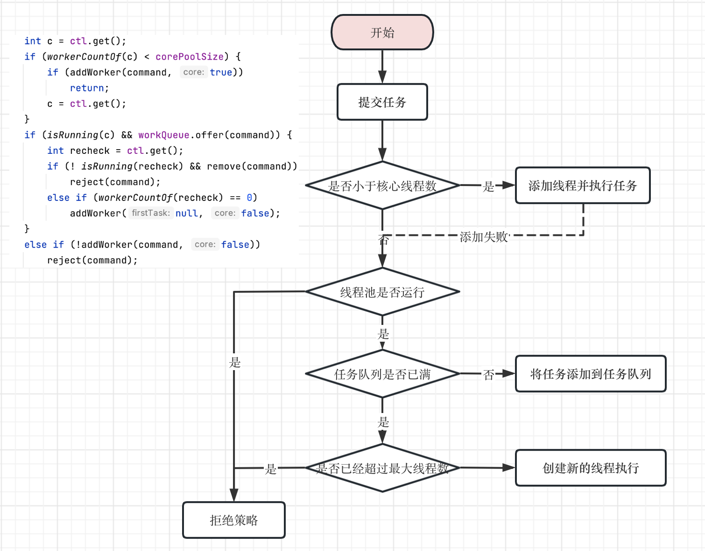

# Java线程池原理

记得前不久我找工作的时候，面试官问了我在项目中使用的线程池场景的时候，当时我对线程池压根儿不了解，然后瞎糊弄根据"线程池"这个名词瞎编乱造，构建出一个应用场景。
当时面试官问我，在工作中遇到过什么困难以及如何解决的？
当时我说：当时我们做的支付中台的时候，没有根据业务隔离线程池，特殊时期某个业务请求量剧增，导致其他的业务请求支付无法得到处理。我当时回答说把线程池根据业务进行隔离。我对线程池的了解仅仅停留在名字上，这不是给自己挖坑吗？于是面试官追问：那你们的线程池参数如何配置的，线程核心数量配置的多少？我磨磨唧唧的回答：好像100个吧。我现在回想起来，真愚蠢

接下来我们好好的盘一盘Java中的线程池问题，我将从以下几个方面展开

1. 线程池是什么以及解决什么样的问题而又产生了什么样的问题
2. 线程池的参数配置
3. 线程的管理策略
4. 线程池的原理
5. 线程池的使用注意事项
6. 动态化线程池

## 线程池是什么

线程池（Thread Pool）是一种基于池化思想管理线程的工具，他只是一种辅助我们来管理线程的一种工具。池化思想就是为了最大化收益并最小化风险，而将资源统一在一起管理的一种思想。我们知道线程的创建销毁是一个很消耗CPU资源的过程，非常耗时，其次线程一旦过多导致的不合理调度问题，以上的种种问题导致的计算机性能降低。为了解决这些问题，线程池就诞生了。

## 线程池解决了什么样的问题

首先线程的创建销毁得到了一个合理的管理，线程池根据业务场景合理的创建和销毁线程，合理的调度线程处理任务。这个过程处理好的话可以降低资源的消耗，提高响应的速度
其次，开发人员无需过于关注线程本身的管理，提高了线程的可管理性。
最后就是既然是一种管理线程的工具，那么将会有更多的高级功能，例如定时线程池等等

- 降低资源消耗、提高响应速度
- 提高线程的管理性
- 扩展功能

## 那么线程池的使用有没有什么问题呢？

1. 参数的不合理配置

在我们不了解线程池的原理，不合理的参数设置将会产生灾难性的问题。
很多企业不推荐使用Executors工具类来创建线程池，那么是为什么呢？真的就不能用吗？

- Executors.newFixedThreadPool和Executors.newSingleThreadExecutor：使用的是无界的LinkedBlockingQueue，任务队列最大长度为Integer.MAX_VALUE，可能堆积大量的请求，从而导致OOM。
- Executors.newCachedThreadPool：使用的是同步队列SynchronousQueue，允许创建的线程数量为Integer.MAX_VALUE，可能会创建大量线程，从而导致OOM。
- Executors.newScheduledThreadPool和Executors.newSingleThreadScheduledExecutor：使用的无界的延迟阻塞队列DelayedWorkQueue，任务队列最大长度为Integer.MAX_VALUE，可能堆积大量的请求，从而导致OOM。

当你不了解这些参数的配置，不合理的使用这些方法，或者配置参数不合理都会导致系统瘫痪。所以要根据实际应用场景合理的配置参数，从而让自己的机器性能发挥最好，系统更稳定。

2. 依赖性的任务

大多数任务都是独立的，所以线程池的参数改变只会对执行的性能影响。然而如果提交的任务需要依赖其他的任务，那么就隐含地给执行策略带来了约束，此时必须小心的维护这些执行策略以避免产生跳跃性的问题。

3. ThreadLocal问题

我们知道线程池可以自由的重用线程，而ThreadLocal则是维护在线程对象上的。只有当ThreadLocal中保存值的生命周期受限于任务的生命周期，ThreadLocal才有意义，而在线程池中不应该使用ThreadLocal进行任务间传递值。也就是说我们线程池中的线程执行一个任务时，该任务在执行期间使用的ThreadLocal值将在任务执行完后进行销毁删除才是一个合理的使用。

解决上述问题比较建议的办法是使用阿里巴巴开源的 TransmittableThreadLocal(TTL)。TransmittableThreadLocal类继承并加强了 JDK 内置的InheritableThreadLocal类，在使用线程池等会池化复用线程的执行组件情况下，提供ThreadLocal值的传递功能，解决异步执行时上下文传递的问题。

4. 线程饥饿死锁

在线程池中，如果一个任务依赖其他的任务，那么很有可能产生死锁问题。例如在单线程Executor中，如果一个任务将另一个任务提交到同一个Executor中，并且等待这个被提交任务的结果，那么就会产生死锁。同理在更大的线程池中，如果所有正在执行任务的线程都由于等待其他仍处于工作队列中的任务而阻塞，那么会发生同样的死锁问题。


## 线程池的参数配置

结合线程池的作者Doug Lea写的注释来看看线程池的几个参数。整个JUC包都是该大佬写的，最近也狂读JUC的源代码。

- corePoolSize：the number of threads to keep in the pool, even if they are idle, unless allowCoreThreadTimeOut is set.
什么意思呢？这个是设置线程池中核心线程的数量，即使核心线程处于空闲状态，也要为了保持这个线程数量，而不能被销毁掉。那么如果设置了allowCoreThreadTimeOut=true，空闲的核心线程将会在空闲超时(keepAliveTime)后被销毁。allowCoreThreadTimeOut的设置通过pool.allowCoreThreadTimeOut(true)来设置。

- maximumPoolSize：the maximum number of threads to allow in the pool.
设置线程池中允许创建的最大线程数量，也就是线程池中最多允许创建maximumPoolSize个线程。

- keepAliveTime：when the number of threads is greater than the core, this is the maximum time that excess idle threads will wait for new tasks before terminating. 
设置线程的存活时间：超过核心线程数的线程，即空闲线程，这些线程在销毁前等待新任务的最大时间。说白了就是允许其空闲的最大时间。

- unit：the time unit for the keepAliveTime argument.
结合keepAliveTime使用，为其设置的时间单位

- workQueue：the queue to use for holding tasks before they are executed. This queue will hold only the Runnable tasks submitted by the execute method.
该队列仅仅存放被execute方法提交的，将要被执行的Runnable任务。当核心线程达到corePoolSize时，之后提交的任务都会放到workQueue中。这里翻译成工作队列不容易理解，应该称为任务队列更恰当。

- threadFactory：the factory to use when the executor creates a new thread.
顾名思义，线程池中的线程就是通过该工厂类创建的。可以自定义线程的创建，例如可以自定义线程的名称，便于之后的问题排查与分析。

- handler：the handler to use when execution is blocked because the thread bounds and queue capacities are reached.
设置拒绝的策略，什么情况下会拒绝任务呢？当任务队列(workQueue)里面放满了任务、最大线程数(maximumPoolSize)的线程都在工作时，这时继续提交的任务线程池就处理不了，应该执行的拒绝策略。

7个线程池的参数通过分析JDK的注释解释完了。

要知道如何设置这些参数，那么得大概知道线程池的处理流程。通过一张图理解线程池的处理过程。



提交任务我们简单总结为四步：
1. 当前核心线程是否达到了设定的corePoolSize数，如果没有就继续创建新的线程执行该任务。
2. 那如果当前线程数达到设定的核心线程数，就判读任务队列有没有满，如果没有满就添加到任务队列中，等待被执行
3. 如果任务队列满了，就判断目前的线程数是否达到maximumPoolSize数，如果没有就继续创建线程并执行该任务。
4. 那如果以上都无法让任务得到执行，就执行拒绝策略，拒绝该任务的执行。

其实我们主要重点关注的只有三个参数的合理设置corePoolSize、maximumPoolSize、workQueue。知道了这三个参数对线程池的提交任务的影响之后，那么就很容易结合场景设置线程的大小了。其实线程池的大小设置并不困难，只需要避免"过大"和"过小"这两种极端情况。如果线程池过大，大量线程将在相对很少的CPU和内存资源上发生竞争，将会导致更高的内存使用量，直至耗尽资源。如果设置过小，那么将导致CPU的资源浪费情况，从而降低了吞吐量。

关于核心线程设置有一个简单的方法

- CPU密集型任务(N+1)：这种任务消耗的主要是CPU资源，可以将线程数设置为N(CPU核心数)+1。比CPU核心数多出来的一个线程是为了防止线程偶发的缺页中断，或者其它原因导致的任务暂停而带来的影响。
- I/O密集型任务(2N)：这种任务会用大部分的时间来处理I/O交互，而线程在处理I/O的时间段内不会占用CPU来处理，这时就可以将CPU交出给其它线程使用。

## 线程的管理策略

1. 管理线程的创建与销毁

通过线程池的核心线程数(corePoolSize)、最大线程数(maximumPoolSize)、存活时间(keepAliveTime)等因素共同负责管理线程的创建和销毁。通过调节corePoolSize和keepAliveTime可以帮助线程池回收多余的空闲的线程占有的资源，从而使得这些资源可以用于执行其它工作。调节maximumPoolSize来控制线程池创建最大的线程数，根据机器的性能来合理设置最大线程数的创建，避免业务高峰期将系统打垮。

2. 管理队列任务

由于线程池不可能无限创建线程，所以在有限的线程池中会限制可并发的执行任务数量，那么多余的任务将被放到任务队列中进行管理。基本的任务排队方法有三种：无界队列、有界队列、同步移交(SynchronousQueue)。当然一种更稳妥的资源管理策略是使用有界队列，如LinkedBlockingQueue。虽然说有界队列有助于避免资源耗尽的情况发生，但是只有当任务相互独立时，为线程池或者工作队列设置界限才是合理的。如果任务之间存在依赖关系，那么有界的线程池或队列可能会导致"饥饿"思死锁问题。此时可以使用无界的线程池(如newCachedThreadPool)避免该问题。

线程池较小，有界任务队列较大时，有助于减少内存的使用量，降低CPU的使用率，同时还可以减少上下文切换，但付出的代价是可能会限制吞吐量。

3. 饱和策略

在有界的线程池和任务队列中，有界队列无法容纳新的任务且无法再创建新的线程执行任务时，饱和策略就开始发挥作用了。JDK提供了几种不同的饱和策略AbortPolicy、CallerRunaPolicy、DiscardPolicy、DiscardOldestPolicy。当创建Executor时，可以选择饱和策略或者对执行策略进行修改。

4. 线程工厂

线程工厂用于线程池来创建新的线程，JDK内置一个默认的线程工厂。在许多情况下都需要使用定制的线程工厂，例如希望为线程自定义名称、为线程指定优先级或者是否守护线程等等。合理的定制线程也有利于之后的分析和调试。

## 线程池的原理

我们知道Executor框架可以将任务的提交与任务的执行策略解耦开来，定制和修改执行策略都提供了相当大的灵活性。如果我们看过源码，可以看到这样一个继承关系ThreadPoolExecutor->AbstractExecutorService->ExecutorService->Executor

- Executor：它提供了一种思想，将任务提交和任务执行进行解耦。用户无需关注线程本身，只需将Runnable类型的任务提交到执行器(Executor)中，由Executor框架完成线程的调配和任务的执行部分。
- ExecutorService：扩充任务的执行能力，提供管理线程池的方法。
- AbstractExecutorService：实现任务的基本执行流程，保证下层的实现只需关注一个执行任务的方法即可。
- ThreadPoolExecutor：维护自身的生命周期的同时管理线程和任务，使两者良好的结合从而执行并行任务，更关注于任务和线程的细节。

从以下几个方面深度展开

### 线程池的生命周期管理

线程池运行的状态，并不是用户显式设置的，而是伴随着线程池的运行，由内部来维护。线程池的状态管理由一个ctl变量维护，该变量分为两部分，int的高三位维护线程池的状态，其余低29位维护线程池中的线程数量，并提供一些方法获取相关的的信息。用一个变量去存储两个信息，可避免在做相关决策时，出现不一致的情况，不必为了维护两者的一致，而占用锁资源。

```java
private final AtomicInteger ctl = new AtomicInteger(ctlOf(RUNNING, 0));
```


### 任务的执行机制

#### 任务如何被提交

当我们提交一个任务，执行pool.execute(task)，这也是执行任务提交的入口，由Executor接口提供的方法。

在execute()方法中，分为三步
1. 如果正在运行的线程数少于corePoolSize(workerCount < corePoolSize)，则尝试将该任务作为首任务启动一个新线程(调用addWorker方法进行处理)。
2. 如果一个任务可以成功排队(workerCount >= corePoolSize)，那么需要再次检查线程池的状态，该检查是为了确保上一步addWorker失败导致的，若线程池已经处于非运行状态等条件下而无法接受任务，应该进行任务的拒绝策略。还要确保线程中至少有一个线程执行任务。
3. 如果不能将任务添加到任务队列，则尝试添加一个新线程处理任务(workerCount >= corePoolSize && workerCount < maximumPoolSize)，若失败(workerCount >= maximumPoolSize)，则表示已经关闭或饱和，因此要采用拒绝策略拒绝任务。

我们通过源码分析：

```java
public void execute(Runnable command) {
    int c = ctl.get();
    if (workerCountOf(c) < corePoolSize) {
        // workerCount < corePoolSize 并尝试添加新的工作线程处理。true为添加核心线程
        if (addWorker(command, true)) return;
        c = ctl.get();
    }
    if (isRunning(c) && workQueue.offer(command)) {
        // workerCount >= corePoolSize && 任务成功排队
        int recheck = ctl.get();
        if (! isRunning(recheck) && remove(command))
            // 如果线程池被关闭，则执行拒绝任务策略
            reject(command);
        else if (workerCountOf(recheck) == 0)
            // 保证线程池至少有一个线程执行，避免创建核心线程为0的线程池
            addWorker(null, false);
    }
    // 任务队列已满 && workerCount >= corePoolSize && workerCount < maximumPoolSize
    else if (!addWorker(command, false))
        // 线程池已经关闭或饱和，因此要采用拒绝策略拒绝任务
        reject(command);
}
```

#### 任务的缓冲

我们知道线程池将任务的提交和任务的执行进行了解耦合，那么任务的提交就相当于生产者，任务的执行相当于消费者。在生产者和消费者之间必然有一种机制来保存生产者提交的任务，消费者来消费待执行的任务来执行。这就是任务的缓冲机制，说白了就是一个单向阻塞队列。提交任务就是往阻塞队列中存放任务，执行任务就是从阻塞队列中获取任务并执行。

我们的单向阻塞队列有很多种：ArrayBlockingQueue、LinkedBlockingQueue、DelayQueue、DelayedWorkQueue、SynchronousQueue、PriorityBlockingQueue、LinkedTransferQueue。

|队列|描述|使用场景|
|---|---|---|
|ArrayBlockingQueue|底层用数组实现的，具有FIFO特性的有界队列。|可用于线程池控制任务多少|
|LinkedBlockingQueue|一个链表组成的有界队列|Executors.newFixedThreadPool()|
|DelayQueue|实现PriorityQueue的延迟获取的无界队列，可以设定多久能获取到元素的时间|用于Timer中定时器|
|DelayedWorkQueue|类似DelayQueue的实现的一个延迟无界队列，内部是一个具有堆排序功能的数组实现的数组。|Executors.newScheduledThreadPool|
|SynchronousQueue|一个不存储元素的无界阻塞队列，支持公平(TransferQueue)和非公平(TransferStack)。|Executors.newCachedThreadPool|
|LinkedTransferQueue|由链表组成的无界阻塞队列，相比SynchronousQueue多了tryTransfer，而且存储元素。|多线程消息的安全传输|
|PriorityBlockingQueue|支持按照优先级排序的有界阻塞队列。|需要根据优先级排队的场景，例如业务排队，VIP或军人优先|

#### 任务的申请

任务的执行分两种情况，一种是当任务提交的时候，伴随着创建了一个工作线程，此时该任务作为工作线程的首任务被执行。第二种就是被所有工作线程调用getTask()方法进行竞争获取任务来执行。

工作线程需要不断的从任务缓冲队列中不断的获取任务并执行，在getTask方法中根据是否超时调用poll(time)和take()从workQueue阻塞队列中获取执行任务。期间也会判断线程池的状态，若已经关闭 state>=STOP 则返回null终止该工作线程。处于SHUTDOWN状态的遇到没有任务执行后也会终止线程。

```java
private Runnable getTask() {
    for (;;) {
        ...
        if (rs >= SHUTDOWN && (rs >= STOP || workQueue.isEmpty())) {
            decrementWorkerCount(); // 如果线程池状态处于STOP及以上，需要终止该线程，返回null无需处理任务
            return null;
        }
        ...
            // 获取任务，如果设有超时，则超时获取任务，否则调用take()一直阻塞获取
            Runnable r = timed ?
                workQueue.poll(keepAliveTime, TimeUnit.NANOSECONDS) :
                workQueue.take();
        ...
    }
}
```

#### 任务的拒绝

任务拒绝模块是线程池的保护部分，当线程池的任务缓存队列已满，并且线程池中的线程数目达到maximumPoolSize时，就需要拒绝掉该任务，采取任务拒绝策略，保护线程池。

用户可以通过实现这个接口去定制拒绝策略

```java
public interface RejectedExecutionHandler {
    void rejectedExecution(Runnable r, ThreadPoolExecutor executor);
}
```

JDK内置四个策略

|名称|描述|
|---|---|
|AbortPolicy|直接抛出RejectedExecutionException异常|
|CallerRunsPolicy|在线程池运行的情况下，由提交任务的线程直接执行该任务，否则直接丢弃，不抛出任何异常。|
|DiscardPolicy|直接抛弃，不会抛出任何异常|
|DiscardOldestPolicy|调用缓存队列的poll方法弹出一个任务丢弃，接着继续提交该任务|

### Worker工作线程的管理

#### Worker线程

线程池为了掌握线程的状态并维护线程的生命周期，从而设计了线程池内的工作线程Worker。Worker仅仅是对Thread对象的包装。firstTask仅仅是在创建Worker工作线程时初始化的首个要执行的任务，当首个任务执行完后，该值为null，就需要从阻塞队列中获取任务了。

```java
private final class Worker extends AbstractQueuedSynchronizer implements Runnable{
    final Thread thread; // Worker持有的线程
    Runnable firstTask; // 初始化第一个要执行的任务，可以为null
}
```

Worder工作线程通过一个HashSet结构保存

```java
private final HashSet<Worker> workers = new HashSet<Worker>();
```

#### Worker线程的回收

Worker且实现了AQS，利用其不可重入独占锁的机制来实现获取(tryLock)线程的是否空闲，那么是一个什么样的过程呢？

当Worker通过getTask()获取到任务后，通过lock()方法进行加锁，表示该工作线程处于工作中正在执行任务。如果处于工作的线程是不允许被中断的。此时线程池调用shutdown()或者shutdownNow()等方法，最终会调用interruptIdleWorkers()方法，遍历所有的Worker工作线程，通过调用tryLock()方法判断是否处于空闲，如果线程正在执行任务说明已经lock了，由于锁的独占机制，此时调用tryLock()返回false表示处于工作中，则不进行中断操作。如果处于空闲，Worker处于无锁状态，调用tryLock()会返回true，表示处于空闲，于是就会中断该空闲线程。

```java
private void interruptIdleWorkers(boolean onlyOne) {
    ...
    if (!t.isInterrupted() && w.tryLock()) {
            t.interrupt();
    }
    ...
}
```

#### Worker线程增加

我们来看看addWorker()的逻辑，该方法有两个参数，firstTask表示初始化第一个任务，如果有，则线程直接先执行该任务，如果为null，则线程直接去阻塞队列通过getTask()获取任务执行。第二参数core，如果为true，表示在线程数判断时工作线程数不能大于corePoolSize，如果为false，则工作线程数不能大于maximumPoolSize。

保留关键代码省略非核心代码。

```java
private boolean addWorker(Runnable firstTask, boolean core) {
    // 进行一系列的检查，如线程池的状态、工作线程的数量校验等等
    // 如果都没问题，就将线程的数量增加1
    ...
    compareAndIncrementWorkerCount(c)
    ...
    // 创建工作线程，并给定首任务
    w = new Worker(firstTask);
    ...
    // 经过一系列检查后，将工作线程用HashSet维护起来
    workers.add(w);
    ...
    // 启动工作线程，这里会运行runWorker(w)方法
    t.start();
    ...
    // 如果工作线程启动失败，则需要将该工作线程移除、将ctl工作线程数-1等等后续操作
    addWorkerFailed(w);
}
```

#### Worker线程执行任务

接下来我们只需要看看我们的任务如何得到运行的。

每个工作线程启动都会执行runWorker()方法，那么启动线程后我们就进入while程序块进行无限循环的处理任务，处理的任务是通过getTask()方法从我们的任务队列workQueue获取。执行任务会进行加锁，细心的同学可以发现我们的Worker继承了AQS，利用了不可重入的锁机制，用tryLock()来判断线程是否处于空闲状态。执行任务前后都会有钩子函数用来扩展，当任务的执行抛出了不可检查异常或者不需要执行任务了，则最终会执行processWorkerExit方法结束该线程，如果需要重新启动一个工作线程的话，同时也会启动一个新的工作线程(详细见processWorkerExit方法)。

```java
final void runWorker(Worker w) {
    ...
    while (task != null || (task = getTask()) != null) { // getTask()阻塞式的不断从workQueue申请任务
        w.lock();// 进行加锁
            ...
            beforeExecute(wt, task);// 执行前的钩子函数
                ...
                task.run(); // 这里便是调用我们任务的run方法进行执行
                ...
                afterExecute(task, thrown);// 执行后的钩子函数
        ...
        w.unlock();// 进行解锁
    }
    ...
    processWorkerExit(w, completedAbruptly);// 线程销毁
}
```

#### Worker线程的销毁

线程回收的工作是在processWorkerExit方法完成的。线程池中线程的销毁依赖JVM自动的回收，线程池做的工作是根据当前线程池的状态维护一定数量的线程引用，防止这部分线程被JVM回收，当线程池决定哪些线程需要回收时，只需要将其引用消除即可。Worker被创建出来后，就会不断地进行轮询，然后获取任务去执行。当Worker无法获取到任务，循环会结束，Worker会主动消除自身在线程池内的引用。由于工作线程退出的原因很多，还要根据具体因素判断是否要重新创建新的工作线程。

```java
private void processWorkerExit(Worker w, boolean completedAbruptly) {
        ...
        workers.remove(w); // 删除Worker引用
    
    tryTerminate(); // 尝试终止
        ...
        addWorker(null, false); // 如果正常退出，还要根据是否需要维持核心线程数来进行增加Worker线程
}
```

## 使用线程池的注意事项

1. 根据业务场景手动配置线程池参数
2. 监控线程池的运行状态
3. 根据业务进行线程池的隔离
4. 线程池和ThreadLocal共用的坑，用完ThreadLocal后习惯remove。阿里巴巴开源TransmittableThreadLocal可以有效的解决这个问题
5. ...

## 动态化线程池

美团技术团队介绍了对线程池参数实现可自定义配置的思路和方法。文章中提到动态化线程池的核心设计包括以下三个方面：

1. 简化线程池配置
2. 参数可动态修改
3. 增加线程池监控

我们知道LinkedBlockingQueue是一个有界队列，而且容量capacity是final修饰不可变，那么美团为了能够动态修改阻塞队列大小直接模仿LinkedBlockingQueue重新实现了一个ResizableCapacityLinkedBlockIngQueue类，并且容量capacity采用volatile修饰，变成可以修改的变量，便于实现动态调整阻塞队列的容量，根据不同场景来热调整阻塞队列的容量。

详细见https://mp.weixin.qq.com/s/baYuX8aCwQ9PP6k7TDl2Ww


> JDK 1.8 源码
> 《Java Concurrency in Practice》
> https://mp.weixin.qq.com/s/baYuX8aCwQ9PP6k7TDl2Ww
> https://mp.weixin.qq.com/s/YbyC3qQfUm4B_QQ03GFiNw
> https://mp.weixin.qq.com/s/GAHsGwaddjw8to46rSP_TA?forceh5=1

----------  END  ----------