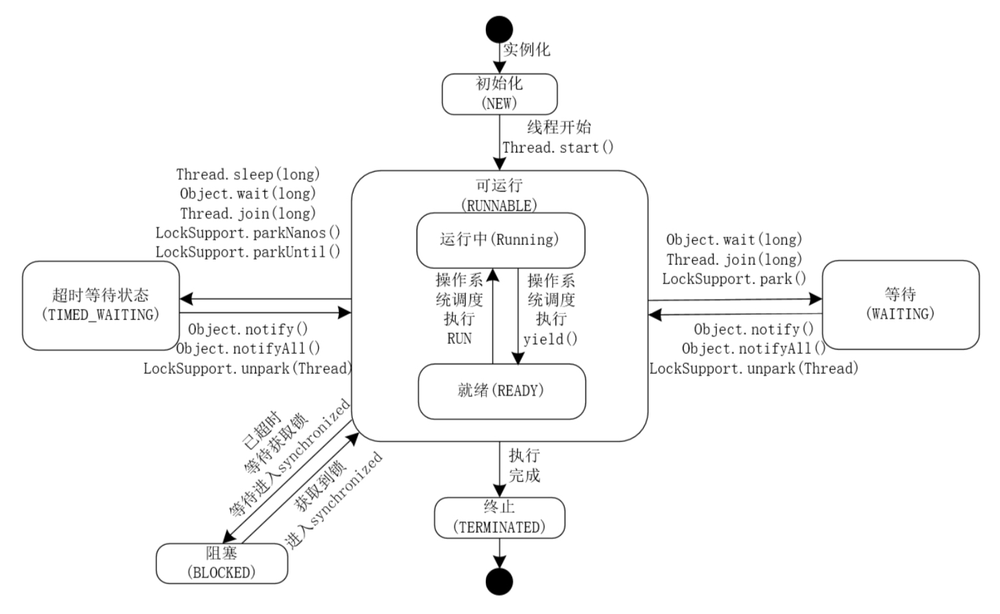

# Java线程状态|Java线程&操作系统线程

## Java中的六种线程状态



- NEW:初始状态，线程被创建，还没有调用start()方法。
- RUNNABLE:可运行状态，可运行状态可以包括运行中状态和就绪状态。
- BLOCKED:阻塞状态，处于这个状态的线程需要等待其他线程释放锁或者 等待进入synchronized。
- WAITING:表示等待状态，处于该状态的线程需要等待其他线程对其进行通知或中断等操作，进而进入下一个状态。
- TIME_WAITING:超时等待状态。可以在一定的时间自行返回。
- TERMINATED:终止状态，当前线程执行完毕。

在Java代码中有个枚举表示状态`java.lang.Thread.State`，在源码中清清楚楚写着哪些方法会导致变为这个状态

```java
public enum State {
    NEW,
    RUNNABLE,
    BLOCKED,
    WAITING,
    TIMED_WAITING,
    TERMINATED;
}
```

1. NEW状态的线程

Thread state for a thread which has not yet started.

```java
public class NewStateThread {
    public static void main(String[] args) throws InterruptedException {
        Thread t = new Thread(() -> {
            System.out.println(Thread.currentThread().getName());
        });// 此时的t线程
        Thread.sleep(10000);
    }
}
```

2. RUNNABLE状态

Thread state for a runnable thread. A thread in the runnable state is executing in the Java virtual machine but it may be waiting for other resources from the operating system such as processor.

```java
public class RunnableStateThread {
    public static void main(String[] args) throws InterruptedException {
        Thread t = new Thread(() -> {
            System.out.println(Thread.currentThread().getName());
        });
        t.start(); // 方法执行后就进入RUNNABLE状态
        Thread.sleep(10000);
    }
}
```


3. WAITING状态

Thread state for a waiting thread. A thread is in the waiting state due to calling one of the following methods:
    Object.wait with no timeout
    Thread.join with no timeout
    LockSupport.park
A thread in the waiting state is waiting for another thread to perform a particular action. For example, a thread that has called Object.wait() on an object is waiting for another thread to call Object.notify() or Object.notifyAll() on that object. A thread that has called Thread.join() is waiting for a specified thread to terminate.

```java
public class WaitingStateThread {
    public static void main(String[] args) throws InterruptedException {
        Thread t = new Thread(() -> {
            while (true) {}
        });
        t.start();
        t.join();
    }
}
```

运行结果

```text
"Thread-0" #11 prio=5 os_prio=31 tid=0x00007f8d2282a000 nid=0x5703 runnable [0x0000700002432000]
   java.lang.Thread.State: RUNNABLE
        at com.example.WaitingStateThread.lambda$main$0(WaitingStateThread.java:7)
        at com.example.WaitingStateThread$$Lambda$1/1452126962.run(Unknown Source)
        at java.lang.Thread.run(Thread.java:748)


"main" #1 prio=5 os_prio=31 tid=0x00007f8d21808800 nid=0xd03 in Object.wait() [0x0000700000ef0000]
   java.lang.Thread.State: WAITING (on object monitor)
        at java.lang.Object.wait(Native Method)
        - waiting on <0x000000076ac1f0b8> (a java.lang.Thread)
        at java.lang.Thread.join(Thread.java:1252)
        - locked <0x000000076ac1f0b8> (a java.lang.Thread)
        at java.lang.Thread.join(Thread.java:1326)
        at com.example.WaitingStateThread.main(WaitingStateThread.java:10)
```


4. TIMED_WAITING状态

Thread state for a waiting thread with a specified waiting time. A thread is in the timed waiting state due to calling one of the following methods with a specified positive waiting time:
    Thread.sleep
    Object.wait with timeout
    Thread.join with timeout
    LockSupport.parkNanos
    LockSupport.parkUntil


```java
public class TimeWaitingStateThread {
    public static void main(String[] args) throws InterruptedException {
        Thread t = new Thread(() -> {
            try {
                Thread.sleep(100000);
            } catch (InterruptedException ignore) { }
        });
        t.start();
    }
}
```

```text
"Thread-0" #11 prio=5 os_prio=31 tid=0x00007f9a4102d800 nid=0x7e03 waiting on condition [0x0000700004243000]
   java.lang.Thread.State: TIMED_WAITING (sleeping)
        at java.lang.Thread.sleep(Native Method)
        at com.example.WaitingStateThread.lambda$main$0(WaitingStateThread.java:10)
        at com.example.WaitingStateThread$$Lambda$1/1452126962.run(Unknown Source)
        at java.lang.Thread.run(Thread.java:748)


```

5. BLOCKED状态

Thread state for a thread blocked waiting for a monitor lock. A thread in the blocked state is waiting for a monitor lock to enter a synchronized block/method or reenter a synchronized block/method after calling Object.wait.


```java
public class BlockedStateThread {
    public static void main(String[] args) throws InterruptedException {
        Thread t = new Thread(() -> {
            try {
                synchronized (Object.class) {
                    Object.class.wait();
                }
            } catch (InterruptedException ignore) { }
        });
        t.start();
    }
}
```

```text
"Thread-0" #11 prio=5 os_prio=31 tid=0x00007fc4b70c6800 nid=0x5603 in Object.wait() [0x0000700008da0000]
   java.lang.Thread.State: WAITING (on object monitor)
        at java.lang.Object.wait(Native Method)
        - waiting on <0x000000076ab006f8> (a java.lang.Class for java.lang.Object)
        at java.lang.Object.wait(Object.java:502)
        at com.example.BlockedStateThread.lambda$main$0(BlockedStateThread.java:8)
        - locked <0x000000076ab006f8> (a java.lang.Class for java.lang.Object)
        at com.example.BlockedStateThread$$Lambda$1/1452126962.run(Unknown Source)
        at java.lang.Thread.run(Thread.java:748)

```

6. TERMINATED状态

Thread state for a terminated thread. The thread has completed execution.


## 操作系统中进程状态

操作系统的进程由至少一个线程组成，进程其实是一个概念的存在，将多个线程组成的集合加上共享的资源便是进程。那么操作系统的线程状态分为三个基本状态：就绪（Ready）状态、执行（Running）状态、阻塞（Block）状态。在部分OS中，为了系统和用户观察和分析进程的需要，将状态分得更细，例如挂起等状态。这里简单介绍这几种状态：

- 就绪（Ready）状态：线程已经分配好除CPU外的所有必要资源，只需获得CPU时间片便可立即执行。
- 执行（Running）状态：处于此状态的线程是已经获得CPU时间片并且正在执行中。
- 阻塞（Block）状态：线程因为某些必要的资源、未达到可执行的条件而阻塞。

## Java线程和操作系统之间的关联

要搞懂Java中层面上的线程与操作系统中的线程之间的关系，必须先理解如下四个概念

- Java中的Thread对象：Java层面上的线程对象
- JVM中的JavaThread对象：它维护了线程的状态，关联Java层面的Thread对象，同时关联OSThread对象来获取底层操作系统创建的osthread的状态
- JVM中的OSThread对象：它维护着实际操作系统创建的线程句柄handle，可以获取底层osthread的状态。
- 操作系统线程：真正操作系统线程，获取CPU时间片后执行

Java中创建一个线程，通过new创建的一个Java对象，在JVM中就是一个oop对象，此时仅仅是创建了Java层面上的对象与JVM层面上的oop对象对应。在代码里我们分析到，并没有调用native方法进行其他的操作，说明仅仅创建了一个对象。
```java
Thread t = new Thread();
```

当调用start方法的时候发生了什么呢？

```java
t.start();
```

调用start方法后，会调用native的start0()方法，此时进入了JVM里面执行native方法。

```java
private native void start0();
```

我们下载[JDK的源码](http://hg.openjdk.java.net/)，然后在源代码(路径：/src/share/native/java/lang/Thread.c)中找到start0的声明，发现是调用的

```c
// /src/share/native/java/lang/Thread.c
static JNINativeMethod methods[] = {
    {"start0",           "()V",        (void *)&JVM_StartThread},
    {"stop0",            "(" OBJ ")V", (void *)&JVM_StopThread},
    ...
}
```

发现他调用Hotspot中的JVM_StartThread，我们来到Hotspot源码(路径：src/share/vm/prims/jvm.cpp)找到JVM_StartThread的方法实现，这里面new一个JavaThread的对象，设置好执行的入口方法。

```c
// src/share/vm/prims/jvm.cpp
void JNICALL JVM_StartThread(JNIEnv* env, jobject jthread) {
    
    native_thread = new JavaThread(&thread_entry, sz);
    ...
    Thread::start(native_thread);
}
```

我们看看thread_entry是什么，这是一个很重要的方法，会在创建操作系统线程执行后，一层一层调用到这个run方法。注意他用的JavaCalls::call_virtual就是通过JNI调用Java层面上的run()方法。

```c
// src/share/vm/prims/jvm.cpp
static void thread_entry(JavaThread* thread, TRAPS) {
    ...
    JavaCalls::call_virtual(&result, obj, KlassHandle(THREAD, SystemDictionary::Thread_klass()),
                          vmSymbols::run_method_name(),
                          vmSymbols::void_method_signature(),
                          THREAD);
}

// src/share/vm/classfile/vmSymbols.hpp
#define VM_SYMBOLS_DO(template, do_alias)   \
    ...                                     \
    template(run_method_name, "run")        \
    ...                                     \
```

我们来看看JavaThread，进行一些初始化，设置入口方法，最后调用os::create_thread创建OSThread对象

```c++
// src/share/vm/runtime/thread.cpp
JavaThread::JavaThread(ThreadFunction entry_point,size_t stack_sz):Thread() {
    ...
    initialize();
    ...
    set_entry_point(entry_point);
    ...
    os::create_thread(this, thr_type, stack_sz);
}
```

因为创建线程和系统相关，我们以Linux操作系统来看看os::create_thread做了什么。它创建了一个OSThread对象将其关联到JavaThread对象上，然后通过遵循POSIX协议标准的创建线程接口pthread_create来进行线程创建，该函数创建之后便开始执行java_start方法，该方法里面正是调用的最后一个参数thread的run方法。我们看到JavaThread::run()方法调用了thread_main_inner进而调用当前对象的entry_point入口函数，这个函数便是之前设置的入口函数，最终通过JNI调用了Java层面的run()方法。

```c
// src/os/linux/vm/os_linux.cpp
// 创建OSThread
bool os::create_thread(Thread* thread, ThreadType thr_type, size_t stack_size) {
    ...
    // Allocate the OSThread object
    OSThread* osthread = new OSThread(NULL, NULL);
    ...
    // JavaThread线程绑定osthread
    thread->set_osthread(osthread);
    
    // pthread_create，第三个参数是线程运行函数的起始地址，第四个参数是参数
    int ret = pthread_create(&tid, &attr, (void* (*)(void*)) java_start, thread);
    
    // Store pthread info into the OSThread
    osthread->set_pthread_id(tid);
    ...
    return true;
}

// src/os/linux/vm/os_linux.cpp
// 入口函数
static void *java_start(Thread *thread) {
    ...
    // 调用thread的run方法，这个thread是JavaThread对象
    thread->run();
    return 0;
}

// src/share/vm/runtime/thread.cpp
// 追踪到JavaThread_run方法
void JavaThread::run() {
  ...
  thread_main_inner();
}

// src/share/vm/runtime/thread.cpp
// 
void JavaThread::thread_main_inner() {
    ...
    this->entry_point()(this, this);
    ...
  this->exit(false);
  delete this;
}
```

简单总结下：
1. Java层面上我们创建一个Thread对象，此时仅仅创建了Java对象，并没有产生线程
2. 当调用start()方法时，会调用start0() native方法，该方法调用了JVM层面的JVM_StartThread方法
3. 然后创建JavaThread对象，在这里面设置执行入口函数，该函数使用JNI回调Java层面的run()方法。也调用了os::create_thread来创建OSThread对象
4. 再OSThread对象创建过程中，调用pthread_create来创建真正的操作系统线程，一个执行体作为执行入口，该执行方法中会最终调用JavaThread对象中设置的入口函数，今儿通过JNI回调Java层面的run()方法
5. 最后Java的run()方法体就得到了执行。

今天先简单分析下Java线程的状态，与操作系统线程的关系，并扒拉了一点源码佐证。后面还会总结一篇详细的执行过程。

参考的文章
> https://blog.csdn.net/wjc133/article/details/118308830
> https://blog.csdn.net/b98982016/article/details/121283573
> http://hg.openjdk.java.net/