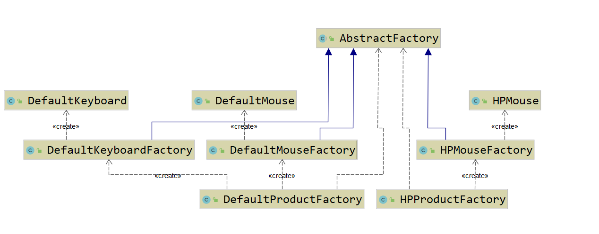
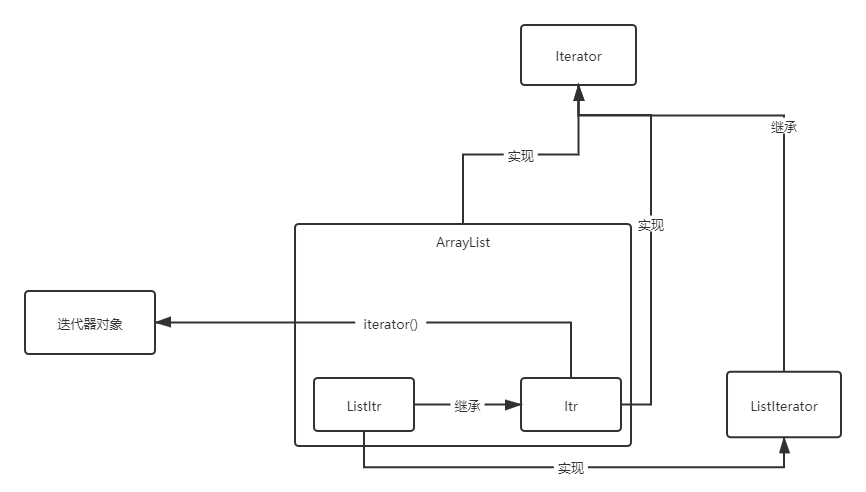

## 设计模式

### 工厂模式(Factory Pattern)

#### 简单工厂模式

简单工厂模式（Simple Factory Pattern）是指由一个工厂对象决定创建出哪一种产品类的实例，但它不属于GOF，23种设计模式

简单工厂适用于工厂类负责创建的对象较少的场景，且客户端只需要传入类的参数，对于如何创建对象的逻辑不需要关心

```java
/**
 * 简单工厂类
 */
public class DefualtCourseFactory {
    public static ICourse create(Class className){
        try {
            if (className != null && !"".equals(className)){
                return (ICourse) className.newInstance();
            }
        }catch (Exception e){
            e.printStackTrace();
        }
        return  null;
    }
}
```

#### 工厂方法模式

工厂方法模式（Factory Method Pattern）是指定义一个创建对象的接口，但让实现这个接口的类来决定实例化哪个类，工厂方法让类的实例化推迟到子类中进行。在工厂方法模式中用户只需要关心所需产品对应的工厂，无须关心创建细节，而且加入新的产品符合开闭原则。

工厂方法模式主要解决产品扩展的问题，在简单工厂中，随着产品链的丰富，如果每个课程的创建逻辑有区别的话，工厂的职责会变得越来越多，有点像万能工厂，并不便于维护。根据单一职责原则我们将职能继续拆分，专人干专事

工厂方法适用于以下场景

```text
- 创建对象需要大量重复的代码。
- 客户端（应用层）不依赖于产品类实例如何被创建、实现等细节。
- 一个类通过其子类来指定创建哪个对象。
```

工厂方法缺点

```text
- 类的个数容易过多，增加复杂度。
- 增加了系统的抽象性和理解难度
```

```java
/**
 * 工厂接口
 */
public interface CourseFactory {
    public ICourse create();
}
/**
 * java课程工厂类
 */
public class JavaCourseFactory implements CourseFactory {
    public ICourse create() {
        return new JavaCourse();
    }
}
/**
 * python课程工厂类
 */
public class PythonCourseFactory implements CourseFactory {
    public ICourse create() {
        return new PythonCourse();
    }
}
```

#### 抽象工厂模式

抽象工厂模式（Abstract Factory Pattern）是指提供一个创建一系列相关或相互依赖对象的接口，无须指定他们具体的类。客户端（应用层）不依赖于产品类实例如何被创建、实现等细节，强调的是一系列相关的产品对象（属于同一产品族）一起使用创建对象需要大量重复的代码。需要提供一个产品类的库，所有的产品以同样的接口出现，从而使客户端不依赖于具体实现。

缺点

```text
- 规定了所有可能被创建的产品集合，产品族中扩展新的产品困难，需要修改抽象工厂的接口。
- 增加了系统的抽象性和理解难度。

ps:但在实际应用中，我们千万不能犯强迫症甚至有洁癖。在实际需求中产品等级结构升级是非常正常的一件事情。我们可以根据实际情况，只要不是频繁升级，可以不遵循开闭原则。代码每半年升级一次或者每年升级一次又有何不可呢？ 
```



### 单例模式(Singleton Pattern)

单例模式（Singleton Pattern）是指确保一个类在任何情况下都绝对只有一个实例，并提供一个全局访问点。单例模式是创建型模式。

优点

```text
- 在内存中只有一个实例，减少了内存开销
- 可以避免对资源的多重占用
- 设置全局访问点，严格控制访问。
```

缺点

```text
- 没有接口，扩展困难
- 如果要扩展单例对象，只有修改代码，没有其他途径
```

一般创建单例的思路

```text
1、私有化构造器,隐藏其所有的构造方法
2、保证线程安全(volatile、synchronized)
3、是否延迟加载
4、防止序列化和反序列化破坏单例
5、防御反射攻击单例
```

#### 饿汉式单例

饿汉式单例是在类加载的时候就立即初始化，并且创建单例对象。绝对线程安全，在线程还没出现以前就是实例化了，不可能存在访问安全问题。

优点

```text
没有加任何的锁、执行效率比较高，在用户体验上来说，比懒汉式更好。
```

缺点

```text
类加载的时候就初始化，不管用与不用都占着空间，浪费了内存，有可能占着茅坑不拉屎
```

基本代码实现

```java
/**
 * 饿汉式单例
 */
public class HungrySingleton {
    //类加载时初始化，或者使用静态块来初始化
    private static final HungrySingleton HUNGRY_SINGLETON = new HungrySingleton();

    //私有化构造方法
    private HungrySingleton(){}

    public static HungrySingleton getInstance(){
        return HUNGRY_SINGLETON;
    }
}
```

#### 懒汉式单例

懒汉式单例(Lazy Singleton)被外部类调用的时候内部类才会加载

基本代码实现

```java
/**
 * 懒汉式加载
 * 1.不做线程安全的话，会出现两个测试线程得到的lazySingleton实例不一致，但是一致的情况也
 * 未必只实例化了一次，当两个线程同时进入，同时出来，输出结果就一直，但是实例化了两次
 * 2.给getInstance方法加上synchronized，是这个方法变成同步方法。用synchronized加锁
 * 在线程数量比较多情况下，如果CPU 分配压力上升，会导致大批量线程出现阻塞，
 * 从而导致程序运行性能大幅下降。
 */
public class LazySingleton {

    private static LazySingleton lazySingleton = null;

    private LazySingleton(){}

    public synchronized static LazySingleton getInstance(){
        if(lazySingleton == null){
            lazySingleton = new LazySingleton();
        }
        return lazySingleton;
    }
}
```

使用双重检查锁机制的代码实现

```java
/**
 * 双重检查锁的单例模式
 */
public class LazyDoubleCheckSingleton {
    private static LazyDoubleCheckSingleton lazy = null;

    private LazyDoubleCheckSingleton(){}

    public static LazyDoubleCheckSingleton getInstance(){
        if(lazy == null){
            synchronized (LazyDoubleCheckSingleton.class){
                if(lazy == null) {
                    lazy = new LazyDoubleCheckSingleton();
                }
            }
        }
        return lazy;
    }
}
```

早期JVM还存在一个问题：指令重排

如上双重锁实现代码中，在创建对象的时候有以下三个步骤：

1. 分配对象内存空间
2. 初始化对象
3. 设置引用指向分配的内存地址

这三个步骤的第三步可能会往前提，导致另一个线程在判空时，由于引用不为空，但是为初始化，就被直接返回使用了，导致直接访问到了一个为初始化的对象。

只需要把变量声明为volatile就可以解决指令重排问题。具体代码如下：

```java
/**
 * 双重检查锁+防止指令重排的单例模式
 */
public class LazyDoubleCheckSingleton {
    private static volatile LazyDoubleCheckSingleton lazy = null;

    private LazyDoubleCheckSingleton(){}

    public static LazyDoubleCheckSingleton getInstance(){
        if(lazy == null){
            synchronized (LazyDoubleCheckSingleton.class){
                if(lazy == null) {
                    lazy = new LazyDoubleCheckSingleton();
                }
            }
        }
        return lazy;
    }
}
```

利用内部类的特性简单的完成延迟单例创建

```java
/**
 * 静态内部类的方式
 * 这种形式兼顾饿汉式的内存浪费,也兼顾 synchronized 性能问题,完美地屏蔽了这两个缺点
 */
public class LazyInnerClassSingleton {
    private LazyInnerClassSingleton(){
        if(LazyHolder.LAZY != null){
            throw new RuntimeException("不允许创建两个实例!");
        }
    }
    /*
     * static 是为了使单例的空间共享
     * final 保证这个方法不会被重写，重载
     */
    public static final LazyInnerClassSingleton getInstance(){
        return LazyHolder.LAZY;
    }

    /*
     * 默认使用内部类的时候,会先初始化内部类,如果没使用的话，内部类是不加载
     */
    private static class LazyHolder {
        private static final LazyInnerClassSingleton LAZY = new LazyInnerClassSingleton();
    }
}
```

#### 反射破坏单例

单例模式的构造方法除了加上private以外，没有做任何处理。如果我们使用反射来调用其构造方法，然后，再调用getInstance()方法，应该就会两个不同的实例，所有即使私有化了构造方法，也要在构造方法中判断实例是否存在，如果存在就抛出异常。还可以使用枚举

#### 序列化破坏单例

当我们将一个单例对象创建好，有时候需要将对象序列化然后写入到磁盘，下次使用时再从磁盘中读取到对象，反序列化转化为内存对象。反序列化后的对象会重新分配内存，即重新创建。那如果序列化的目标的对象为单例对象，就违背了单例模式的初衷，相当于破坏了单例

1. 增加readResolve()方法即可

```java
/**
 * 序列化时导致单例破坏
 */
public class SerializableSingleton implements Serializable {
    /*
     * 序列化就是说把内存中的状态通过转换成字节码的形式,从而转换一个 IO 流,
     * 写入到其他地方(可以是磁盘、网络 IO),内存中状态给永久保存下来了
     * 反序列化将已经持久化的字节码内容,转换为IO流通过IO流的读取，
     * 进而将读取的内容转换为 Java 对象,在转换过程中会重新创建对象new
     *
     * 解决方案：只需要增加readResolve()方法即可
     */
    private static final SerializableSingleton SERIALIZABLE_SINGLETON = new SerializableSingleton();

    private SerializableSingleton(){}

    public static SerializableSingleton getInstance(){
        return SERIALIZABLE_SINGLETON;
    }

    private Object readResolve() {
        return SERIALIZABLE_SINGLETON;
    }

}
```

2. 枚举类型

```java
、**
  * 1. 枚举可以避免反射创建，因为反射在通过newInstance创建对象时，会检查该类是否ENUM修饰，
  *    如果是则抛出异常，反射失败。
  * 2. 枚举避免序列化问题
  */
public enum EnumSingleton {
    INSTANCE;
    public static EnumSingleton getInstance(){
        return INSTANCE;
    }
}
```

#### 注册式单例

注册式单例又称为登记式单例，就是将每一个实例都登记到某一个地方，使用唯一的标识获取实例。注册式单例有两种写法：一种为容器缓存，一种为枚举登记。

#### ThreadLocal线程单例

ThreadLocal 不能保证其创建的对象是全局唯一，但是能保证在单个线程中是唯一的，天生的线程安全。

### 构造者模式(Builder Pattern)

定义：将一个复杂对象的构建与其表示分离，使得同样的构建过程可以创建不同的表示

场景：当一个类的构造函数参数个数过多，而且这些参数有些是可选的参数，有些参数的填写依赖另一些参数，可以考虑使用构造者模式。
通常解决方案：
1. 折叠构造函数模式，代码中构造函数调用构造函数，将非必填的给默认值。
    ```text
    使用及阅读不方便。
    ```
2. Java Bean 模式，采用getter、setter方式赋值。
    ```text
    对象的状态容易发生变化，造成错误。因为类中的属性是分步设置的，所以就容易出错。
    而且暴露setter导致数据的安全性问题，如果希望创建不可变对象，也就是说，对象在创建好之后，就不能再修改内部的属性值，要实现这个功能，我们就不能在类中暴露 set() 方法。构造函数配合 set() 方法来设置属性值的方式就不适用了
    ```
采用构造者模式的通用步骤：
```text
1. 在 A类 中创建一个静态内部类 Builder ，然后将 A类 中的参数都复制到 Builder 类中。
2. 在 A类 中创建一个private的构造函数，参数为 Builder 类型
3. 在Builder中创建一个public的构造函数，参数为 A类 中必填的那些参数。
4. 在Builder中创建设置函数，对 A类 中那些可选参数进行赋值，返回值为 Builder 类型的实例(this)。
5. 在Builder中创建一个build()方法，在其中构建 A类 的实例并返回。
```

举例：
spring framework中`org.springframework.http.ResposeEntity.class`采用的就是构造器模式

与工厂模式的区别：
```text
工厂模式是用来创建不同但是相关类型的对象（继承同一父类或者接口的一组子
类），由给定的参数来决定创建哪种类型的对象。建造者模式是用来创建一种类型的复杂对
象，通过设置不同的可选参数，“定制化”地创建不同的对象。

场景解释：
顾客走进一家餐馆点餐，我们利用工厂模式，根据用户不同的选择，来制作不同的食物，比
如披萨、汉堡、沙拉。对于披萨来说，用户又有各种配料可以定制，比如奶酪、西红柿、起
司，我们通过建造者模式根据用户选择的不同配料来制作披萨。
```

实现代码如下：
```text
public class Demo {
	private final String str;
	private Demo(DefaultBuilder builder){
		this.str = builder.str;
	}

	public static class DefaultBuilder {
		private String str;
		public Demo build(){
			return new Demo(this);
		}
		public DefaultBuilder setStr(String str){
			this.str = str;
			return this;
		}
	}
}
```


### 原型模式(Prototype Pattern)

原型设计模式是利用对已有对象（原型）进行复制（或者叫拷贝）的方式来创建新对象；调用者不需要知道任何创建细节，不调用构造函数。属于创建型模式

原型模式主要适用的场景

```text
- 类初始化消耗资源较多
- new产生的一个对象需要非常繁琐的过程（数据准备、访问权限等）
- 构造函数比较复杂
- 循环体中生产大量对象时
```

#### 简单克隆

浅克隆（浅拷贝）：只是完整复制了值类型数据，没有赋值引用对象。换言之，所有的引用对象仍然指向原来的对象，显然不是我们想要的结果

#### 深度克隆

实现对象克隆有两种方式：

```text
- 实现Cloneable接口并重写Object类中的clone()方法；
- 实现Serializable接口，通过对象的序列化和反序列化实现克隆，可以实现真正的深度克隆。
```

#### 克隆破坏单例模式

如果我们克隆的目标的对象是单例对象，那意味着，深克隆就会破坏单例

防止克隆破坏单例解决思路是禁止深克隆便可

```text
- 单例类不实现Cloneable接口
- 重写clone()方法，在clone方法中返回单例对象即可
```

### 代理模式(Proxy Pattern)

指为其他对象提供一种代理，以控制对这个对象的访问。代理对象在客服端和目标对象之间起到中介作用。属于结构型设计模式。

适用场景

```text
- 保护目标对象
- 增强目标对象
```

代理模式的优点

```text
- 代理模式能将代理对象与真实被调用的目标对象分离
- 一定程度上降低了系统的耦合程度，易于扩展
- 代理可以起到保护目标对象的作用 
- 增强目标对象的职责
```

代理模式的优缺点

```text
- 代理模式会造成系统设计中类的数目增加
- 在客户端和目标对象之间增加了一个代理对象，会造成请求处理速度变慢
- 增加了系统的复杂度
```

#### 静态代理

显式声明被代理对象

#### 动态代理

动态配置和替换被代理对象

JDK动态代理的实现原理

```text
1、拿到被代理类的引用，并且获取它的所有的接口（反射获取）。
2、JDK Proxy类重新生成一个新的类，实现了被代理类所有接口的方法。
3、动态生成Java代码，把增强逻辑加入到新生成代码中。
4、编译生成新的Java代码的class文件。
5、加载并重新运行新的class，得到类就是全新类
```

CGLib动态代理容易踩的坑
1、无法代理final修饰的方法

CGLib和JDK动态代理对比

```text
1.JDK动态代理是实现了被代理对象的接口，CGLib是继承了被代理对象。
2.JDK和CGLib都是在运行期生成字节码，JDK是直接写Class字节码，CGLib使用ASM框架写Class字节码，Cglib代理实现更复杂，生成代理类比JDK效率低。
3.JDK调用代理方法，是通过反射机制调用，CGLib是通过FastClass机制直接调用方法，CGLib执行效率更高
```

#### 静态代理和动态的本质区别

```text
1、静态代理只能通过手动完成代理操作，如果被代理类增加新的方法，代理类需要同步新增，违背开闭原则
2、动态代理采用在运行时动态生成代码的方式，取消了对被代理类的扩展限制，遵循开闭原则
3、若动态代理要对目标类的增强逻辑扩展，结合策略模式，只需要新增策略类便可完成，无需修改代理类的代码
```

#### 高仿真JDK Proxy手写实现

利用JDK Proxy字节重组，重新生的对象来替代原始的对象以达到动态代理的目的.JDK Proxy生成对象步骤如下：

```text
1、拿到被代理对象的引用，并且获取到它的所有的接口，反射获取
2、JDKProxy类重新生成一个新的类、同时新的类要实现被代理类所有实现的所有的接口
3、动态生成Java代码，把新加的业务逻辑方法由一定的逻辑代码去调用（在代码中体现）
4、编译新生成的Java代码.class
5、再重新加载到JVM中运行

此过程就叫字节码重组。JDK中有一个规范，在ClassPath下只要是$开头的class文件一般都是自动生成的
```

#### CGLib和JDK动态代理对比

```text
1.JDK动态代理是实现了被代理对象的接口，CGLib是继承了被代理对象
2.JDK和CGLib都是在运行期生成字节码， JDK是直接写Class字节码， CGLib使用ASM框架写Class字节码，Cglib代理实现更复杂，生成代理类比JDK效率低
3.JDK调用代理方法，是通过反射机制调用，CGLib是通过FastClass机制直接调用方法，CGLib执行效率更高
```

#### 代理模式与Spring

Spring中的代理选择原则

```text
- 当Bean有实现接口时，Spring就会用JDK的动态代理。
- 当Bean没有实现接口时，Spring选择CGLib。
- Spring可以通过配置强制使用CGLib，只需在Spring的配 置文件中加入如下代码：
				<aop:aspectj-autoproxy proxy-target-class="true"/>
```

### 委派模式(Delegate Pattern)

委派模式（Delegate Pattern）的基本作用就是负责任务的调用和分配任务，跟代理模式很像，可以看做是一种特殊情况下的静态代理的全权代理，但是代理模式注重过程，而委派模式注重结果，委派模式不属于GOF 23种设计模式中。属于行为型模式

Delegate 结尾的一般都是委派，Dispatcher

### 策略模式(Strategy Pattern)

策略模式（Strategy Pattern）是指定义了算法家族、分别封装起来，让它们之间可以互相替换，此模式让算法的变化不会影响到使用算法的用户。

策略模式的应用场景

```text
- 假如系统中有很多类，而他们的区别仅仅在于他们的行为不同。
- 一个系统需要动态地在几种算法中选择一种
```

优点：

```text
- 策略模式符合开闭原则。
- 避免使用多重条件转移语句，如if...else...语句、switch语句
- 使用策略模式可以提高算法的保密性和安全性。
```

缺点：

```text
- 客户端必须知道所有的策略，并且自行决定使用哪一个策略类。
- 代码中会产生非常多策略类，增加维护难度。
```

### 模板模式(Template Pattern)

模板模式通常又叫模板方法模式（Template Method Pattern）是指定义一个算法的骨架，并允许**子类为一个或者多个步骤提供实现**。模板方法使得子类可以在不改变算法结构的情况下，重新定义算法的某些步骤，属于行为性设计模式

使用场景

```text
- 一次性实现一个算法的不变的部分，并将可变的行为留给子类来实现。
- 各子类中公共的行为被提取出来并集中到一个公共的父类中，从而避免代码重复。
```

钩子方法

```text
主要目的是用来干预执行流程，使得我们控制行为流程更加灵活，更符合实际业务的需求。钩子方法的返回值一般为适合条件分支语句的返回值（如boolean、int等）
```

优点

```text
- 利用模板方法将相同处理逻辑的代码放到抽象父类中，可以提高代码的复用性
- 将不同的代码不同的子类中，通过对子类的扩展增加新的行为，提高代码的扩展性
- 把不变的行为写在父类上，去除子类的重复代码，提供了一个很好的代码复用平台，符合开闭原则
```

缺点

```text
- 类数目的增加，每一个抽象类都需要一个子类来实现，这样导致类的个数增加。
- 类数量的增加，间接地增加了系统实现的复杂度。
- 继承关系自身缺点，如果父类添加新的抽象方法，所有子类都要改一遍
```

### 适配器模式(Adapter Pattern)

适配器模式是指将一个类的接口转换成客户期望的另一个接口，使原本的接口不兼容的类可以一起工作，属于结构型设计模式。
适配器适用场景

```text
- 已经存在的类，它的方法和需求不匹配（方法结果相同或相似）的情况
- 适配器模式不是软件设计阶段考虑的设计模式，是随着软件维护，由于不同产品、不同厂家造成功能类似而接口不相同情况下的解决方案
```


优点：

```text
- 能提高类的透明性和复用，现有的类复用但不需要改变。
- 目标类和适配器类解耦，提高程序的扩展性。
- 在很多业务场景中符合开闭原则。
```

缺点：

```text
- 适配器编写过程需要全面考虑，可能会增加系统的复杂性。
- 增加代码阅读难度，降低代码可读性，过多使用适配器会使系统代码变得凌乱。
```

### 装饰者模式(Decorator Pattern)

装饰者模式是指在不改变原有对象的基础之上，将功能附加到对象上，提供了比继承更有弹性的替代方案（扩展原有对象的功能），属于结构型模式。为对象扩展一些额外的职责。

装饰者在代码程序中适用场景

```text
- 用于扩展一个类的功能或给一个类添加附加职责。
- 动态的给一个对象添加功能，这些功能可以再动态的撤销。
```

 装饰者模式最本质的特征是将原有类的附加功能抽离出来，简化原有类的逻辑

#### 装饰者模式和适配器模式对比

装饰者和适配器模式都是包装模式（Wrapper Pattern），装饰者也是一种特殊的代理模式。

|      |                          装饰者模式                          |                          适配器模式                          |
| :--: | :----------------------------------------------------------: | :----------------------------------------------------------: |
| 形式 |                            市一中                            |              没有层级关系，装饰器模式有层级关系              |
| 定义 | 装饰者和被装饰者都实现同一个接口，主要目的是为了扩展之后还保持OOP关系 | 适配器和被适配者没有必然的联系，通常是采用继承或代理的形式进行包装 |
| 关系 |                        满足is-a的关系                        |                       满足has-a的关系                        |
| 功能 |                        注重覆盖、扩展                        |                        注重兼容、转换                        |
| 设计 |                           前置考虑                           |                           后置考虑                           |

优点

```text
- 装饰者是继承的有力补充，比继承灵活，不改变原有对象的情况下动态地给一个对象扩展功能，即插即用。
- 通过使用不同装饰类以及这些装饰类的排列组合，可以实现不同效果。
- 装饰者完全遵守开闭原则。
```

缺点：

```text
- 会出现更多的代码，更多的类，增加程序复杂性。
- 动态装饰时，多层装饰时会更复杂。
```

### 观察者模式(Observer Pattern)

观察者模式定义了对象之间的一对多依赖，让多个观察者对象同时监听一个主体对象，当主体对象发生变化时，它的所有依赖者（观察者）都会收到通知并更新，属于行为型模式。观察者模式有时也叫做发布订阅模式。观察者模式主要用于在关联行为之间建立一套触发机制的场景。

优点

```text
- 观察者和被观察者之间建立了一个抽象的耦合。
- 观察者模式支持广播通信。
```

缺点

```text
- 观察者之间有过多的细节依赖、提高时间消耗及程序的复杂度。
- 使用要得当，要避免循环调用
```

### 责任链模式(Chain Of Responsibility Design Pattern)

定义

```text
在 GoF 的定义中，一旦某个处理器能处理这个请求，就不会继续将请求传递给后续的处理器了。当然，在实际的开发中，也存在对这个模式的变体，那就是请求不会中途终止传递，而是会被所有的处理器都处理一遍。这种变体也有两种实现方式：用链表存储处理器和用数组存储处理器，后面一种实现方式更加简单。
```

应用场景举例

```text
对于支持 UGC（User Generated Content，用户生成内容）的应用（比如论坛）来说，用户生成的内容（比如，在论坛中发表的帖子）可能会包含一些敏感词（比如涉黄、广告、反动等词汇）。针对这个应用场景，我们就可以利用职责链模式来过滤这些敏感词。
对于包含敏感词的内容，我们有两种处理方式，一种是直接禁止发布，另一种是给敏感词打马赛克（比如，用 *** 替换敏感词）之后再发布。第一种处理方式符合 GoF 给出的职责链模式的定义，第二种处理方式是职责链模式的变体。
```

框架中的应用

```text
Filter、Spring Interceptor、Spring AOP

Filter可以拿到原始的http请求，但是拿不到你请求的控制器和请求控制器中的方法的信息;
Interceptor 可以拿到你请求的控制器和方法，却拿不到请求方法的参数;
Aop 可以拿到方法的参数，但是却拿不到http请求和响应的对象;

他们的细粒度不同，AOP的细粒度更细，为每个类做相关的功能增强，Interceptor的细粒度其次，Filter也差不多，只是Filter是存在web容器，和Spring无关，而Interceptor是Spring中的，和Spring容器的生命周期一致。
```


### 状态模式(State Pattern)

状态模式是状态机的一种实现方式。状态机又叫有限状态机，它有 3 个部分组成：状态、事件、动作。其中，事件也称为转移条件。事件触发状态的转移及动作的执行。不过，动作不是必须的，也可能只转移状态，不执行任何动作。

针对状态机，总结了三种实现方式

1. 分支逻辑法。利用 if-else 或者 switch-case 分支逻辑，参照状态转移图，将每一个状态转移原模原样地直译成代码。对于简单的状态机来说，这种实现方式最简单、最直接，是首选。 
2. 查表法。对于状态很多、状态转移比较复杂的状态机来说，查表法比较合适。通过二维数组来表示状态转移图，能极大地提高代码的可读性和可维护性。 
3. 状态模式。对于状态并不多、状态转移也比较简单，但事件触发执行的动作包含的业务逻辑可能比较复杂的状态机来说，我们首选这种实现方式。 


### 迭代器模式
迭代器模式（Iterator Design Pattern），也叫作游标模式（Cursor Design Pattern）。
迭代器是用来遍历容器的，一个完整的迭代器模式一般会涉及容器和容器迭代器两部分内容。为了达到基于接口而非实现编程的目的，容器又包含容器接口、容器实现类，迭代器又包含迭代器接口、迭代器实现类。

java里面的List迭代器关系图：


```text
遍历集合数据有三种方法：for 循环、foreach 循环、iterator 迭代器。对于这三种方式，foreach 循环只是一个语法糖而已，底层是基于迭代器来实现的。也就是说foreach的底层实现就是迭代器实现。这两种遍历方式可以看作同一种遍历方式，也就是迭代器遍历方式。
```

利用迭代器来遍历有下面三个优势：
```text
- 迭代器模式封装集合内部的复杂数据结构，开发者不需要了解如何遍历，直接使用容器提供的迭代器即可；
- 迭代器模式将集合对象的遍历操作从集合类中拆分出来，放到迭代器类中，让两者的职责更加单一；
- 迭代器模式让添加新的遍历算法更加容易，更符合开闭原则。除此之外，因为迭代器都实现自相同的接口，在开发中，基于接口而非实现编程，替换迭代器也变得更加容易。
```

如何控制迭代器遍历期间集合的元素修改问题
```text
ArrayList 中定义一个成员变量modCount，记录集合被修改的次数，集合每调用一次增加或删除元素的函数，就会给modCount 加 1。当通过调用集合上的 iterator() 函数来创建迭代器的时候，我们把modCount 值传递给迭代器的 expectedModCount 成员变量，之后每次调用迭代器上的hasNext()、next()、currentItem() 函数，我们都会检查集合上的 modCount 是否等于expectedModCount，也就是看，在创建完迭代器之后，modCount 是否改变过。如果两个值不相同，那就说明集合存储的元素已经改变了，要么增加了元素，要么删除了元素，之前创建的迭代器已经不能正确运行了，再继续使用就会产生不可预期的结果，所以我们选择 fail-fast 解决方式，抛出运行时异常，结束掉程序，让程序员尽快修复这个因为不正确使用迭代器而产生的 bug。
```
如何在遍历的同时安全地删除集合元素
```text
迭代器类中还定义了一个remove() 方法，能够在遍历集合的同时，安全地删除集合中的元素。不过，需要说明的是，它并没有提供添加元素的方法。毕竟迭代器的主要作用是遍历，添加元素放到迭代器里本身就不合适。
Java 迭代器中提供的 remove() 方法还是比较鸡肋的，作用有限。它只能删除游标指向的前一个元素，而且一个 next() 函数之后，只能跟着最多一个 remove() 操作，多次调用 remove() 操作会报错。
```

给迭代器做个快照，解决未觉性
```text
1. 在迭代器类中定义一个成员变量 snapshot 来存储快照。每当创建迭代器的时候，都拷贝一份容器中的元素到快照中，后续的遍历操作都基于这个迭代器自己持有的快照来进行。

2. 我们可以在容器中，为每个元素保存两个时间戳，一个是添加时间戳 addTimestamp，一个是删除时间戳 delTimestamp。当元素被加入到集合中的时候，我们将 addTimestamp设置为当前时间，将 delTimestamp 设置成最大长整型值（Long.MAX_VALUE）。当元素被删除时，我们将 delTimestamp 更新为当前时间，表示已经被删除。
注意，这里只是标记删除，而非真正将它从容器中删除。
同时，每个迭代器也保存一个迭代器创建时间戳 snapshotTimestamp，也就是迭代器对应的快照的创建时间戳。当使用迭代器来遍历容器的时候，只有满足addTimestamp<snapshotTimestamp<delTimestamp 的元素，才是属于这个迭代器的快照。
如果元素的 addTimestamp>snapshotTimestamp，说明元素在创建了迭代器之后才加入的，不属于这个迭代器的快照；如果元素的 delTimestamp<snapshotTimestamp，说明元素在创建迭代器之前就被删除掉了，也不属于这个迭代器的快照。

实际上，第二种解决方案相当于解决了一个问题，又引入了另外一个问题。ArrayList 底层依赖数组这种数据结构，原本可以支持快速的随机访问，在 O(1) 时间复杂度内获取下标为i的元素，但现在，删除数据并非真正的删除，只是通过时间戳来标记删除，这就导致无法支持按照下标快速随机访问了。
可以在 ArrayList 中存储两个数组。一个支持标记删除的，用来实现快照遍历功能；一个不支持标记删除的（也就是将要删除的数据直接从数组中移除），用来支持随机访问。
```


### 访问者模式(Visitor Design Pattern)

Allows for one or more operation to be applied to a set of objects at runtime, decoupling the operations from the object structure.

允许一个或者多个操作应用到一组对象上，解耦操作和对象本身。

访问者模式针对的是一组类型不同的对象（PdfFile、PPTFile、WordFile）。不过，尽管这组对象的类型是不同的，但是，它们继承相同的父类（ResourceFile）或者实现相同的接口。在不同的应用场景下，需要对这组对象进行一系列不相关的业务操作（抽取文本、压缩等），但为了避免不断添加功能导致类（PdfFile、PPTFile、WordFile）不断膨胀，职责越来越不单一，以及避免频繁地添加功能导致的频繁代码修改，我们使用访问者模式，将对象与操作解耦，将这些业务操作抽离出来，定义在独立细分的访问者类（Extractor、Compressor）中。

这个模式的代码实现比较难，所以应用场景并不多。 


Double Dispatch

理解“Dispatch”

```text
在面向对象编程语言中，我们可以把方法调用理解为 一种消息传递，也就是“Dispatch”。一个对象调用另一个对象的方法，就相当于给它发 送一条消息。这条消息起码要包含对象名、方法名、方法参数。
```

理解“Single”“Double”

```text
“Single”“Double”指的是执行哪个对象的哪个方法，跟几个因素的运行时类型有关。进一步解释。Single Dispatch 之所以称为“Single”，是因为执行哪个对象的哪个方法，只跟“对象”的运行时类型有关。Double Dispatch 之所以称为“Double”，是因为执行哪个对象的哪个方法，跟“对象”和“方法参数”两者的运行时类型有关。
```

Single Dispatch 和 Double Dispatch 跟多态和函数重载直接相关。当前主流的面向对象编程语言（比如，Java、C++、C#）都只支持 Single Dispatch，不支持 Double Dispatch。


### 备忘录模式(Momento Design Pattern)

备忘录模式，也叫快照（Snapshot）模式，英文翻译是 Memento Design Pattern。在 GoF 的《设计模式》一书中，备忘录模式定义：

Captures and externalizes an object’s internal state so that it can be restored later, all without violating encapsulation. 

在不违背封装原则的前提下，捕获一个对象的内部状态，并在该对象之外保存这个状态，以便之后恢复对象为先前的状态。  


## 总结


