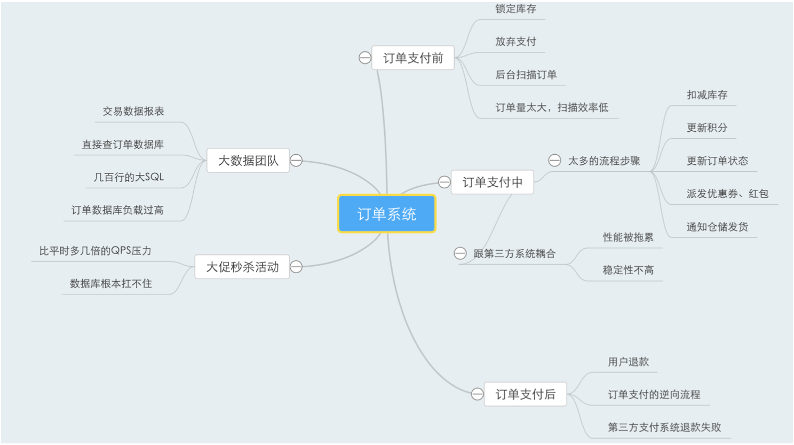

# 中间件

订单系统的整体分析


QPS的框架嵌入系统进行QPS的监控，可视化工具进行监控





六个问题：

```text
第一，思考一下系统的核心业务流程，当然不是指那种查询之类的操作。所谓核心链路指的是对你的系统进行的数据更新的操 作，这才是核心链路，因为查询操作一般来说不涉及复杂的业务逻辑，主要是对数据的展示。
对你的系统的核心链路分析一下，有哪些步骤，这些步骤各自的性能如何，综合起来让你的核心链路的性能如何?在这里是否有改进的
空间?
第二，思考一下，在你的系统中，是否有类似后台线程定时补偿的逻辑? 比如订单长时间未支付就要自动关闭它，你们系统里有没有那种后台线程，会定时扫描你的数据，对异常数据进行补偿、自动修复等操
作的?
如果有的话，这种数据一般量有多大?如果没有，你可以思考一下，你们系统的核心数据是否需要类似的后台自动扫描机制?
第三，思考一下，在你的系统里有没有跟第三方系统进行耦合?就是一些核心流程里需要同步调用第三方系统进行查询、更新 等操作，第三方系统是否对你的核心链路有性能和稳定性上的影响?
第四，思考一下，在你的核心链路中，是否存在那种关键步骤可能会失败的情况?万一失败了该怎么办? 第五，大家可以思考一下，平时是否存在其他系统需要获取你们数据的情况?他们是如何获取你们数据的?
是直接跑SQL从你们数据库里查询?或者是调用你们的接口来获取数据?是否存在这种情况?如果有，对你们有什么影响吗? 
第六，系统是否存在流量洪峰的情况，有时候突然之间访问量增大好几倍，是否会对你们的系统产生无法承受的压力?
```


技术调研：其实技术调研说白了，就是对一个技术去找到一些业内常用的开源实现，然后对各种不同的实现都进行一些调研，对比一
下他们的优劣势，看看谁比较符合我们的需求，谁比较适合我们来使用。

```text
具体来说，比如对于我们现在的情况，你只知道有一个MQ的概念，但是你要考虑一下:
	业内常用的MQ有哪些?
	每一种MQ各自的表现如何? 
	这些MQ在同等机器条件下，能抗多少QPS(每秒抗几千QPS还是几万QPS)? 
	性能有多高(发送一条消息给他要2ms还是20ms)? 
	可用性能不能得到保证(要是MQ部署的机器挂了怎么办)?
然后你还得考虑:
	他们会不会丢失数据?
	如果需要的话能否让他们进行线性的集群扩容(就是多加几台机器)?
	消息中间件经常需要使用的一些功能他们都有吗(比如说延迟消息、事务消息、消息堆积、消息回溯、死信队列，等等)?
另外还得考虑这些MQ在文档是否齐全?社区是否活跃?在行业内是否广泛运用?是用什么语言编写的?
把这些事情都搞清楚了，那么你就完成了技术调研，可以全面的对比各种MQ的优劣势，然后从中选择一个最适合我们的来使用。
```

```
他们都是如何集群化部署抗高并发的?
他们对海量消息是如何分布式存储的?
他们是如何实现主从多备份的高可用架构的?
他们是如何实现集群路由让别人找到对应的机器发送消息和接收消息的?
从架构原理上自己对比一下Kafka、RabbitMQ、RocketMQ。
```

